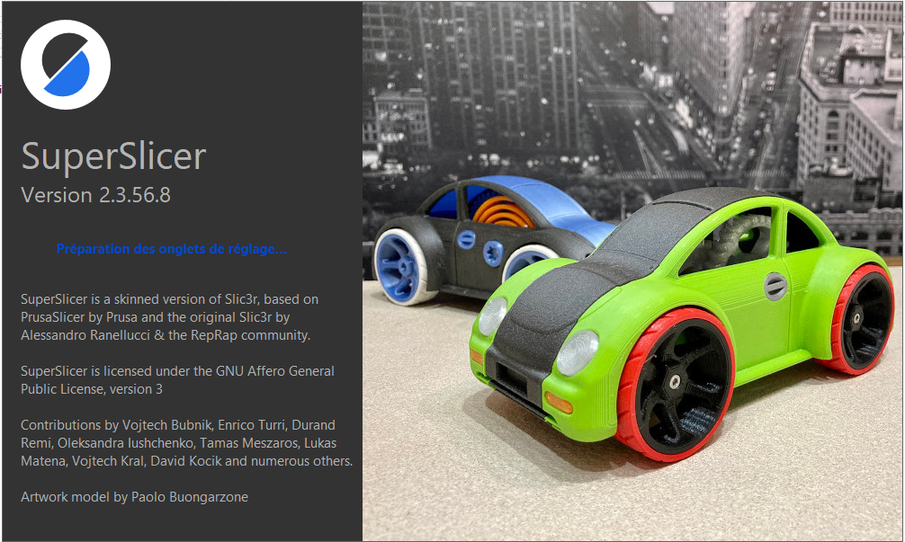

# SuperSlicer-Documentation
Documentation non officielle de SuperSlicer en français.

[Version 2.3.57.0](src/superslicer.md)

## Documentation en ligne

[Accès à la version en ligne sur ce repository](src/superslicer.md)

## Modifications

Version 1.10
01/07/2021 : Mise en ligne de la [version au format MarkDown](src/superslicer.md)

Version 1.11
01/07/2021 : Mise à jour de la [version au format MarkDown](src/superslicer.md)

Version 1.12
11/07/2021 : passage version 2.3.56.7

Version 1.13
12/07/2021 : Mise à jour de la partie variable.

Version 1.14
15/07/2021 :  Rajout  de la partie Troubleshooting + Nouvelles variables.

Version 1.15
21/07/2021 : Ajout d'une section lexique.

Version 1.16
27/07/2021 : Mise à jour des variables.

Version 1.18
21/07/2021 : Ajout nouvelles variables

Version 1.19
21/07/2021 : Passage à version 2.3.57.0
