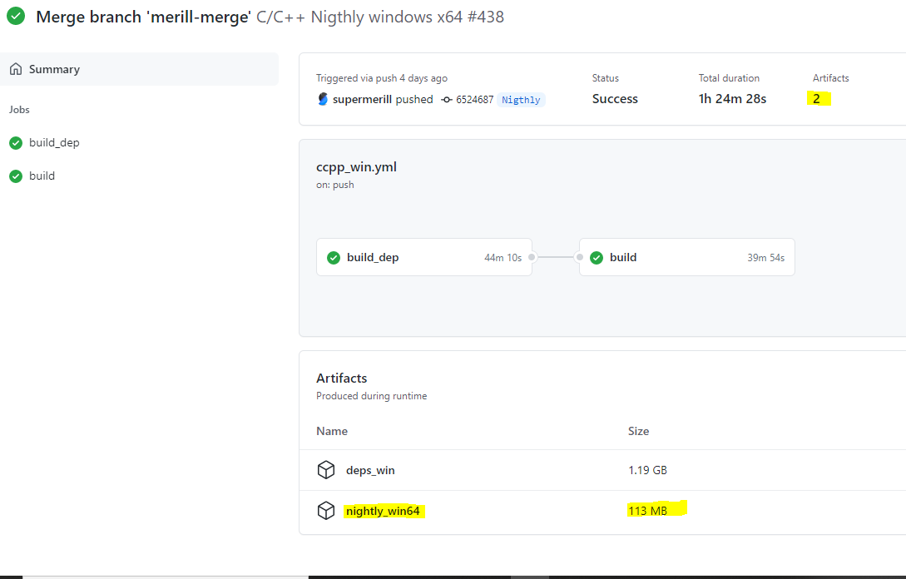

# A propos de SuperSlicer

## Contenu de la page

* A propos de SuperSlicer
	* [Quelles sont les principales caractéristiques de SuperSlicer ? Les principales différences ?](#quelles-sont-les-principales-caractéristiques-de-superslicer--les-principales-différences-)
	* [Quelles sont les principales caractéristiques de SuperSlicer / PrusaSlicer / Slic3r ?](#quelles-sont-les-principales-caractéristiques-de-superslicer--prusaSlicer--slic3r-) 
	* [Les autres caractéristiques principales](#les-autres-caractéristiques-principales)
	* [Développement](#développement)
	* [Licence et attribution](#licence-et-attribution)

* [Retour Page principale](../superslicer.md)

**SuperSlicer** est une variante de PrusaSlicer (qui est une variante de slic3r) (précédemment Slic3r++).

Les versions 64 bits pré-compilées de Windows, Linux et MacOS sont disponibles sur la [page git releases](https://github.com/supermerill/SuperSlicer/releases). Les versions Linux et macOS ne sont pas testées, juste compilées, donc merci de signaler tout bug qui pourrait survenir pendant l'utilisation. Les compilations nocturnes sont disponibles sur la [git actions page](https://github.com/supermerill/SuperSlicer/actions). Cliquez sur la version correspondant à votre plateforme et ensuite sur 'Artifacts (2)' à droite de l'écran pour télécharger le fichier exécutable compressé.

SuperSlicer prend des modèles 3D (STL, OBJ, AMF) et les convertit en instructions G-Code pour les imprimantes FDM ou en couches PNG pour les imprimantes 3D SLA. Il est compatible avec toutes les imprimantes modernes basées sur le modèle RepRap qui utilisent un firmware basé sur Marlin, Prusa, Klipper, etc.

SuperSlicer est basé sur [PrusaSlicer](https://github.com/prusa3d/PrusaSlicer) de Prusa Research. PrusaSlicer est basé sur [Slic3r](https://github.com/Slic3r/Slic3r) par Alessandro Ranellucci et la communauté RepRap.

Voir le [wiki](https://github.com/supermerill/SuperSlicer/wiki) et le [répertoire de documentation](https://github.com/supermerill/SuperSlicer/tree/master/doc) pour des informations sur la compilation.

## Quelles sont les principales caractéristiques de SuperSlicer ? Les principales différences ?

- ***Lissage*** de la surface supérieure et de nombreux nouveaux paramètres pour affiner la qualité de la surface supérieure, comme "un seul périmètre sur le dessus".
- Une option "remplissage plus dense" pour soutenir les couches supérieures (pleines).
- De meilleurs murs minces (ancrés à l'intérieur de l'impression, plus de morceaux aléatoires aux extrémités, intégrés dans les boucles du périmètre).
- Options permettant de modifier les dimensions et/ou la géométrie des trous, pour les imprimer à la bonne taille.
- Meilleurs débordements (ajoutez des périmètres si nécessaire, inversion du sens d'impression à chaque couche).
- Définition des bordures : beaucoup plus d'options (intérieur, extérieur seulement, 'coins', par objet).
- Quelques nouvelles options de couture, pour aider à les cacher.
- Impressions de calibration intégrées 
- Script de génération d'objets intégré (FreeCad) 
- Peut joindre les périmètres en un seul grand pour éviter les déplacements.
- Beaucoup d'autres petites options et corrections (comme le motif concentrique rempli). 
- Il possède également toutes les fonctionnalités actuelles de PrusaSlicer. 

**Liste complète des changements [ici.](https://github.com/supermerill/SuperSlicer/wiki)** Voir le [wiki](https://github.com/supermerill/SuperSlicer/wiki) pour d’autres infos sur le logiciel 

## Quelles sont les principales caractéristiques de SuperSlicer / PrusaSlicer / Slic3r ?

Les principales caractéristiques communes à ces 3 solutions sont les suivantes :

- ***Multi-plateforme*** (Linux/Mac/Win) et distribué comme une application autonome sans aucune dépendance requise.
- Interface de ***ligne de commande complète*** pour l'utiliser sans interface graphique.
- Impression d'objets multi-matériaux (***extrudeuses multiples***)
- Prise en charge de plusieurs types de codes G (RepRap, Makerbot, Mach3, Machinekit, etc.). 
- Possibilité d’imprimer plusieurs objets ***ayant des paramètres d'impression distincts***
- Traitement multithread
- Réparation automatique STL (tolérance pour les modèles invalides)
- Tests unitaires automatisés étendus

## Les autres caractéristiques principales
- Combinaison de couches de remplissage tous les "n" périmètres et densité variable pour accélérer l'impression.
- ***Prévisualisation 3D*** (y compris les fichiers multi-matériaux).
- ***Hauteurs de couches multiples*** en une seule impression.
- Mode vase en spirale pour les modèles avec peu de  relief.
- Réglage fin de la vitesse, de l'accélération et de la largeur d'extrusion.
- Plusieurs motifs de remplissage, dont les nids d'abeille, les spirales, les courbes de Hilbert et les gyroïdes.
- Création de géométrie de support, radeau, bord, jupe.
- ***Température de veille*** et essuyage automatique pour l'impression multi-extrudeurs
- ***Macros G-code personnalisables*** et nom de fichier de sortie avec des caractères de remplacement variables.
- Support pour les ***scripts de post-traitement.***
- Logique de refroidissement contrôlant la vitesse du ventilateur et la vitesse d'impression dynamique.

## Développement
### Dans quelle langage est-il écrit ?

Presque tout est écrit en C++.

Le cœur du moteur de découpage en tranches est la bibliothèque libslic3r, qui peut être développée et utilisée de manière autonome. L'interface en ligne de commande est une enveloppe d’encapsulage de libslic3r. Vous pouvez télécharger un paquet précompilé depuis la page de publication - il fonctionnera sans aucune dépendance.

### Je peux vous aider ?

Bien sûr ! Vous pouvez faire ce qui suit pour trouver des choses pour lesquelles nous pouvons vous aider :

- Ajoutez un problème au [tracker GitHub](https://github.com/supermerill/SuperSlicer/issues) **s'il n'est pas déjà présent**. 

Avant d'envoyer des correctifs et des demandes d'extraction, contactez-moi (de préférence en ouvrant un problème sur GitHub ou en commentant un problème existant et connexe) pour discuter des changements que vous proposez. De cette façon, nous pouvons nous assurer que personne ne perd son temps et qu'aucun conflit ne survient dans le développement.

## Licence et attribution

SuperSlicer est sous licence GNU Affero General Public License, version 3. SuperSlicer est basé sur PrusaSlicer de PrusaResearch.

PrusaSlicer est sous licence GNU Affero General Public License, version 3. PrusaSlicer est la propriété de Prusa Research. PrusaSlicer est initialement basé sur Slic3r d'Alessandro Ranellucci.

Slic3r est sous licence GNU Affero General Public License, version 3. Slic3r a été créé par Alessandro Ranellucci avec l'aide de nombreux autres contributeurs.

La licence GNU Affero General Public License, version 3 garantit que si vous utilisez une partie de ce logiciel de quelque manière que ce soit (même derrière un serveur web), votre logiciel doit être publié sous la même licence.

Page suivante  [Avoir du support](../getting-support.md)

[Retour Page principale](../superslicer.md)
