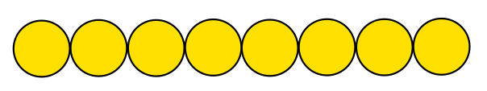

# Mathématiques des flux

Source : https://manual.slic3r.org/advanced/flow-math

Cette page explique les mathématiques utilisées dans SuperSlicer pour déterminer la quantité de matière extrudé.

#### Comprendre la largeur d'extrusion

Deux questions principales doivent être résolues par SuperSlicer :

1.  **A quelle distance** les cordons d'extrusion doivent-ils être positionnés afin d'obtenir une bonne finition continue ?
2.  **Quelle quantité de matière** doit être extrudée pour créer ces cordons ?

Si deux cordons adjacents sont **trop proches** (ou **trop de matière** est extrudée), ils se chevaucheront. Si deux cordons adjacents sont **trop éloignés** (ou **pas assez de matériau** n'est extrudé), des espaces seront visibles et/ou les extrusions se délamineront en raison d'un collage insuffisant.

En extrudant plus ou moins pendant le déplacement (c'est-à-dire en modifiant le rapport **vitesse d'écoulement/vitesse de déplacement**), nous pouvons rendre les trajectoires plus ou moins épaisses :

**Les tracés plus épais auront une meilleure liaison** avec la couche inférieure, et sont donc souhaitable bons pour les pièces mécaniques. Cependant, ils seront moins à même de s'approcher de la forme de l'objet et de remplir les petits espaces ou les courbes étroites (pensez à une mèche de perceuse : une mèche plus grande ne pourra pas pénétrer dans les endroits étroits). Au contraire, les cordons **minces** offriront moins de collage mais une meilleure précision de la forme.

Notez toutefois que la largeur d'extrusion ne peut être contrôlée que lorsque l'on extrude sur une surface existante (telle qu'une couche précédente ou un lit d'impression). Si nous extrudons à l'air libre (c'est-à-dire lors du pontage), la forme résultante sera toujours ronde et égale au diamètre de la buse :

En fait, si vous réduisez le débit de matière, vous obtiendrez des cercles plus petits dans une certaine mesure, jusqu'à ce que la viscosité du plastique génère une rupture du cordon déposée à cause d'une trop grande tension dans la matière. Si, au contraire, vous extrudez trop de matière, la forme du filament extrudé ne changera pas (toujours égale au diamètre de la buse) mais vous obtiendrez un cordon plus lâche.

Commençons donc par une définition :

> La **largeur d'extrusion est l'épaisseur d'un seul filament** extrudé à l'air libre ou au-dessus d'une surface. Ce n'est pas **la distance entre deux cordons  adjacents**, car un certain chevauchement sera généralement appliqué afin d'obtenir un meilleur collage.

#### Ponts : le cas facile

Comme dit plus haut, il n'y a qu'un seul débit correct pour le pontage : celui qui ne fait pas s'affaisser ou se casser votre pont. Les extrusions sont**rondes**et leur**diamètre est égal au diamètre de la buse**. Les trajectoires parallèles seront positionnées de manière à être**tangentes**, donc l'espacement entre une trajectoire et sa voisine est également égal au diamètre de la buse. (Dans le cas des ponts, nous ne voulons aucun chevauchement car il a été prouvé qu'il génère un écroulement des cordons déjà déposés).

Le volume de matériau nécessaire pour un trajet de longueur unitaire est calculé en fonction de la forme cylindrique, donc avec une section transversale circulaire :

    E = (nozzle_diameter/2)^2 * PI

#### Extrusion sur le dessus d'une surface

Dans ce cas, le problème est le suivant : **Quelle forme aura notre extrusion ?** Nous savons qu'elle sera écrasée horizontalement, mais aura-t-elle une forme rectangulaire ou ovale ? Quelle est la largeur maximale de l'extrusion que nous pouvons obtenir avec un diamètre de buse donné avant que le plastique ne commence à s'enrouler sur les côtés ?

SuperSlicer part du principe que la forme de la section transversale d'une extrusion est un oblong. La relation entre la largeur d'extrusion souhaitée et le volume à extruder est donc la suivante :

Lorsque la largeur d'extrusion cible est inférieure à la hauteur de la couche, la forme est imprévisible. Nous utilisons donc la même formule rectangulaire mais ne recommandons pas l'utilisation de valeurs d'extrusion aussi fines.

La formule ci-dessus fournit une fonction qui met en corrélation la largeur d'extrusion cible avec la quantité de matériau à extruder par unité de distance : `E = f(extrusion_width, layer_height)`

#### Espacement des cordons

Ok, maintenant nous savons combien extruder pour faire un seul cordon de la largeur désirée. Mais **de combien devons-nous faire se chevaucher** les cordons afin d'obtenir un collage parfait ?

En supposant qu'il n'y ait pas de chevauchement, donc des cordons tangents, il y aurait un espace vide (jaune) :

L'aire de la section transversale de ces vides est généralement :

`void_area = layer_height^2 - (layer_height/2)^2 * PI`

Idéalement, nous voudrions remplir toute cette zone jaune en plaçant les extrusions à proximité les unes des autres. Cependant, il est très peu probable que la deuxième extrusion remplisse l'espace situé sous la précédente, il y aurait donc toujours un petit vide. Le chevauchement idéal serait quelque chose comme :

`0 < overlap_factor*void_area < void_area`

avec un facteur de recouvrement ( `overlap_factor` ) allant de 0 à 1. Le facteur de recouvrement représente la quantité de vide restant entre les extrusions. Il est difficile d'estimer cette quantité, car elle dépend probablement aussi de la viscosité du plastique, de la vitesse d'extrusion et de la température. Dans le passé, plusieurs valeurs ont été essayées pour le  facteur de recouvrement ( `overlap_factor`), mais certains utilisateurs rapportaient toujours des cordons trop épars. Une valeur de 1 est actuellement utilisée pour garantir que l'erreur (qui est toujours présente) est entièrement du côté d'une sur-extrusion plutôt que du manque de matière.

L'espacement des cordons est ainsi :

`spacing = extrusion_width - layer_height * (1 - PI/4)`

#### Valeurs par défaut recommandées

SuperSlicer permet aux utilisateurs de définir manuellement la largeur d'extrusion pour chaque type d'extrusion (périmètres, remplissage, matériau de support, etc.) mais calculera des valeurs par défaut recommandées si aucune valeur personnalisée n'est saisie.

Pour les **Périmètres externes**, SuperSlicer utilisera par défaut une **largeur d'extrusion mince** , égale au`nozzle diameter * 1.05`. Ceci est considéré comme la largeur d'extrusion sûre la plus fine. Une largeur d'extrusion fine permet une **meilleure précision** de la forme de l'objet et minimise les erreurs d'écoulement causées par un filament irrégulier.

La largeur d'extrusion est calculée en obtenant la section transversale du diamètre de la buse configurée, puis en calculant la largeur d'extrusion produite par l'extrusion de cette quantité de matériau. En d'autres termes, en **mariant la vitesse d'écoulement et la vitesse de déplacement** . Le but de cette logique est de trouver le flux "standard" qui minimise les forces latérales pendant l'extrusion. L'extrusion ainsi calculée est plafonnée à une valeur maximale égale à `nozzle_diameter * 1.7`, sauf pour les remplissages internes épars où le flux standard complet est utilisé.
