# Fonctionnalités avancées

## Contenu de la page

* Fonctionnalités avancées
	* [Paramètres par modèle](#paramètres-par-modèle)
	* [Changement de couleur](#changement-de-couleur)
	* [Modificateurs](#modificateurs)
	* [Recharger depuis le Disque](#recharger-depuis-le-disque)
	* [Insérer une pause ou un G-code personnalisé à une couche](#insérer-une-pause-ou-un-g-code-personnalisé-à-une-couche)
	* [Exporter les parcours d'outils au format OBJ](#exporter-les-parcours-doutils-au-format-obj)

* [Retour Page principale](../superslicer.md)

## Paramètres par modèle

Avec SuperSlicer, vous pouvez imprimer plusieurs modèles à la fois, chacun avec des paramètres légèrement différents. Par exemple, avec un remplissage ou une hauteur de couche différents.

Faites un **clic-droit** (mode **Avancée**) sur un modèle et choisissez soit :

- **Remplissage**
- **Couches et périmètres**
- **Supports**

Dans le mode **Expert**, une option supplémentaire **Ajouter des réglages** est disponible et vous permet d'ajuster des paramètres tels que la vitesse, la largeur d'extrusion, le chevauchement remplissage/périmètre et plus encore.

Vous pouvez également cliquer avec le bouton droit sur l'icône d'édition dans la Liste d'objets.

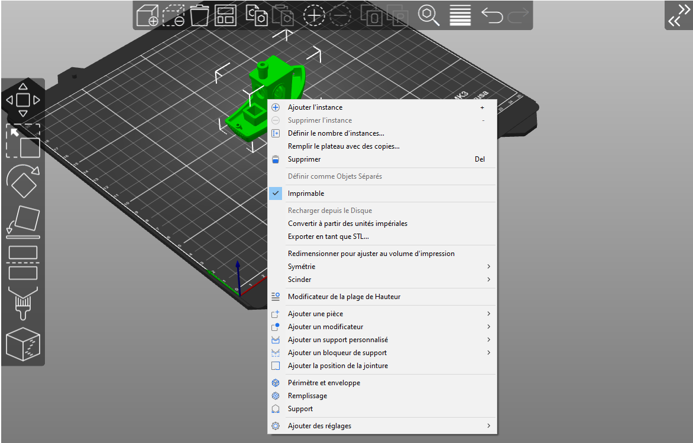

Une nouvelle fenêtre apparaîtra dans le panneau de droite appelée **Paramètres de l'objet à modifier**. La modification de ces paramètres affectera **uniquement l'objet concerné et ses instances**. Vous pouvez supprimer les paramètres remplacés en cliquant sur l'icône croix rouge. Si vous le faites, les paramètres globaux seront à nouveau appliqués.

## Changement de couleur

SuperSlicer vous permet de planifier un changement de filament à une certaine couche. Cela peut être utilisé pour imprimer des modèles multicolores de base. L'imprimante interrompt automatiquement l'impression dès qu'elle lit le changement de couleur dans le G-code (commande M600) et invite l'utilisateur à procéder au changement de filament.

1. Un changement de couleur peut être inséré à partir de la fenêtre d'[**Aperçu**](../user_interface/user_interface.md#aperçu-des-découpes)
1. Faites glisser le **curseur de couche** à droite pour sélectionner la couche cible
1. Vous pouvez soit 
   1. Faire un **clic gauche** sur l'icône plus orange pour ajouter un changement de couleur (couleur d'aperçu aléatoire)
   1. Faire un **clic droit** sur l'icône plus orange et sélectionnez **Ajouter un changement de couleur**. Une fenêtre de sélection de couleur apparaîtra vous permettant de choisir la couleur désirée afin d'obtenir un aperçu plus fidèle
1. Si vous réitérez, vous ajoutez autant de changements de couleur que vous le souhaitez

Vous pouvez **retirer** un changement de couleur en déplaçant le curseur sur la couche cible et en faisant un clic gauche sur l'icône croix grise.

Vous pouvez **éditer** l'aperçu d'un changement de couleur en déplaçant le curseur sur la couche cible et en faisant un clic droit sur l'icône croix grise.

Un aperçu s'affiche instantanément pour que vous puissiez voir exactement à quoi ressemblera votre modèle avec le changement de couleur.

N'oubliez pas que vous devez utiliser des **filaments du même type**, mélangez toujours du PLA avec du PLA, du PETG avec du PETG et ainsi de suite. Le mélange de matériaux de différents types entraînera très probablement une impression échouée car ils n'adhèrent pas bien les uns aux autres.

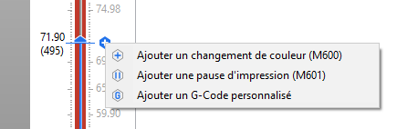 

**Estimations du temps des changements de couleur**

Lorsque vous ajoutez un ou plusieurs changements de couleur, le panneau d'informations de découpage inclura des estimations de temps d'impression jusqu'à chaque changement de couleur. Cela vous permet de planifier le moment où vérifier l'imprimante pour procéder au changement de couleur.

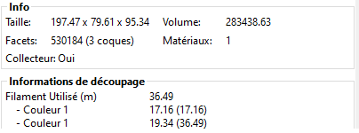 

**Couper le signal sonore invitant à changer de couleur**

Si le temps estimé de changement de couleur se produit pendant la nuit ou à un autre moment gênant, vous pouvez basculer le bip de votre imprimante en mode *[Silencieux]*, *[Muet]* ou *[Une fois]*. Cela se trouve dans les *Réglages*, dans le menu LCD.

## Modificateurs

Dans certains cas, vous voudrez peut-être **modifier certains paramètres uniquement pour une section spécifique de votre modèle**. Par exemple, vous pouvez souhaiter qu'une partie de votre modèle ait un remplissage plus dense ou plusieurs périmètres pour une rigidité accrue. Mais vous ne voulez pas ajuster ces paramètres globalement, car cela gaspillerait beaucoup de matériau et augmenterait le temps d'impression.

Il existe plusieurs façons de spécifier quelle section du modèle doit être affectée par les paramètres personnalisés. Vous pouvez utiliser un modificateur de plage de hauteur, une primitive de maillage de modification simple (par exemple, un cube) ou un maillage de modification de modèle personnalisé.

### Modificateurs de plage de hauteur

Faites un **clic-droit** sur un modèle et choisissez **Modificateur de plage de hauteur** dans le menu contextuel.

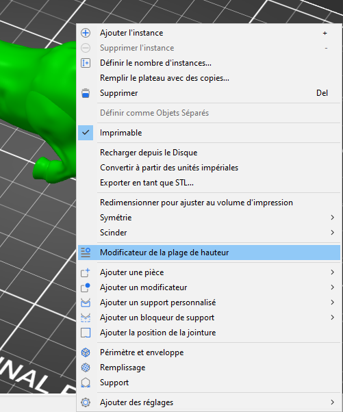  

Une nouvelle fenêtre apparaîtra dans le panneau de droite appelée **Plages de hauteur**. Ici, vous définissez des intervalles entre lesquels vous pouvez appliquer différents paramètres. Lorsque vous définissez un intervalle, il apparaîtra dans la liste des objets dans le panneau de droite.

Vous pouvez ajouter ou supprimer des intervalles avec les icônes **plus** et **moins** oranges.

Lorsque vous cliquez sur l'icône engrenage à côté de l'intervalle, vous pouvez choisir de configurer :

**Mode avancé** - remplissage personnalisé, couches et périmètres ou supports

**Mode expert** - remplissage personnalisé, couches et périmètres, supports, largeur d'extrusion, vitesse et plusieurs autres paramètres

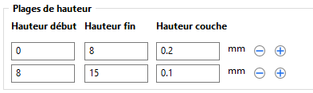

Le paramètre d'intervalle comporte également une **entrée de hauteur de couche**. Par défaut, le paramètre global de couche est utilisé, mais vous pouvez choisir de découper le modèle à une hauteur de couche différente et seul l'intervalle sera affecté par ce changement. Gardez à l'esprit que si vous définissez une hauteur de couche différente pour l'ensemble du modèle, sur l'intervalle de hauteur, elle sera remplacée par cette valeur.

Un modificateur de plage de hauteur a été utilisé pour définir les couches supérieure et inférieure sur 0 et pour changer le motif de remplissage en triangles pour la partie inférieure (noire) du modèle

### Ajouter un modificateur

**Les maillages de modification appliquent des paramètres personnalisés à l'intersection du maillage de modification et du modèle.**

Faites un **clic-droit** sur un modèle et choisissez **Ajouter un modificateur - [Sélectionner le type de modificateur]**. Vous pouvez également cliquer avec le bouton droit sur l'icône engrenage dans le panneau Liste des objets.

|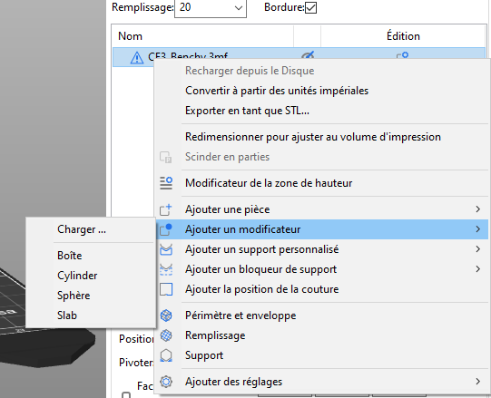|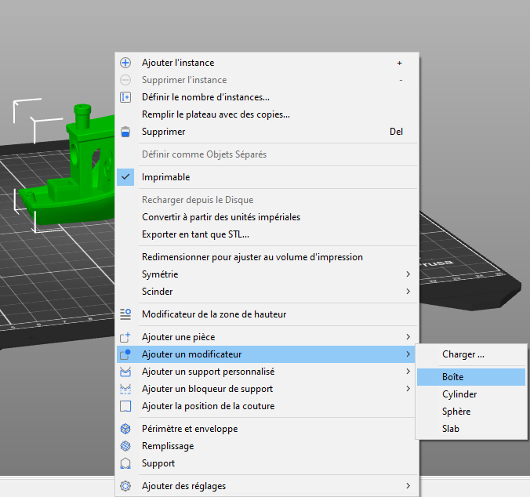|
| - | :-: |

#### *Forme du maillage de modification*
Vous avez le choix entre 4 primitives - cube, cylindre, sphère et pavé.

De plus, en mode expert, vous pouvez utiliser une **forme personnalisée en tant que maillage de modification** en sélectionnant **Charger…** dans la sélection de maillage. Ce maillage est généralement quelque chose que vous avez modélisé au préalable dans un programme de modélisation 3D.

Un maillage de modification sous la forme d'un rectangle qui supprime les couches pleines supérieure et inférieure et un autre sous la forme d'un plan qui les réactive et change l'extrudeur au numéro 2 (imprimé avec le MMU2S) Image Prusa

Lorsque vous choisissez la forme de modification (par exemple, le cube), elle apparaîtra dans la vue 3D et dans la liste des objets dans le panneau de droite.

Vous pouvez utiliser les outils familiers Outils Déplacer, Faire pivoter et Redimensionner pour transformer le maillage de modification.

#### *Modification des paramètres du maillage de modification*
Vous pouvez soit faire un **clic droit sur le modificateur** dans la vue 3D ou cliquer sur l'**icône engrenage** dans le panneau Liste des objets pour sélectionner :

- **Mode avancé** - remplissage personnalisé, couches et périmètres ou supports
- **Mode expert** - remplissage personnalisé, couches et périmètres, supports, largeur d'extrusion, vitesse et plusieurs autres paramètres

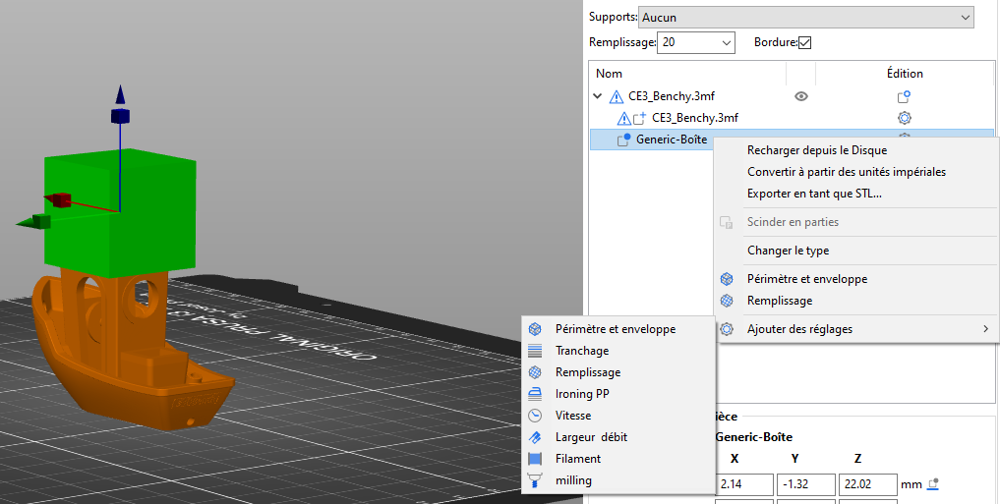 

Certains paramètres ne sont disponibles que dans les **modes Avancé et Expert** : **mode Avancé**- remplissage personnalisé, couches et périmètres ou supports **Mode expert**- remplissage personnalisé, couches et périmètres, supports, largeur d'extrusion, vitesse et plusieurs autres paramètres

Si vous redimensionnez le modèle, le modèle et le maillage de modification seront redimensionnés. Le maillage de modification conservera sa taille et sa position par rapport au modèle.

#### *Placer le modificateur sur le plateau*
Si vous avez déplacé un modificateur au-dessus du plateau d'impression, vous pouvez utiliser le bouton Panneau de manipulation de pièces pour le replacer.

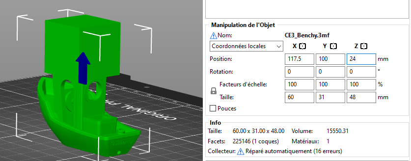 

### Ajouter un support personnalisé
**Les supports personnalisés permettent de rajouter des géométries de support aux endroits désirés.**

Faites un **clic-droit** sur un modèle et choisissez **Ajouter un support personnalisé - [Sélectionner le type de support]**.

### Ajouter un bloqueur de support
**Les supports personnalisés permettent de rajouter des géométries de support aux endroits désirés.**

Faites un **clic-droit** sur un modèle et choisissez **Ajouter un bloqueur de support - [Sélectionner le type de bloqueur]**. Le bloquer de support empêchera la création de support dans la zone où il est positionné.

### Ajouter la position de la jointure
**Les sphères de position de la jointure permettent de spécifier à quel endroit seront positionné les jointures.**

Faites un **clic-droit** sur un modèle et choisissez **Ajouter la position de la jointure**.

Une sphère sera créée, elle pourra être positionné dans la zone désiré de la jointure. Les jointures seront créées à proximité de la sphère. Après la création de la sphère, le panneau Manipulation d’une pièce permettra de modifier la position de la sphère par rapport à la pièce.

La position de la jointure spécifiée par la sphère prendra la priorité sur les autres réglages de la jointure.

## Recharger depuis le Disque

Cette fonctionnalité est idéale pour les cas où vous avez créé **une version plus récente de votre modèle** et que vous souhaitez remplacer l'ancienne version dans SuperSlicer sans avoir à configurer des choses comme à nouveau les supports personnalisés ou les maillages de modification.

**Faites un clic-droit** sur un modèle dans la vue 3D et choisissez **Recharger depuis le Disque** dans le menu contextuel.

Vous pouvez également cliquer sur l'icône *édition* dans la liste d'objets (côté droit).

Le rechargement depuis le disque fonctionne même sur les **maillages de modification personnalisés**, que vous pouvez ajouter en mode Expert.

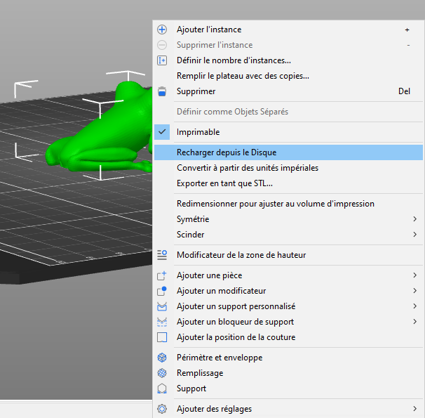 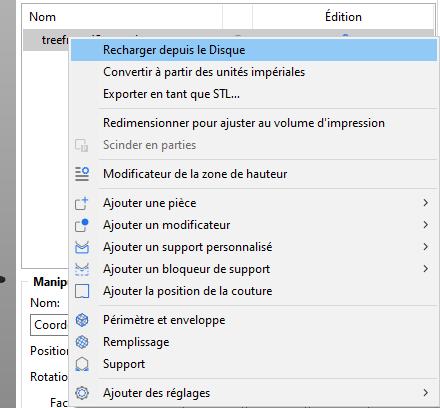

*Deux façons d'accéder à la fonction Recharger depuis le Disque*

### Recharger depuis le disque pour les fichiers 3MF

Lorsque vous rouvrez un fichier de projet 3MF, vous pouvez aussi choisir de recharger l'un des modèles.

Par défaut, les fichiers de projet 3MF sont configurés pour ne pas enregistrer le chemin d'accès complet aux modèles source, car cela peut poser un risque pour la sécurité lors du partage d'un tel fichier. Si le chemin d'accès complet n'est pas enregistré et si **Recharger depuis le Disque** est demandé, SuperSlicer demandera l'emplacement du fichier source.

**Pourquoi l'enregistrement des chemins complets est-il désactivé par défaut ?**

Le format 3MF est essentiellement une archive zip, qui contient des fichiers XML lisibles par l'homme, une image miniature et certains fichiers divers. Le fait que les fichiers XML soient lisibles par l'homme est l'un des avantages du format de fichier 3MF. Cependant, dans certains cas, vous ne souhaiterez peut-être pas révéler l'emplacement de vos fichiers de modèle, par exemple : *C:\Masociété\MonProjetSecret\MonAmis_son_cadeau.stl*

## Insérer une pause ou un G-Code personnalisé à une couche

### Insérer une pause à une couche

L'insertion d'une pause à une certaine hauteur peut être utilisée pour insérer des aimants, des poids ou des écrous dans vos impressions. Lorsque vous reprenez l'impression, ces objets insérés seront couverts par les couches suivantes.

1. Une pause peut être insérée à partir de la fenêtre d'[**Aperçu**](../user_interface/user_interface.md#aperçu-des-découpes)
1. Faites glisser le **curseur de couche** à droite pour sélectionner la couche cible
1. **Faites un clic-droit** sur l'icône plus orange
1. Sélectionnez **Insérer une pause d'impression (M601)** 
   1. La pause sera insérée **avant** que la couche sélectionnée soit en cours d'impression
1. Insérez un court message à afficher sur l'écran LCD de l'imprimante lorsque l'impression est en pause 
   1. Par exemple :  "*Placer les inserts dans les emplacements et reprendre l'impression*"
1. Confirmez la pause en appuyant sur **OK**

Vous pouvez **supprimer** la pause en déplaçant le curseur sur la couche de pause et en faisant un clic gauche sur l'icône croix grise.

Vous pouvez **Modifier** le message de pause en faisant un clic droit sur l'icône engrenage bleu.

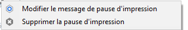

Vous avez besoin de SuperSlicer 2.2 ou plus récent pour accéder aux fonctions Insérer une pause et Insérer un G-code personnalisée.

Lorsque vous découpez à nouveau l'impression avec des pauses d'impression insérées, vous obtenez des **estimations du temps jusqu'à chaque pause**. L'imprimante signalera également la pause par un bip.

Lors de l'insertion d'**aimants**, ils doivent être fermement insérés dans leurs emplacements. Sinon, ils resteront collés à la tête d'impression lorsqu'elle passera sur eux. Soit concevez les fentes avec une tolérance serrée ou utilisez une petite **goutte de super glue** pour les maintenir en place.

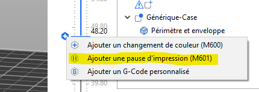

### Insérer un G-code personnalisé à une couche

L'insertion d'un G-code personnalisé peut être utile pour des **utilisateurs avancés** lors de la création de G-code de calibration **comme une tour de température**. 

"Un grand pouvoir implique de grandes responsabilités" : Vérifiez deux fois que vous avez inséré les bons G-codes et que vous comprenez ce qu'ils font. Par exemple, avec certains G-codes, vous pouvez accidentellement remplacer les valeurs en EEPROM ou déplacer la buse dans le plateau d'impression.

1. Un G-code personnalisé peut être inséré à partir de la fenêtre d'[**Aperçu**](../user_interface/user_interface.md#aperçu-des-découpes)
1. Faites glisser le **curseur de couche** à droite pour sélectionner la couche cible
1. **Faites un clic-droit** sur l'icône plus orange
1. Sélectionnez **Ajouter un G-code personnalisé** 
   1. Le G-code personnalisé sera inséré **avant** que la couche sélectionnée soit en cours d'impression
1. Insérez le G-code personnalisé dans la nouvelle fenêtre ouverte
1. Confirmez en appuyant sur **OK**

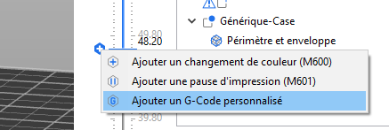

Vous pouvez **supprimer** le G-code personnalisé en déplaçant le curseur sur la couche cible et en faisant un clic gauche sur ***l'icône croix grise***.

Vous pouvez **Editer** le G-code personnalisé en faisant un clic droit sur ***l'icône croix bleue***.

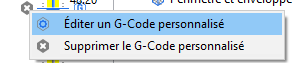 

## Exporter les parcours d'outils au format OBJ

L'exportation du modèle découpé en tant que OBJ peut être utile si vous êtes familiarisé avec un programme de modélisation et de rendu 3D. Lorsque vous découpez un modèle, vous pouvez choisir **Fichier - Exporter - Exporter les parcours en tant que OBJ**. Vous pouvez ensuite importer ce fichier dans un logiciel 3D que vous aimez, tel que Blender, et rendre des aperçus photoréalistes ou même des animations de l'impression.

L'exportation comprend tout ce que vous voyez actuellement dans l'Aperçu. Cela signifie que si vous utilisez le curseur de couche pour prévisualiser une coupe transversale du modèle, le fichier exporté inclura uniquement les couches visibles dans l'aperçu.

Si vous prévoyez de rendre uniquement l'extérieur du modèle découpé, nous vous recommandons de désactiver complètement le remplissage, de maintenir la hauteur de couche supérieure à 0,15 mm et de réduire le nombre de périmètres à 2 afin de réduire le nombre de polygones. Pourtant, vous pouvez vous attendre à plusieurs millions de polygones par modèle.

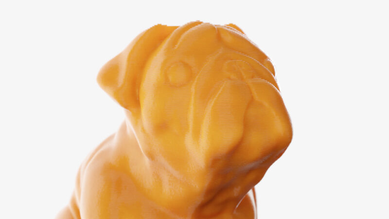

*Rendu du G-Code exporté créé dans Blender 2.8*

Page suivante  [Découpage multi-matériaux](../multimaterial/multimaterial.md)

[Retour Page principale](../superslicer.md)
