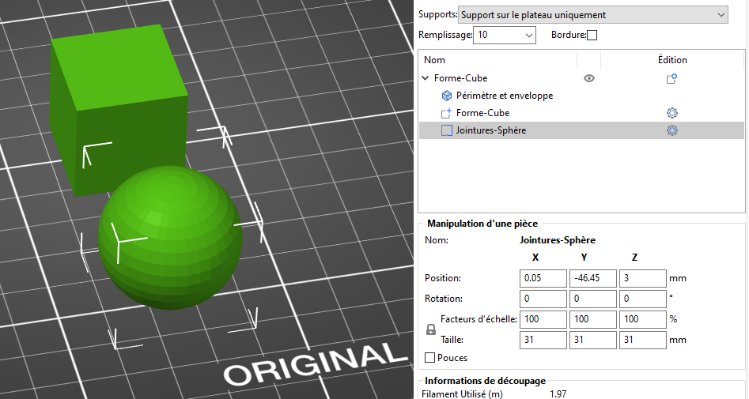

# Fonctionnalités avancées

## Contenu de la page

* Fonctionnalités avancées
	* [Paramètres par modèle](#paramètres-par-modèle)
	* [Changement de couleur](#changement-de-couleur)
	* [Modificateurs](#modificateurs)
	* [Recharger depuis le Disque](#recharger-depuis-le-disque)
	* [Insérer une pause ou un G-Code personnalisé à une couche](#insérer-une-pause-ou-un-g-code-personnalisé-à-une-couche)
	* [Exporter les parcours d'outils au format OBJ](#exporter-les-parcours-doutils-au-format-obj)
	* [Volume négatif](#volume-négatif)
	* [Scripts de post-traitement](#scripts-de-post-traitement)
	* [Recharger depuis le Disque](#recharger-depuis-le-disque)
	* [Galerie de formes](#galerie-de-formes)
	* [Simplifier le maillage](#simplifier-le-maillage)

* [Retour Page principale](../superslicer.md)

## Paramètres par modèle

Avec SuperSlicer, vous pouvez imprimer plusieurs modèles à la fois, chacun avec des paramètres légèrement différents. Par exemple, avec un remplissage ou une hauteur de couche différents.

Faites un **clic-droit** (mode **Avancée**) sur un modèle et choisissez soit :

- **Remplissage**
- **Couches et périmètres**
- **Supports**

Dans le mode **Expert**, une option supplémentaire **Ajouter des réglages** est disponible et vous permet d'ajuster des paramètres tels que la vitesse, la largeur d'extrusion, le chevauchement remplissage/périmètre et plus encore.

Vous pouvez également cliquer avec le bouton droit sur l'icône d'édition dans la Liste d'objets.

Une nouvelle fenêtre apparaîtra dans le panneau de droite appelée **Paramètres de l'objet à modifier**. La modification de ces paramètres affectera **uniquement l'objet concerné et ses instances**. Vous pouvez supprimer les paramètres remplacés en cliquant sur l'icône croix rouge. Si vous le faites, les paramètres globaux seront à nouveau appliqués.

## Changement de couleur

SuperSlicer vous permet de planifier un changement de filament à une certaine couche. Cela peut être utilisé pour imprimer des modèles multicolores de base. L'imprimante interrompt automatiquement l'impression dès qu'elle lit le changement de couleur dans le G-code (commande M600) et invite l'utilisateur à procéder au changement de filament.

1. Un changement de couleur peut être inséré à partir de la fenêtre d'[**Aperçu**](../user_interface/user_interface.md#aperçu-des-découpes)
1. Faites glisser le **curseur de couche** à droite pour sélectionner la couche cible
1. Vous pouvez soit 
   1. Faire un **clic gauche** sur l'icône plus bleue pour ajouter un changement de couleur (couleur d'aperçu aléatoire)
   1. Faire un **clic droit** sur l'icône plus bleue et sélectionnez **Ajouter un changement de couleur**. Une fenêtre de sélection de couleur apparaîtra vous permettant de choisir la couleur désirée afin d'obtenir un aperçu plus fidèle
1. Si vous réitérez, vous ajoutez autant de changements de couleur que vous le souhaitez

Vous pouvez **retirer** un changement de couleur en déplaçant le curseur sur la couche cible et en faisant un clic gauche sur l'icône croix grise.

Vous pouvez **éditer** l'aperçu d'un changement de couleur en déplaçant le curseur sur la couche cible et en faisant un clic droit sur l'icône croix grise.

Un aperçu s'affiche instantanément pour que vous puissiez voir exactement à quoi ressemblera votre modèle avec le changement de couleur.

N'oubliez pas que vous devez utiliser des **filaments du même type**, mélangez toujours du PLA avec du PLA, du PETG avec du PETG et ainsi de suite. Le mélange de matériaux de différents types entraînera très probablement une impression échouée car ils n'adhèrent pas bien les uns aux autres.

 

**Estimations du temps des changements de couleur**

Lorsque vous ajoutez un ou plusieurs changements de couleur, le panneau d'informations de découpage inclura des estimations de temps d'impression jusqu'à chaque changement de couleur. Cela vous permet de planifier le moment où vérifier l'imprimante pour procéder au changement de couleur.

 

## Modificateurs

Dans certains cas, vous voudrez peut-être **modifier certains paramètres uniquement pour une section spécifique de votre modèle**. Par exemple, vous pouvez souhaiter qu'une partie de votre modèle ait un remplissage plus dense ou plusieurs périmètres pour une rigidité accrue. Mais vous ne voulez pas ajuster ces paramètres globalement, car cela gaspillerait beaucoup de matière et augmenterait le temps d'impression.

Il existe plusieurs façons de spécifier quelle section du modèle doit être affectée par les paramètres personnalisés. Vous pouvez utiliser un **modificateur de plage de hauteur**, un modèle de modification avec une géométrie simple (par exemple, un cube) ou un maillage de modification de modèle personnalisé.

### Modificateur de plage de hauteur

Faites un **clic-droit** sur un modèle et choisissez **Modificateur de plage de hauteur** dans le menu contextuel.

  

Une nouvelle fenêtre apparaîtra dans le panneau de droite appelée **Plages de hauteur**. Ici, vous définissez des intervalles entre lesquels vous pouvez appliquer différents paramètres. Lorsque vous définissez un intervalle, il apparaîtra dans la liste des objets dans le panneau de droite.

Vous pouvez ajouter ou supprimer des intervalles avec les icônes **plus** et **moins** bleus.

Lorsque vous cliquez sur l'icône engrenage à côté de l'intervalle, vous pouvez choisir de configurer :

**Mode avancé** - remplissage personnalisé, couches et périmètres ou supports

**Mode expert** - remplissage personnalisé, couches et périmètres, supports, largeur d'extrusion, vitesse et plusieurs autres paramètres

Le paramètre d'intervalle comporte également une **entrée de hauteur de couche**. Par défaut, le paramètre global de couche est utilisé, mais vous pouvez choisir de découper le modèle à une hauteur de couche différente et seul l'intervalle sera affecté par ce changement. Gardez à l'esprit que si vous définissez une hauteur de couche différente pour l'ensemble du modèle, sur l'intervalle de hauteur, elle sera remplacée par cette valeur.

Un modificateur de plage de hauteur a été utilisé pour définir les couches supérieure et inférieure sur 0 et pour changer le motif de remplissage en triangles pour la partie inférieure (noire) du modèle

### Ajouter un modificateur

**Les maillages de modification appliquent des paramètres personnalisés à l'intersection du maillage de modification et du modèle.**

Faites un **clic-droit** sur un modèle et choisissez **Ajouter un modificateur - [Sélectionner le type de modificateur]**. Vous pouvez également cliquer avec le bouton droit sur l'icône engrenage dans le panneau Liste des objets.

|||
| - | :-: |

#### *Forme du maillage de modification*
Vous avez le choix entre 4 primitives - cube, cylindre, sphère et pavé.

De plus, en mode expert, vous pouvez utiliser une **forme personnalisée en tant que maillage de modification** en sélectionnant **Charger…** dans la sélection de maillage. Ce maillage est généralement quelque chose que vous avez modélisé au préalable dans un programme de modélisation 3D.

Un maillage de modification sous la forme d'un rectangle qui supprime les couches pleines supérieure et inférieure et un autre sous la forme d'un plan qui les réactive et change l'extrudeur au numéro 2 (imprimé avec le MMU2S) Image Prusa

Lorsque vous choisissez la forme de modification (par exemple, le cube), elle apparaîtra dans la vue 3D et dans la liste des objets dans le panneau de droite.

Vous pouvez utiliser les outils familiers Outils Déplacer, Faire pivoter et Redimensionner pour transformer le maillage de modification.

#### *Modification des paramètres du maillage de modification*
Vous pouvez soit faire un **clic droit sur le modificateur** dans la vue 3D ou cliquer sur l'**icône engrenage** dans le panneau Liste des objets pour sélectionner :

- **Mode avancé** - remplissage personnalisé, couches et périmètres ou supports
- **Mode expert** - remplissage personnalisé, couches et périmètres, supports, largeur d'extrusion, vitesse et plusieurs autres paramètres

 

Certains paramètres ne sont disponibles que dans les **modes Avancé et Expert** : **mode Avancé**- remplissage personnalisé, couches et périmètres ou supports **Mode expert**- remplissage personnalisé, couches et périmètres, supports, largeur d'extrusion, vitesse et plusieurs autres paramètres

Si vous redimensionnez le modèle, le modèle et le maillage de modification seront redimensionnés. Le maillage de modification conservera sa taille et sa position par rapport au modèle.

#### *Placer le modificateur sur le plateau*
Si vous avez déplacé un modificateur au-dessus du plateau d'impression, vous pouvez utiliser le bouton Panneau de manipulation de pièces pour le replacer.

 

### Ajouter un support personnalisé
**Les supports personnalisés permettent de rajouter des géométries de support aux endroits désirés.**

Faites un **clic-droit** sur un modèle et choisissez **Ajouter un support personnalisé - [Sélectionner le type de support]**.

### Ajouter un bloqueur de support
**Les supports personnalisés permettent de rajouter des géométries de support aux endroits désirés.**

Faites un **clic-droit** sur un modèle et choisissez **Ajouter un bloqueur de support - [Sélectionner le type de bloqueur]**. Le bloquer de support empêchera la création de support dans la zone où il est positionné.

### Ajouter la position de la jointure
**Les sphères de position de la jointure permettent de spécifier à quel endroit seront positionné les jointures.**

Faites un **clic-droit** sur un modèle et choisissez **Ajouter la position de la jointure**.

Une sphère sera créée, elle pourra être positionné dans la zone désiré de la jointure. Les jointures seront créées à proximité de la sphère. Après la création de la sphère, le panneau Manipulation d’une pièce permettra de modifier la position de la sphère par rapport à la pièce.

La position de la jointure spécifiée par la sphère prendra la priorité sur les autres réglages de la jointure.

## Recharger depuis le Disque

Cette fonctionnalité est idéale pour les cas où vous avez créé **une version plus récente de votre modèle** et que vous souhaitez remplacer l'ancienne version dans SuperSlicer sans avoir à configurer des choses comme à nouveau les supports personnalisés ou les maillages de modification.

**Faites un clic-droit** sur un modèle dans la vue 3D et choisissez **Recharger depuis le Disque** dans le menu contextuel.

Vous pouvez également cliquer sur l'icône *édition* dans la liste d'objets (côté droit).

Le rechargement depuis le disque fonctionne même sur les **maillages de modification personnalisés**, que vous pouvez ajouter en mode Expert.

 

*Deux façons d'accéder à la fonction Recharger depuis le Disque*

### Recharger depuis le disque pour les fichiers 3MF

Lorsque vous rouvrez un fichier de projet 3MF, vous pouvez aussi choisir de recharger l'un des modèles.

Par défaut, les fichiers de projet 3MF sont configurés pour ne pas enregistrer le chemin d'accès complet aux modèles source, car cela peut poser un risque pour la sécurité lors du partage d'un tel fichier. Si le chemin d'accès complet n'est pas enregistré et si **Recharger depuis le Disque** est demandé, SuperSlicer demandera l'emplacement du fichier source.

**Pourquoi l'enregistrement des chemins complets est-il désactivé par défaut ?**

Le format 3MF est essentiellement une archive zip, qui contient des fichiers XML lisibles par l'homme, une image miniature et certains fichiers divers. Le fait que les fichiers XML soient lisibles par l'homme est l'un des avantages du format de fichier 3MF. Cependant, dans certains cas, vous ne souhaiterez peut-être pas révéler l'emplacement de vos fichiers de modèle, par exemple : *C:\Masociété\MonProjetSecret\MonAmis_son_cadeau.stl*

## Insérer une pause ou un G-Code personnalisé à une couche

### Insérer une pause à une couche

L'insertion d'une pause à une certaine hauteur peut être utilisée pour insérer des aimants, des poids ou des écrous dans vos impressions. Lorsque vous reprenez l'impression, ces objets insérés seront couverts par les couches suivantes.

1. Une pause peut être insérée à partir de la fenêtre d'[**Aperçu**](../user_interface/user_interface.md#aperçu-des-découpes)
1. Faites glisser le **curseur de visualisation des couches** à droite pour sélectionner la couche cible
1. **Faites un clic-droit** sur l'icône plus bleue
1. Sélectionnez **Insérer une pause d'impression (M601)** 
   1. La pause sera insérée **avant** que la couche sélectionnée ne soit en cours d'impression
1. Insérez un court message à afficher sur l'écran LCD de l'imprimante lorsque l'impression est en pause 
   1. Par exemple :  "*Placer les roulements dans les logements et reprendre l'impression*"
1. Confirmez la pause en appuyant sur **OK**

Vous pouvez **supprimer** la pause en déplaçant le curseur sur la couche de pause et en faisant un clic gauche sur l'icône croix grise.

Vous pouvez **Modifier** le message de pause en faisant un clic droit sur l'icône engrenage bleu.

Vous avez besoin de SuperSlicer 2.2 ou plus récent pour accéder aux fonctions Insérer une pause et Insérer un G-code personnalisée.

Lorsque vous stoppez  à nouveau l'impression avec l'insertion de pauses d'impression, vous obtenez des **estimations du temps jusqu'à chaque pause**. L'imprimante signalera également la pause par un bip.

### Insérer un G-code personnalisé à une couche

L'insertion d'un G-code personnalisé peut être utile pour des **utilisateurs avancés** lors de la création de G-code de calibration **comme une tour de température**. 

"Un grand pouvoir implique de grandes responsabilités" : Vérifiez deux fois que vous avez inséré les bons G-codes et que vous comprenez ce qu'ils font. Par exemple, avec certains G-codes, vous pouvez accidentellement remplacer les valeurs en EEPROM ou déplacer la buse dans le plateau d'impression.

1. Un G-code personnalisé peut être inséré à partir de la fenêtre d'[**Aperçu**](../user_interface/user_interface.md#aperçu-des-découpes)
1. Faites glisser le **curseur de couche** à droite pour sélectionner la couche cible
1. **Faites un clic-droit** sur l'icône plus bleue
1. Sélectionnez **Ajouter un G-code personnalisé** 
   1. Le G-code personnalisé sera inséré **avant** que la couche sélectionnée soit en cours d'impression
1. Insérez le G-code personnalisé dans la nouvelle fenêtre ouverte
1. Confirmez en appuyant sur **OK**

Vous pouvez **supprimer** le G-code personnalisé en déplaçant le curseur sur la couche cible et en faisant un clic gauche sur ***l'icône croix grise***.

Vous pouvez **Editer** le G-code personnalisé en faisant un clic droit sur ***l'icône croix bleue***.

 

## Exporter les parcours d'outils au format OBJ

L'exportation du modèle découpé en tant que OBJ peut être utile si vous êtes familiarisé avec un programme de modélisation et de rendu 3D. Lorsque vous découpez un modèle, vous pouvez choisir **Fichier - Exporter - Exporter les parcours en tant que OBJ**. Vous pouvez ensuite importer ce fichier dans un logiciel 3D que vous aimez, tel que Blender, et rendre des aperçus photoréalistes ou même des animations de l'impression.

L'exportation comprend tout ce que vous voyez actuellement dans l'Aperçu. Cela signifie que si vous utilisez le curseur de couche pour prévisualiser une coupe transversale du modèle, le fichier exporté inclura uniquement les couches visibles dans l'aperçu.

Si vous prévoyez de rendre uniquement l'extérieur du modèle découpé, nous vous recommandons de désactiver complètement le remplissage, de maintenir la hauteur de couche supérieure à 0,15 mm et de réduire le nombre de périmètres à 2 afin de réduire le nombre de polygones. Pourtant, vous pouvez vous attendre à plusieurs millions de polygones par modèle.

*Rendu du G-Code exporté créé dans Blender 2.8 (Image Prusa)*

# Volume négatif

Le volume négatif permet de soustraire un maillage d'un autre.

De cette façon, vous pouvez, par exemple, créer des trous facilement redimensionnables directement dans SuperSlicer.

**Faites un clic-droit** sur un modèle et choisissez **Volume négatif**depuis le menu contextuel.  Sélectionnez ensuite la forme de volume négatif.  Vous pouvez choisir l'une des formes de base (cube, cylindre, sphère), en choisir une dans la galerie de formes ou utiliser **Charger...** pour importer un maillage personnalisé.

La soustraction du volume négatif se produit lors du découpage, la géométrie réelle du modèle n'est pas modifiée. Cela signifie qu'il n'est pas possible d'exporter un STL avec les volumes négatifs soustraits.

# Scripts de post-traitement

Il y a certaines choses que SuperSlicer ne fait tout simplement pas. Cependant, en utilisant des scripts de post-traitement, vous pouvez modifier automatiquement le G-code généré pour faire (presque) tout ce que vous voulez.

Vous pouvez spécifier le chemin d'accès au script dans **Réglages d'impression - Options de sortie - Scripts de post-traitement**.

* Exécution de scripts de post-traitement : ajoute depuis la version 2.5  python/perl avant un fichier .py ou .pl.
    * Si le fichier est introuvable, il réessaye en ajoutant le chemin du répertoire SuperSlicer avant.
    * Si le fichier ne peut pas être trouvé, il essaie à nouveau en ajoutant le chemin du répertoire de configuration de SuperSlicer avant.
    * Si le fichier est introuvable, il est réessayé en ajoutant le chemin du répertoire de l'utilisateur.
    
### Mise en place des scripts

Les scripts de post-traitement peuvent être écrits en **n'importe quel langage de programmation** (Perl, Python, Ruby, Bash, etc.). Ils doivent simplement être reconnus par votre système en tant qu'exécutable et accepter le chemin d'accès au fichier G-code comme seul argument.

Si vous souhaitez exécuter plusieurs scripts, placez chaque invocation de script sur sa propre ligne.

### Exécution de scripts

Chaque script recevra le chemin absolu d'un fichier G-code **temporaire** généré par SuperSlicer. Ce fichier est stocké dans un dossier temporaire sur votre disque (généralement votre disque système rapide). Le script est ensuite exécuté pour modifier le G-code sur place et le fichier G-code résultant est écrit dans le dossier cible sélectionné ou envoyé à un hôte d'impression, tel que PrusaConnect ou Octoprint.

Veuillez noter que la visionneuse de G-code visualise toujours le G-code avant le post-traitement.

SuperSlicer transmet toute la configuration de découpage aux scripts de post-traitement à l'aide des variables d'environnement. Chaque variable est préfixée par "SLIC3R_" et la première du lettre du nom de variable est en majuscule. Par exemple, la densité de remplissage est transmise au script en tant que variable d'environnement **"SLIC3R_Fill_density"**.

Deux variables d'environnement supplémentaires sont transmises aux scripts de post-traitement : la variable d'environnement **SLIC3R_PP_HOST** fournit la spécification de l'hôte, où "File" signifie copier le G-code sur un disque dur local ou un support amovible, tandis que les autres valeurs ("PrusaLink", "Repetier ", "SL1Host", "OctoPrint", "FlashAir", "Duet", "AstroBox" ...) spécifie le type d'hôte d'impression auquel le G-code sera envoyé.

La variable d'environnement **SLIC3R_PP_OUTPUT_NAME** contient le nom du fichier G-code incluant le chemin (pour **SLIC3R_PP_HOST == "File"**) ou un nom qui sera donné au fichier après son téléchargement sur l'hôte (PrusaLink, Octoprint ...)

Le script de post-traitement peut suggérer un nouveau nom de fichier de sortie (probablement basé sur SLIC3R_PP_OUTPUT_NAME) en l'enregistrant sur une seule ligne dans un nouveau fichier temporaire "nom de sortie", par exemple pour ajouter des horodatages ou des numéros de séquence aux G-codes finaux. Le nom du fichier "nom de sortie" doit être créé en suffixant le nom de fichier de G-code d'entrée avec ".output_name".  SuperSlicer lira le nouveau nom du fichier et le traitera correctement, par exemple lors de son envoi à Octoprint.

### Paramètres des scripts

Vous pouvez utiliser des paramètres avec votre script de cette façon :

/path/to/executable devient /path/to/executable avec l'argument outputfilename.gcode

/path/to/executable -arg -arg2 devient /path/to/executable avec les arguments -arg, -arg2 et outputfilename.gcode

Si le chemin vers l'exécutable ou les arguments contiennent des espaces, ces arguments doivent être échappés en utilisant le style d'échappement commun à la plate-forme (style d'échappement du shell sous Linux et OSX, échappement de la ligne de commande Windows).

### Exemples

#### Python

[Exemple d'ajout d'un compteur au nom de fichier](https://github.com/foreachthing/Slic3rPostProcessing/blob/a47d64c8b83459cf3bd2906a3e81172c07328f34/SPP-Python/Slic3rPostProcessor.py#L212)

Chemin d'accès du fichier final exporté (ou son nom pour Octoprint)

    env_slicer_pp_output_name = str(getenv('SLIC3R_PP_OUTPUT_NAME'))

Script Python qui modifie le chemin de sortie

    with open(sourcefile + '.output_name', mode='w', encoding='UTF-8') as fopen:
    fopen.write(counter + '_' + env_slicer_pp_output_name)

### Changements historiques et rupture de compatibilité descendante

Avant la version 2.4, SuperSlicer exécutait le script sur le G-code final exporté vers le support cible souhaité. Qui était très souvent un lecteur amovible, comme une carte SD. Les cartes SD sont lentes et s'usent, donc ce n'était pas idéal. Il y avait aussi des problèmes lors de l'envoi du G-code à Octoprint. La nouvelle approche avec le fichier temporaire sur votre disque système évite ces problèmes et étend la fonctionnalité des scripts de post-traitement. Cependant, cela pourrait casser certains de vos scripts existants.

# Recharger depuis le Disque

Cette fonctionnalité est idéale pour les cas où vous avez créé**une version plus récente de votre modèle**et que vous souhaitez remplacer l'ancienne version dans SuperSlicer sans avoir à configurer des choses comme à nouveau les supports personnalisés ou les mesh de modification.

**Faites un clic-droit**sur un modèle dans la vue 3D et choisissez**Recharger depuis le Disque**dans le menu contextuel.

Vous pouvez également cliquer sur l'icône_édition_dans la liste d'objets (côté droit).

Le rechargement depuis le disque fonctionne même sur les**mesh de modification personnalisés**, que vous pouvez ajouter en mode Expert.

_Deux façons d'accéder à la fonction Recharger depuis le disque_

### Recharger depuis le disque pour les fichiers 3MF

Lorsque vous rouvrez un fichier de projet 3MF, vous pouvez aussi choisir de recharger l'un des modèles.

Par défaut, les fichiers de projet 3MF sont configurés pour ne pas enregistrer le chemin d'accès complet aux modèles source, car cela peut poser un risque pour la sécurité lors du partage d'un tel fichier. Si le chemin d'accès complet n'est pas enregistré et si**Recharger depuis le disque**est demandé, PrusaSlicer demandera l'emplacement du fichier source.

**Pourquoi l'enregistrement des chemins complets est-il désactivé par défaut ?**  
Le format 3MF est essentiellement une archive zip, qui contient des fichiers XML lisibles par l'homme, une image miniature et certains fichiers divers. Le fait que les fichiers XML soient lisibles par l'homme est l'un des avantages du format de fichier 3MF. Cependant, dans certains cas, vous ne souhaiterez peut-être pas révéler l'emplacement de vos fichiers de modèle, par exemple :  
_C:MyCompanyNameMySecretProjectNamefriend\_name\_gift.stl_

# Galerie de formes

La galerie de formes intégrée offre un moyen rapide et facile d'accéder à vos modèles les plus utilisés, que vous les utilisiez comme modificateurs ou à placer sur le plateau et à imprimer. Les formes par défaut incluent des primitives de base (cube, cylindre, sphère…) ainsi que d'autres objets utiles, comme un disque d'aide ou un symbole de recyclage. Vous pouvez étendre la bibliothèque avec vos propres modèles. Il peut s'agir du logo de votre entreprise, d'une forme de modification que vous utilisez souvent ou simplement d'un modèle que vous imprimez encore et encore. Si vous ajoutez un modèle, il obtiendra une vignette générée automatiquement. Cependant, vous pouvez remplacer la vignette PNG générée par votre propre image.

Nous prévoyons d'étendre la fonctionnalité de galerie de formes dans les prochaines versions. Nous ajouterons probablement un système de dossiers/onglets, afin que vous puissiez organiser les formes. Nous prévoyons également d'ajouter un générateur de texte. Et nous allons étendre la bibliothèque des formes par défaut. 

# Simplifier le maillage

Les numérisations 3D et les modèles sculptés comportent souvent un grand nombre de triangles, ce qui les rend difficiles à utiliser. Ces fichiers peuvent ralentir SuperSlicer, prendre beaucoup de temps à découper et même ralentir les imprimantes 3D FDM, en raison du grand nombre de parcours d'outils courts générés.

Vous pouvez réduire le nombre de triangles dans un maillage à l'aide de la fonction Simplifier le maillage. Cliquez avec le bouton droit sur le modèle et sélectionnez**Simplifier le modèle**dans le menu contextuel.

Vous pouvez limiter la simplification soit par niveau de détail soit par le ratio de triangles à supprimer.

Vous pouvez également activer l'option "Afficher la vue filaire" pour voir le contour blanc de chaque triangle.

Un taux de simplification très élevé (petit nombre de triangles) peut être utilisé pour obtenir un effet "**Low-Poly**".

Un aperçu commence automatiquement à être généré chaque fois que vous ajustez la position de l'un ou l'autre des curseurs. Une fois la simplification terminée, le maillage simplifié sera affiché.

Cliquer sur le bouton**Appliquer**utilise les paramètres actuels pour le processus de simplification et ferme la boîte de dialogue. Vous pouvez annuler cette action avec la fonction Annuler (Ctrl+Z).

La simplification des modèles avec un grand nombre de triangles est gourmande en calculs et**prendra du temps**, en particulier sur les machines plus lentes.

# Substitutions de G-code

Cette fonctionnalité est disponible dans SuperSlicer depuis la version  2.4.X

SuperSlicer offre un post-traitement simple du G-Code en spécifiant des paires de recherche et de remplacement, avec une correspondance optionnelle de regex, une sensibilité à la casse et une correspondance de mots entiers, similaire à ce que proposent les éditeurs de texte courants. Les expressions régulières sont des outils très puissants et polyvalents qui permettent de mettre en place des substitutions même assez compliquées. Si vous avez besoin d'un post-traitement plus compliqué, il est possible d'utiliser un [script de post-traitement externe](https://help.prusa3d.com/fr/article/scripts-de-post-traitement_283913) à la place.

La fonctionnalité est accessible depuis les**Réglages d'impression -> Options de sortie**.

Le G-Code est traité avant d'être prévisualisé, de sorte que vos modifications seront visibles dans l'aperçu du G-Code. Il peut être utile d'activer 'G-code commenté' pour que SuperSlicer génère des annotations supplémentaires, que vous pouvez ensuite faire correspondre avec une regex.

### Syntaxe des expressions régulières

La syntaxe des expressions régulières de Perl est prise en charge comme décrit dans [booster la syntaxe des expressions régulières Perl](https://www.boost.org/doc/libs/1_78_0/libs/regex/doc/html/boost_regex/syntax/perl_syntax.html), où un modificateur "sur une seule ligne" imite le modificateur**_s/_**de Perl. Lorsque les expressions régulières sont actives, l'expression "Remplacer par" prend en charge la syntaxe "étendue" comme décrit dans [booster la syntaxe du format étendu](https://www.boost.org/doc/libs/1_78_0/libs/regex/doc/html/boost_regex/format/boost_format_syntax.html). [Les lookahead et lookbehind](https://www.w3docs.com/learn-javascript/lookahead-and-lookbehind.html)sont pris en charge par le moteur d'expressions régulières, mais uniquement pour les expressions de longueur fixe. Avec les expressions régulières désactivées,**_n__, r, t_**, et les variables sont pris en charge dans les expressions "Rechercher" et "Remplacer par" de la même manière que la syntaxe "étendue" de Notepad++.

Le post-processeur de recherche/remplacement de G-code traite le G-code en blocs, où un seul bloc de G-code est généré pour chaque couche en commençant par le Z jusqu'à passer à la couche suivante. Plusieurs expressions de recherche/remplacement sont appliquées une par une à un bloc de G-code avant de traiter le bloc de G-code suivant. La correspondance de motifs multilignes est possible, mais uniquement à l'intérieur d'un bloc de G-code, très probablement à l'intérieur d'une seule couche. Les expressions régulières sont puissantes mais délicates, nous recommandons donc l'[espace de test en ligne regular expressions 101](https://regex101.com/) pour se familiariser avec les expressions régulières et pour tester et affiner les expressions régulières modifiant le G-code avant de les saisir dans SuperSlicer. N'oubliez pas de changer le type de regex en ECMAScript dans l'espace de test en ligne regular expressions 101.

### Exemple

Un exemple d'une modification de G-code assez puissante par une expression régulière raisonnablement complexe : augmenter le taux d'extrusion du remplissage solide supérieur de la valeur par défaut de 95 % à 98 %.  
Rechercher :

    (;TYPE:Top solid infilln)(.*?)(;TYPE:|$)(?!Top solid infill)

  
Remplacer par :

    ${1}M221 S98n${2}M221 S95n${3}

Page suivante  [Découpage multi-matériaux](../multimaterial/multimaterial.md)

[Retour Page principale](../superslicer.md)
