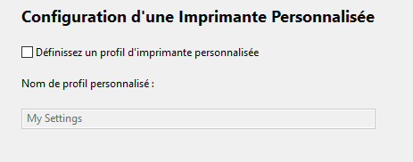

# Configuration

## Contenu de la page

* Configuration
	* [Assistant de Configuration](#assistant-de-configuration) 
	* [Instantanés de Configuration](#instantanés-de-configuration) 

* [Retour Page principale](../superslicer.md)

## Assistant de Configuration
Lorsque vous lancez SuperSlicer pour la première fois, vous serez accueilli par un Assistant de Configuration. L'Assistant de Configuration peut également être lancé manuellement à tout moment à partir du menu supérieur en sélectionnant **Configuration** - **Assistant de Configuration**.

À partir de la version 2.2, SuperSlicer intègre également des profils pour diverses fournisseurs de machine FDM (par exemple les imprimantes Creality). Vous pouvez sélectionner les profils de fournisseur que vous souhaitez activer.

Si vous avez sélectionné des fabricants d'imprimantes, vous pourrez sélectionner les profils d'imprimante de chaque fournisseur que vous souhaitez importer.

La sélection d'imprimante  vous permet de sélectionner les profils d'imprimante que vous souhaitez importer. La plupart des imprimantes d'impression [FDM](../glossary/glossary.md#fused-deposition-modeling-fdm) sont livrées avec une buse de 0,4 mm, cependant, si vous envisagez d'acheter des buses de diamètre différent, vous pouvez importer des profils supplémentaires en cochant les cases appropriées. Des profils supplémentaires peuvent également être importés ultérieurement. 

SuperSlicer prend également en charge les imprimantes [SLA](../glossary/glossary.md#sla) . À l'heure actuelle, la seule imprimante  [SLA](../glossary/glossary.md#sla)  officiellement prise en charge est l'Original Prusa SL1. 

Vous pouvez également définir un profil d'imprimante personnalisé. Cependant, cette fonction est principalement destinée aux fabricants d'imprimantes et aux utilisateurs expérimentés.

Enfin, vous pouvez choisir de vérifier automatiquement les mises à jour de l'application et de mettre à jour automatiquement les profils intégrés. Nous vous suggérons de laisser ces deux fonctionnalités activées.

#### *Vérifier les mises à jour automatique*
Si activé, SuperSlicer vérifie en ligne l'existence de nouvelles versions. Lorsqu'une nouvelle version est disponible, une notification est affichée au démarrage suivant de l'application (jamais pendant l'utilisation du programme). Ceci est uniquement un mécanisme de notification, aucune installation automatique n'est faite.

#### *Mettre à jour automatiquement les préréglages intégrés*
Si activé, SuperSlicer télécharge les mises à jour des préréglages système intégrés en arrière-plan. Ces mises à jour sont téléchargées dans un répertoire temporaire séparé. Lorsqu'une nouvelle version de préréglages est disponible, elle est proposée au démarrage de l'application.

Les mises à jour ne sont jamais appliquées sans l'accord de l’utilisateur et n'annulent jamais les réglages personnalisés de l'utilisateur.

De plus, un instantané de sauvegarde de l'ensemble de la configuration est créé avant qu'une mise à jour ne soit appliquée.

#### *Recharger depuis le Disque*
Si activé, permet à la commande Recharger à partir du disque de rechercher et de charger automatiquement les fichiers lorsqu'elle est invoquée.

Si non activée, la commande Recharger à partir du disque demandera de sélectionner chaque fichier à l'aide d'une boîte de dialogue d'ouverture de fichier.

#### *Association de fichiers**

**Associer les fichiers  .3mf à SuperSlicer** : Association automatique des fichiers d’extension .3mf à SuperSlicer. En double-cliquant sur ces fichiers, ils seront automatiquement ouverts dans SuperSlicer.

**Associer les fichiers .stl files à SuperSlicer** : Association automatique des fichiers d’extension .stl à SuperSlicer. En double-cliquant sur ces fichiers, ils seront automatiquement ouverts dans SuperSlicer.

#### *Mode de vue :*
L'interface utilisateur de SuperSlicer se décline en trois variantes

**Simple, Avancé et Expert** 

Le mode Simple n'affiche que les paramètres les plus fréquemment utilisés, nécessaire aux réglages d'une impression 3D ordinaire. Les deux autres offrent des réglages progressivement plus sophistiqués, ils conviennent respectivement aux utilisateurs avancés et experts.

**Utiliser les pouces** : La taille des objets peut être spécifié en pouces.

## Instantanés de Configuration
Un instantané contient une configuration complète, avec tous les profils système et utilisateur, au moment où l'instantané a été généré. Vous pouvez afficher et vous déplacer d'avant en arrière entre les instantanés à l'aide du menu **Configuration - Instantanés de Configuration**.

Si vous avez l'option' *Mettre à jour automatiquement des Préréglages intégrés* activée dans les **Préférences**, un nouvel instantané est créé avant chaque mise à jour. Vous pouvez aussi créer manuellement un instantané en sélectionnant **Configuration - Capturer un instantané de la configuration**.

Vous pouvez recharger un instantané à l'aide du bouton **Activer**.

Après avoir modifiés les paramètres de vos profils. Si vous ne sauvegardez pas les modifications, à la fermeture du profil ou au changement de réglage, SuperSlicer vous demandera si vous désirez enregistrer les modifications apportées (en indiquant les anciennes et nouvelles valeurs) ou si vous préférez ignorer ces modifications. *Ceci est une des nouveautés de la version 2.3.0*

Page suivante [Première impression avec SuperSlicer](first_print/first_print.md)

[Retour Page principale](../superslicer.md)

