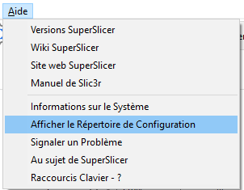

# Lancement de SuperSlicer en mode Console

Version : SuperSlicer_2.3.57.5 based on Slic3r (with GUI support) https://github.com/supermerill/SuperSlicer

Concernant le repertoire de configuration, si vous avez un dossier nommé `configuration` à côté de l'exe, il sera utilisé à la place du dossier utilisateur. 
Le dossier utilisateur est accessible via la fonction **Afficher le Répertoire de Configuration**

Vous pouvez ainsi aisément déterminer quel répertoire est utilisé pour la configuration du logiciel !

## Commande 

Usage : superslicer [ ACTIONS ] [ TRANSFORM ] [ OPTIONS ] [ file.stl ... ]

### Actions
     --export-3mf        Exportez le(s) modèle(s) au format 3MF.
     --export-amf        Exportez le(s) modèle(s) en tant qu'AMF.
     --export-gcode, --gcode, -g Découpez le modèle et exportez les parcours d'outils en code G.
     --export-obj        Exportez le(s) modèle(s) au format OBJ.
     --export-sla, --sla Découpez le modèle et exportez les couches d'impression SLA au format PNG.
     --export-stl        Exportez le(s) modèle(s) au format STL.
     --gcodeviewer       Visualiser un code G déjà découpé et enregistré
     --help, -h          Montrer cette aide.
     --help-fff          Afficher la liste complète des options de configuration de l'impression/du code G.
     --help-sla          Afficher la liste complète des options de configuration de l'impression SLA.
     --info              Écrire des informations sur le modèle dans la console.
     --save ABCD         Sauvegarder la configuration dans le fichier spécifié.
     --slice, -s         Découpez le modèle en FFF ou SLA en fonction de la valeur de configuration printer_technology.

### Options de transformation
     --align-xy X,Y      Alignez le modèle sur le point donné.
     --center X,Y        Centre l'impression autour du centre donné.
     --cut N             Coupez le modèle au Z donné.
     --dont-arrange      Ne réorganisez pas les modèles donnés avant de les fusionner et conservez leurs coordonnées XY originales.
     --duplicate N       Multipliez les copies par ce facteur.
     --duplicate-grid X,Y        Multipliez les copies en créant une grille.
     --merge, -m         Disposez les modèles fournis dans une plaque et fusionnez-les en un seul modèle afin d'effectuer les actions une seule fois.
     --repair            Essayer de réparer les mailles non-manifold (cette option est implicitement ajoutée lorsque nous devons découper le modèle pour effectuer l'action demandée).
     --rotate N           Angle de rotation autour de l'axe Z en degrés.
     --rotate-x N        Angle de rotation autour de l'axe X en degrés.
     --rotate-y N        Angle de rotation autour de l'axe Y en degrés.
     --scale N             Facteur d'échelle ou pourcentage.
     --scale-to-fit X,Y,Z        Mise à l'échelle pour s'adapter au volume donné.
     --split             Détecter les parties non connectées dans le(s) modèle(s) donné(s) et les diviser en objets distincts.

### Autres options
     --config-compatibility   Cette version de SuperSlicer peut ne pas comprendre les configurations produites par les versions les plus récentes de SuperSlicer. Par exemple, une version plus récente de SuperSlicer peut étendre la liste des saveurs de firmware supportées. On peut décider d'abandonner ou de remplacer une valeur inconnue par une valeur par défaut de manière silencieuse ou verbeuse. (disable, enable, enable_silent ; par défaut : enable)
     --datadir ABCD      Charge et stocke les configurations dans le répertoire donné. Ceci est utile pour maintenir différents profils ou inclure des configurations à partir d'un stockage réseau.
     --ignore-nonexistent-config Ne pas échouer si un fichier fourni avec **--load** n'existe pas.
     --load ABCD         Charge la configuration à partir du fichier spécifié. Elle peut être utilisée plus d'une fois pour charger des options à partir de plusieurs fichiers.
     --loglevel N        Définit le niveau d'information de la création d'un journal. 0:fatal, 1:error, 2:warning, 3:info, 4:debug, 5:trace Par exemple, loglevel=2 enregistre les messages de niveau fatal, erreur et warning.
     --output ABCD, -o ABCD Le fichier où la sortie sera écrite (si non spécifié, elle sera basée sur le fichier d'entrée).
     --single-instance   Si cette option est activée, les arguments de la ligne de commande sont envoyés à une instance existante de l'interface graphique SuperSlicer, ou une fenêtre SuperSlicer existante est activée. Remplace la valeur de configuration "single_instance" des préférences de l'application.
     --sw-renderer       Effectuer un rendu avec un logiciel de rendu. Le logiciel de rendu de MESA est chargé à la place du pilote OpenGL par défaut.

Les options d'impression sont traitées dans l'ordre suivant :
	1) Configuration des paramètres à partir de la ligne de commande, par exemple --fill-pattern=stars (priorité la plus élevée, écrase tout ce qui est en dessous)
	2) Fichiers de configuration chargés avec --load
	3) Valeurs de configuration chargées à partir de fichiers amf ou 3mf

Exécutez **--help-fff / --help-sla** pour voir la liste complète des options d'impressions pour les deux modes d'impression.

Page suivante [Mode console pour impression FDM](mode_console_fff.md) 

[Retour Page principale](../superslicer.md)
