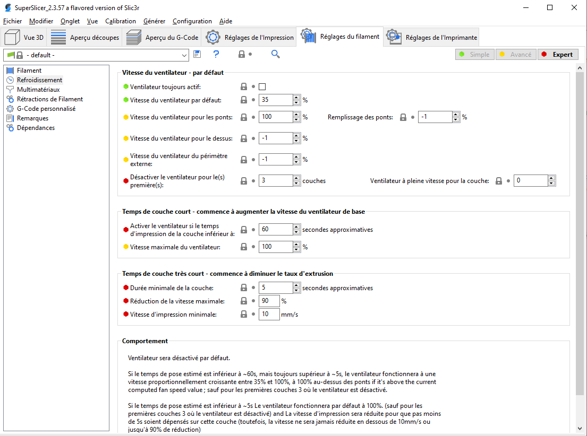
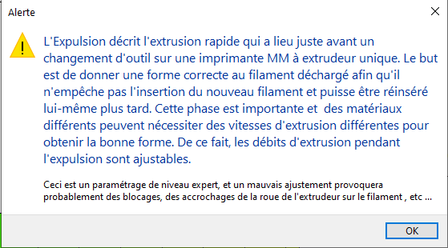

# Réglages du filament

## Contenu de la page

* Réglages du filament
	* [Filament](#filament) 
	* [Refroidissement](#refroidissement)
	* [Multimatériaux](#multimatériaux)
	* [Rétractions de Filament](#rétractions-de-filament)
	* [G-Code personnalisé](#g-code-personnalisé)
	* [Remarques](#remarques)
	* [Dépendances](#dépendances)

* [Retour Page principale](../superslicer.md)

## Filament

#### *[Couleur](../variable/filament_colour.md)*

Ceci est utilisé dans l'interface de SuperSlicer uniquement en tant qu’indication visuelle.

#### *Diamètre*

Entrez le diamètre de votre filament ici. Une bonne précision est requise, utilisez un pied à coulisse et calculez la moyenne de plusieurs mesures le long du filament.

#### *Multiplicateur d’extrusion*

Ce facteur modifie proportionnellement le flux d'extrusion. Vous pouvez avoir besoin de modifier ceci afin d'obtenir un rendu de surface net et une largeur correcte pour les murs uniques. Les valeurs habituelles vont de 0.9 à 1.1. Si vous pensez devoir changer davantage cette valeur, vérifiez le diamètre de votre filament et les E Steps dans le firmware.

#### *Densité*

Entrez ici la densité de votre filament. Ceci est uniquement pour des informations statistiques. Un bon moyen d'obtenir cette valeur est de peser un morceau de filament d'une longueur connue et de calculer le rapport de sa longueur par son poids. 

#### *Coût*

Entrez le coût par Kg de votre filament. Ceci est uniquement pour l'information statistique.

#### *Poids de la bobine*

Entrez ***le poids d'une bobine de filament vide***. De cette manière pouvez peser une bobine de filament partiellement utilisée avant l'impression et ainsi comparer le poids que vous avez mesuré avec le poids du filament calculé avec la bobine pour savoir si la quantité de filament est suffisante pour terminer l'impression.

### Température

#### *Extrudeur*

##### *Première couche*

Température de la buse pour la première couche. Si vous souhaitez contrôler la température manuellement pendant l'impression, réglez ce paramètre sur zéro pour désactiver les commandes de contrôle de la température dans le G-Code de sortie.

##### *Autres couches*

Température de la buse pour les couches après la première. Réglez ceci sur zéro pour désactiver les commandes de contrôle de température dans le G-Code de sortie.

#### *Plateau*

##### *Première couche*

Température du plateau chauffant pour la première couche. Mettez ceci à zéro pour désactiver les commandes de contrôle de température du plateau dans la sortie.

##### *Autres couches*

Température du plateau pour les couches après la première. Mettez ceci à zéro pour désactiver les commandes de contrôle de température du plateau dans la sortie.

#### *Chambre*

Paramètre permettant de définir la température dans l’enceinte de la machine pour les imprimantes fermées.

### Propriétés du filament

#### *[Type de filament](../variable/filament_type.md)*

Le type de matériau de filament à utiliser dans les G-codes personnalisés.

#### *Matériau soluble*

Définition de la propriété soluble du matériau. Il est probable qu'un matériau soluble soit utilisé pour un support soluble.

#### *Retrait*

Entrez le pourcentage de retrait que le filament aura après refroidissement (94% si vous mesurez 94mm au lieu de 100mm). La pièce sera mise à l'échelle en XY pour compenser. Seul le filament utilisé pour le périmètre est pris en compte.

Veillez à laisser suffisamment d'espace entre les objets, car cette compensation se fait après les vérifications.

### Contournement de la vitesse d’impression

#### *Vitesse maximale*

Vitesse maximale autorisée pour ce filament. Limite la vitesse maximale d'une impression au minimum de la vitesse d'impression et de la vitesse du filament. 

> Définir à zéro pour ne fixer aucune limite.

#### *Vitesse volumétrique maximale*

Vitesse volumétrique maximale autorisée pour ce filament. Limite la vitesse volumétrique d'une impression au minimum des vitesses volumétriques d'impression et de filament. Mettez à zéro pour enlever la limite. 

Voir le paragraphe :  [Vitesse volumétrique maximale](../print_settings/print_settings.md#vitesse-volumétrique-maximale) Vitesse volumétrique maximale

## Refroidissement

La température joue un rôle essentiel dans la détermination de la qualité d'impression. Trop chaude et le matériau se déforme, trop froide et l'adhésion des couches peut être problématique. Le refroidissement permet au matériau fraîchement déposé de se solidifier suffisamment pour constituer une bonne base pour la couche suivante, ce qui facilite la réalisation des surplombs, des petits détails et des ponts.
Dès que le plastique fondu quitte la buse, il n'est plus sous le contrôle précis du système d'extrusion. Il y a deux problèmes à considérer :

1. L'impression doit toujours être effectuée sur une **couche déjà solidifiée** sinon, le plastique précédemment extrudé sera déplacé et déformé par la nouvelle couche
1. Lors de l'impression de **surplombs** ou de **ponts**, il est important d'immobiliser et solidifier le plastique en place dès que possible. Sinon, le filament s'affaissera.

La plupart des imprimantes 3D sont livrées avec un **ventilateur d'impression**. En soufflant de l'air ambiant sur le filament extrudé, le refroidissement peut être considérablement amélioré. Cependant, avec certains matériaux, cela pourrait aggraver les choses et provoquer une déformation ou une séparation des couches.

Il existe deux techniques principales de refroidissement : **l'ajout d'un ventilateur** et **le ralentissement de la vitesse d'impression**. SuperSlicer peut choisir d'utiliser les deux techniques, en utilisant d'abord un ventilateur, puis en ralentissant l'impression si le temps de couche est trop rapide.

La figure montre la stratégie adoptée par SuperSlicer. En lisant de droite à gauche, lorsque le seuil minimal du ventilateur (#2) est atteint, le ventilateur est activé. Son intensité augmente au fur et à mesure que le temps de couche diminue. La vitesse d'impression reste constante jusqu'à ce que le temps d'impression estimé descende en dessous d'un certain seuil (#1), c'est alors que la vitesse d'impression est réduite jusqu'à ce qu'elle atteigne sa valeur minimale.

### Ventilateurs

La plupart des électroniques et firmwares permettent l'ajout d'un ventilateur via une connexion électronique. Ceux-ci peuvent alors être piloté avec des codes G,  pour s'allumer ou s'éteindre selon les besoins du modèle, et pour tourner à différentes vitesses.

Il faut faire attention au positionnement du ventilateur afin qu'il ne refroidisse pas un lit chauffé plus que nécessaire. Il ne doit pas non plus refroidir le bloc chauffant de la [Hot End](../glossary/glossary.md#hot-end) afin de ne pas le forcer à faire plus de travail et à gaspiller de l'énergie. Le mouvement de l'air doit viser l'extrémité de la buse, en s'écoulant sur le matériau fraîchement extrudé.

### Ralentissement

SuperSlicer peut demander à l'imprimante de ralentir si le temps de couche estimé est supérieur à un certain seuil.

Il faut être prudent car l'effet escompté pourrait être atténué par le fait que la buse ne s'éloigne pas suffisamment de la nouvelle extrusion, ce qui pose problème pour les petites couches très détaillées. Pour cette raison, il est généralement recommandé d'utiliser un ventilateur lorsque cela est possible.

 SuperSlicer vous permet de régler les paramètres de refroidissement pour chaque filament.

#### *Garder le ventilateur toujours actif*

Le ventilateur d'impression maintiendra toujours au moins une vitesse minimale. **Ce paramètre est généralement activé** pour la plupart des matériaux à l'exception de l'ABS, du PC et de certains flexibles.

#### *Activer le refroidissement automatique*

Lorsqu'il est activé, le ventilateur de refroidissement et la vitesse d'impression changeront pendant l'impression en fonction des paramètres ci-dessous. Une description textuelle ci-dessous sera **mise à jour à chaque changement de n'importe quel paramètre de refroidissement** et expliquera en détail le comportement de refroidissement résultant.

Lorsqu'il est désactivé, le ventilateur d'impression fonctionnera à une vitesse fixe tout le temps défini par **Vitesse du ventilateur - Min** à l'exception des ponts, qui peuvent encore être définis par **Vitesse du ventilateur pour les ponts**.

### Réglages du ventilateur (par défaut)

#### *Faites fonctionner le ventilateur à la vitesse par défaut quand c’est possible*

Si cette option est activée, le ventilateur fonctionnera continuellement à la vitesse de base si aucun réglage n'annule la vitesse. Utile pour le PLA, nuisible pour l'ABS.

#### *Vitesse du ventilateur par défaut*

Vous pouvez définir le **Min** et le **Max** de la vitesse du ventilateur en pourcentage du régime maximal du ventilateur. 

La valeur **Max** sera utilisée lorsque la durée d'impression de la couche est inférieure à la valeur **Ralentir si le temps d'impression de la couche est inférieur à**.

La valeur **Min** sera utilisée lorsque la durée d'impression de la couche est supérieure à la valeur **Activer le ventilateur si le temps d'impression de la couche est inférieur à**.

Si le temps d'impression de la couche se situe entre ces deux valeurs, la vitesse du ventilateur fonctionnera **proportionnellement** à une vitesse entre le **Min** et le **Max**.

Cela peut sembler un peu déroutant, mais vous pouvez utiliser la description textuelle mise à jour en direct sous les Réglages du ventilateur, qui, nous l'espérons, clarifiera tout. Essayez de modifier les valeurs et voyez comment la description change.

#### *Vitesse du ventilateur pour les ponts*

Augmente la vitesse du ventilateur avec la valeur définie lors de l'impression de **ponts et surplombs**. En règle générale, vous définissez cette valeur sur une valeur supérieure à celle de l'impression normale.

L’option ne ralentira pas le ventilateur s'il fonctionne déjà à une vitesse plus élevée.

> Réglez sur 1 pour désactiver le ventilateur

> Mettez la valeur -1 pour utiliser la vitesse normale du ventilateur sur les ponts et les surplombs.

#### *Vitesse du ventilateur pour le dessus*

Cette vitesse de ventilation est appliquée pendant tous les remplissages du dessus.

> Réglez sur 1 pour désactiver le ventilateur.

> Mettez la valeur -1 pour utiliser la vitesse normale du ventilateur sur les couches du dessus.

Ne peut être remplacée que par disable_fan_first_layers.

#### *Vitesse du ventilateur du périmètre externe*

Lorsqu'elle est définie sur une valeur non nulle, cette vitesse de ventilation n'est utilisée que pour les périmètres extérieurs (ceux qui sont visibles).

> Défini à 1 pour désactiver le ventilateur.

> Mettez la valeur -1 pour utiliser la vitesse normale du ventilateur sur les périmètres externes.

Les périmètres externes peuvent bénéficier d'une vitesse de ventilation plus élevée pour améliorer la finition de surface, tandis que les périmètres internes, les remplissages, etc. bénéficient d'une vitesse de ventilation plus faible pour améliorer l'adhésion des couches.

#### *Désactiver le ventilateur pour les X premières couches*

Le refroidissement de la toute première couche n'est généralement **pas nécessaire**, car elle est déposée sur une surface plane. Avec de nombreux filaments, vous pouvez même vouloir éviter le refroidissement pendant les quelques premières couches supplémentaires (généralement entre 1 et 5) pour éviter de déformer et de détacher l'impression du plateau d'impression, ce qui entraînerait inévitablement une impression ratée.

#### *Ventilateur à pleine vitesse pour la X couche*

La vitesse du ventilateur va augmenter de façon linéaire en partant de zéro pour la couche [disable_fan_first_layers](../variable/disable_fan_first_layers.md) jusqu'au maximum pour la couche [full_fan_speed_layer](../variable/full_fan_speed_layer.md). [full_fan_speed_layer](../variable/full_fan_speed_layer.md) sera ignorée si inférieure à [disable_fan_first_layers](../variable/disable_fan_first_layers.md), auquel cas le ventilateur fonctionnera à la vitesse maximum autorisée pour la couche [disable_fan_first_layers](../variable/disable_fan_first_layers.md) +1.

### Temps de couche court

#### *Activer le ventilateur si le temps d'impression de la couche est inférieur à*

Si le temps d'impression estimé de la couche est inférieur à ce nombre de secondes, le ventilateur sera activé et sa vitesse calculée par interpolation des vitesses Min et Max.

#### *Vitesse maximale du ventilateur*

Ce paramètre représente la vitesse maximale à utiliser pour le ventilateur, utilisé lorsque pour une couche le temps d'impression est très court.

### Temps de couche très court

#### *Durée minimale de la couche*

Si le temps d'impression estimé de la couche est inférieur à ce nombre de secondes, la vitesse des déplacements d'impression sera réduite afin d'atteindre cette valeur. Le ralentissement se fait en mettant à l'échelle les vitesses d'impression, de sorte que certains mouvements seront toujours plus rapides que d'autres.

#### *Réduction de la vitesse maximale*

Réglez sur 90% si vous ne voulez pas que la vitesse soit réduite de plus de 90%.

#### *Vitesse d'impression minimale*

La vitesse minimale à laquelle SuperSlicer réduira les vitesses. L'impression à des vitesses extrêmement basses pendant des périodes prolongées peut entraîner des problèmes tels que le fluage thermique.

Gardez à l'esprit qu'en augmentant cette valeur trop haute, vous pouvez invalider partiellement le temps de couche minimum défini par **Ralentir si le temps d'impression de la couche est inférieur à**. Parce que même lors de l'impression à cette vitesse minimale, le temps de couche peut être plus court que la valeur définie.

 

## Multimatériaux

Propriété Multimatériaux du filament

#### *Température de changement de filament multi-matériaux*

Température de changement de filament multi-matériaux 

##### *Température de changement de filaments activé*

Détermine si les températures de changement de filament seront appliquées.

##### *Température de changement de filament*

Pour réduire davantage les fils, il peut être utile de définir une température inférieure juste avant l'extraction du filament de la tête chauffante.

##### *Mode rapide*

Expérimental : diminue la température de la buse pendant les mouvements de refroidissement plutôt qu'avant l'extraction pour réduire le temps d'attente.

##### *Utilise aussi le ventilateur de filament pour l’extrudeuse*

Paramètre expérimental. Peut permettre au hotend de refroidir plus rapidement lors des changements de filament.

##### *Vitesse du ventilateur de changement de filaments*

Paramètre expérimental. Des vitesses de ventilateur trop élevées peuvent entrer en conflit avec la routine PID du hotend.

#### *Réduction de changement de filament multi-matériaux*

##### *Active la réduction de fil ‘skinnydip’*

Skinnydip effectue un plongeon supplémentaire dans la zone de fusion pour 'brûler' les fines chaînes de filaments.

*(Image source [TNDavid](https://github.com/TNDavid))*

Lien sur discussion skinnydip sur [Github PrusaSlicer](https://github.com/prusa3d/PrusaSlicer/issues/2729)

##### *Distance d’insertion*

Pour les extrudeuses standard, généralement de 40 à 42 mm. Pour la mise à niveau par l'extrudeuse bondtech, généralement de 30 à 32 mm. Commencez avec une valeur faible et augmentez-la progressivement jusqu'à ce que les fils disparaissent. S'il y a des taches sur votre tour de purge, votre valeur est trop élevée.

##### *Pause en zone de fusion*

Restez dans la zone de fusion pendant cette durée avant d’extraire le filament.  Généralement pas nécessaire.

##### *Pause avant extraction*

Peut être utile pour éviter que les engrenages de l’extrudeur Bondtech ne déforment les pointes encore un peu chaudes, mais ce n'est généralement pas nécessaire.

##### *Vitesse pour entrer dans la zone de fusion*

Ce n’est généralement pas nécessaire de changer cette valeur.

##### *Vitesse pour sortir de la zone de fusion*

Ce n’est généralement pas nécessaire de changer cette valeur.

#### *Paramètres de la tour de purge*

##### *Purge minimale sur la tour de purge*

Après un changement d'outil, la position exacte dans la buse du filament qui vient d'être chargé peut ne pas être connue, et la pression du filament n'est probablement pas encore stable. Avant de purger la tête d'impression dans un remplissage ou un objet sacrificiel, SuperSlicer va toujours utiliser cette quantité de matériau dans la tour de purge pour produire un remplissage successif ou des extrusions d'objet sacrificiel de façon fiable.

#### *Paramètres de changement de filament pour les imprimantes multi-matériaux mono extrudeur*

##### *Vitesse de chargement au départ*

Vitesse utilisée au tout début de la phase de chargement.

##### *Vitesse de chargement*

Vitesse utilisée pour charger le filament sur la tour de purge.

##### *Vitesse de déchargement au démarrage*

Vitesse utilisée pour décharger l'extrémité du filament juste après l'expulsion.

##### *Vitesse de déchargement*

Vitesse utilisée pour décharger le filament sur la tour de purge (n'affecte pas l'étape initiale de déchargement juste après l'expulsion).

##### *Temps de chargement du filament*

Temps nécessaire pour que le Firmware de l'imprimante (ou la Multi Material Unit 2.0) charge un filament au cours d'un changement d'outils (lorsqu'il exécute le T code). Ce temps est ajouté au temps total d'impression par l'estimateur de temps du G-code.

##### *Temps de décharge du filament*

Temps nécessaire pour que le Firmware de l'imprimante (ou la Multi Material Unit 2.0) décharge un filament au cours d'un changement d'outils (lorsqu'il exécute le T code). Ce temps est ajouté au temps total d'impression par l'estimateur de temps du G-code.

##### *Délais après le déchargement*

Temps d'attente nécessaire après que le filament a été déchargé.  Peut aider à obtenir des changements d'outils fiables avec des matériaux flexible qui ont besoin de plus de temps pour revenir à leurs dimensions originales.

##### *Nombres de mouvements de refroidissement*

Le filament est refroidi en étant déplacé d'avant en arrière dans les tubes de refroidissement. Spécifiez le nombre souhaité de ces mouvements.

##### *Vitesse du premier mouvement de refroidissement*

Les mouvements de refroidissement accélèrent progressivement jusqu'à cette vitesse.

##### *Vitesse du dernier mouvement de refroidissement*

Les mouvements de refroidissement accélèrent progressivement à partir de cette vitesse.

##### *Paramètres de l’expulsion*

Cette chaine est éditée par RammingDialog et contient les paramètres spécifiques d'expulsion.

## Rétractions de Filament

Paramètres de gestion personnalisés de la **Rétraction**.

#### *Longueur*

Lorsque la rétraction est déclenchée avant un changement d'outil, le filament est retiré de la longueur indiquée (la longueur est mesurée sur le filament brut, avant qu'il entre dans l'extrudeur).

#### *Décalage de l’axe Z*

Si vous indiquez une valeur positive, l'axe Z est rapidement élevé à chaque rétraction. Lorsque vous utilisez plusieurs extrudeurs, seul le réglage du premier extrudeur sera pris en compte.

#### *Décaler Z seulement au-dessus de*

Si vous indiquez une valeur positive, le levage de l'axe Z ne sera déclenché qu'à partir de la valeur absolue indiquée pour l'axe Z. Vous pouvez modifier ce réglage pour ***éviter*** le levage de l'axe Z ***sur les premières couches***.

#### *Décaler Z seulement en-dessous de*

Si vous indiquez une valeur positive, le levage de l'axe Z ne sera déclenché que jusqu'à la valeur absolue indiquée pour l'axe Z. Vous pouvez modifier ce réglage pour ***limiter*** le levage de l'axe Z ***aux premières couches***.

#### *Vitesse de Rétraction*

La vitesse des rétractions (ne s'applique qu'au moteur de l'extrudeur).

#### *Vitesse de Réinsertion*

La vitesse de chargement d'un filament dans l'extrudeur après une rétraction (ne s'applique qu'au moteur de l'extrudeur). Si cette valeur reste sur zéro, la vitesse de rétraction est utilisée.

#### *Longueur supplémentaire à la reprise*

Lorsque la rétraction est compensée après un déplacement, l'extruder exprimera cette quantité de filament en plus. Ce réglage est rarement nécessaire.

#### *Trajet minimal après une rétraction*

La rétraction n'est pas déclenchée lorsque les déplacements sont plus courts que cette distance.

#### *Rétracter lors des changements de couche*

Cette option active la rétraction lors d'un déplacement sur l'axe Z.

#### *[Essuyer lors des rétractions](../variable/filament_retract_before_wipe.md)*

Cette option déplace la buse lors des rétractions sur un cordon déjà imprimé, limitant ainsi l'apparition d'amas sur les extrudeurs ayant tendance à couler.

Après le point de rétraction une partie de la rétraction va se faire avec la buse qui suit le cordon déjà déposé.

Zone d’essuyage

#### *Essuyage Extra pour les périmètres extérieurs*

A la fin de l'extrusion de la boucle du périmètre externe, un essuyage est effectué, allant un peu à l'intérieur de l'impression. Le nombre mis dans ce paramètre augmente l'essuyage en déplaçant la buse à nouveau le long du cordon avant l'essuyage final.

#### *Quantité de rétraction avant essuyage*

Avec les extrudeurs bowden, il est conseillé d'effectuer une rétraction rapide avant de réaliser le mouvement d’essuyage.

## G-Code personnalisé

 

### G-Code de début

Cette procédure de départ est insérée au début, après n'importe quel G-Code de départ de l'imprimante (et après n'importe quel changement d'outil pour ce filament dans le cas des imprimantes multi-matériaux). Ceci est utilisé pour supplanter les réglages d'un filament spécifique. Si SuperSlicer détecte **M104**, **M109**, **M140** ou **M190** dans vos codes personnalisés, de telles commandes ne seront pas ajoutées automatiquement de sorte que vous restez libre de personnaliser l'ordre des commandes de chauffe et autres actions personnalisées. Notez que vous pouvez utiliser des variables génériques pour les tous les paramètres SuperSlicer, donc vous pouvez utiliser une commande "**M109 S[first_layer_temperature]**" où vous voulez.

### G-Code de fin

Cette procédure de fin est insérée à la fin d'un fichier de sortie, avant le G-Code de fin de l'imprimante (et avant tout changement d'outil de ce filament dans le cas des imprimantes multimatériaux). Notez que vous pouvez utiliser des variables génériques pour tous les réglages SuperSlicer. Si vous avez des extrudeurs multiples, le G-Code est traité dans l'ordre des extrudeurs.

## Remarques

Vous pouvez renseigner dans cette zone les notes concernant le filament. 

## Dépendances

Cette partie permet de définir les dépendances du profil par rapport à une machine.

### Imprimantes compatibles

Sélectionner les imprimantes compatibles avec ce profil. Vous pouvez cocher l’option **Tout** pour toutes les sélectionner.

### Condition de compatibilité des imprimantes

Une expression booléenne utilisant les valeurs de configuration d'un profil d'imprimante actif. Si cette expression est évaluée comme vraie, ce profil est considéré comme compatible avec le profil d'imprimante actif.

### Profil d’impression compatibles

Sélectionnez les profils d’impression compatibles. Vous pouvez cocher l’option **Tout** pour toutes les sélectionner.

### Conditions des profils d’impression compatibles

Une expression booléenne utilisant les valeurs de configuration d'un profil d'imprimante actif.  Si cette expression est évaluée comme vraie, ce profil est considéré comme compatible avec le profil d'imprimante actif.

Appliquer permet de sélectionner les machines compatibles avec le profil.

Page suivante [Réglages de l'Imprimante](../printer_settings/printer_settings.md)

[Retour Page principale](../superslicer.md)

