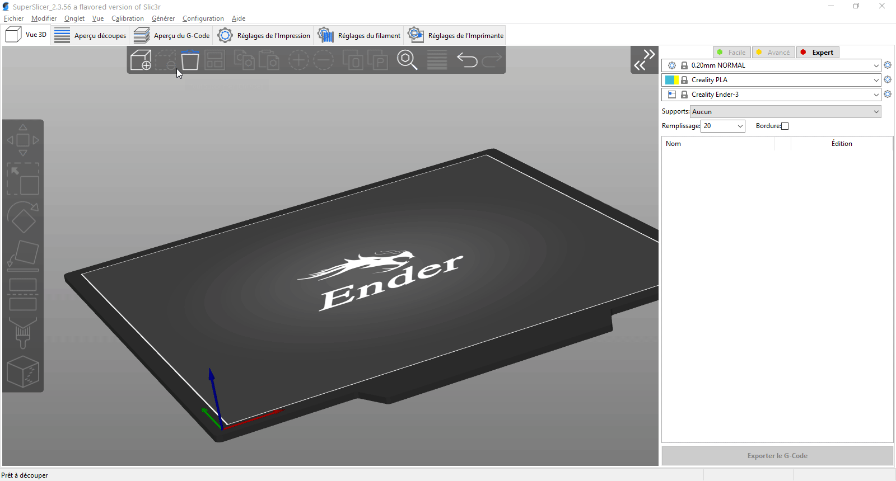
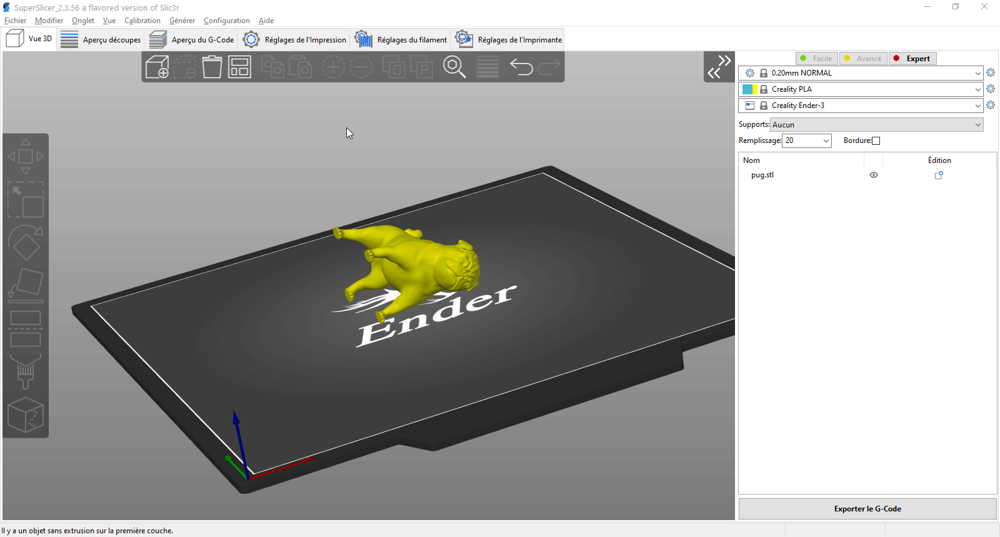
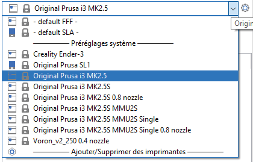
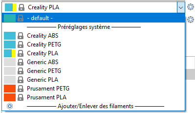
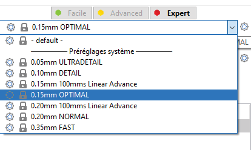
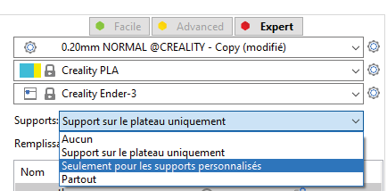
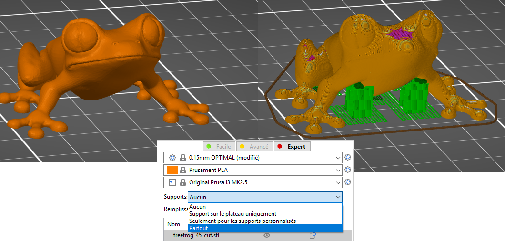
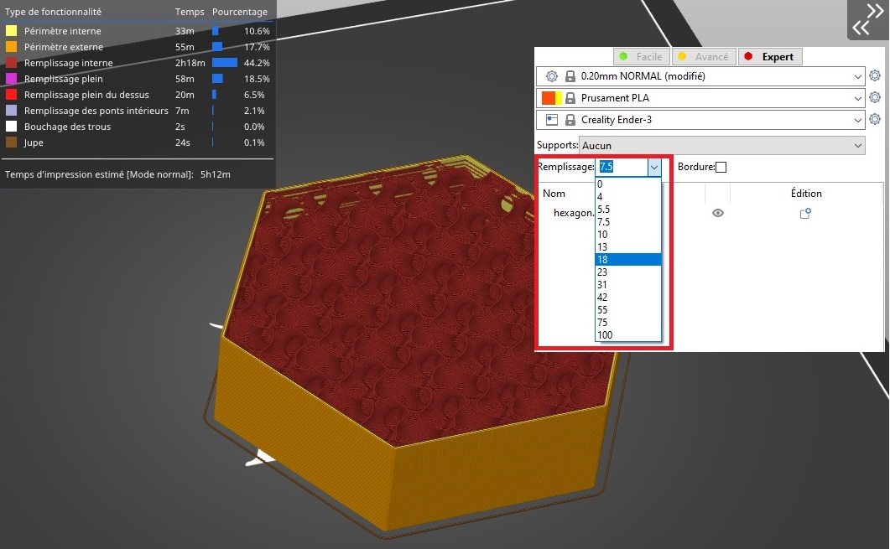
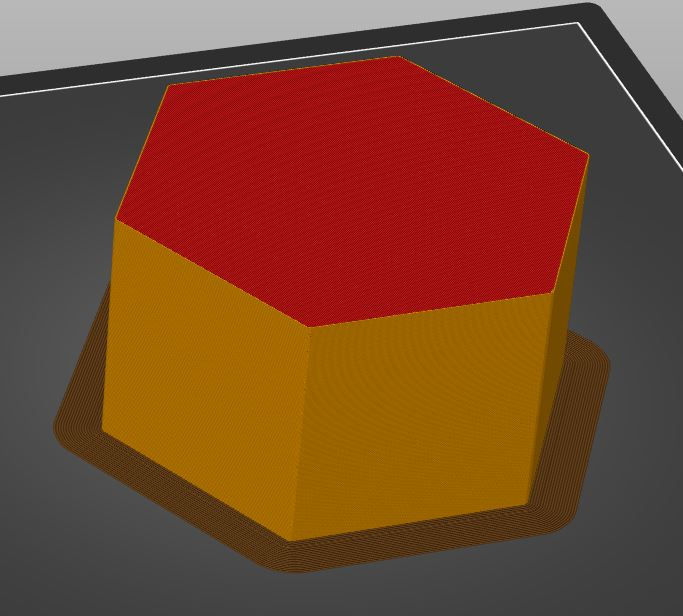
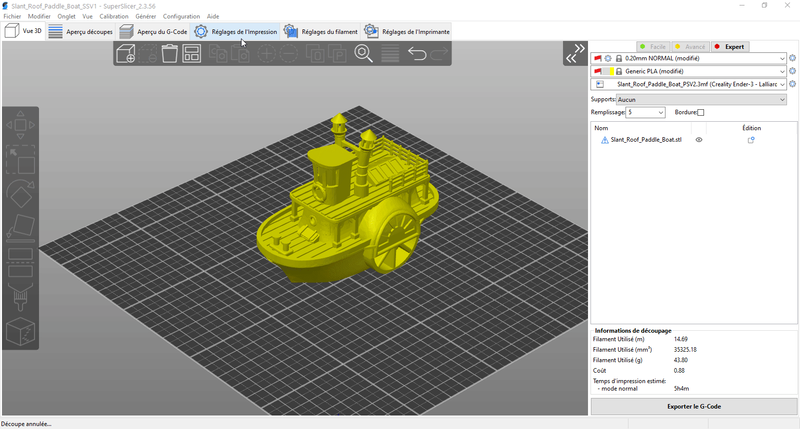

# Première impression avec SuperSlicer

## Contenu de la page

* Première impression avec SuperSlicer
	* [Importation du modèle](#importation-du-modèle)
	* [Orientation du modèle](#orientation-du-modèle)
	* [Sélection de l'imprimante](#sélection-de-limprimante)
	* [Sélection du matériau](#sélection-du-matériau)
	* [Sélection d'un profil d'impression/d'une hauteur de couche](#sélection-dun-profil-dimpressiondune-hauteur-de-couche)
	* [Supports](#supports)
	* [Remplissage](#remplissage)
	* [Bordure](#bordure)
	* [Prévisualisation du G-code avant l'impression](#prévisualisation-du-g-code-avant-limpression)

* [Retour Page principale](../superslicer.md)

## Importation du modèle

Vous devez d'abord importer votre modèle. Vous pouvez soit le glisser-déposer dans la fenêtre de SuperSlicer, soit utiliser le bouton **Ajouter** dans la barre d'outils supérieure, soit choisir **Fichier** - **Importer**.

Les formats 3D supportés sont STL, OBJ, 3MF et AMF.

## Orientation du modèle

Il est possible que votre modèle soit mal orienté après l'importation. Si tel est le cas, vous pouvez utiliser l'outil Rotation (R) pour ajuster manuellement l'orientation de l'objet. Lorsque vous choisissez un axe de rotation, vous pouvez utiliser les guides courts pour effectuer une rotation par incréments de 5 degrés ou les guides longs, qui s'alignent sur des incréments de 45 degrés.

Vous pouvez également utiliser l'outil Placer sur une face (**F**). Lorsque vous le sélectionnez, plusieurs plans blancs apparaissent sur votre modèle. Cliquer sur le plan blanc l'alignera avec le plateau d'impression virtuel.

## Sélection de l'imprimante

Si vous n'avez sélectionné qu'une seule imprimante et taille de buse dans l'Assistant de Configuration, vous avez déjà la bonne imprimante de sélectionnée. Si vous avez choisi d'importer plusieurs profils d'imprimante, sélectionnez celui que vous souhaitez utiliser dans le menu déroulant du panneau de droite.

*Sélection d’une imprimante. En partie supérieure de la liste on retrouve les imprimantes SLA.*

## Sélection du matériau

Des matériaux différents nécessitent des températures d'impression, une vitesse d'impression, un refroidissement et une variété d'autres paramètres différents. Heureusement, SuperSlicer est disponible avec des préréglages pour de nombreux matériaux différents, il vous suffit donc d'en sélectionner un dans le menu déroulant du panneau de droite.

## Sélection d'un profil d'impression/d'une hauteur de couche

En ajustant la hauteur des couches imprimées, vous pouvez optimiser entre la qualité d'impression et le temps d'impression. SuperSlicer propose différents profils d'impression. Pour commencer, nous suggérons d'utiliser des couches de 0,15 ou 0,2 mm car elles offrent une très bonne qualité d'impression avec des temps d'impression raisonnables.

## Supports

Étant donné que chaque couche repose sur la précédente, il peut être nécessaire d'imprimer une structure de support sous les parties qui seraient sinon imprimées dans le vide. De plus, il est difficile pour l'imprimante de reproduire des surplombs très abrupts. SuperSlicer peut détecter où placer les supports et les générer automatiquement. Pour activer les supports, sélectionnez Supports : ***Partout*** ou Supports : ***Sur le plateau uniquement*** dans le menu déroulant du panneau de droite.

Un modèle qui a besoin de supports (à gauche), un modèle avec des supports générés (à droite).

## Remplissage

Les objets ne sont généralement pas imprimés pleins, mais ils ne sont pas non plus totalement vide. Un motif de remplissage clairsemé est utilisé pour remplir l'intérieur du modèle. L'objectif principal du remplissage est de fournir une structure de support interne pour les couches supérieures, ainsi que l'amélioration des propriétés mécaniques de la pièce imprimée. D'un autre côté, nous voulons généralement avoir le moins de remplissage possible afin de réduire les temps d'impression et la consommation de filament. La quantité de remplissage peut être ajustée dans le panneau de droite. Généralement, des valeurs d'environ 10 à 15% suffisent largement.

## Bordure

Une bordure est utilisée pour augmenter l'adhérence au plateau d'impression et réduire la possibilité de déformation. Cela se fait en imprimant des contours supplémentaires sur la première couche et c'est particulièrement utile lorsque la surface de la première couche est très petite. Vous pouvez l'activer en cochant une case dans le panneau de droite. Lorsque l'impression est terminée, il est généralement très facile de retirer la bordure à la main.

## Prévisualisation du G-code avant l'impression

Il est recommandé de toujours prévisualiser le G-code avant de l'imprimer. Lorsque vous cliquez sur le bouton ***Découper maintenant***, vous passez automatiquement en mode d’[**Aperçu**](../user_interface/user_interface.md#aperçu-des-découpes). Vous pouvez également utiliser le bouton de basculement entre la vue 3D et le mode d’[Aperçu des découpes](../user_interface/user_interface.md#aperçu-des-découpes)  dans le coin inférieur gauche ou appuyer sur la touche **Tabulation**. À l'aide du curseur sur la droite, vous pouvez ajuster l'aperçu et inspecter chaque couche. Vérifiez la forme générale du modèle et assurez-vous qu'elle corresponde à l'objet 3D. Vérifiez particulièrement les couches, qui commenceraient à s'imprimer dans le vide, si vous en remarquez, il est nécessaire d'activer la génération de supports. Si la découpe semble bonne, vous pouvez continuer et sélectionner **Exporter le G-code**.

Page suivante  [Interface utilisateur](../user_interface/user_interface.md)

[Retour Page principale](../superslicer.md)
