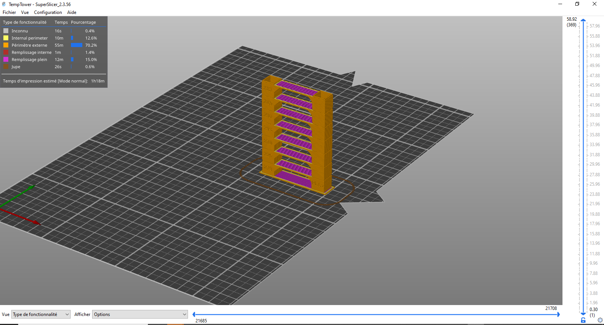

# SuperSlicer Aperçu du G-Code

## Contenu de la page

* SuperSlicer Aperçu du G-Code
	* [Trancheurs supportés](#trancheurs-supportés) 
	* [Associer à l'extension de fichier .gcode](#associer-à-lextension-de-fichier-gcode)
	* [Caractéristiques](#caractéristiques)

* [Retour Page principale](../superslicer.md)

**SuperSlicer G-code Viewer** est une application légère, que vous pouvez utiliser pour prévisualiser rapidement les codes G de tous les trancheurs courants. Son comportement est identique à celui de la prévisualisation dans SuperSlicer (le même code est utilisé), mais vous pouvez charger un fichier G-Code externe.

## Trancheurs supportés

Le logiciel analyse actuellement, et jusqu'à un certain point interprète , le G-Code de :

- [SuperSlicer](https://github.com/supermerill/SuperSlicer)
- [PrusaSlicer](https://www.prusa3d.fr/prusaslicer/)
- [Slic3r et Slic3rPE](https://slic3r.org/)
- [CURA](https://ultimaker.com/fr/software/ultimaker-cura)
- [ideaMaker](https://www.raise3d.com/ideamaker/)
- [Simplify3D](https://www.simplify3d.com/)
- [Craftware](https://craftbot.com/software)
- [KISSlicer](https://www.kisslicer.com/)

 

Le visualiseur autonome de G-Code de SuperSlicer s'efforce d'estimer les largeurs d'extrusion, les hauteurs de couche, les types d'extrusion, les types de mouvements, les couches, etc. à partir du code G généré par les différentes solutions logiciels. Le code G lui-même ne contient pas toutes les informations mentionnées ci-dessus, de sorte que le code G est généralement complété par des commentaires spécifiques aux slicers. Le logiciel essaye d'obtenir autant de données que possible, mais certaines parties peuvent encore être marquées comme inconnues.

SuperSlicer interprète le G-Code avec les commentaires ";TYPE:", ";HEIGHT:", ";LAYER_CHANGE", ";COLOR_CHANGE", ";PAUSE_PRINT" et ";CUSTOM_GCODE". Le G-Code généré qui ne contient pas ces nouvelles annotations sera toujours affiché, mais les largeurs ou les types d'extrusion peuvent ne pas être affichés de manière fiable.

Le G-Code généré avec d'autres logiciels se chargera très probablement correctement, mais certaines fonctionnalités, telles que l'analyse du temps d'impression par fonctionnalité, pourraient ne pas être disponibles.

## Associer à l'extension de fichier .gcode

Si vous associez l'extension de fichier. G-Code à la visionneuse G-Code, vous pourrez la lancer simplement en ouvrant le fichier (en double-cliquant sur celui-ci ou en appuyant sur la touche Entrée). Vous pouvez le faire en activant Configuration - Préférences - Associer des fichiers . G-Code à SuperSlicer  G-Code Viewer.

***Vous pouvez aussi associer l'extension de fichier en utilisant les outils de votre système d'exploitation.***

### Windows
-  *Cliquez avec le bouton droit de la souris sur n'importe quel fichier **G-Code***
-  *Sélectionnez Ouvrir avec - Choisissez le programme par défaut ... - SuperSlicer  G-Code Viewer*
-  *Cliquez sur Plus en bas*
-  *Cochez Toujours utiliser cette application*

### MacOS
-  *Sélectionnez n'importe quel fichier G-code dans le Finder et choisissez Fichier > Obtenir des informations*
-  *Dans la section Ouvrir avec, sélectionnez SuperSlicer  G-Code Viewer*
-  *Cliquez sur Modifier tout et confirmez*

### Ubuntu
- *Sélectionnez n'importe quel fichier G-code*
- *Cliquez avec le bouton droit de la souris sur le fichier et sélectionnez Propriétés*
- *Sélectionnez l'onglet ***Ouvrir avec***
- *Sélectionnez SuperSlicer  G-Code Viewer et cliquez sur Set as default.*

Le processus est similaire sur d'autres distributions Linux.

## Caractéristiques

La visionneuse autonome G-Code affiche les noms des profils d'impression/filtrage/impression utilisés.

Lorsque le code G final est disponible après le découpage, un nouveau curseur horizontal apparaît, limitant la visualisation des extrusions et le déplacement dans le temps, ce qui permet de simuler l'impression dans le temps. Par défaut, le nouveau curseur horizontal limite la visualisation de la dernière couche sélectionnée par la barre d'outils verticale. Alternativement, le curseur horizontal limite les extrusions dans toutes les couches sélectionnées par le curseur vertical. Dans le premier cas, si le curseur horizontal limite la visibilité de la couche supérieure, alors les autres couches inférieures sont rendues en gris. Nous avons emprunté cette stratégie de visualisation à l'interface utilisateur de Craftware, comme l'a fait Cura.

La légende indique désormais le temps d'impression et la fraction de temps d'impression par caractéristique (périmètre, remplissage, etc.), et les étiquettes de la légende servent de boutons pour afficher / cacher le temps d'extrusion particulier. L'estimation du temps d'impression est disponible à la fois dans l'aperçu du code G après le découpage et dans la visionneuse autonome du code G.

### Multiple instances

On peut lancer autant de SuperSlicer G-Code Viewer qu'on le souhaite, soit en ouvrant un G-Code dans le menu **Fichier->Aperçu du G-Code**, soit en lançant l'application G-Code Viewer, soit en double-cliquant sur un fichier G-Code dans un explorateur de fichiers.

Page suivante [LAncement mode console](../console/mode_console.md) 

[Retour Page principale](../superslicer.md)

