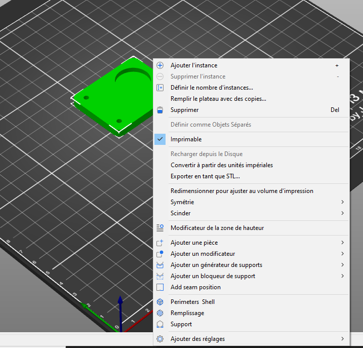
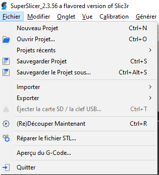
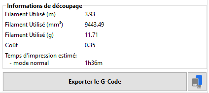
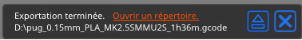
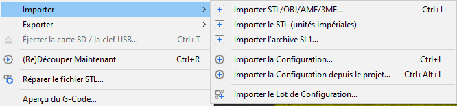
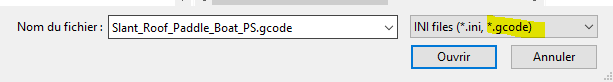
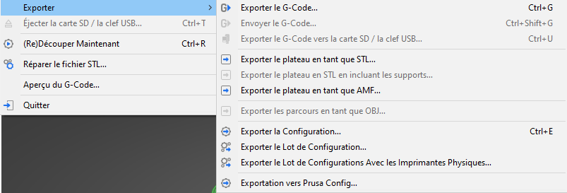
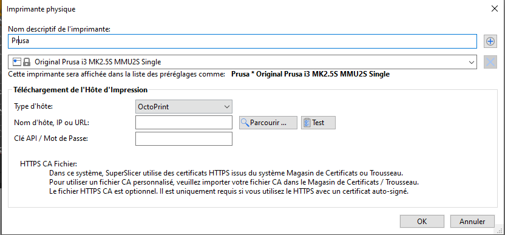

# Exporter/Importer

## Contenu de la page

* Exporter/Importer
	* [Exporter](#exporter) 
	* [Formats de fichiers pris en charge](#formats-de-fichiers-pris-en-charge)
	* [Sauvegarder des projets](#sauvegarder-des-projets) 
	* [Exporter vers une carte SD/une clé USB](#exporter-vers-une-carte-sdune-clé-usb) 
	* [Import / Export des configurations](#import--export-des-configurations) 

* [Retour Page principale](../superslicer.md)

## Exporter
Tous les modèles sur le plateau d'impression et tous les paramètres de SuperSlicer peuvent être enregistrés comme un seul ***Fichier de projet 3MF*** via le menu **Fichier – Sauvegarder le projet**.

Télécharger un fichier **3MF** est un excellent moyen de partager votre modèle en ligne. Par rapport au STL, le 3MF inclut des informations supplémentaires telles que vos paramètres d'impression, la vignette de visualisation de la pièce, les supports personnalisés, la hauteur de couche variable et plus encore !

Alternativement, tous les modèles sur le plateau d'impression peuvent être exportés en un seul STL via **Fichier - Exporter - Exporter le plateau en tant que STL**.

Vous pouvez également exporter des modèles individuels au format STL. Faites un **clic-droit** sur l'un des modèles de la vue 3D et sélectionnez **Exporter en tant que STL ...** Cela peut être utile si vous avez créé des modifications du modèle dans SuperSlicer, telles que la découpe du modèle.

 

En mode SLA, il est également possible d'inclure des supports arborescent (en tant que STL non modifiable) via le menu **Fichier - Exporter le plateau au format STL en incluant les supports**.

*Enfin, la totalité du plateau peut être exportée au format AMF via le menu Fichier - Exporter - Exporter le plateau au format AMF. Il est à noter que ce format d'export est maintenant devenu obsolète et qu'il est préférable d'utiliser le format 3MF.

## Formats de fichiers pris en charge

### 3MF
Le format de fichier préféré également utilisé pour enregistrer les Fichiers projet.

### STL
Les formats binaire et ASCII sont pris en charge.

### OBJ
Les informations telles que le matériau et la texture sont ignorées lors de l'importation.

### AMF

***AMF*** = Additive manufacturing file format

Même si l'AMF est pris en charge,  aujourd’hui il existe un certain consensus des différentes solutions logiciel en faveur du format 3MF à la place. Il est donc plutôt recommandé d’utiliser le format 3MF pour la sauvegarde des projets.

Format AMF : <https://en.wikipedia.org/wiki/Additive_manufacturing_file_format>

## Sauvegarder des projets
**Fichier - Sauvegarder le Projet** enregistre un fichier 3MF contenant tous les objets, paramètres, modificateurs et leurs paramètres. C'est essentiellement **un instantané complet des réglages et géométries de SuperSlicer**.

Lorsque vous ouvrez un fichier de projet sur un autre ordinateur, il doit toujours produire le même G-code.

 

### Format de fichier 3MF
Contrairement à un fichier STL, qui ne stocke que [la géométrie](http://www.fabbers.com/tech/STL_Format) d'un objet (comme une série de triangles de surface), un fichier 3MF est capable de stocker une variété de fichiers différents dans une seule archive, tels que :

- Plusieurs modèles (Incluant les modèles de supports personnalisés)
- **Les réglages du slicer**
- Une vignette
- Des couleurs
- Des textures

Vous pouvez changer l'extension ".3mf" de votre modèle 3D en ".zip" et voir le contenu comme vous le feriez avec un fichier Zip standard. La taille du fichier est également significativement plus petite par rapport au STL.

En savoir plus sur le format 3MF [ici](https://3mf.io/).

## Exporter vers une carte SD/une clé USB
SuperSlicer détecte automatiquement si vous insérez une carte SD, une clé USB ou tout autre support amovible.

Une fois détecté, un nouveau **bouton Exporter vers une carte SD/une clé USB** apparaîtra à côté du bouton Exporter le G-code (coin inférieur droit). Cliquez dessus pour ouvrir la boîte de dialogue d'enregistrement du fichier avec le chemin initialisé sur la carte SD ou la clé USB.

Si plusieurs cartes SD ou clés USB sont détectées, la boîte de dialogue de fichier s'ouvre sur le **dernier support amovible visité**.

Une fois qu'un G-Code est exporté vers un support amovible, un bouton **Éjecter** est affiché à côté du bouton **Exporter le G-code**, qui déconnectera votre appareil en toute sécurité.

 

## Import / Export des configurations

### Importer

### Importer la Configuration

Permet d’importer un fichier INI qui intègre les réglages exportés pour une configuration. 

Cette fonction permet aussi de récupérer les réglages sauvegardés dans chaque fichier G-Code que génère SuperSlicer.

### Importer la Configuration depuis le projet

Permet d’importer les réglages de la configuration stocker dans un projet SuperSlicer. Ce projet est un fichier au format 3MF voir :  [Format de fichier 3MF](../input_output/input_output.md#format-de-fichier-3mf). 

### Importer le Lot de configuration

Permet d’importer au format INI ***l’ensemble des configurations*** d’impression, de filament et d’imprimantes ***personnalisées*** définies dans un fichier d’export

### Exporter

#### *Exporter la Configuration* 

Permet d’exporter au format INI la configuration actuelle.

#### *Exporter le lot de Configuration* 

Permet d’exporter au format INI ***l’ensemble des configurations*** d’impression, de filament et d’imprimantes ***personnalisées***.

#### *Exporter le lot de Configuration Avec les imprimantes Physiques*

Identique à la fonction précédente, mais rajoute les informations sur la connexion des imprimantes (paramètres réseau).

 

Page suivante  [Barre d'outils de gauche](../left_toolbar/left_toolbar.md)

[Retour Page principale](../superslicer.md)
