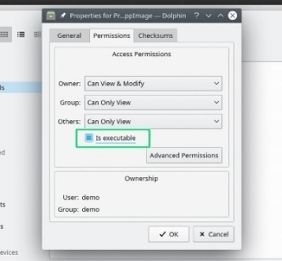

# Installation SuperSlicer

## Contenu de la page

* Installation SuperSlicer
	* [Télécharger les versions](#télécharger-les-versions) 
	* [Installer SuperSlicer](#installer-superslicer)
* [Retour Page principale](../superslicer.md)

## Télécharger les versions
La dernière version SuperSlicer se trouve toujours sur le github <https://github.com/supermerill/SuperSlicer/releases> et elle est disponible pour Windows, Mac OS X et Linux.

## Installer SuperSlicer
### Windows
Lors du téléchargement à partir de Github, assurez-vous de télécharger le bon fichier pour votre ordinateur. Pour Windows, ce sera un fichier .zip, "Win64" dans le titre. La plupart des ordinateurs de nos jours sont en 64 bits.

Consultez [Download SuperSlicer](https://github.com/supermerill/SuperSlicer/releases) pour télécharger et tester des versions Alpha et Bêta de SuperSlicer, sur toutes les plates-formes.

### Mac
Un installateur autonome **DMG** de la dernière version stable peut être téléchargé depuis [le Github](https://github.com/supermerill/SuperSlicer/releases).

Lors du téléchargement à partir de Github, assurez-vous de télécharger le bon fichier pour votre ordinateur. Pour Mac, ce sera le fichier DMG, qui est en 64 bits.

Pour installer l'un de ces packages, faites simplement un glisser-déposer dans la fenêtre du programme d'installation.

### Linux
Une **AppImage** autonome de la dernière version peut être téléchargé depuis [le Github](https://github.com/supermerill/SuperSlicer/releases).  Extrayez le fichier zip contenant un fichier AppImage. Si vous téléchargez à partir de Github, vous obtiendrez simplement un fichier AppImage. Vous devrez ensuite rendre le fichier AppImage exécutable pour démarrer SuperSlicer. La manière exacte dont cela se fait varie un peu d'une distribution à l'autre.

#### *Rendre les fichiers AppImage exécutables*
Ubuntu, Linux Mint et MX Linux sont trois distributions populaires de Linux. Tout ce que vous devez faire est de localiser le fichier AppImage, cliquez dessus avec le bouton droit de la souris et sélectionnez Propriétés. Dans le nouveau menu qui apparaît, sélectionnez Permissions et cochez "Autoriser l'exécution du fichier en tant que programme", ou une variante de ceci (carré vert), pour rendre le fichier exécutable. Fermez les propriétés et vous devriez maintenant pouvoir double-cliquer sur l'icône pour démarrer SuperSlicer.

||||
| :-: | :-: | :-: |
|*Ubuntu 20.04*|*MX Linux 19.2*|*Linux Mint 20 Cinnamon*|

#### *Depuis la console* 
Une autre façon de rendre un fichier exécutable dans la plupart des distributions consiste à utiliser la console. Allez dans le répertoire dans lequel vous avez extrait le fichier AppImage. L'exemple ci-dessous utilise le dossier "Downloads".

	 cd Downloads

Listez les fichiers de ce répertoire pour copier le nom exact du fichier.

	ls

Rendez le fichier exécutable

	chmod a+x SuperSlicer-exact-file-name.AppImage

Pour démarrer SuperSlicer, exécutez la commande ci-dessous à partir du Terminal ou double-cliquez sur le fichier dans votre environnement de bureau.

	./SuperSlicer-exact-file-name.AppImage

Page suivante  [Avoir du support](../getting-support.md)

[Retour Page principale](../superslicer.md)
