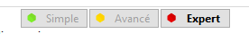

# Barre d'outils de gauche

## Contenu de la page

* Barre d'outils de gauche
	* [Outils Déplacer, Pivoter et Redimensionner](#outils-déplacer-pivoter-et-redimensionner) 
		* [Déplacer](#déplacer)
		* [Pivoter](#pivoter) 
		* [Redimensionner](#redimensionner) 
	* [Outil d’orientation selon une face](#outil-dorientation-selon-une-face) 
	* [Outil de coupe](#outil-de-coupe) 
	* [Peinture des supports](#peinture-des-supports) 
	* [Peinture des coutures](#peinture-des-coutures) 

* [Retour Page principale](../superslicer.md)

## Outils Déplacer, Pivoter et Redimensionner

### Déplacer

Les objets peuvent être déplacés par un glisser avec le clic gauche de la souris même lorsque l'outil de déplacement est inactif. L'activation de l'outil Déplacer **M** affiche un manipulateur 3D, qui permet à l'utilisateur d'ajuster la position de l'objet sur l'axe X, Y ou Z.

- Déplacement par incréments de 1 mm appuyer sur **Majuscule**

 

**Note :** Avec SuperSlicer il n’est pas possible de positionner la pièce sous ou en dessus du plateau d’impression, il n’existe pas d’option pour empêcher le logiciel de placer la pièce au contact de la plaque. La seule astuce est éventuellement de rajouter une pièce de départ et ensuite d’associer la nouvelle pièce pour pouvoir la positionner en dessus du plateau. Mais elle ne pourra pas être sous le plateau.

Si besoin vous pouvez toujours utiliser la fonction découper pour enlever les parties que vous ne voudriez pas imprimer.

### Pivoter

L'outil Rotation (**R**) affiche un manipulateur 3D, qui permet à l'utilisateur de faire pivoter l'objet autour de l'axe X, Y ou Z. Dès que l'utilisateur saisit l'une des poignées des axes, deux ensembles de guides circulaires blancs apparaissent. Si vous passez la souris sur ces guides, la rotation passera de continue à des rotations pas à pas.

- Positionnement souris sur _**Cercle extérieur / marques courtes incréments de 5 degrés**_
- Positionnement souris sur _**Cercle intérieur / marques longues incréments de 45 degrés**_

 

### Redimensionner

L'outil Redimensionner (**S**) affiche un manipulateur 3D, qui permet à l'utilisateur de redimensionner l'objet soit uniformément, en saisissant l'une des cubes d'angle, soit de manière non uniforme, en saisissant la poignée de l'axe X, Y ou Z.

Par défaut, le redimensionnement est symétrique, les deux côtés du modèle s'étendent uniformément et le centre reste en place. En maintenant la touche **Ctrl** enfoncée avant de saisir l'une des poignées **X**, **Y** ou **Z** bascule le mode sur non symétrique.

- Incréments de 5% avec touche **Majuscule**
- Redimensionner pour s'adapter au plateau (taille maximale) touche **F**  ( Uniquement avec l'outil redimensionner sélectionné )

 

## Outil d’orientation selon une face

Il est possible qu'un modèle soit mal orienté après l'importation. Cela se produit en particulier lorsque le modèle a été exporté à partir d'un logiciel de modélisation 3D qui utilise une orientation d'axe différente. La façon **la plus rapide** de faire pivoter le modèle dans les bonnes orientations est d'utiliser l'outil ***Placer sur une face***  (**F**).

***Sélectionnez d'abord un modèle*** que vous souhaitez réorienter. Appuyez ensuite sur la touche **F** ou choisissez l'**Outil positionner sur la surface** dans la barre d'outils de gauche. Plusieurs plans blancs apparaîtront sur le modèle. Un clic sur l'un des plans blancs alignera ce plan sur le plateau d'impression.

 

Contrairement à ce que le nom pourrait laisser penser les « faces » proposées ne sont pas seulement des faces sur le modèle mais peuvent représenter des faces matérialisées par 3 points d’appui sur le modèle. L’algorithme derrière tout ça, utilise ce que l’on appelle une ***Enveloppe convexe du modèle***.

## Outil de coupe

Dans certains cas, vous souhaiterez peut-être couper un modèle en plusieurs morceaux avant l'impression :

- Le modèle est trop grand pour être imprimé en une seule pièce
- Vous ne voulez imprimer qu'une partie d'un modèle

SuperSlicer fournit une fonction de coupe de base. Une coupe est possible avec le plan XY. Sélectionnez l'objet et appuyez sur la touche **C** ou choisissez l'**Outil de coupe** dans la barre d'outils de gauche. Un manipulateur 3D et un menu contextuel apparaîtront.

 

Vous pouvez ajuster la position du plan de coupe sur l'axe Z en saisissant la poignée cubique du manipulateur et en la faisant glisser vers le haut ou vers le bas. Vous pouvez également saisir une valeur exacte en [mm] dans le menu contextuel. Par défaut, le modèle sera divisé en deux parties, toutes deux conservées dans leur orientation actuelle et placées sur le plateau d'impression.

Vous pouvez choisir de supprimer la partie supérieure ou inférieure en décochant **Gardez la partie du haut/du bas**. Enfin, vous pouvez décider de faire pivoter la partie basse vers le haut - cela est souvent pratique car la coupe crée une belle zone plate à placer sur le plateau d'impression.

Pour couper le modèle le long de différents axes, faites d'abord pivoter le modèle, puis effectuez la coupe.

## Peinture des supports

Cet outil est disponible à partir de la **Version 2.3 de SuperSlicer** 

SuperSlicer est un outil qui vous permet de peindre directement sur l'objet et de sélectionner les zones où les supports doivent être **renforcés** ou **bloqués**.

L'outil est disponible dans la barre d'outils de gauche et **n'est affiché qu'en modes Avancé et Expert**. Après avoir sélectionné un objet et cliqué sur l'icône de la barre d'outils, tous les autres objets sont masqués afin de ne pas obscurcir la vue, l'objet sélectionné est rendu en gris clair pour assurer le contraste.

**Bouton gauche de la souris** - Rajouter des supports

**Bouton droit de la souris** - Bloquer les supports

**Shift** + **Bouton gauche de la souris** - Effacer la sélection

**Alt** + **Roue de la souris** - Changer la taille des pinceaux

### Mode de génération des supports

**N'oubliez pas d'activer les supports** si vous voulez les générer réellement. Par défaut, la génération de support est définie sur **Aucun** dans le panneau de droite.

#### *Renforcer les supports*

Si vous définissez manuellement des zones de support, il est plus logique de changer les supports pour **les renforts de support uniquement.** 

Bien entendu, vous pouvez également définir les supports sur **Partout** ou **depuis la plaque de construction uniquement** et utiliser les renforts de support pour marquer les zones supplémentaires qui doivent être soutenues. Ce deuxième cas d'utilisation est utile si vous fixez le seuil de porte-à-faux très bas, de sorte que seuls les porte-à-faux très raides obtiennent des appuis générés automatiquement.

#### *Bloquer les supports*

Si vous utilisez des bloqueurs de support, vous devez changer les supports à **Partout**   ou **depuis la plaque de construction uniquement**. Ces modes activent également les **supports générés automatiquement** dans Paramètres d'impression - Support. Les supports seront désormais générés en fonction du S*euil de surplomb défini*, sauf pour la zone bloquée par les bloqueurs de support peints.

#### *Renfoncer et bloquer les supports en même temps*
Avec des modèles très complexes, il est possible que vous souhaitiez utiliser à la fois les renforts de support et les bloqueurs. Dans ce cas, réglez les supports à **Partout** ou **Depuis la plaque de construction** uniquement. Vous pouvez bloquer certains supports générés automatiquement avec des bloqueurs tout en marquant les zones qui n'ont pas obtenu de supports automatiques avec des rajouts.

**NOTE IMPORTANTE :** Votre sélection ne sera pas complètement respectée lorsque la région peinte est très petite. Le générateur de support lui-même fonctionne sur un réseau interne, de sorte que les zones supportées/non supportées ne sont pas détaillées à l'infini.

### Forme du pinceau

#### *Sphérique (par défaut)*

Peint tout ce qui se trouve à l'intérieur de la sphère, qu'il soit visible ou non de la vue courante. C'est la méthode préférée dans la plupart des cas.

#### *Circulaire*

Peint tous les endroits visibles à l'intérieur du cercle à partir de la vue actuelle, en laissant éventuellement des zones non peintes, mais en ne peignant jamais derrière les coins.

### Plan de découpage

Vous pouvez utiliser l'outil plan de découpage pour cacher une partie de l'objet, de sorte que les zones difficiles d'accès puissent être facilement peintes. Déplacez le curseur de gauche à droite pour déplacer le plan de découpe.

Le bouton **Réinitialiser la direction** permet d'aligner l'outil de plan de découpe parallèlement à la vue actuelle de la caméra. Par exemple, si vous voulez que le plan de découpe se déplace de haut en bas, regardez le modèle du haut (**Vue de dessus 1**) et appuyez sur le bouton ***Réinitialiser la direction***. Le bouton apparaît lorsque vous déplacez le curseur vers une valeur non nulle.

### Réglage automatique par angle

Le bouton ***Automatique par angle*** permet de sélectionner tous les triangles qui sont "plus horizontaux" qu'un seuil. Il peut être utilisé par défaut pour une édition manuelle ultérieure afin de s'assurer qu'aucun débord n'est laissé sans support. Une autre utilisation est de simplement prévisualiser les surplombs et de décider où vous voulez peindre les renforts. Les triangles de surplomb sont visualisés en **temps réel** pendant que le seuil est ajusté.

### Défaire et refaire

Pendant que l'outil de support de la peinture est ouvert, un nouvel historique d'annulation et de rétablissement est créé. Vous pouvez annuler chaque trait de peinture que vous avez effectué (application de peinture, blocage, effacement).

Une fois que vous quittez l'outil ***Supports de peinture***, tous les traits de la dernière session de peinture sont fusionnés en une seule étape dans l'historique global d'annulation et de rétablissement.

### Sauver les supports Peint au format 3MF

Lorsque vous utilisez le projet **Fichier – Sauvegarder le Projet**, le fichier 3MF généré comprendra toutes les informations relatives aux supports Peint. Cela signifie que vous pouvez personnaliser les supports peints à l'avenir, une fois que vous aurez réouvert le fichier dans SuperSlicer.

C'est très utile si vous voulez **partager votre modèle**. D'autres personnes pourront utiliser vos supports peints et les modifier librement.

## Peinture des coutures 

Cet outil est disponible à partir de la **version 2.3 de SuperSlicer.**

A moins que vous n'imprimiez en mode "vase en spirale", chaque boucle du périmètre doit commencer et se terminer quelque part. De plus, l'imprimante doit s'arrêter d'extruder pendant un bref instant lorsque la tête d'impression passe à la couche suivante. Ce point de départ/fin crée une **couture verticale** potentiellement visible sur le côté de l'objet. C'est ce que l'on appelle communément des boutons, des coutures de couche ou des cicatrices.

Vous pouvez définir la position de la couture dans les paramètres d'impression pour essayer de cacher la couture dans un coin, de rendre aléatoire la position de la couture ou de l'aligner avec le dos du modèle.

L'outil de peinture des joints permet un contrôle plus détaillé de l'emplacement des joints. L'outil est accessible à partir de la barre d'outils de gauche et **n'est affiché qu'en mode avancé et expert**. Après avoir cliqué sur l'icône, l'utilisateur peut peindre les "renforts de couture" ou les "bloqueurs de couture" sur le modèle de la même manière que les supports de peinture.

**Bouton de gauche de la souris** - Appliquer la couture 

**Bouton droit de la souris** - Blocage de la couture

**Shift** + **Bouton gauche de la souris** - Effacer la sélection

**Alt** + **Roue de la souris** - Changer la taille des pinceaux

### Logique de placement des coutures

S'il y a une zone de couture, SuperSlicer place toujours des coutures dans la zone définie.

S'il y a un bloqueur, sa zone est exclue des éventuels zones candidates au positionnement de la couture.

Les options de position de la couture basées sur les coûts, de la couture arrière et de la couture aléatoire sont toujours respectées. Lorsque l'option Aligné est active et que des renforts sont utilisés, la couture est placée au **milieu de la zone imposée**. Cela permet de dessiner des coutures propres sur le modèle.

#### Alignement de la couture

La couture va se positionner sur la zone peinte, mais si vous désirez que la couture soit toujours du même côté. Pensez à sélectionner l’option : **Positionnement des jointures : Aligné**

Définition de la zone de couture avec un positionnement aléatoire puis aligné.

### Type de pinceau

#### *Pinceau sphérique (par défaut)*

Peint tout ce qui se trouve à l'intérieur de la sphère, qu'il soit visible ou non de la vue courante. C'est la méthode préférée dans la plupart des cas.

#### *Pinceau circulaire*

Peint tous les endroits visibles à l'intérieur du cercle à partir de la vue actuelle, en laissant éventuellement des zones non peintes, mais en ne peignant jamais derrière les coins.

### Plan de découpage

Vous pouvez utiliser l'outil plan de découpage pour cacher une partie de l'objet, de sorte que les zones difficiles d'accès puissent être facilement peintes. Déplacez le curseur de gauche à droite pour déplacer le plan de découpe.

 

Le bouton **Réinitialiser la direction** permet d'aligner l'outil de plan de découpe parallèlement à la vue actuelle de la caméra. Par exemple, si vous voulez que le plan de découpe se déplace de haut en bas, regardez le modèle du haut (**Vue de dessus 1** ) et appuyez sur le bouton Réinitialiser la direction. Le bouton apparaît lorsque vous déplacez le curseur vers une valeur non nulle.

Page suivante :  [Barre d’outils du haut](../top_toolbar/top_toolbar.md)

[Retour Page principale](../superslicer.md)

