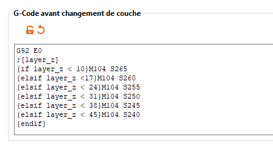

# Macros

## Contenu de la page

* Macros
	* [Opérateurs](#opérateurs) 
	* [Fonctions](#fonctions) 
	* [Variables scalaires](#variables-scalaires) 
	* [Variables sous forme de tableau](#variables-sous-forme-de-tableau)
	* [Tableaux multidimensionnels](#tableaux-multidimensionnels)
	* [Tour de température](#tour-de-température)
	* [SuperSlicer Liste de variables](#superslicer-liste-de-variables) 
		* [Variables les plus utiles](#variables-les-plus-utiles)
		* [Variables supplémentaires dans le Format du nom de fichier de sortie](#variables-supplémentaires-dans-le-format-du-nom-de-fichier-de-sortie) 
		* [Variables moins utiles](#variables-moins-utiles)  

* [Retour Page principale](../superslicer.md)

SuperSlicer permet deux types de constructions de macro dans les sections de G-code personnalisé :

**Évaluation conditionnelle :**

	{if <condition_1>}<GCode_condition_1>[][{else}<GCode_else>]{endif}

**Évaluation d'expression :**

	{<expression>}

Dans les deux constructions, les variables de configuration de SuperSlicer sont accessibles par leur nom (par exemple `layer_z `) et les éléments des variables sous forme de tableau sont accessibles en utilisant des crochets (par exemple` temperature[0] `fait référence à la température du premier extrudeur).

Les tableaux multidimensionnels ne sont actuellement accessibles que sous la forme d'une simple variable sous forme de tableau résultant en une valeur de chaîne (par exemple, si la variable 	`extruder_offset `contient une valeur de 0x0,nx0 elle n'est accessible que comme  	`extruder_variable[1]` résultant en une valeur de chaîne [n, 0] - peut être affiché dans le G-code mais ne peut pas être utilisé dans les opérations arithmétiques).

Les chaînes sont identifiées par des guillemets `"chaîne"` et les expressions régulières par des barres obliques `/` . Les chaînes ne sont pas analysées récursivement, c'est-à-dire que les crochets et les crochets à l'intérieur des chaînes apparaîtront dans la sortie. Cela permet des constructions telles que 	`{"[texte entre crochets]"}`

## Opérateurs

Les opérateurs suivants sont autorisés :

1. Comparaison 

		<,>, ==,! =, <>, <=,> =

    1. Exemple : 

		`{if layer_height == 0.2}; Faire quelque chose {endif}`

1. Logique booléenne ou les équivalents, 

		&&, ||,!

    1. Exemple : 

		`{if layer_height> 0.1 and first_layer_temperature [0]> 220}; Faire quelque chose {endif}`

1. Arithmétique

		+, -, 

    1. Exemple : 

		`M104 S {first_layer_temperature[0]2/3}`

        (Notez que first_layer_temperature est un tableau)

1. Opérateur [ternaire](https://fr.wikipedia.org/wiki/Op%C3%A9ration_ternaire#:~:text=En%20informatique%2C%20un%20op%C3%A9rateur%20ternaire,qui%20d%C3%A9finit%20une%20expression%20conditionnelle.) `?`

		<condition> ? <cond_true>:<cond_false>

    1. Exemple : 

		`M104 S {(first_layer_temperature [0]> 220? 230 : 200)}`

    Cela semble devoir être placé entre parenthèses pour fonctionner. . Cette expression règle la température de l'extrudeur à 230 ou 200 selon que la première couche doit être supérieure à 220°.

1. Correspondance d'expressions régulières 

		= ~ (correspondant), ! ~ (ne correspondant pas)

1. Les expressions régulières sont placées entre des barres obliques /. 
   1. Exemple : 

			{if printer_notes=~/./};Printer is Prusa{endif}

## Fonctions

	Minimum min(a,b)

	Maximum max(a,b)
	
## Variables scalaires
Ces valeurs sont scalaires et peuvent être directement référencées.

- printer_notes (chaîne)
- layer_z (uniquement disponible dans le G-Code de changement de couche)
- layer_num (uniquement disponible dans le G-Code de changement de couche)
	
## Variables sous forme de tableau

Ces variables sont des tableaux et doivent être accédées en indiquant l'indice du tableau.

- temperature
- first_layer_temperature
- bed_temperature (notez qu'il s'agit d'un tableau, même si une seule valeur a du sens : bed_temperature[0])
- first_layer_bed_temperature (voir remarque ci-dessus )
	
## Tableaux multidimensionnels
Ces variables ne sont accessibles que sous forme de tableaux simples et ne peuvent pas être utilisées dans les expressions arithmétiques.

- extruder_offset
- bed_shape

## Exemples

### Tour de température
Vous pouvez utiliser le G-code personnalisé **[Avant changement de couche](../variable/before_layer_gcode.md)** pour diminuer lentement la température de la hotend. Tout d'abord, on peut utiliser l'expression if/elseif/else :

	{if layer_z < 10}M104 S265

	{elsif layer_z <17}M104 S260

	{elsif layer_z < 24}M104 S255

	{elsif layer_z < 31}M104 S250

	{elsif layer_z < 38}M104 S245

	{elsif layer_z < 45}M104 S240

	{endif}

Le même résultat peut être obtenu par une expression if/else/endif plus courte avec une interpolation linéaire :

	M104 S{if layer_z < 10}265{elsif layer_z > 45}240{else}265+(240-265)

Ou on peut utiliser l'opérateur ternaire :

	M104 S{(layer_z < 10) ? 265 : (layer_z > 45) ? 240 : 265+(240-265)(layer_z-10.0)/(45-10)}

Résultat du code dans la fenêtre de personnalisation du G-Code avant changement de couche

Page suivante : [SuperSlicer Liste des variables](../variable/variable_list.md) 

[Retour Page principale](../superslicer.md)

