# Découpage multi-matériaux

## Contenu de la page

* Découpage multi-matériaux
	* [Importation d'un modèle multi-matériaux](#importation-dun-modèle-multi-matériaux) 
	* [Prévention des coulures](#prévention-des-coulures)
	* [Attribution de couleurs (extrudeurs)](#attribution-de-couleurs-extrudeurs)
	* [ColorPrint avec le MMU](#colorprint-avec-le-mmu)
	* [Tour de purge](#tour-de-purge)
	* [Volume de purge](#volume-de-purge)

* [Retour Page principale](../superslicer.md)

Ces paramètres sont regroupés dans la partie **Réglages de l’impression** dans la section **Extrudeurs multiples**.

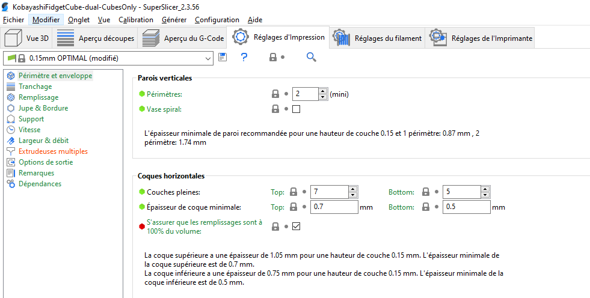 

## Importation d'un modèle multi-matériaux
### Importation de plusieurs fichiers STL en tant qu'un modèle multi-matériaux
Tout d'abord, **basculez le préréglage d'imprimante sur une imprimante multi-matériaux** (comme le MMU2S), sinon, les étapes suivantes ne fonctionneront pas.

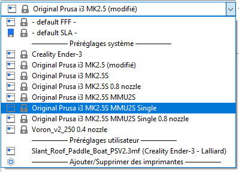

Vous pouvez alors :

1. **Faire un glisser et déposer de tous les fichiers STL à la fois** dans la vue 3D
1. Sélectionner **Fichier - Importer - et sélectionnez tous les fichiers STL à la fois**
1. Sélectionner **Ajouter...** Ctrl + I à partir de la barre d'outils supérieure **et sélectionner tous les fichiers STL à la fois**

SuperSlicer vous demandera s'il doit représenter les modèles chargés comme un seul objet avec plusieurs pièces - confirmez l'invite en sélectionnant **Oui**.

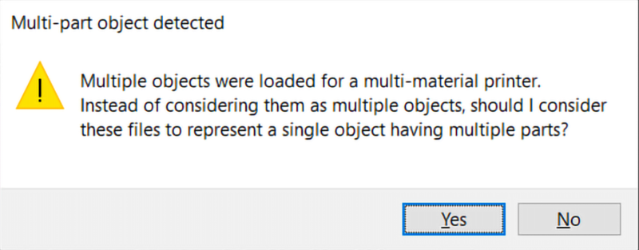

### Importation d'un seul fichier STL ou OBJ en tant qu'un unique modèle multi-matériaux
Le format de fichier STL ne prend pas en charge plusieurs objets dans un seul fichier de façon native. Cependant, il n'est pas rare que plusieurs modèles/coques distincts soient malgré tout dans un seul fichier STL. SuperSlicer chargera ces modèles comme un seul objet. Si vous souhaitez diviser les objets en plusieurs pièces, utilisez la fonction **Scinder en pièces** dans la barre d'outils supérieure.

### Importation d'un fichier 3MF en tant que modèle multi-matériaux
Les fichiers 3MF supportent nativement plusieurs objets dans un seul fichier, les modèles multi-matériaux devraient être automatiquement reconnus et chargés correctement. L'enregistrement d'un fichier de projet (Fichier - Enregistrer) est le moyen idéal de stocker et de partager des modèles multi-matériaux pour les imprimantes Prusa.

## Prévention des coulures
### Activer
Cette option abaissera la température des extrudeurs inutilisés pour prévenir le suintement (oozing). Cela active automatiquement la génération d'une grande jupe et le déplacement des extrudeurs hors de cette jupe lors des changements de température.

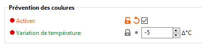

### Variation de température
Ce paramètre n’est actif que si l’option de prévention des coulures a été activée. La valeur représente la différence de température devant être appliquée quand un extrudeur n'est pas actif. Permet la génération d'un contour complet "sacrificiel" sur lequel les buses sont nettoyées régulièrement.

## Attribution de couleurs (extrudeurs)
Si votre modèle a été importé correctement vous verrez chaque pièce dans la liste d'objets sur le côté droit. Si vous ne voyez pas la liste des objets, passez en **mode Avancé ou Expert**.

Vous pouvez attribuer une couleur (extrudeur) à une pièce en **double-cliquer sur le rectangle coloré** dans la liste d'objets.

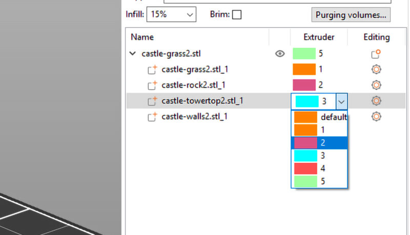

### Modification de la couleur d'aperçu
La modification de la couleur des "extrudeurs" individuels n'a aucun effet réel sur l'impression, mais c'est une bonne façon de la visualiser et elle peut vous aider à sélectionner les bonnes couleurs de filament. Vous pouvez changer la couleur attribuée à un extrudeur en cliquant sur la **boîte de couleur** à côté du nom du profil dans la sélection de profil de filament.

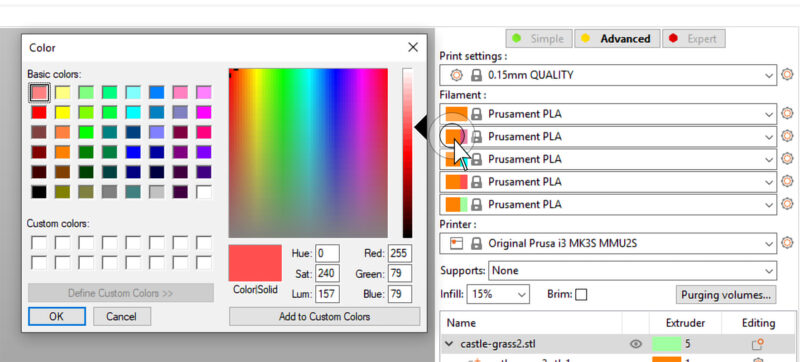

## ColorPrint avec le MMU
SuperSlicer prend en charge les scénarios suivants :

**Imprimante mono-matériau** (ou MMU2 en mode extrudeuse simple).

Dans ce cas, des changements de couleur (permutation manuelle des filaments) peuvent être ajoutés, mais pas des changements d'extrudeuse.

**Imprimante multi-matériaux avec la même extrudeuse affectée à tous les objets**, à leurs volumes et aux maillages de modification.

Des changements de couleur (permutation manuelle des filaments) pour une extrudeuse arbitraire et des changements d'outils automatiques d'une extrudeuse active à une autre extrudeuse peuvent être ajoutés.

**Imprimante multi-matériaux, où plusieurs extrudeuses sont affectés aux objets**, à leurs volumes ou aux maillages de modification.

Seuls des changements de couleur peuvent être ajoutés. Les changements d'extrudeuse sont déjà définis par les affectations d'extrudeuse sur le plateau et l’on ne peut pas qu'ils soient étendus ou outrepassés par ColorPrint. Alors qu'en théorie, il pourrait être possible de combiner les changements d'extrudeuse du plateau avec les changements d'extrudeuse de ColorPrint, le résultat serait difficile à interpréter par l'utilisateur, nous avons donc décidé de rester simple.

Il est possible de modifier n'importe quelle action de ColorPrint après sa création (clic droit), le curseur de couche doit être exactement sur la couche que vous souhaitez modifier.

**Cas interdits**

Lorsque des changements de couleur/extrudeuse sont ajoutés et rendus invalides par la suite en changeant de profil d'imprimante ou en modifiant les affectations de l'extrudeuse sur le plateau (en passant du scénario 2 à 3 ci-dessus ou vice versa), les changements de couleur/extrudeuse non valides sont marqués d'un **point d'exclamation** pour alerter l'utilisateur.

Un tel changement de couleur/extrudeuse sera **ignoré** lors de l'exportation du G-code. Toute autre manipulation avec le curseur ColorPrint est bloquée avant que ces conflits ne soient résolus par l'utilisateur.

### Exemples
#### *Changement de couleur automatique basé sur les couches (ColorPrint - scénario 2)*
Imaginez cela comme un changement de couleur normal avec l'imprimante à une seule extrudeuse. Chaque couche ne peut avoir qu'une seule couleur à la fois. Mais plutôt que de changer la couleur manuellement, vous pouvez choisir quelle extrudeuse utiliser ensuite. 

Déplacez le curseur d'aperçu à la hauteur de changement de couleur souhaitée, cliquez sur l'icône plus bleue et sélectionnez **Changer l'extrudeur**.

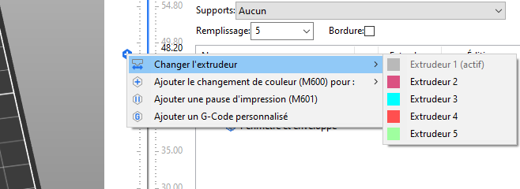 

Si vous activez **Réglages d'impression - Extrudeurs multiples - Sans couches dispersées**, chaque changement de couleur n'ajoutera qu'une seule couche à la tour de Purge.

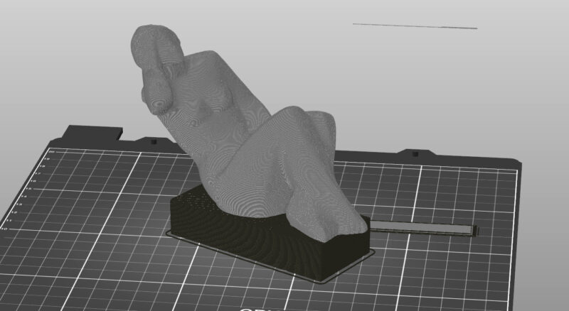

#### *Impression avec plus de 5 couleurs à la fois avec le MMU2S (scénario 3)*
Disons que vous avez une impression multi-matériaux avec les 5 filaments déjà utilisés. Cependant, vous souhaitez utiliser une couleur de plus en changeant manuellement le filament dans l'un des emplacements mmu.

Déplacez simplement le curseur d'aperçu de couche à la hauteur de changement de couleur souhaitée, cliquez sur l'icône plus bleue et sélectionnez pour quelle extrudeuse vous souhaitez ajouter le changement de couleur. Toutes les extrudeuses utilisées dans la couche actuelle seront marqués.

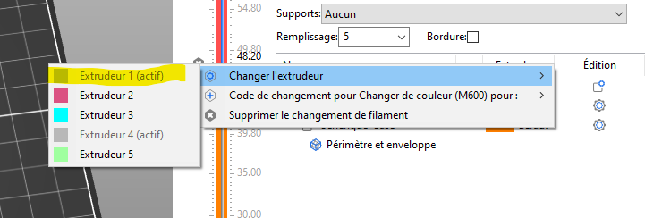  

Le modèle résultant avec 8 couleurs utilisées au total :

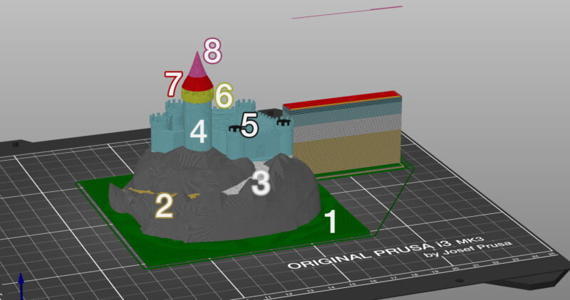

L'action interdite dans cet exemple consiste à créer un changement de couleur basé sur une couche en affectant une extrudeuse différente à la moitié d'une pièce. Par exemple, le toit peut être bicolore (rouge/rose), mais ce changement de couleur ne doit être effectué que manuellement. Si vous souhaitez effectuer le changement automatiquement en affectant une extrudeuse différente, divisez le modèle en deux modèles distincts.

## Tour de purge
Une vidéo sur YouTube m’a permis de bien appréhender les différents fonctionnements des tours de Purge : <https://www.youtube.com/watch?v=WZiLsk_h18U>

### Tour de Purge intelligente
La tour de Purge intelligente assure **des transitions de couleur nettes** et **un flux de filament stable** après un changement de couleur, tout en visant à gaspiller le moins de filament possible. Il y a toujours qu'une seule tour de Purge, quel que soit le nombre d'objets imprimés en même temps.

**La taille de la tour de Purge est indépendante de la taille de l'objet en cours d'impression.**

Imprimer plusieurs copies à la fois ou imprimer de gros objets améliore l'efficacité globale de l'utilisation du filament.

#### *Placement de la tour de Purge*
Dès que vous sélectionnez une imprimante multi-matériaux dans la boîte de sélection de l'Imprimante, la tour de Purge intelligente apparaît dans l'aperçu 3D. L'aperçu montre son encombrement maximal, car la taille peut diminuer après le découpage, en fonction du nombre de changements de couleur dans chaque couche. La taille diminuera depuis le bord avec la ligne polygonale. Vous pouvez modifier l'emplacement de la tour de Purge en la faisant glisser avec le bouton gauche de la souris. Assurez-vous que la tour de Purge ne se superpose avec aucun des objets.

Pour raccourcir les déplacements entre l’objet et la tour de Purge, placez-la à proximité de l’objet/des objets.

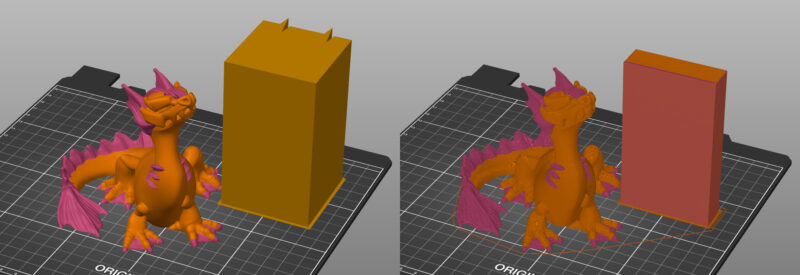

*La taille réelle de la tour de Purge est visible dans l'aperçu du G-code.*

#### *Taille de la tour de Purge*
Dans **Réglages d'impression - Extrudeurs multiples - Tour de Purge** vous pouvez régler la **Largeur** de la tour de Purge. L'autre dimension est calculée automatiquement en fonction de la quantité de filament nécessaire à purger.

La quantité de purge peut être réglée en cliquant sur le bouton **Volumes de purge des volumes ...** dans le panneau de droite.

La tour de Purge est rarement pleine. Au lieu de cela, le rapport de remplissage éparse et dense est automatiquement ajusté à chaque couche, en fonction du nombre de changements de couleur en cours, afin de gaspiller le moins de filament possible.

**Line d'expulsion de la tour de Purge**

Si vous voyez une ligne en l'air au-dessus de la tour de Purge, c'est **normal**. C'est la visualisation de l'expulsion finale de l'extrudeur avant qu'il ne décharge le dernier filament utilisé (afin de créer une pointe acérée).

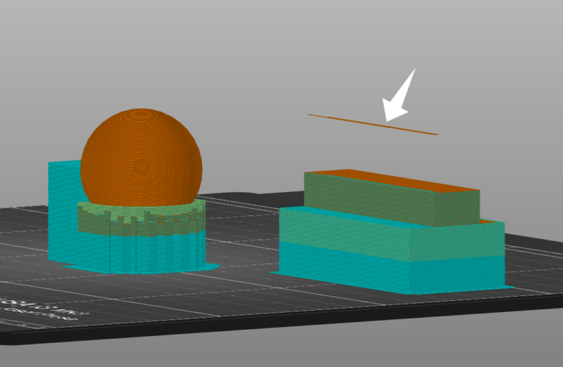

### Tour de Purge sans couches dispersées
La taille de la tour de Purge peut être réduite en ignorant les couches sans changement d'outil. Cela permet d'économiser du matériau et dans presque tous les cas de réduire le temps d'impression.

1. Aller dans **Réglages d'impression - Extrudeurs multiples**
1. Cochez **Sans couches dispersées (EXPÉRIMENTAL)**

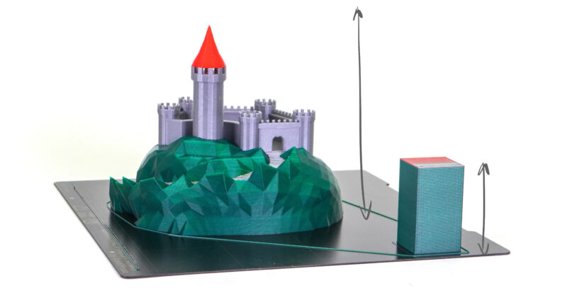

Sur notre ensemble de projets multi-matériaux, cette fonctionnalité a réduit le temps total d'impression de 3,16% et le filament déposé sur la tour de Purge a été réduit de 16,17%.

La fonction de tour de Purge sans couches sans changement d'outil est très utile avec le ColorPrint avec le mmu. Seul un faible nombre de changements de filament est nécessaire pour imprimer un signe coloré sans surveillance et, par conséquent, beaucoup de matériau est économisée par rapport à une tour de Purge complète.

**Désactivez la détection de crash** si vous utilisez une tour de Purge sans couches sans changement d'outil. Sinon, vous risquez une collision potentielle entre l'axe X et l'objet imprimé lors d'une reprise après un crash.

Comme SuperSlicer ne vérifie actuellement pas les collisions de l'extrudeur avec l'objet imprimé lors de la descente vers le haut de la tour de Purge, cette fonction est marquée comme expérimentale et il est recommandé de placer la **tour de Purge dans le coin arrière droit** du plateau d'impression de la MK3S, tandis que l'**objet est placé dans le coin opposé**.

### Purge dans le remplissage
Du fait que l'intérieur du modèle n'est pas visible, il peut être utilisé pour nettoyer la buse pendant la transition de couleur. La tour de Purge ne peut pas être éliminée complètement, car certains modèles ne disposent pas d'assez de remplissage, mais la purge dans le remplissage peut **réduire considérablement la quantité de matériau gâché**.

1. Faites un **clic-droit** sur un modèle dans la vue 3D
1. Choisissez **Options de Purge**.
1. Puis dans le panneau de droite, cochez **Nettoyer dans le remplissage de cet objet**.

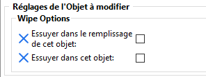

Du filament foncé purgé dans le remplissage peut être visible à travers les parois de couleur claire. Pour éviter ce problème, nous vous suggérons d'augmenter le nombre de périmètres.

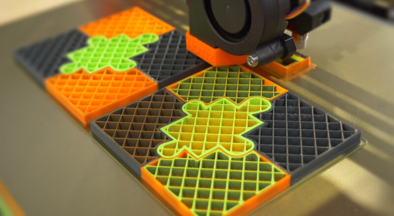

*Problème avec impression de filament claire / foncé (Image Prusa)*

### Objet de Purge
Pour réduire davantage la quantité de matériau utilisée pour la tour de Purge intelligente, vous pouvez choisir de nettoyer le filament résiduel dans un objet. Ce que l’on appelle "l'objet de Purge" sera utilisé pendant la transition de couleur pour nettoyer la buse. En conséquence, les couleurs de l'objet seront mélangées - ce qui est pratique si vous ne vous souciez pas de la couleur de la surface (par exemple, des pièces mécaniques).

1. Faites un **clic-droit** sur un modèle dans la vue 3D
1. Choisissez **Options de Purge**.
1. Puis dans le panneau de droite, cochez **Purger dans cet objet**

**Objet de Purge plus haut que l'objet multicolore**

L'objet de Purge sera terminé avec le dernier filament utilisé lors de l'impression multicolore.

**Objet multicolore plus haut que l'objet de Purge**

Une fois que l'impression de l'objet de Purge est terminée, la purge est déplacée vers la tour de Purge intelligente.

Lors d'un changement de couleur, le flux n'est pas parfaitement stable. Par exemple, une infime quantité d'air peut se coincer dans la buse lorsque le nouveau matériau fondu pousse par le haut. Par conséquent, de légers artefacts peuvent apparaître sur votre objet de Purge.

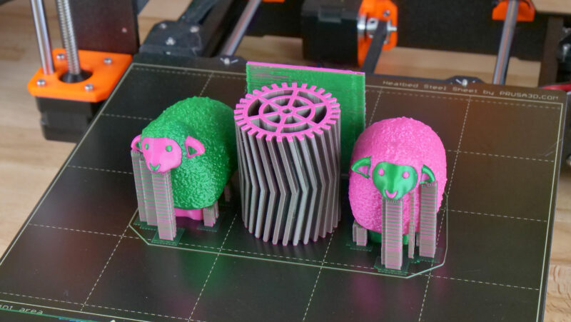

*L'encombrement de la tour de purge est minime grâce à l'objet de Purge (l'engrenage) Image Prusa*

## **Volume de purge**
Lors d'un changement de filament, une petite quantité de plastique fondu reste dans la buse. Lorsque le nouveau filament est chargé, il fond également et commence à pousser le contenu de la buse vers l'extérieur. Pendant ce temps, vous verrez un changement progressif de la couleur du filament extrudé.

Afin d'assurer une transition de couleur nette, SuperSlicer propose plusieurs façons de déposer ce filament :

- **Tour de Purge intelligente**
- **Nettoyer dans le remplissage**
- **Nettoyer dans un objet**

La quantité de matériau à purger lors d'un changement de filament peut être définie en cliquant sur le **Volumes de purge…** dans la barre d'outils de droite.

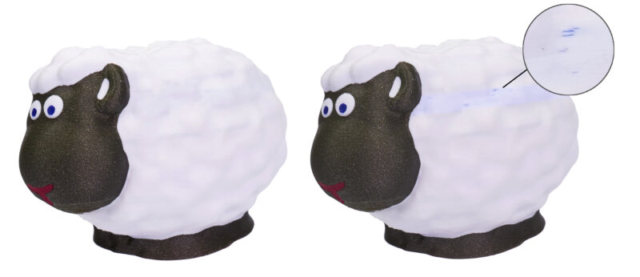

*Le mouton à droite a la couleur blanche contaminée par le pigment bleu du filament précédent (Image Prusa)*

Par défaut, vous pouvez simplement définir la quantité de matériau à purger lors du déchargement ou du chargement du filament. Cela vous permet d'optimiser la quantité de filament gaspillé en diminuant, par exemple, la quantité à purger lors du chargement du filament noir. D'autre part, vous pouvez augmenter la valeur lors de la transition vers des couleurs très claires, pour vous assurer qu'elles ne sont pas contaminées par les couleurs précédentes.

L’accès aux réglages des volumes de purge se fait via le bouton ***Volumes de purge*** :

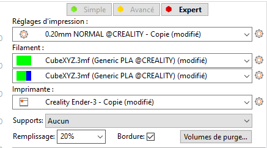

Ce bouton n’est accessible que si l’option Tour de Purge est active (***Réglages d’impression*** -> ***Extrudeurs Multiples*** -> **Activer** *Tour de Purge*

**Exemple :**

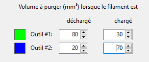

Transition de **Vert** vers **Bleu** = déchargement du **Vert** + chargement du **Bleu** = **80 + 70 = 150 mm³**

Transition de **Bleu** vers **Vert** = déchargement du **Bleu** + chargement du **Vert** = **20 + 30 = 50 mm³**

Si vous passez en mode avancé, vous pouvez voir le volume de purge résultant calculé pour chaque combinaison de changement de couleur, avec les paramètres actuels du mode simple.

Lorsque vous utilisez un **filament soluble** pour imprimer des supports, augmentez le volume de purge à au moins **120** **mm³ pour le déchargement**.

Les filaments contenant des additifs (très brillant, beaucoup de paillettes, etc.) peuvent également nécessiter un volume de purge accru

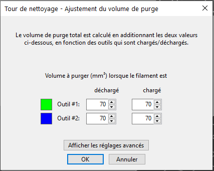

### Mode avancé
Dans le mode avancé, vous serez présenté avec une matrice. Chaque cellule représente la quantité de filament nécessaire pour purger pendant le changement du filament X (colonne de gauche) vers le filament Y (ligne supérieure).

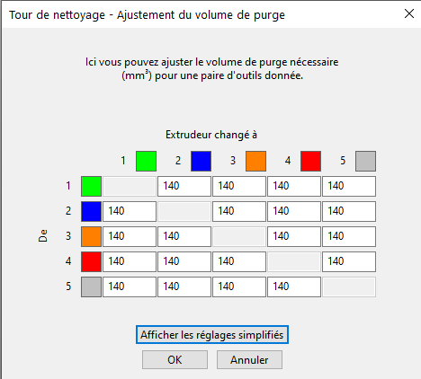 

Page suivante [Découpage SLA](../sla_printer/sla_printer.md)

[Retour Page principale](../superslicer.md)
