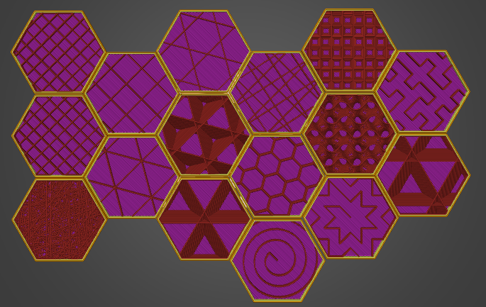

# Plus d’information sur le remplissage
Vous avez sans doute noté que de nouveaux motifs de remplissage ont été ajoutés à notre nouvelle version de **SuperSlicer (2.3)**. Désormais, avec une telle quantité d’options, vous vous sentez peut-être même un peu perdu au milieu de toutes ces possibilités. Quel remplissage choisir ? Existe-t-il un motif universel qui fonctionne pour tous les modèles ? Ou bien dois-je en choisir un en particulier dans une situation spécifique ? Voyons ce qu’il est possible de faire en choisissant le bon type de remplissage et en ajustant ses paramètres.

#### *Qu’est-ce que le remplissage et à quoi peut-il servir ?*

Dans un premier temps, rappelons rapidement ce qu’est un remplissage et pourquoi il est important. Si vous êtes un pro de l’impression 3D, vous voudrez sans doute passer ce chapitre, mais ça ne peut pas faire de mal de dépoussiérer les bases, pas vrai ?

Les modèles imprimés 3D sont rarement imprimés avec un remplissage de 100% ou complètement creux. Au lieu de cela, nous utilisons une méthode qui **remplit l’intérieur d’un objet avec une structure de soutien.** Cette méthode aide à solidifier le modèle et **empêche la formation d’espaces et de trous à la surface de l’objet.** Les modèles pleins (remplissage 100%) demandent beaucoup de filament et de temps. Par ailleurs, la plupart du temps, les modèles pleins ne présenteront pas de meilleures propriétés mécaniques que les modèles avec un remplissage moins dense. Si vous décidez d’imprimer un modèle sans remplissage, vous prenez le risque de compromettre la surface du modèle – il se peut qu’il y ait de petits espaces et peut-être même de grands trous. Il semble assez évident que la meilleure solution se trouve dans l’entre-deux. Avec de bons réglages de remplissage **vous pouvez économiser beaucoup de matériau et de temps** mais aussi générer des motifs intéressants sur la surface.

Dans la plupart des cas, il est très peu intéressant de régler une densité de remplissage de plus de 40%. Nos tests ont révélé que **le meilleur réglage de densité se trouve autour de 10-20% ,** et nous avons entré cette valeur dans nos profils **SuperSlicer**. 10-20% représente un équilibre entre la robustesse, la fiabilité d’impression, le temps d’impression et la consommation de matière. Bien entendu, pour certains objets, un remplissage de 5% (ou moins) peut suffire, surtout les grandes pièces simples imprimées en **PLA**. Vous obtiendrez une plus grande solidité avec un remplissage de plus de 20%. Néanmoins, le même effet peut être obtenu en ajoutant davantage de périmètres (**Réglages de l’impression/Périmètre et enveloppe**). En utilisant des réglages d’impression différents vous pouvez non seulement changer la structure interne et les propriétés mécaniques, mais aussi la vitesse d’impression, la consommation de matière et la surface de l’objet.

Avant d’aborder les réglages avancés, passons rapidement en revue tous les types de remplissage existants ainsi que leurs propriétés, un par un.

#### *Les types de remplissage et leurs propriétés*

La liste des remplissages s’est bien allongée et il peut être difficile de choisir le bon type. Même si vous pouvez avoir l’impression que c’est surtout l’apparence qui les distingue, c’est l’inverse qui est vrai. Par exemple, certains remplissages nous permettent d’économiser beaucoup de matériau et de temps, certains peuvent être remplis par des liquides, etc…

## Motifs SuperSlicer

- [3dhoneycomb](pattern_3dhoneycomb.md)
- [adaptivecubic](pattern_adaptivecubic.md)
- [archimedeanchords](pattern_archimedeanchords.md)
- [concentric](pattern_concentric.md)
- [cubic](pattern_cubic.md)
- [grid](pattern_grid.md)
- [gyroid](pattern_gyroid.md)
- [hilbertcurve](pattern_hilbertcurve.md)
- [honeycomb](pattern_honeycomb.md)
- [line](pattern_line.md)
- [monotonic](pattern_monotonic.md)
- [monotonicgapfill](pattern_monotonicgapfill.md)
- [octagramspiral](pattern_octagramspiral.md)
- [rectilinear](pattern_rectilinear.md)
- [rectilinear-grid](pattern_rectilinear-grid.md)
- [scatteredrectilinear](pattern_scatteredrectilinear.md)
- [stars](pattern_stars.md)
- [supportcubic](pattern_supportcubic.md)
- [triangles](pattern_triangles.md)

### Motifs réservés aux couches

- [concentricgapfill](pattern_concentricgapfill.md)
- [rectilineargapfill](pattern_rectilineargapfill.md)
- [monotonicgapfill](pattern_monotonicgapfill.md)
- [sawtooth](pattern_sawtooth.md)
- [smooth](pattern_smooth.md)