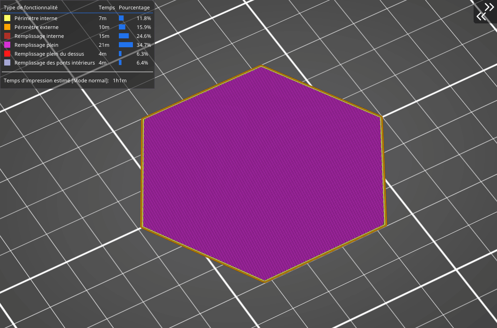

# Cubique adaptatif

Le remplissage cubique adaptatif fonctionne sur le **même principe que le remplissage cubique :** il s’agit de cubes dont un coin est orienté vers le bas et où les lignes se croisent au sein d’une même couche. Mais il y a un avantage majeur : Contrairement au remplissage cubique simple, ce motif rend le remplissage **plus dense en approchant des bords du modèle,** laissant de larges cavités au milieu. **La consommation de matériau** est environ ¼ moins importante que le remplissage rectiligne.

Le remplissage cubique adaptatif fonctionne en raffinant les cellules d’un [**octree**](https://fr.wikipedia.org/wiki/Octree) qui contiennent un objet triangle. Des ancres sont ajoutées à chaque ligne de remplissage. Cela rend le remplissage plus robuste et stabilise le flux d’extrusion au début de la ligne de remplissage. Fondamentalement, ce remplissage devient plus ou moins dense en fonction de la distance de la paroi la plus proche. Ceci est particulièrement utile pour les grosses impressions avec un volume interne important. Il en résulte un temps d’impression plus court et une consommation de filament moins importante tout en conservant un bon soutien des couches supérieures et des propriétés mécaniques identiques.

[Retour à la page des Motifs](pattern.md)