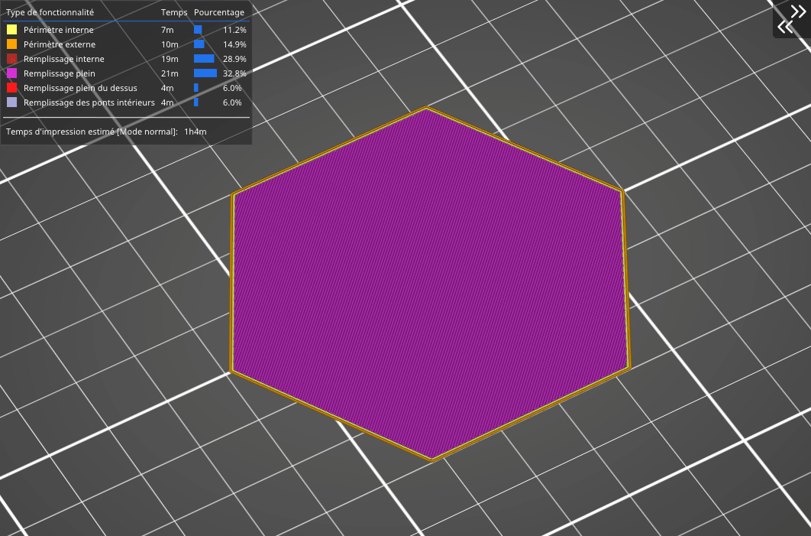

# Spirale d'Archimède

Une fois encore, ce remplissage en forme de spirale permet **de remplir avec un liquide plus facilement.** Cette forme simple **permet d’économiser du matériau et du temps** (comparé au remplissage rectiligne). Comme le [remplissage concentrique](pattern_concentric.md), les Spirales d'Archimède **aident à la flexibilité du modèle** si vous imprimez avec un filament flexible.

[Retour à la page des Motifs](pattern.md)