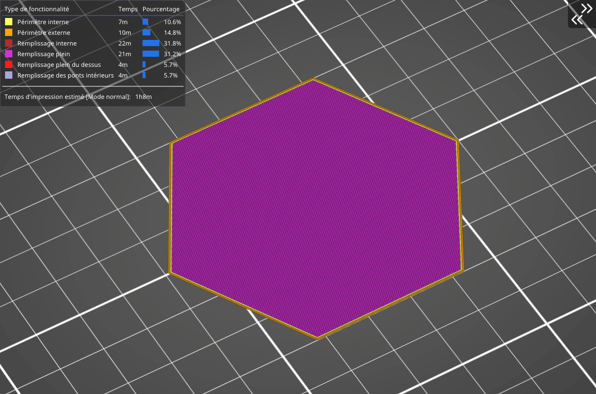

# Concentrique

Le remplissage concentrique **trace les contours parallèle au périmètre du modèle** en partant de l'extérieure puis les rapetisse de plus en plus en direction du centre. En d’autres termes : si vous imprimez un cylindre, le remplissage concentrique va générer **des cercles concentriques** dans ce cylindre. Cela peut être utile pour **des pièces transparentes ou des modèles flexibles** (des pneus de voiture RC par exemple). Le temps d’impression est le principal désavantage. La consommation de matériau n’est pas plus importante que celle des précédents types de motif de remplissage.

[Retour à la page des Motifs](pattern.md)