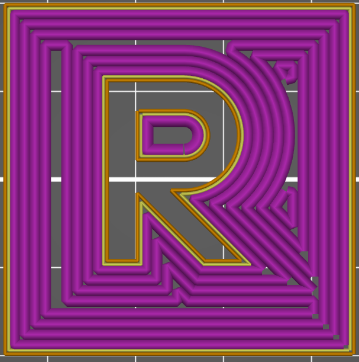
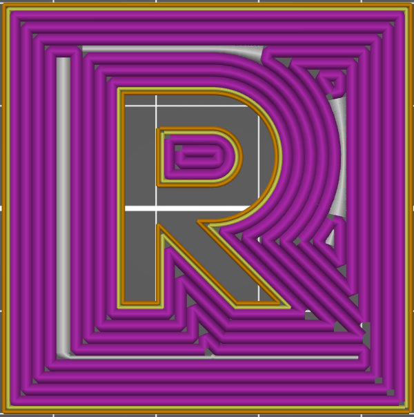

#  Concentric (Remplit)

Le remplissage concentrique **trace les contours parallèle au périmètre du modèle** en partant de l'extérieure puis les rapetisse de plus en plus en direction du centre. Dans le cas du type remplit le logiciel va chercher à **remplir** les interstices laissés par les cordons de remplissage. pour boucher les trous dans la couche.

 

A droite un remplissage avec motif **Concentric Remplit** par rapport au même remplissage seulement **[Concentric](pattern_concentric.md)** à gauche.

[Retour à la page des Motifs](pattern.md)