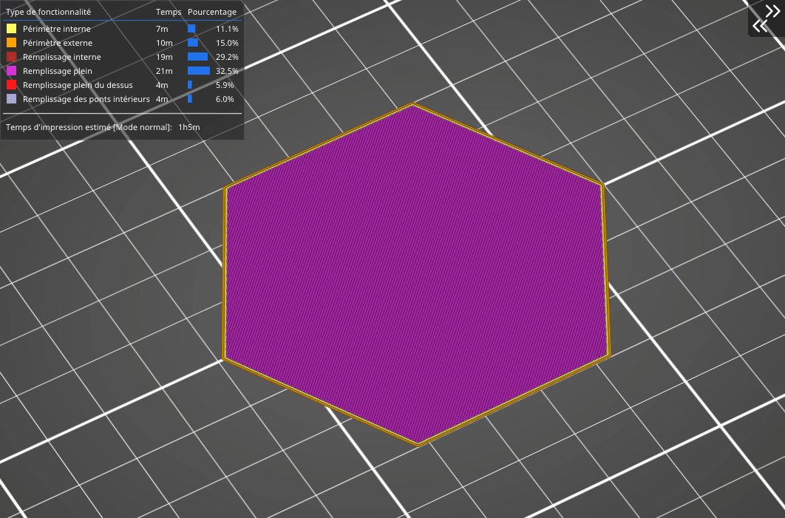

# Tri- Cubique

Là aussi, il s’agit d’un remplissage dont les trajets se croisent au sein d’une même couche. Néanmoins, contrairement aux remplissages décrits précédemment, il **fabrique des cubes** dont l’un des coins est orienté vers le bas. De cette manière cela génère **une multitude de poches d’air** qui peuvent servir à isoler de la chaleur, ou permettre à un objet de flotter sur l’eau (avec des filaments étanches tels que le PETG). Le temps d’impression et la consommation de filament ne diffèrent pas des remplissages précédents.

[Retour à la page des Motifs](pattern.md)