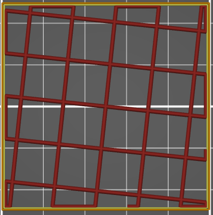

# Grille

Le remplissage  **Grille:**  est un remplissage de type fort  2D. Les trajets du remplissage créés une grille de déplacement rectiligne qui se croisent à 90°.
 
 
  
  

[Retour à la page des Motifs](pattern.md)