# Grille

| Type de remplissage                                                                                                                                                                                                                        |         Image              |
|--------------------------------------------------------------------------------------------------------------------------------------------------------------------------------------------------------------------------------------------|:---------------------:|
| A. **Grille:** fort remplissage 2D                                                                                                                                                                                                         | 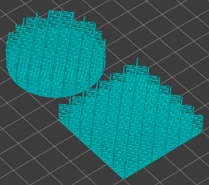 |
| B. **Rectiligne :** remplissage 2D rapide                                                                                                                                                                                                  | 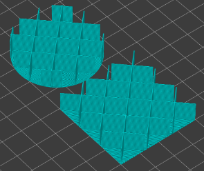 |
| C. **Monotone :** *(Mode ligne)* remplissage 2D                                                                                                                                                                                   |  |
| D. **Triangles :** fort remplissage 2D                                                                                                                                                                                                     | 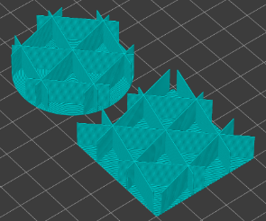 |
| E. **Etoiles :** fort remplissage 2D                                                                                                                                                                                                       | 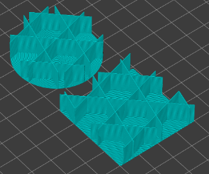 |
| F. **Tri-Cubique :** fort remplissage 3D                                                                                                                                                                                                       | 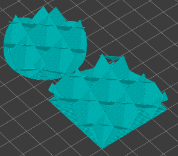 |
| G. **Cubique adaptatif :** fort remplissage 3D (cela permet d'économiser de la matière par rapport à Cubique)                                                                                                                              | 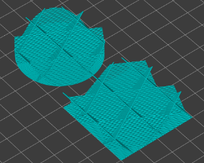 |
| H. **Support Cubique :** fort remplissage 3D                                                                                                                                                                                               | 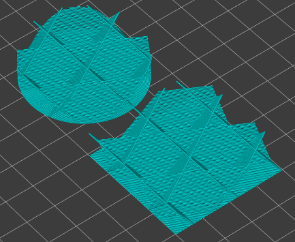 |
| I.  **Ligne :** remplissage 2D rapide un remplissage en forme de grille continue non orthogonale, imprimant en continu dans une direction diagonale Nécessite forcément la définition d’une longueur maximum de l’ancre de remplissage     | 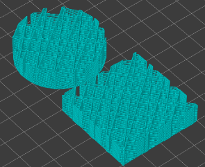 |
| J. **Concentrique :** remplissage 3D flexible                                                                                                                                                                                              | 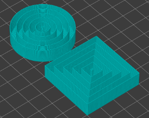 |
| K. **Nid d’abeille :** fort remplissage 2D                                                                                                                                                                                                 | 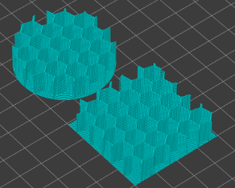 |
| L. **Hexagonal 3D :** remplissage 3D flexible                                                                                                                                                                                          |  |
| M. **Giroïde** : Remplissage avec une résistance accrue pour un poids le plus faible.                                                                                                                                                      | 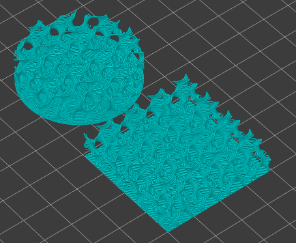 |
| N.  **Courbe de Hilbert :** fort remplissage 2D.Théoriquement ces parcours doivent permettre de remplir tout l’espace en une fois sans rétracter la buse. Ici ce n’est pas le las c’est une mauvaise implémentation des courbes de Hilbert |  |
| O. **Spirale d’Archimède** : remplissage 2D flexible                                                                                                                                                                |  |
| P. **Spirale Octagramme** (Etoile) :** remplissage flexible 2D                                                                                                                                                                             | 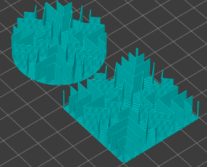 |
| P. **Rectiligne aléatoire :** remplissage 2D                                                                                                                                                                             | 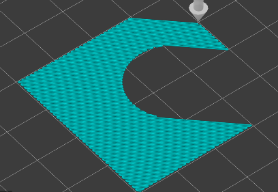 |
| P. **Cubique adapatatif :** fort remplissage 3D                                                                                                                                                                             |  |
| P. **Support Cubique :** fort remplissage 3D                                                                                                                                                                             |  |

[Retour à la page des Motifs](pattern.md)