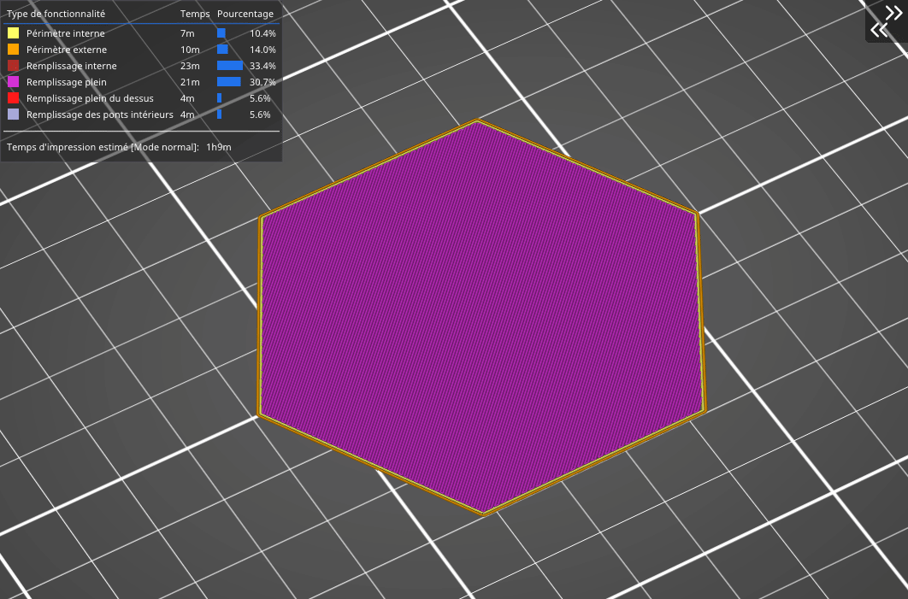

# Courbe de Hilbert

La courbe de Hilbert dessine un labyrinthe rectangulaire dans le modèle. Le principal avantage de ce remplissage est son **apparence originale,** de plus il peut facilement être **rempli avec de la résine** pour les impressions SLA sans créer par la suite des volume de rétention.

Le principal désavantage de ce remplissage est son temps d’impression important, qui se situe entre le [nid d’abeille](pattern_honeycomb.md) et le remplissage [rectiligne](pattern_rectilinear.md). La consommation de matériau de la courbe de Hilbert est identique à celle du remplissage [rectiligne](pattern_rectilinear.md).

[Retour à la page des Motifs](pattern.md)