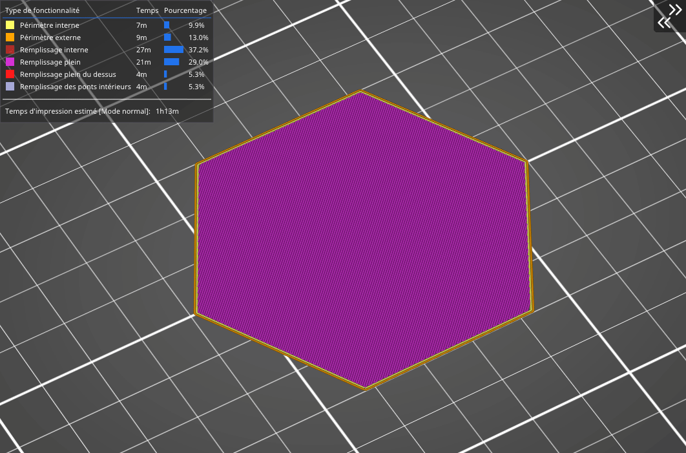

# Nid d’abeille

Ce remplissage imprime une **grille faite d’hexagones.** Son principal avantage est sa **résistance mécanique** et ses trajets optimisés sans intersection de trajets. Son principal désavantage est **sa consommation de matériau importante** (environ 25% de plus) comparé aux autres remplissages, et les temps d’impression peuvent être **deux fois plus longs** par rapport à [d'autres remplissages](pattern.md).

[Retour à la page des Motifs](pattern.md)
