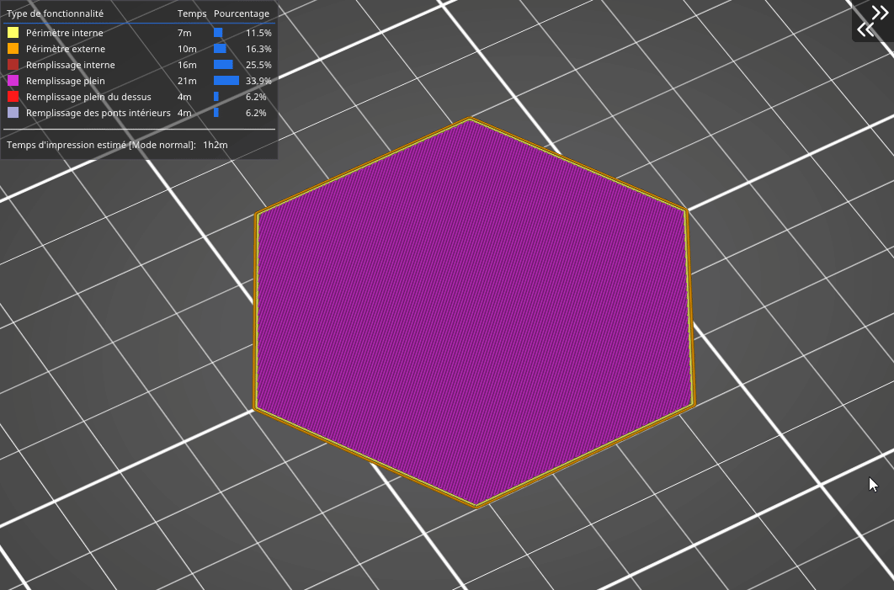

# Lignes

Le remplissage en lignes est l’un de ceux qui **ne présentent pas d’intersection des trajets** sur une couche. Ses trajets sont semblables à ceux du remplissage rectiligne mais **ils ne sont pas parallèles** les uns aux autres. Au lieu de cela, ils sont imprimés selon un angle aigu. Sans surprise, ce remplissage est **similaire au remplissage rectiligne** en ce qui concerne le temps d’impression et la consommation de matériau.

[Retour à la page des Motifs](pattern.md)