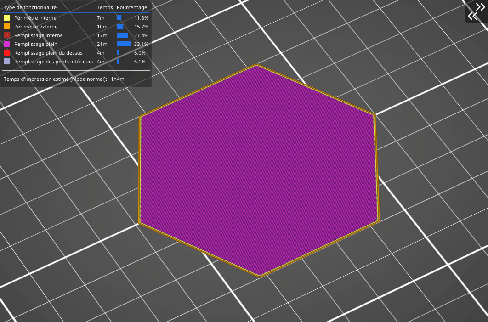
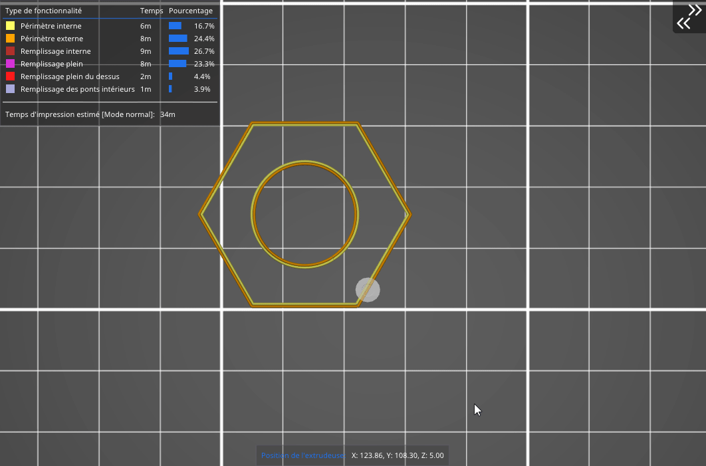

# Monotone

Le remplissage Monotone génère une grille rectiligne en imprimant une couche dans une direction, puis la couche d’après selon un angle de 90°, et ainsi de suite. par rapport à un profil purement [rectiligne](pattern_rectilinear.md) l'ordre d'enchainement des remplissage va être différent de manière à garder un remplissage continue dans une direction.

 Le motif de remplissage monotone remplit les couches avec des lignes parallèles, identiques à celles du remplissage de type rectiligne. Néanmoins, ce remplissage utilise **une planification de trajet avancée** 
 
 
 
 
[Retour à la page des Motifs](pattern.md)