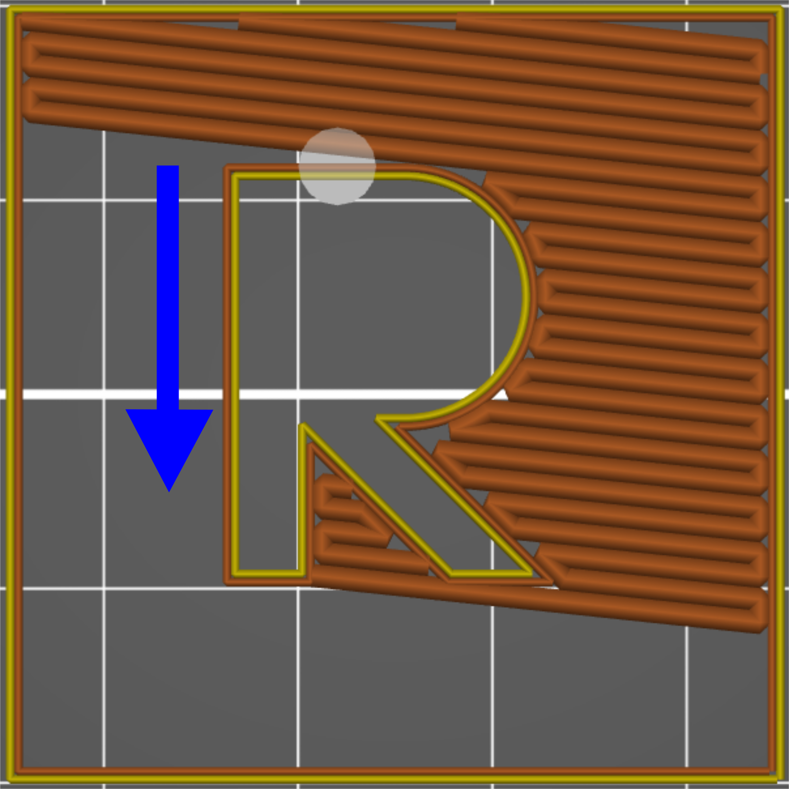
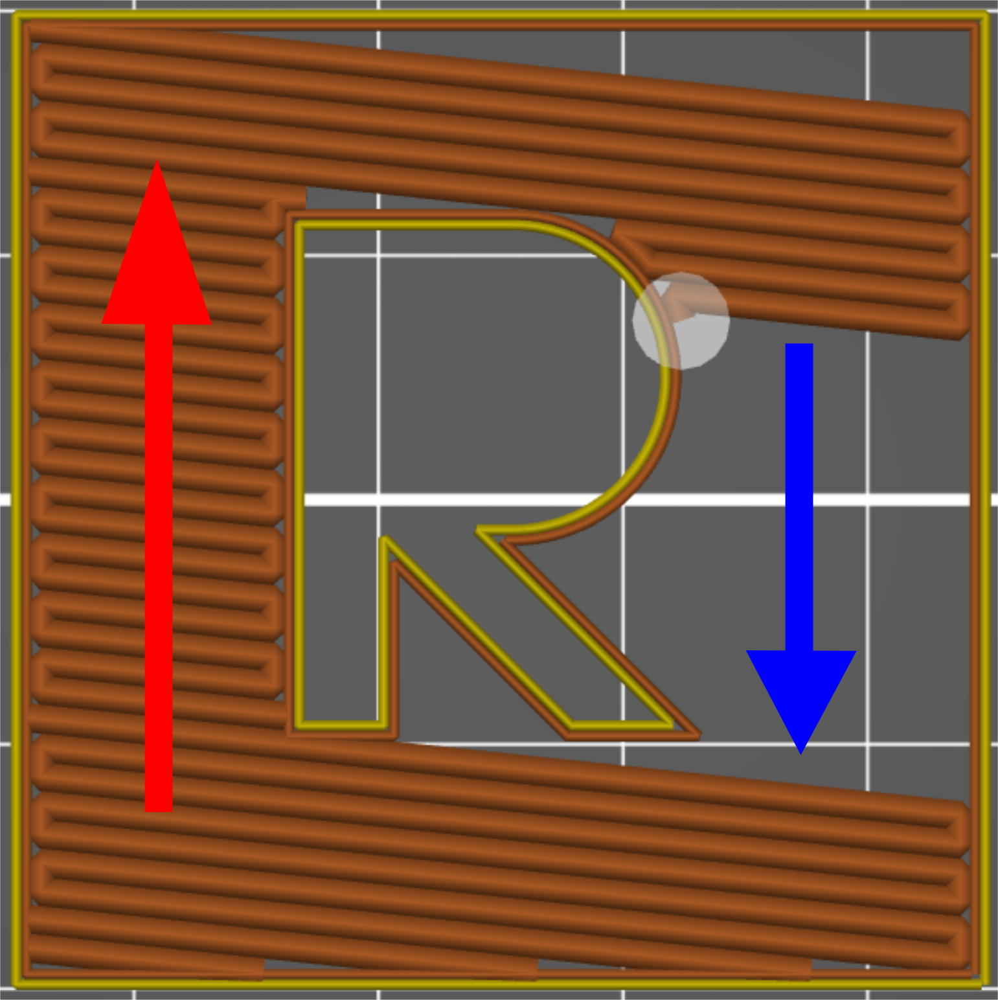
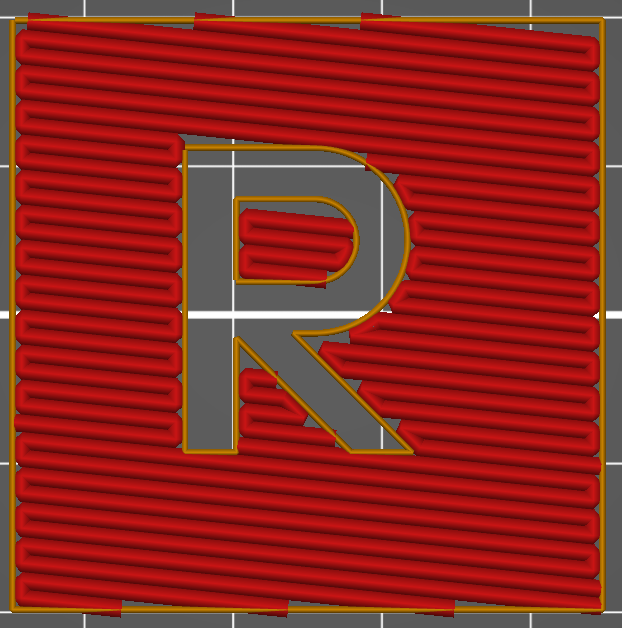
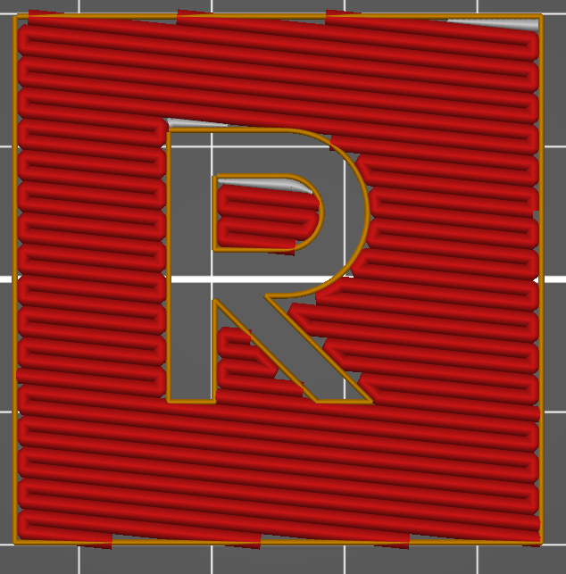

# Monote remplit

Le remplissage Monotone génère une grille rectiligne en imprimant une couche dans une direction, puis la couche d’après selon un angle de 90°, et ainsi de suite. par rapport à un profil purement [rectiligne](pattern_rectilinear.md) l'ordre d'enchainement des remplissage va être différent de manière à garder un remplissage continue dans une direction.

 

Dans le cas du motif **Monotone remplit** le logiciel va chercher à **remplir** les interstices laissés par les cordons de remplissage. pour boucher les trous dans la couche.

 

A droite un remplissage avec motif **Monotone Remplit** par rapport au même remplissage seulement **[Monotone](pattern_monotonic.md)** à gauche.

[Retour à la page des Motifs](pattern.md)