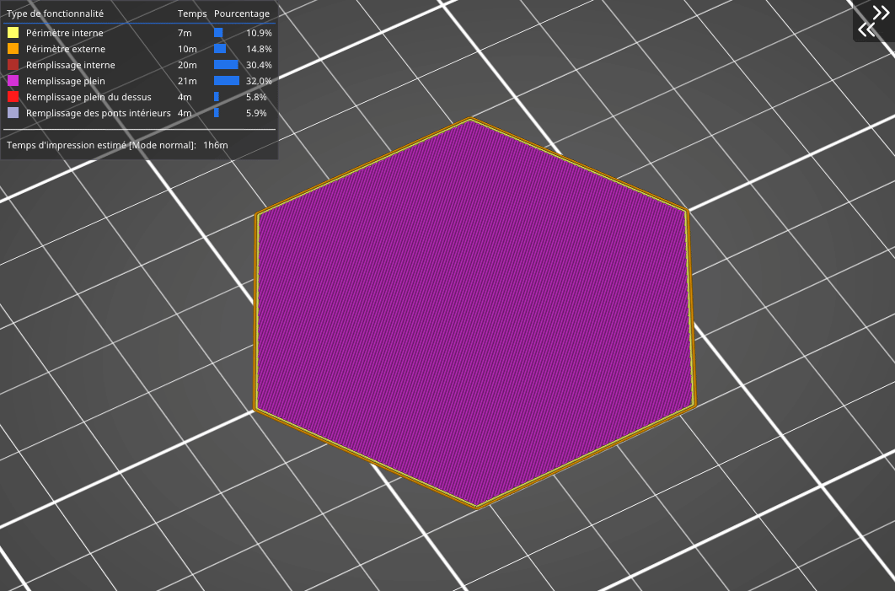

# Spirale Octagramme

Le motif en Spirale Octagramme permet de **remplir l’objet facilement avec un liquide** grâce aux grands compartiments générés par ce type de remplissage. La spirale octagramme favorise également la **flexibilité de certains modèles.** Mais elle surtout intéressante pour **des raisons esthétiques** et pour le soutien apporté à la couche supérieure. La consommation de matériau est la même que pour les [spirales d'archimède](pattern_archimedeanchords.md) mais le temps d’impression est légèrement plus long.

[Retour à la page des Motifs](pattern.md)