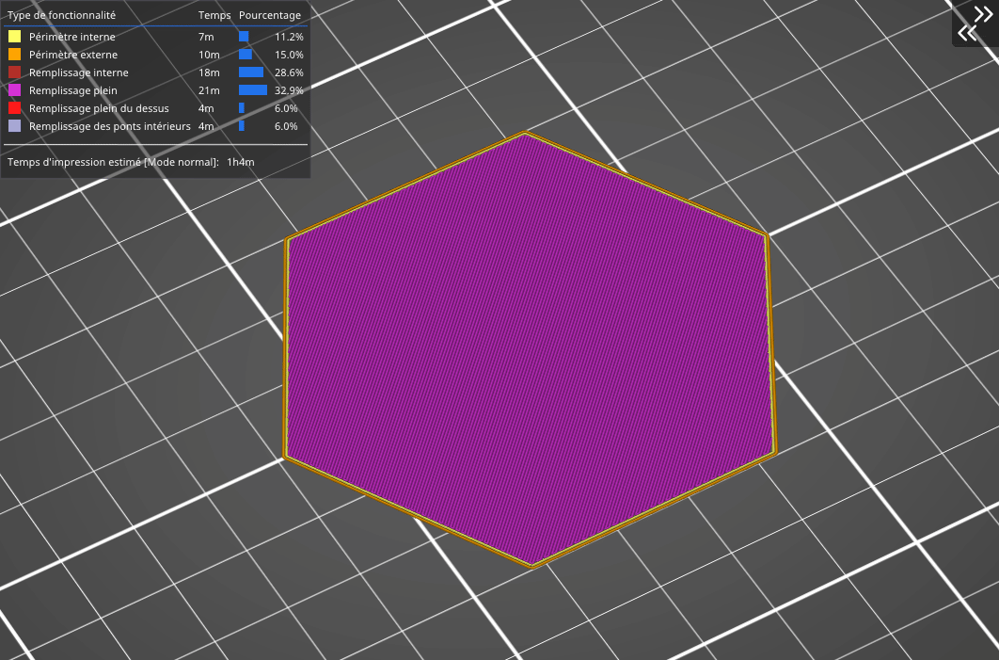
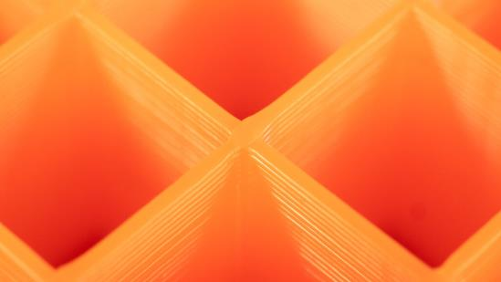

# Grille

C’est l’une des variantes de remplissage **les plus simples et les plus rapides**. Contrairement au remplissage rectiligne, elle est imprimée dans **les deux directions (rotation à 90°) pour chaque couche**. Par conséquent, le matériau s’accumule là où les trajets se croisent. Le remplissage en grille est **plus solide** (et présente une meilleure adhérence de couche) que le remplissage rectiligne, néanmoins, il peut parfois générer **des bruits ennuyeux** et même un **échec de l’impression** quand la buse passe sur les intersections où le matériau s’accumule.

Compte tenu de la façon dont ce remplissage est imprimé, les trajets se croisent et cela provoque une accumulation de matériau à ces endroits. Vous entendrez parfois un son spécifique lorsque la buse atteint ces zones. Cela peut même provoquer l’échec de l’impression.

[Retour à la page des Motifs](pattern.md)