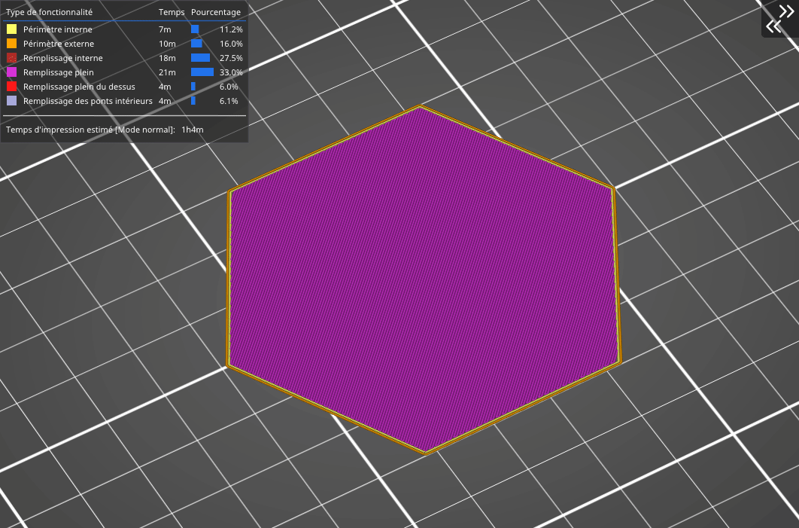

# Rectiligne

Le remplissage Rectiligne **est l’un des motifs de remplissage de base.** Il génère une grille rectiligne en imprimant une couche dans une direction, puis la couche d’après selon un angle de 90°, et ainsi de suite. De cette manière, cela consomme **moins de filament** et **le matériau ne s’accumule pas aux intersections** (contrairement à la [grille](pattern_grid.md)). Ce remplissage d’impression **est l’un des plus rapides**.

Ce type de remplissage est le seul **qui est recommandé pour un remplissage de l’impression à 100%**. Si un autre type de remplissage est paramétré dans votre profil et que vous mettez le pourcentage de remplissage sur une densité de 100%, **SuperSlicer** basculera automatiquement le type de remplissage sur rectiligne.

[Retour à la page des Motifs](pattern.md)