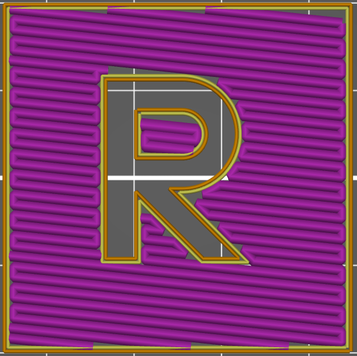
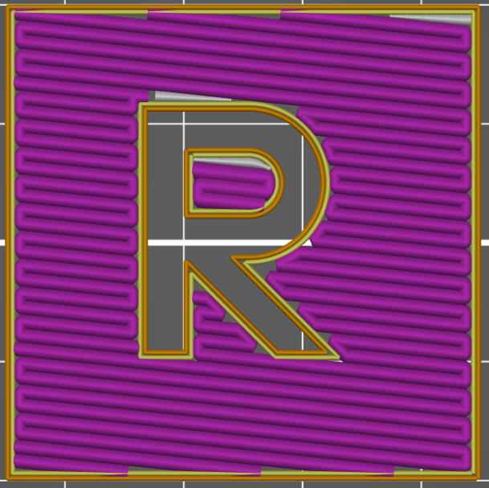

# Rectiligne (Remplit)

Le remplissage Rectiligne génère une grille rectiligne en imprimant une couche dans une direction, puis la couche d’après selon un angle de 90°, et ainsi de suite. Dans le cas du motif **rectiligne remplit** va chercher à **remplir** les interstices laissés par les cordons de remplissage. pour boucher les trous dans la couche.

 

A droite un remplissage avec motif **Rectiligne Remplit** par rapport au même remplissage seulement **[Rectiligne](pattern_rectilinear.md)** à gauche.

[Retour à la page des Motifs](pattern.md)