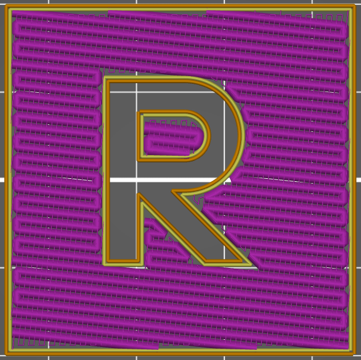

# Lissage

Le lissage rajoute une passe à 90° sur la couche déjà imprimée. Ce passage supplémentaire a une très faible largeur de ligne et s'imprime à la même vitesse que la vitesse de remplissage.

Le lissage permet d'imprimer un motif [Rectiligne](pattern_rectilinear.md) sur la couche imprimée. Cela a deux effets bénéfiques majeurs :
* Il fait fondre la couche déjà imprimée en la passant plusieurs fois sous une buse chaude. C'est de là que vient le nom "repassage" qui est parfois utilisé. La vitesse de déplacement étant très faible et la largeur du trait étant très petite, la buse chauffe la surface de manière significative. La partie plate de la buse finie la surface alors de manière lisse.
* Elle comble les lacunes de la couche déjà imprimée. Le mouvement de lissage se fait à la même hauteur que la couche elle-même. Il a moins de débit qu'une couche pleine, mais il a quand même un très faible débit. En théorie, ce flux n'a nulle part où aller, mais en pratique, il maintient la pression à l'intérieur de la chambre de la buse. Chaque fois que la buse passe sur une irrégularité de la surface, le matériau dans la buse s'écoule dans cet espace.

[Retour à la page des Motifs](pattern.md)
