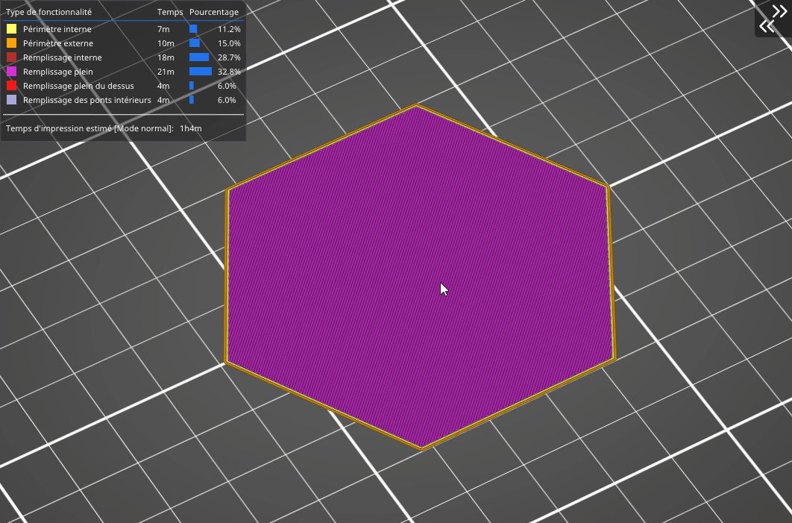

# Étoile

Le remplissage en étoile est **basé sur les triangles** mais **les trajets sont modifiés** pour former des étoiles à six branches. Une fois encore, ce remplissage est généré par des lignes qui se croisent au sein d’une même couche. La consommation de matériau et de temps est la même que celle du remplissage précédent.

[Retour à la page des Motifs](pattern.md)