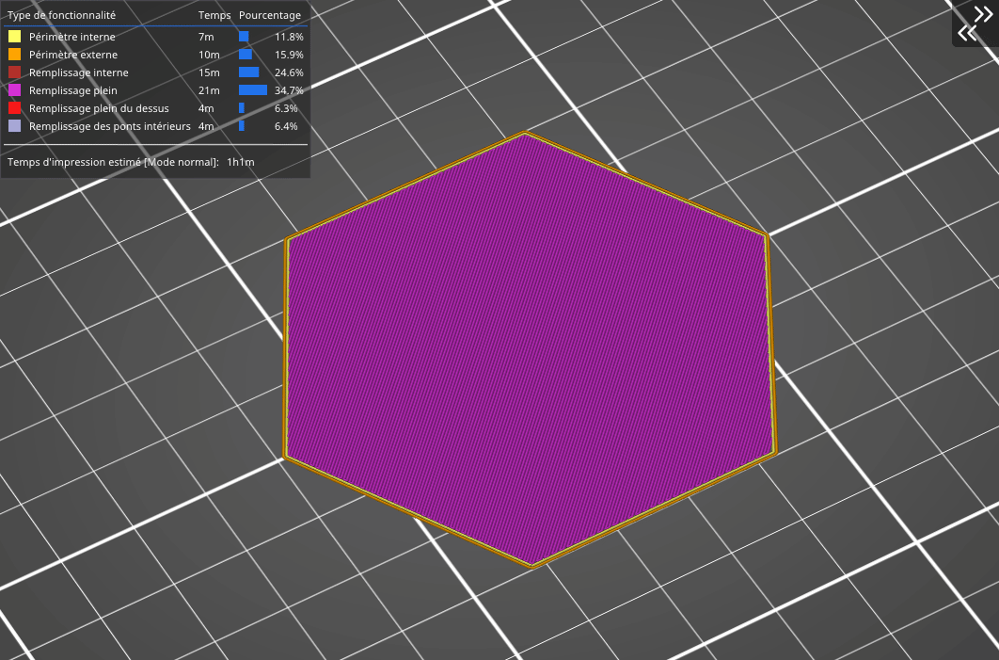

# Support cubique

Le remplissage support cubique fonctionne de la même manière que le précédent, à une différence près : la **densité du remplissage augmente seulement dans l’axe Z.** Sa fonction primaire est de **supporter les couches du haut** en économisant le plus de matériau possible, il n’améliore donc en rien les qualités mécaniques du modèle. La consommation de matériau et le temps d’impression de ce remplissage sont **de loin les plus intéressants** de tous les remplissages pris en charge.

[Retour à la page des Motifs](pattern.md)