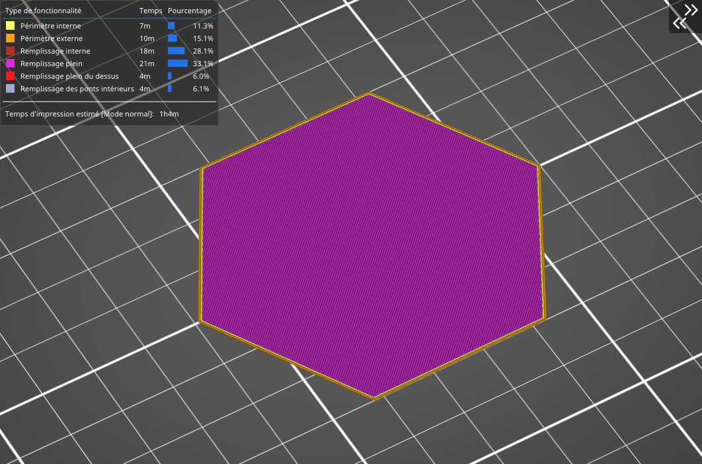

# Triangles

Ce remplissage fonctionne comme le remplissage en grille – les trajets se croisent sur la couche, néanmoins, cette fois ils sont **imprimés dans trois directions** et forment une structure en triangle. La consommation de matériau et de temps **sont presque identiques à [la grille](pattern_grid.md).**

[Retour à la page des Motifs](pattern.md)
