# Réglages de l'impression

## Contenu de la page

* Réglages de l'impression
	* [Périmètre et enveloppe](#périmètre-et-enveloppe) 
	* [Couche](#couche)
	* [Remplissage](#remplissage)
	* [Bordure et jupe](#bordure-et-jupe)
	* [Support](#support)
	* [Vitesse](#vitesse)
	* [Largeur et Débit](#largeur-et-débit)
	* [Extrudeurs multiples](#extrudeurs-multiples)
	* [Options de sortie](#options-de-sortie)
	* [Remarques](#remarques)
	* [Dépendances](#dépendances)

* [Retour Page principale](../superslicer.md)

## Périmètre et enveloppe

### Parois verticales

#### *Périmètres*
Définit le nombre minimal de contours qui forment la paroi d'un modèle. Les profils  utilisent pratiquement toujours un minimum de deux périmètres. 

**Augmenter la résistance du modèle**

La résistance d'un modèle est principalement définie par le nombre de périmètres (pas le remplissage). Si vous voulez avoir une impression plus résistance, augmentez le nombre de périmètres.

#### *Vase spirale*
Crée un conteneur avec un contour unique continu, augmentant progressivement la hauteur en Z.

Lorsque vous imprimez quelque chose avec une paroi à périmètre unique, il y a toujours un petit défaut où l'imprimante passe à la couche suivante. Cet endroit, où l'imprimante s'arrête et termine le périmètre et prend la valeur de son incrément en Z pour commencer un nouveau périmètre, crée une 'cicatrice' disgracieuse sur le côté du modèle. Cette cicatrice appelée aussi 'couture' est également un point faible de l'impression.

Le vase spirale n'a pas ce défaut, à l'exception des N premières couches pleines inférieures. Au lieu de cela, la hauteur augmente progressivement tout le temps, jusqu'à ce que le haut de l'impression soit atteint.

Lorsque le mode vase est activé, SuperSlicer définit automatiquement les paramètres associés en conséquence :

- un périmètre
- remplissage de 0%
- couches pleines supérieures désactivées
- supports désactivés
- "maintien de l'épaisseur de coque verticale" désactivé

Gardez à l'esprit que le simple fait de modifier ces paramètres et de ne pas activer le mode vase n'est pas la même chose que le véritable mode vase, car l'objet ne sera pas imprimé en continu.

Vous pouvez toujours ajuster le nombre de **couches pleines inférieures**. De plus, vous pouvez régler la **largeur d'extrusion des périmètres externes** dans le menu [**Avancé**](#avancé) pour obtenir un vase plus épais/étanche (par exemple de 0,45 à 0,6).

Le modèle doit être défini comme un solide plein, sinon, SuperSlicer essaiera (et échouera) à créer des surfaces intérieures et extérieures, donc modélisez uniquement les dimensions extérieures.

**Un seul objet à la fois peut être imprimé en mode vase**. Si vous aviez plusieurs objets sur le plateau d'impression, il serait impossible de les imprimer en continu. Vous pouvez contourner cette limitation en activant l'impression séquentielle.

### Coques horizontales
#### *Épaisseur de coque minimale*
Pour un nombre sélectionné de périmètres et une hauteur de couche, SuperSlicer calcule l'**épaisseur des parois fines optimale**. Si vous revenez à votre dessin CAO et modifiez l'épaisseur de la paroi à cette valeur exacte, vous éliminerez les chevauchements inutiles du périmètre et votre impression aura une finition parfaite de la surface des parois.

Normalement, vous obtenez des recommandations pour un nombre pair de périmètres (2,4,6…). Si vous activez Détecter les parois fines, vous obtiendrez également une recommandation pour un nombre impair de périmètres (1,3…).

Vous pouvez penser que lorsque la largeur d'extrusion d'un périmètre est de 0,45 mm, deux périmètres auront une largeur de 0,90 mm (2x0,45). Cependant, si vous regardez la recommandation pour une hauteur de couche de 0,2 mm, vous constaterez que ce n'est pas vrai et que la valeur suggérée est de 0,86 mm.

Afin de comprendre comment ce nombre est calculé, nous devons examiner la section transversale d'un cordon. SuperSlicer suppose que la section transversale d'une extrusion est un rectangle avec des extrémités semi-circulaires. Notez que la largeur d'extrusion comprend les deux extrémités semi-circulaires.

*(Cette image est une reprise de la source originale : <https://manual.slic3r.org/advanced/flow-math> )*

Ajoutons maintenant une seconde extrusion/périmètre. Si nous supposons qu'il n'y a pas de chevauchement (chemins tangents), il y aurait un espace vide (en jaune). Afin de remplir l'espace vide et de relier les périmètres ensemble, SuperSlicer chevauche légèrement les périmètres. C'est essentiellement pourquoi vous ne pouvez pas simplement multiplier le nombre de périmètres par la largeur d'un seul périmètre pour obtenir l'épaisseur de paroi idéale.

*(Cette image a été fortement inspirée par la source originale : <https://manual.slic3r.org/advanced/flow-math>)*

> Notez que la hauteur de couche (h) est utilisée dans le calcul et l'implication que cela a - si vous modifiez la hauteur de couche, votre épaisseur de paroi idéale changera également !

Pour plus d'informations, consultez la [page mathématique du Flux de Slic3r](https://manual.slic3r.org/advanced/flow-math) (certaines parties de ce texte proviennent de la même page).

#### *Couches pleines - supérieures/inférieures*

Les parties inférieures et supérieures de chaque modèle sont généralement remplies de couches pleines (100% de remplissage).

Vous pouvez définir le nombre **de couches pleines (supérieures et inférieures)** que vous souhaitez imprimer. Vous pouvez également définir une **épaisseur de coque minimale**, ce qui est particulièrement utile lorsque vous utilisez la fonction de hauteur de couche variable. L'info-bulle sous ces paramètres sera mise à jour à chaque modification que vous apporterez, vous donnant une meilleure idée de l'épaisseur de paroi supérieure/inférieure résultante.

Régler les couches pleines supérieures ou inférieures à 0 remplace l'épaisseur de paroi minimale. Vous n'avez donc pas besoin de régler également l'épaisseur de paroi minimale à 0 pour obtenir des couches supérieures ou inférieures.

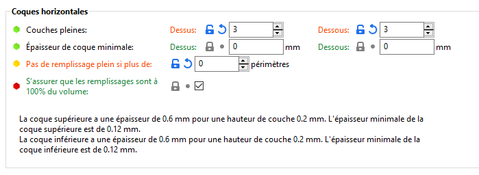

Le remplissage plein supérieur est essentiellement un pont sur le motif de remplissage. Pour cette raison, vous verrez presque toujours un peu d'affaissement des premières lignes de remplissage pleins. Plus le remplissage est faible, plus la distance de pontage est longue et, par conséquent, plus l'affaissement est important. Cela peut être contrecarré en augmentant simplement le nombre de couches pleines - nous suggérons ***au moins 3 couches supérieures***. Vous pouvez réduire davantage ce comportement avec un maillage modificateur, qui augmente le remplissage pour les dernières couches avant le remplissage plein.

Gardez à l'esprit que lorsque vous imprimez à des hauteurs de couche basses, vous aurez besoin de plus de couches pleines pour obtenir la même épaisseur de paroi supérieure/inférieure (par exemple, avec une hauteur de couche de 0,3 mm, utilisez 3 couches supérieures, avec une hauteur de couche de 0,1 mm, utilisez 9 couches supérieures).

Le motif de remplissage plein par défaut est rectiligne, mais vous pouvez choisir parmi plusieurs autres motifs.

#### *S’assurer que les remplissages sont à 100% du volume*

Option expérimentale qui modifie (en remplissage plein) le débit de remplissage pour avoir la quantité exacte de plastique à l'intérieur du volume à remplir (le débit varie généralement de -7% à + 4%, en fonction de la taille de la surface à remplir et du paramètre de chevauchement, mais il peut aller jusqu'à + 50% pour le remplissage dans de très petites zones où la couverture rectilinéaire n’est pas bonne). Il présente l'avantage de supprimer la surextrusion causée par le paramètre de chevauchement dans les surfaces de remplissage étroites.

### Qualité 

Attention l'utilisation de ces options génère un découpage plus lent.

#### *Un seul périmètre sur le dessus*

Option pour n’'utiliser qu'un seul périmètre sur les surfaces plates du dessus, pour laisser plus de place au motif de dessus.

#### *Périmètres supplémentaires si nécessaire*

Une option héritée qui, à notre connaissance, ne fait plus vraiment grand-chose. Faites-nous savoir si vous trouvez un cas où cela change quelque chose.

Théoriquement cette option permet d’ajouter plus de périmètres si nécessaire pour éviter des trous dans les parois inclinées. SuperSlicer ajoute des périmètres, jusqu'à ce que plus de 70% de la boucle immédiatement au-dessus soit supportée.

#### *S'assurer de l'épaisseur de la coque verticale*

Cette fonction résout l'un des plus gros problèmes des slicers plus anciens, à savoir le fait d'avoir des trous entre les périmètres sur une surface inclinée. Cela était typique lors de l'impression de bustes et d'autres modèles à l'aspect organique. De tels objets avaient généralement quelques trous au-dessus de la tête. Lorsque cette fonction est activée, SuperSlicer s'assure qu'elle définit les supports (internes) nécessaires pour les périmètres dans une couche à venir.

Cette fonctionnalité affecte actuellement encore la génération du G-code même lorsqu'elle est désactivée et peut produire un G-code inattendu. Il s'agit d'un problème connu et nous travaillons sur un correctif.

#### *Éviter de traverser les périmètres*

Permet d’optimiser les déplacements afin de minimiser le franchissement de périmètres. Cela peut aider à empêcher les coulures de la buse lors des déplacements, en particulier avec les extrudeurs Bowden. L'activation de cette fonction ralentit considérablement la génération du G-code et augmente le temps d'impression.

Éviter de traverser les périmètres option actives à droite.

#### *Eviter de traverser les périmètres - Longueur de détour maximum*

Paramètre actif si l’option ***Éviter de traverser les périmètres*** est active. Il indique, la longueur de détour maximum pour éviter de croiser les périmètres. Si le détour est plus long que cette valeur, l'option *Eviter de traverser les périmètres* ne s'applique pas pour ce chemin de déplacement. La longueur de détour peut être spécifiée soit comme une valeur absolue soit comme le pourcentage (par exemple 50%) d'un chemin de déplacement direct.

#### *Murs minces*

Option pour détecter les parois extrudable par une seule passe (parois minces) (pièces dans lesquelles deux extrusions ne rentrent pas et nous devons réduire à une seule trace). Si cette case n'est pas cochée, SuperSlicer peut essayer d’adapter les périmètres là où ce n’est pas possible, créant ainsi un chevauchement conduisant à une sur-extrusion.

#### *Détecter les parois fines*

Par défaut, chaque mur se compose de périmètres extérieurs et intérieurs (un minimum de deux périmètres pour les parois fines). S'il y a suffisamment d'espace pour cela, un motif de remplissage est utilisé pour combler le vide entre ces périmètres intérieurs/extérieurs. 

L'activation de **Détecter les parois fines** permet à SuperSlicer de générer un seul périmètre qui officie à la fois pour l'intérieur et l'extérieur de la coque. Cela vous aidera à obtenir de petits détails. Cependant, les parois plus fines qu'une seule largeur d'extrusion de périmètre seront probablement ignorées.

#### *Détecter les périmètres faisant des ponts*

Active **le flux de pontage** pour les surplombs et allume le ventilateur. C’est une option expérimentale qui ajuste le flux pour les surplombs (le flux pour les ponts sera utilisé), leur applique la vitesse pour les ponts et active le ventilateur.

Voir le paramètre  [Ratio de débit pour les ponts](#ratio-de-débit-pour-les-ponts) pour le réglage du débit sur les ponts.

### Surplombs

#### *Seuil pour Vitesse du pont et ventilateur*

Largeur minimale non supportée pour une extrusion afin d'appliquer le ventilateur de pont & vitesse du surplomb à ce surplomb. 

Peut être spécifié en mm ou en % du diamètre de la buse diamètre de la buse.

> ***Mettre à 0 pour le désactiver.***

#### *Seuil pour débit du pont*

Largeur minimale non supportée pour une extrusion afin d'appliquer le flux de pont à ce porte-à-faux. 

> Peut être spécifié en mm ou en % du diamètre de la buse.

> ***Mettre à 0 pour le désactiver.***

#### *Direction d’extrusion*

##### *Inversé sur impair*

Extrudez les périmètres qui ont une partie sur un surplomb dans la direction inverse dans le sens inverse, en couches impaires. Ce motif alterné peut améliorer considérablement les surplombs abrupts.

***!! Cet algorithme est très lent (il utilise les mêmes résultats que extra_perimeters_overhangs) !!***

##### *Seuil inversé*

Nombre de mm que doit avoir le surplomb pour que l'inversion soit considérée utile. 

> Peut être défini par un % de la largeur du périmètre.

### Avancé

#### *Pas de périmètres dans un pont*
Cette option est là pour aider à découper les objets qui ont un trou de contre-perçage. 

Il existe plusieurs options pour résoudre ce problème :

- **Retirer les périmètres** : il suffit de déplacer le périmètre depuis la zone du pont.

> Pour (+) : simple et efficace.
> Contre (-) : certains ponts ne sont pas ancrés des deux côtés.

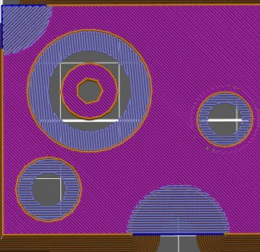

- **Remplir les vides avec des ponts** : déplacez le périmètre et étendez la zone du pont pour remplir l'espace vide. Cela créera un opercule que l'utilisateur devra retirer manuellement. Notez que vous pouvez faire cela manuellement en créant un nouveau cylindre à cette position (clic droit sur votre pièce -> ajouter une pièce -> cylindre, dans la zone de droite déverrouiller les échelles et changer la taille X&Y ; appuyer sur entrée et ensuite le déplacer dans votre trou ; changer sa taille z à votre hauteur de couche et entrer la position Z).

> Pour (+) : meilleur effet de contre-perçage.
> Contre (-) : les cônes de contre-perçage avec un angle raide détruiront votre pièce à cause de la surextrusion (encore plus que la normale).

- **Ne gardez que les ponts** : n'imprimez aucune zone qui ne soit pas un pont. Trop expérimental, ne l'utilisez pas avant qu'il ne s'améliore un peu. 

> Pour  (+) : ? simple ?
> Contre (-) : détruira vos surplombs et je ne pense pas qu'il imprimera mieux le trou de contre-alésage non plus.

- **Conserver les ponts et les surplombs** : Il imprime le pont comme l'option précédente, mais remplit le reste avec un périmètre et des "mauvais ponts". Très expérimental. 

> Pour (+) : va pousser la bonne quantité de plastique, comme "Supprimer les périmètres" mais avec moins de "ponts ancrés sur un côté".
> Contre (-) : difficile à imprimer.

#### *Remplir les trous entre les parois*

##### *Surface minimum*
Ce paramètre représente le minimum de mm² pour la création d’une extrusion de remplissage d’espace entre les parois.

> Peut être définie par un % de (largeur du périmètre)²

#### *Position des jointures*

Détermine le point de départ de chaque boucle de périmètre, et donc la position de la **jointure verticale** potentiellement visible sur le côté de l'objet. Sauf si vous imprimez en mode vase spirale.

La jointure ressemble à une petite goutte sur la surface du modèle. SuperSlicer peut tenter de masquer la jointure dans les bords du modèle (en utilisant le réglage "**Le plus proche**”) ou sur la face arrière (“**Arrière**"), de les répartir aléatoirement sur la surface ("**Aléatoire**”), disposés en lignes (“**Aligné**”) ou Selon des critères de coût (**Basé sur les coûts**).

Dans le cas où la position de la jointure est basée sur les coûts, il est possible de définir deux « Coûts » :

- Un **Coût du déplacement** de l'extrudeuse. La pénalité la plus élevée est lorsque le point est le plus éloigné de la position de l'extrudeuse avant l'extrusion du périmètre externe.
- Un Coût du placement de la couture à un mauvais **Angle**. Le pire angle (pénalité maximale) est quand il est plat.

A moins que vous n'imprimiez en mode "vase en spirale", chaque boucle du périmètre doit commencer et se terminer quelque part. Ce point de départ/fin crée une couture verticale potentiellement visible sur le côté de l'objet. C'est ce qu'on appelle communément des boutons, des coutures de couches ou des cicatrices.

Cette couture sera particulièrement visible si la forme de l'objet est cylindrique, sans angles vifs.

Afin de masquer le plus possible la couture, plusieurs options de placement de la couture sont disponibles dans : [**Paramètres d'impression - Périmètres et enveloppe- Avancé -Jointures.**](#jointures)

 

À partir de SuperSlicer 2.3, vous pouvez utiliser **l'outil de peinture des coutures** pour avoir un contrôle détaillé sur le placement des coutures.

***Basé sur les coûts*** 

Tentative de placer la couture dans le bord le plus proche de la couche actuelle. Si votre modèle a des angles vifs, cela rendra la couture effectivement **invisible**.

Pour être précis, on essaiera de choisir un sommet concave sans surplomb de sorte que la couture soit cachée à l'intérieur de l'angle concave. Si aucun sommet concave sans surplomb n'est disponible, il choisira un sommet convexe sans surplomb. Si aucun n'est disponible, il choisira un sommet sans surplomb. Le choix parmi les candidats est opéré de manière à ce que le point de départ soit le plus proche de la position précédente de l'extrudeuse. Cette option est donc optimale pour les courts trajets.

##### *Aligné*

Il utilisera la même logique que le plus **proche** pour trouver les candidats, mais il choisira celui qui est le plus proche du point de départ de la couche précédente. Cela permettra de s'assurer que la couture est principalement alignée sur l'ensemble de l'objet.

Position de couture aléatoire (à gauche) ou alignée (à droite)

##### *Aléatoire*
Celui-ci choisira un point différent pour chaque couche, ce qui rendra le joint moins perceptible au prix d'une surface moins lisse (petits boutons éparpillés sur la surface).

Il n'est pas très logique d'utiliser la position aléatoire du joint sur les modèles avec coins / bords tranchants, il est bien préférable d'utiliser la position la plus proche ou alignée dans ce cas. En revanche, pour l'impression de formes cylindriques sans bords tranchants, la position aléatoire du joint est une option viable.

##### *Arrière*

L'arrière fonctionne de manière similaire à l'alignement, mais il essaiera de positionner la couture près du Y maximum (arrière du lit d'impression). Il essaie toujours d'éviter les débordements et tente de placer la couture dans les coins.

##### *Comment réduire la visibilité de la couture*

Avec la technologie FDM, il n'est pas possible d'éliminer entièrement la couture. Elle sera toujours un peu visible. Cependant, avec des réglages bien adaptés, elle ne devrait pas être trop visible.

Les paramètres qui affectent la visibilité de la couture sont **l'avance linéaire** et le **multiplicateur d'extrusion**. Les profiles Prusa d'origine ont déjà ces réglages, mais si vous voulez affiner un profil personnalisé, vous pouvez essayer d'abaisser le multiplicateur d'extrusion et de calibrer la valeur de l'avance linéaire pour réduire la visibilité de la couture.

Vous pouvez utiliser le **mode "Vase"** pour éviter la couture, mais vous serez alors limité à un seul périmètre et à aucun remplissage.

Exemple de position de la couture en fonction des réglages

|||||
| :-: | :-: | :-: | :-: |
|
**Aléatoire**
|
**Basé sur les coûts**
|
**Aligné**
|
**Arrière**
|

### Périmètre à une boucle
Cette option permet d’enchaîner les périmètres pour créer une seule extrusion continue sans interruption. Les longs déplacements intérieurs (de l'extérieur aux trous) ne sont pas extrudés pour laisser un peu d'espace au remplissage.

L’option ***Jointures*** Permet de spécifier la position des points de départ des jonctions entre périmètres. Il est possible de choisir entre :

- ***Au plus près*** : Au plus près entre les jointures ou sur l’arrière.
- Et ***Arrière*** : à l’arrière du modèle.

### Coins arrondis

Avec cette option, les périmètres internes contourneront les angles aigus en créant un rayon au lieu de faire un angle aigu. Cela peut aider quand il y a des trous visibles dans les coins aigus des périmètres.

 

 Exemple de périmètres à droite obtenus avec l’option **Coins arrondis**

### Périmètres externes en premier
Les périmètres seront imprimés de l'extérieur vers l'intérieur au lieu de l'ordre inverse.

Ce paramètre peut aider à la **précision dimensionnelle** car le périmètre extérieur est posé en premier et tout filament supplémentaire extrudé lors de l'impression des périmètres suivants est repoussé à l'écart de la paroi extérieure. En revanche, la surface peut être légèrement moins lisse.

**Appliquer sur**

L’option permet de régler le mode d’application de cette option sur les périmètres de l’impression.
##### ***Seulement le coté extérieure***
Ne faites le périmètre extérieur que sur les côtés extérieurs. Utile quand l’épaisseur est trop faible.
##### ***Seulement pour le coté intérieur***
Ne faites le périmètre extérieur que sur les côtés intérieurs Utile quand vous voulez seulement retirer la couture des trous de vis.

**En mode vase (sans couture)**

Imprimez les périmètres de contour en deux cercles de manière continue, un peu comme pour le mode vase. 

Il faut que le paramètre external_perimeters_first soit actif.

Ne fonctionne pas pour la première couche, car cela pourrait endommager le plateau.

Remarquez qu'il utilisera min_layer_height de votre configuration matérielle comme hauteur de base  (elle ne commence pas à 0). Veillez donc à indiquer la valeur la plus basse possible que votre imprimante puisse gérer. 

Si sa hauteur n'est pas inférieure à deux fois la hauteur actuelle de la couche, l'algorithme normal est utilisé, car il n'y a pas assez de place pour effectuer deux boucles.

Par exemple, pour que cet algorithme ai un vrai impact, il faut que la hauteur minimale soit au moins à 0.05 pour une hauteur de couche de 0.2.

**Une meilleur liaison**

Ce réglage peut dégrader un peu la qualité de votre périmètre externe, en échange d'une meilleure liaison entre les périmètres.

Utilisez-le si vous avez de grandes difficultés avec le collage des périmètres, par exemple avec des filaments à haute température.

Ce pourcentage est le % de chevauchement entre les périmètres, un peu comme perimeter_overlap et external_perimeter_overlap, mais en sens inverse. Vous devez définir perimeter_overlap et external_perimeter_overlap à 100 %, sinon ce paramètre n'a aucun effet.

- 0 : aucun effet, 
- 50% : la moitié de la buse sera au-dessus d'un périmètre déjà extrudé pendant l’extrusion d’un nouveau périmètre, sauf s'il s'agit d'un périmètre externe.

La valeur maxi est de 50%.

Ce paramètre est très expérimental, veuillez faire un rapport sur l'utilité. Il peut être supprimé s'il n'y a pas d'utilité pour ça.

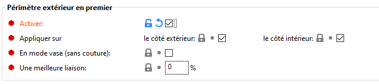

## Couche

### Hauteur de couche

#### *Hauteur de  base des couches*

Hauteur de chaque tranche/épaisseur de chaque couche. La hauteur de couche est le principal facteur affectant à la fois :

- le temps d'impression
- la résolution verticale

En choisissant des **hauteurs de couche plus élevées**, vous pouvez **réduire considérablement le temps d'impression** au prix de couches plus visibles. D'un autre côté, choisir une **petite hauteur de couche** (par exemple 0,10 mm) permettra des **détails supplémentaires** au prix de temps d'impression plus longs.

En règle générale, nous ne suggérons pas de descendre à moins de 0,10 mm car l'amélioration de la qualité d'impression avec des couches de 0,07 ou 0,05 mm est relativement mineure avec des temps d'impression nettement plus longs.

Image Prusa

Gardez à l'esprit que la hauteur de couche ne modifie que la résolution **verticale**. Par exemple, un texte en relief parallèle au plateau d'impression aura la même apparence quelle que soit la hauteur de couche. Si vous recherchez une résolution accrue dans le plan XY, [allez voir les buses avec un diamètre différent](../tutorial/nozzles_with_a_different_diameter.md).

Pour tirer le meilleur parti des deux mondes, pensez à utiliser la **Fonction de hauteur de couche variable.**

**Hauteur de couche maximale pour votre buse**

La hauteur de couche doit être **inférieure à 80%** du **diamètre de la buse** (par exemple, la hauteur de couche maximale avec une buse de 0,4 mm est d'environ 0,32 mm). La hauteur de couche ne peut pas être supérieure au diamètre de la buse, SuperSlicer affichera un message d'erreur si vous essayez de saisir une telle valeur.

#### *Hauteur de la première couche*

Lors de l'impression avec des hauteurs de couche très basses, vous souhaiterez peut-être toujours imprimer une première couche plus épaisse pour augmenter l'adhérence au plateau d'impression. **Les profils d'impression Original Prusa utilisent toujours 0,20 mm comme première hauteur de couche.**

Vous pouvez l'exprimer en valeur absolue (par exemple 0,20 mm) ou en pourcentage de la hauteur de couche par défaut (par exemple 150%).

Changer la hauteur de la première couche nécessitera très probablement une **calibration de la première couche** sur votre imprimante.

### Filtration
#### *Résolution*
Résolution minimale pour les détails, utilisée pour simplifier le fichier d'entrée afin d'accélérer le découpage et de réduire l'utilisation de la mémoire. Les modèles haute-résolution possèdent souvent plus de détails que ce que les imprimantes peuvent produire. 

Mettez **à zéro** pour désactiver toute simplification et utiliser la résolution complète de l'entrée.
#### *Précision de la lecture du modèle*

C'est la précision du fichier de l'objet en entrée. Il est utilisé pour aligner des points qui devraient être sur la même ligne.
Mettez **à zéro** pour désactiver toute simplification et utiliser la résolution complète de l'entrée.

#### *Découper le rayon de fermeture de l’espacement*
Les fentes d'une taille inférieure à 2x le rayon de l'espacement sont remplies au cours du tranchage par maillage triangulaire. L'opération de fermeture de l'espacement peut réduire la résolution de l'impression finale, aussi est-il conseillé de conserver une valeur relativement basse.

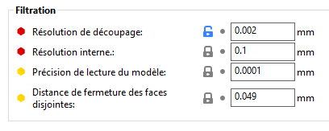

### Modification des couches

#### *Lissage des courbes*
Ces paramètres permettent au logiciel de lisser les angles de chaque couche. La nouvelle précision sera celle de ce paramètre. 

Mettez **à zéro** pour désactiver toute simplification et utiliser la résolution complète de l'entrée.

Remarque : comme il utilise les arêtes du polygone et ne fonctionne que dans les plans 2D, vous devez disposer d'un modèle 3D très propre. 

Il n'est utile que pour adoucir des modèles fonctionnels ou des angles très plats.

L’algorithme de lissage des courbes peut être modifié en jouant sur 3 paramètres :

- **Angle Concave minimum**
- **Angle convexe minimum**
- **La Distance Maxi**

#### *Compensation de Taille XY*
L'objet sera agrandi/réduit sur les plans XY selon la valeur indiquée (négatif = réduit, positif = agrandi). Ce réglage peut être utile pour un réglage fin des tailles de trous.

Il est possible de définir une valeur

Pour les contour **Extérieurs** ou **Intérieurs** et sur la **Première couche**.

Lors de l'impression, **la Première couche** est écrasée sur le plateau d'impression chauffé et, par conséquent, elle est généralement **un peu plus large qu'elle ne devrait l'être.**

Pour de nombreuses applications, ce n'est peut-être pas un problème. Mais si vous avez quelque chose qui a vraiment besoin d'avoir des dimensions précises ou de s'adapter avec des tolérances très serrées, cela peut être un problème. 

Pour accéder à ces paramètres, SuperSlicer doit être en mode avancé ou expert.

#### *Compensation du rétrécissement des trous verticaux*
Les trous convexes seront agrandis/rétrécis dans le plan XY par la valeur configurée (négatif = vers l'intérieur, positif = vers l'extérieur, devrait être négatif car les trous sont toujours un peu plus petits à l'intérieur). Cela peut être utile pour affiner la taille des trous.

Ce paramètre se comporte de la même manière que la compensation de la taille XY interne, mais uniquement pour les formes convexes. Il s'ajoute à **Compensation XY intérieure**, il ne le remplace pas.

**Le Seuil** (en mm²) représente la zone maximale pour le trou où la compensation de la taille du trou s'appliquera pleinement. Après cela, elle se réduira à 0 pour quatre fois cette surface.

Réglez à 0 pour laisser la compensation de la taille du trou s'appliquer entièrement à tous les trous détectés.

#### *Convertir les trous verticaux rond en Polygone*
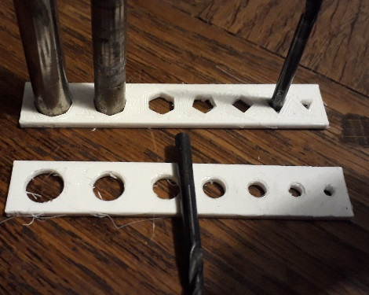

Lors de l'impression 3D avec les technologies fil fondu, la rétraction et la façon dont le matériau est extrudé font que les trous sont plus petits que prévu. Une façon d'y remédier est de créer des trous plus grands, mais ce n'est pas la seule façon : vous pouvez jouer avec la géométrie. Les bords sont imprimés avec précision et donc en réduisant le nombre de "côtés" des cercles ET en les plaçant à l'"extérieur" (ne pas couper les coins) du trou, vous pouvez avoir des trous fonctionnels.

Dans l'image ci-dessus, les forets entrent parfaitement dans le polygone mais ils ne peuvent pas entrer dans leur trou rond, il est trop étroit comme prévu.

Idée et mathématiques de ***polygones*** [http://hydraraptor.blogspot.com/2011/02/polyholes.html](http://hydraraptor.blogspot.com/2011/02/polyholes.html).

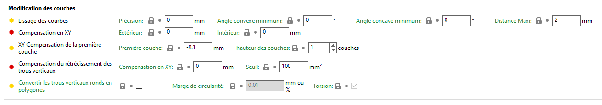

### Autre
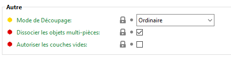

#### *Dissocier les objets multi-pièces*
Lorsque vous imprimez des objets multi-matériaux, ce réglage fera en sorte que SuperSlicer rattache ensemble les parties de l'objet qui se superposent (la 2e partie sera rattachée à la 1ere, la 3e partie sera rattachée à la 1ere et la 2e, etc...).

#### *Autoriser les couches vides*
Evite que le moteur de découpe d’afficher un message d’erreur si une couche pleine est vide et donc l'impression devra repartir dans le vide par la suite.

*Image : Message avec couche vide*

## Remplissage
La principale fonction du remplissage est de servir de support interne pour les couches supérieures, qui devraient autrement former un pont au-dessus d'un espace vide. Le remplissage affecte également la vitesse d'impression, la résistance structurelle, la consommation de filament et même l'apparence de l'objet terminé.

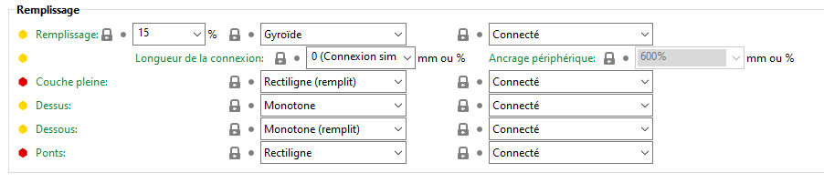

### Remplissage
Paramètres liés directement au remplissage des modèles

#### *Densité de remplissage*
La plupart des modèles peuvent être imprimés avec un remplissage de 10-15%. Si le dessus du modèle se referme progressivement, il peut être imprimé vide (remplissage 0%), même si nous ne le conseillons généralement pas. Si vous voulez que le modèle soit plus lourd, qu'il ait une résistance à la compression plus importante ou une plus grande rigidité, vous pouvez augmenter le remplissage. Vous aurez rarement besoin d'un remplissage supérieur à 30%. Enfin, vous pouvez imprimer le modèle avec un remplissage de 100% et motif de remplissage sera alors obligatoirement rectilinéaire. Gardez à l'esprit qu'un remplissage de 100% peut avoir un impact négatif sur l'apparence de l'objet imprimé.

**Augmenter la résistance d'un modèle**

La résistance d'un modèle est surtout définie par le nombre de **périmètres (pas le remplissage**). Si vous voulez obtenir une impression plus résistante, augmentez le nombre de périmètres. Cela dit, le remplissage augmente la résistance à la compression.

#### *Motif de remplissage*
SuperSlicer vous propose de choisir entre plusieurs motifs de remplissage. Au moment de choisir un motif de remplissage, voici les choses à prendre en considération :

- La vitesse d'impression
- La densité en fonction du matériau utilisé (les couches supérieures auront de meilleurs supports avec moins de matériau)
- L'apparence
- Les supports pour les couches supérieures
- La flexibilité (pour les impressions en TPU/TPE)

#### *Options de modèles de remplissage dans SuperSlicer*
Pour couvrir le large éventail de motifs imprimés, les objets circulaires et rectangulaires ont été découpés. Le remplissage a été fixé à 10 % pour aider à illustrer les motifs de remplissage. La couche supérieure est enlevée dans les images afin de montrer le motif intérieur.

SuperSlicer vous permet de modifier le motif de la structure de remplissage imprimée, ce qui est avantageux dans certains cas d'utilisation. Par exemple :

- **Les remplissages 2D forts** sont utilisés pour les impressions de tous les jours
- **Les remplissages 2D rapides** sont utilisés pour les modèles rapides mais faibles
- **Les remplissages 3D** sont utilisés pour rendre l'objet aussi résistant dans toutes les directions
- **Les remplissages 3D flexible** sont utilisés pour les matériaux flexibles

Les options de modèle suivantes sont disponibles :

| Type de remplissage                                                                                                                                                                                                                        |         Image              |
|--------------------------------------------------------------------------------------------------------------------------------------------------------------------------------------------------------------------------------------------|:---------------------:|
| A. **Grille:** fort remplissage 2D                                                                                                                                                                                                         |  |
| B. **Rectiligne :** remplissage 2D rapide                                                                                                                                                                                                  |  |
| C. **Monotone :** *(Mode ligne)* remplissage 2D                                                                                                                                                                                   |  |
| D. **Triangles :** fort remplissage 2D                                                                                                                                                                                                     |  |
| E. **Etoiles :** fort remplissage 2D                                                                                                                                                                                                       |  |
| F. **Tri-Cubique :** fort remplissage 3D                                                                                                                                                                                                       |  |
| G. **Cubique adaptatif :** fort remplissage 3D (cela permet d'économiser de la matière par rapport à Cubique)                                                                                                                              |  |
| H. **Support Cubique :** fort remplissage 3D                                                                                                                                                                                               |  |
| I.  **Ligne :** remplissage 2D rapide un remplissage en forme de grille continue non orthogonale, imprimant en continu dans une direction diagonale Nécessite forcément la définition d’une longueur maximum de l’ancre de remplissage     |  |
| J. **Concentrique :** remplissage 3D flexible                                                                                                                                                                                              |  |
| K. **Nid d’abeille :** fort remplissage 2D                                                                                                                                                                                                 |  |
| L. **Hexagonal 3D :** remplissage 3D flexible                                                                                                                                                                                          |  |
| M. **Giroïde** : Remplissage avec une résistance accrue pour un poids le plus faible.                                                                                                                                                      |  |
| N.  **Courbe de Hilbert :** fort remplissage 2D.Théoriquement ces parcours doivent permettre de remplir tout l’espace en une fois sans rétracter la buse. Ici ce n’est pas le las c’est une mauvaise implémentation des courbes de Hilbert |  |
| O. **Spirale d’Archimède** : remplissage 2D flexible                                                                                                                                                                |  |
| P. **Spirale Octagramme** (Etoile) :** remplissage flexible 2D                                                                                                                                                                             |  |
| P. **Rectiligne aléatoire :** remplissage 2D                                                                                                                                                                             |  |
| P. **Cubique adapatatif :** fort remplissage 3D                                                                                                                                                                             |  |
| P. **Support Cubique :** fort remplissage 3D                                                                                                                                                                             |  |

##### *Remplissage gyroïde*
Le remplissage gyroïde est l'un des remplissages les plus polyvalents.

- Il est tridimensionnel- ce qui lui confère **une résistance égale dans toutes les directions**
- Il peut être imprimé plutôt **rapidement**
- Il ne **se croise pas** sur la même couche
- Il a un **bon rapport résistance/poids**

Pour plus d’information sur le remplissage Gyroïde <https://mathcurve.com/surfaces/Gyroide/gyroide.shtml>

#### *Motif de remplissage couche pleine*
Vous pouvez choisir un motif de remplissage personnalisé qui ne s'appliquera aux couches pleines. La couche supérieure visible utilisera elle sont propre réglage avec le Motif de remplissage du dessus.

#### *Motif de remplissage du dessus*
Vous pouvez choisir un motif de remplissage personnalisé qui ne s'appliquera qu'à la couche supérieure visible, et pas aux couches pleines adjacentes du dessous. 

#### *Motif de remplissage du dessous*
Vous pouvez choisir un motif de remplissage personnalisé qui n'affectera que la couche inférieure visible, et pas les couches pleines adjacentes au-dessus.

Les options de modèle suivantes sont disponibles :

| Type                          | Image                             |
|-------------------------------|-----------------------------------|
| A. **Lissage**                |                                   |
| B. **Rectiligne**             |              |
| C. **Rectiligne (remplit)**   |                                   |
| D. **Monotone**               |              |
| E. **Concentrique**           |  |
| F. **Concentrique (remplit)** |                                   |
| G. **Courbe de Hilbert**      |                                   |
| H. **Spirale d’Archimède**    |                                   |
| I. **Spirale Octagramme**     |                                   |
| J. **Dent de scie**           |                                   |

Note : Théoriquement le mode de remplissage du dessous et dessus Rectiligne aligné devrait permettre un remplissage sans changement d’orientation entre 2 couches mais visiblement sur les versions 2.3.0 testées, le mode ne changeait pas du rectiligne standard.

Pour plus d'infos sur les remplissage [consultez la page](../pattern/pattern.md) sur les remplissages de SuperSlicer.

#### *Types de remplissage pour la couche du dessus (et du bas)*

Le fait d’éditer un remplissage ne consiste pas seulement à choisir un type de remplissage pour les parties internes de l’objet. Vous pouvez aussi modifier les types de remplissage pour les couches du haut et du bas afin d’obtenir des résultats intéressants. Cela peut être ajusté dans l’onglet **Réglages d’impression/Remplissage/Motif de remplissage du dessus (du dessous)**. Néanmoins, le fait de changer le remplissage du dessus ou du dessous provoque des **changements esthétiques** et n’améliore en rien les propriétés mécaniques du modèle.

*Remplissage des couches du dessus/dessous.*

Voici chacun des sept types de remplissage du dessus (et du dessous) imprimés avec un flux de 80% afin de mettre en évidence les motifs.

**Rectiligne**

Une nouvelle fois, il s’agit du type de remplissage du dessus le plus commun (et basique). Les trajets d’impression sont orientés en zig-zag pour toute la couche. Néanmoins, c’est le type de remplissage le plus simple et il **ne procure aucun avantage** d’aucune sorte (voir le remplissage monotone). **Monotone** Le motif de remplissage monotone remplit la couche du dessus (ou du bas) avec des lignes parallèles, identiques à celles du remplissage de type rectiligne. Néanmoins, ce remplissage utilise **une planification de trajet avancée.** Contrairement au remplissage rectiligne, celui-ci est toujours imprimé de gauche à droite, jamais dans la direction opposée. Ce système simple permet d’obtenir **un remplissage homogène sans vilaines aspérités.** Celles-ci apparaissent en général avec d’autres remplissages lorsque les trajets gauche-droite rencontrent les trajets droite-gauche. Cette méthode en apparence simple est étonnamment difficile à intégrer. Nous avons utilisé la variante **du Système de Colonie de Fourmis** décrite par Raad Salman.

différence entre remplissage Rectilinéaire et monotone ( Image Prusa)

##### *Rectiligne aligné*
Ce motif de remplissage fonctionne de la même façon que le remplissage rectiligne mais la dernière couche n’est pas imprimée à 90° de la précédente. Au lieu de cela, les trajets des deux couches sont parallèles l’un à l’autre. Cela peut aider à créer un motif de couche du dessus homogène pour les modèles qui ont des couches du dessus à différentes hauteurs (imaginez un modèle en escalier). 

##### *Concentrique* 
Le motif de remplissage concentrique copie la forme du périmètre. Si vous imprimez un cylindre, il dessinera des cercles concentriques sur le dessus du modèle. 

##### *Courbe de Hilbert*
Il s’agit surtout d’un remplissage esthétique. S’il est imprimé à l’intérieur, le motif Courbe de Hilbert génère des formes rectangulaires, tandis que la couche du haut ressemblera davantage à **un panier en osier.** Certaines personnes disent que cela ressemble à « des vers ». Ce remplissage augmente significativement le temps d’impression du fait de sa forme complexe. 

##### *Spirale d'Archimède*
Avec les Spirales d'Archimède, la surface qui se trouve le plus au-dessus est imprimée en spirale. Ce remplissage peut permettre de gagner du temps lorsque vous imprimez certains modèles. 

##### *Spirale octagramme*
Là aussi, ce remplissage a été décrit précédemment. Il est surtout intéressant pour des raisons esthétiques, mais sa forme complexe allonge le temps d’impression.

#### *Longueur de la connexion*
Le remplissage est généralement **connecté aux périmètres** avec ce qu’on appelle une ancre, qui consiste en une courte ligne qui constitue un autre périmètre (interne) et qui se transforme en ligne de remplissage. La longueur de l’ancre de remplissage détermine quelle longueur en millimètres de cette ancre sera connectée au remplissage et aux périmètres. Si vous réglez cette valeur sur 0, le remplissage sera imprimé indépendamment sur les périmètres. Une valeur plus haute permettra d’imprimer l’ancre en tant que prolongement du remplissage. L’ancre de remplissage aide à améliorer **l’intégrité du modèle et sa solidité**. **Longueur maximum de l’ancre de remplissage** Cette valeur détermine la longueur maximum de l’ancre de remplissage connectant le remplissage aux périmètres.

Mettre une valeur de 1000 dans le paramètre **Longueur de la connexion** revient à fixer ce paramètre à illimité ( 0 le désactive)

#### *Ancrage périphérique*
Ce paramètre permet de relier une ligne intercalaire à un périmètre interne avec un court segment d'un périmètre supplémentaire. Si elle est exprimée en pourcentage (exemple : 15 %), elle est calculé sur la largeur d'extrusion du remplissage. 
SuperSlicer tente de relier deux lignes de remplissage proches à un court segment de périmètre. Si aucun un tel segment de périmètre plus court que `infill_anchor_max` n'est trouvé, la ligne de remplissage est connectée à un segment de périmètre sur un seul côté et la longueur du  segment de périmètre pris est limité à ce paramètre, mais pas plus long que `anchor_length_max`.

Définissez ce paramètre sur **zéro** pour désactiver l'ancrage des périmètres connectés à une ligne de remplissage unique.

### Réduction du temps d’impression
SuperSlicer propose deux méthodes pour économiser du temps et du matériau. La première option permet de **combiner le remplissage toutes les X couches.** La valeur par défaut est réglée sur 1, c’est à dire que chaque couche de périmètre est imprimée avec une couche de remplissage (1 = ratio de 1 couche de remplissage pour 1 couche de périmètre). Le fait d’augmenter cette valeur à 2 (ratio 2:1) va permettre d’imprimer une couche de remplissage (à la hauteur de couche correspondante) toutes les deux couches de périmètre. Mais gardez à l’esprit que cette valeur ne peut pas être augmentée à l’infini. SuperSlicer vous laissera entrer une valeur très haute mais seule la valeur maximale qui est physiquement possible sera inscrite dans le G-code. Pour être plus spécifique : Si vous utilisez une buse de 0,4 mm et une hauteur de couche de 0,15 mm, le slicer ne vous permettra pas d’imprimer une couche de périmètre moins souvent que deux couches de périmètre. Sinon le remplissage serait imprimé dans le vide. Mais si vous imprimez avec une hauteur de couche de 0,05 mm (buse de 0,4 mm), vous pouvez combiner le remplissage toutes les 8 couches. La seconde méthode pour économiser du temps (et du matériau) consiste à **imprimer du remplissage seulement là où il en a besoin,** Par exemple, si vous imprimez une sphère, cette fonction ne génèrera qu’une colonne de remplissage au centre afin de soutenir d’éventuels surplombs. Le principal désavantage de cette fonction est la faible résistance à l’impact du fait du manque de remplissage dans certaines zones du modèle.

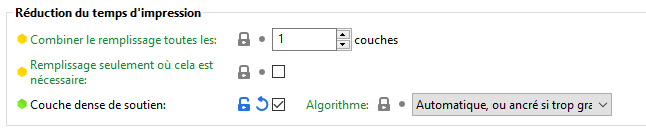

#### *Combinez le remplissage toutes les X couches*
Différentes hauteurs de couche seront utilisées pour le remplissage et pour les périmètres afin d'accélérer l'impression sans sacrifier sa qualité.

**Exemple :** Combiner un remplissage toutes les 3 couches, avec une hauteur de couche de 0,1 mm, le remplissage étant imprimé avec une hauteur de couche de 0,3 mm.

La hauteur de couche maximum est limitée par le diamètre de votre buse. Si vous essayez de combiner un remplissage toutes les 1+ couches avec une buse de 0,4 mm et une hauteur de couche de 0,3 mm, aucun changement ne va réellement se produire car vous ne pouvez pas imprimer des couches plus grandes que (environ) 0,32 mm (80% du diamètre de la buse).

Remplissage (en gris) imprimé avec une hauteur de couche deux fois supérieure à celle des périmètres (en orange)

#### *Faire remplissage seulement où cela est nécessaire*
En choisissant cette option le remplissage se fera comme pour une structure de support interne, et seule les zones ayant besoin de support génèreront sous elles un motif de remplissage. Si cette option est activée elle ralentira la génération du G-code (du fait des tests de surplomb supplémentaires requis). De plus, le remplissage ne sera probablement plus en contact avec le périmètre à certains endroits, donc utilisez cette option avec précaution.

Cette option ne prend pas le réglage de **seuil de surplomb** des supports en compte.

Exemple d'une sphère réalisée avec l'option de _**remplissage uniquement là où c'est nécessaire**_.

**Note** : Les quelques essais réalisés n’ont pas permis de mettre en évidence un intérêt fort sur cette option. En l’absence de réglage du surplomb il est difficile de bien gérer cette option.

#### *Couche dense de soutient*

Permet la création d'une couche de support sous la première surface pleine interne. Cela vous permet d'utiliser un taux de remplissage très bas sans compromettre la qualité du remplissage solide. 

Le remplissage dense utilise une densité de remplissage de 50%.

Lorsque ce commutateur est activé, si le remplissage est inférieur à 40%, il recherche une zone supportée sous chaque surface pleine, avec seulement des lignes droites entre les périmètres. Lorsqu'il en trouve une, il utilise un processus de remplissage spécial qui pose un périmètre (avec un chevauchement, de sorte qu'il est ~supporté par le périmètre interne actuel et ensuite un remplissage rectiligne de 42% à l'intérieur. Cela permet d'éviter tout gondolage qui pourrait ruiner votre surface supérieure, et de s'assurer que tout peut être supporté même avec un taux de remplissage de 0%.

#### *Algorithme*
Choisissez la disposition de la couche dense. L'option automatique permettait d'essayer de dessiner la plus petite surface avec uniquement des lignes droites à l'intérieur du remplissage peu dense. 'Ancrés' ne fait qu'agrandir un peu (par 'Marge de remplissage par défaut') les surfaces qui nécessitent un meilleur support.

### Avancé
SuperSlicer vous permet d’ajuster encore davantage les motifs de remplissage ! Si vous basculez en mode Avancé ou Expert, vous trouverez bien plus de réglages dans l’onglet Remplissage. Voyons donc tous les réglages liés aux remplissages, qu’ils soient dans le mode Avancé ou Expert 

Ces réglages de remplissage sont vraiment des paramètres avancés et la plupart des utilisateurs d’imprimantes 3D n’en auront vraisemblablement jamais besoin. Néanmoins, il y aura peut-être quelques situations où vous voudrez les ajuster, donc voyons ce qu’ils permettent de faire :
#### *Remplissage plein toutes les X couches*
Cette fonctionnalité permet d'imposer une couche pleine après chaque nombre de couches donné. Cela peut être utile pour augmenter la résistance de la pièce imprimée, néanmoins d'autres options, comme l'augmentation du nombre de périmètres ou le pourcentage de remplissage sont préférables. Cela peut également servir à créer des cellules internes séparées afin d'accroitre l'isolation thermique.

**Régler sur 0 pour désactiver.**

L’impression d’un remplissage plein toutes les X couches** peut être pratique lorsque vous voulez améliorer la solidité d’un modèle (le fait d’augmenter le nombre de périmètres fonctionne mieux, cela dit) ou pour diviser le remplissage en cavités multiples afin de permettre à un objet de flotter sur l’eau. Cette fonction permet simplement l’impression d’un remplissage plein à intervalles réguliers.
#### *Angle du remplissage*
Angle par défaut pour l'orientation du remplissage. Un quadrillage sera appliqué à certains motifs de remplissage.

**Les ponts** seront imprimés en utilisant la meilleure direction détectée par SuperSlicer, donc ce réglage ne les concerne pas.

#### *Surface de seuil pour le remplissage plein*
Impose le remplissage plein pour des zones présentant une surface plus petite que celle définie par le seuil spécifié.

**Régler sur 0 pour désactiver.**

Le paramètre Surface de seuil pour le remplissage plein est surtout pratique pour les petites pièces ou celles qui sont complexes. Grâce à ce réglage, vous pouvez déterminer comment les grandes et petites cavités du modèle seront comblées avec un remplissage à 100%. Cela peut aider à rendre les petites pièces plus solides.

#### *L’angle de remplissage*
L’angle de base pour le remplissage, fait pivoter le motif selon l’angle choisi.

#### *L’angle pour les ponts*
L’angle pour les ponts est calculé automatiquement par SuperSlicer. Si vous laissez 0°, SuperSlicer choisira la meilleure valeur. Néanmoins, vous pouvez la changer manuellement si vous le souhaitez. Pour imprimer avec un angle de pontage égal à 0° il faut en fait régler sur 180°.

> **Utilisez 180° pour un angle nul.**

#### *L’angle d’incrément*
L’angle d’incrément cet angle est ajouté à chaque couche à l'angle de base pour le remplissage. Peut être utile pour une raison esthétique, ou pour être sûr de toucher chaque caractéristique de l'objet même avec un remplissage très faible. 

> **Régler sur 0 pour désactiver.**

#### *Ancrage des remplissages plein de X mm*
Ce paramètre fait croître les couches haut / bas / pleines par la valeur renseignée pour les ancrer dans la pièce.

> **Mettez 0 pour le désactiver.** Peut être un% de la largeur du périmètre.

##### *Pour les ponts*
Ce paramètre fait croître les couches en pont par la valeur renseignée pour les ancrer dans la pièce.

> **Mettez 0 pour le désactiver.** Peut être spécifié par un % de la largeur du périmètre externe.

#### *Rétracter uniquement lors du franchissement de parois*
Désactiver la rétraction lorsque le chemin de déplacement ne franchit pas les périmètres des couches extérieures (et donc les coulures seront probablement invisibles).

La rétractation seulement lors du franchissement de parois peut réduire un peu le temps d’impression et augmenter l’intégrité du remplissage. Le fait de désactiver les rétractions va accroitre les écoulements de filament non-visibles (cachés dans le modèle). Les rétractations resteront activées pour les périmètres.

#### *Remplissage avant les périmètres*
Cette option inverse l'ordre d'impression des périmètres et du remplissage, ce dernier étant alors imprimé en premier. L’impression du remplissage avant les périmètres peut parfois être utile pour l’impression de surplombs où les périmètres n’ont rien à quoi se rattacher. Néanmoins, le remplissage peut impacter négativement la qualité de la surface externe. La seconde utilisation de cette méthode concerne les MMU2s, pour lesquelles la purge des couleurs se fait plus efficacement – la couleur est nettoyée dans le remplissage et le périmètre est imprimé avec une couleur nette.

### Options avancées de remplissage
#### *Réglage du remplissage pour le lissage*
C'est le pourcentage du débit qui est utilisé pour la deuxième passe de lissage. Typiquement 10-20%. Ne devrait pas être supérieur à 20%, à moins que votre largeur d'extrusion soit largement supérieure à celle de votre buse. Une valeur trop faible et votre extrudeuse va manger le filament. Une valeur trop élevée et la première passe ne sera pas bien imprimée.

#### *Espacement des lignes de lissage*
Il s'agit de la largeur de la passe de lissage, en % de l'extrusion du remplissage supérieur la largeur, ne doit pas être supérieure à 50% (deux fois plus de lignes, 50% de chevauchement). Il n'est pas nécessaire de descendre en dessous de 25% (quatre fois plus de lignes, 75% de chevauchement). 

Si vous avez des problèmes avec votre processus de lissage, n'oubliez pas de regarder le débit->débit du pont supérieur, car ce paramètre doit être réglé à min 110% pour s’assurer d'avoir assez de plastique dans la couche supérieure. Une valeur trop basse fera que votre extrudeuse mangera le filament.

### Lissage Post-processus

Le lissage permet d’obtenir **une surface lisse** sur les plans horizontaux – les trajets du filament sont presque invisibles. Comment cela est-il possible ? La buse chaude passe sur la surface **une fois supplémentaire mais avec un débit de filament réduit.** Le fait d’activer ou de désactiver le lissage, et de choisir ou pas le type de lissage (toutes les surfaces, uniquement la surface la plus au-dessus, toutes les surfaces pleines) devrait suffire à la plupart des utilisateurs d’imprimantes 3D. Néanmoins, peut-être voudrez-vous ajuster le ratio de flux ou l’espacement entre les passages du lissage. Le **ratio de flux** est réglé en tant que pourcentage de la hauteur de couche normale, et **l’espacement entre les passages du lissage** détermine à quelle distance les lignes parallèles tracées par la buse doivent se trouver les unes par rapport aux autres. Les valeurs de ces paramètres sont réglées sur des valeurs optimales, mais vous pouvez les modifier à votre guise si le résultat ne vous convient pas.

Si vous augmentez **le débit**, vous risquez d’avoir des résidus de matériau sur la surface. De plus, le passage de la buse sera visible. Un débit moins important, par contre, rendra les passages sur la dernière couche visibles du fait du manque de matériau venant combler les creux. **L’espacement entre les passages du lissage** A également un impact important sur l’apparence de la couche du dessus. Afin de faciliter l’explication, nous allons faire une comparaison avec un chasse-neige. Imaginons que vous n’utilisiez qu’une partie de la lame du chasse-neige pour pousser la neige – cela va retirer une certaine quantité de neige et aussi dégager une partie de la route. Maintenant, si vous enfoncez complètement la lame du chasse-neige et poussez vers l’avant, vous allez dégager un passage, mais vous allez laisser derrière vous l’excès de neige. 

#### *Qu'est-ce que le lissage et comment fonctionne-t-il ?*

Le lissage permet de lisser les surfaces planes en effectuant une deuxième phase de remplissage spéciale sur la même couche.

Lorsque la buse chaude se déplace sur la couche supérieure qui vient d'être imprimée, elle aplatit tout plastique qui aurait pu se recroqueviller. La buse extrude également **une petite quantité de filaments** pour remplir les trous de la surface supérieure. L'espacement entre les différentes passes de repassage est généralement une fraction du diamètre de la buse. Cela signifie que la buse passera plusieurs fois au même endroit. Le lissage est effectué à un angle fixe de 45 degrés par rapport à la première phase de remplissage normal de la surface supérieure, car cette approche donne de meilleurs résultats.

#### *Les inconvénients*
Le principal inconvénient est **l'augmentation du temps d'impression**, car la deuxième phase de remplissage du haut est effectuée avec un très faible espacement entre les lignes de repassage. Vous pouvez voir combien de temps d'impression sera consacré au lissage dans l'aperçu.

Si vous repassez une grande surface, sur certaines machines, vous risquez de constater un **fluage de chaleur** et, éventuellement, un bouchage de la partie chaude parce que l'extrusion est très petite et lente pendant le repassage. Cela peut poser un problème surtout lors de l'impression avec du PLA, en raison de sa faible résistance à la température. Le risque est accru pendant les canicules d'été.

Un autre inconvénient est que les bords seront un peu flous ou moins tranchants. Le parcours de repassage est prévu pour une petite extrusion, mais la buse est physiquement toujours de la même taille, de sorte qu'un peu de plastique va saigner sur le bord.

#### *Quand utiliser le lissage*
Le lissage est utile pour les impressions à surface plane, **comme les plaques d'identification, les logos, les badges, les boîtes, les couvercles,** etc.

Le lissage peut également être utile lorsque vous souhaitez coller deux pièces ensemble et que vous avez besoin que les surfaces soient aussi plates que possible afin de réduire au maximum l'écart entre elles.

**Le lissage n'est pas utile pour les objets ronds, les Figures et les formes organiques en général**. Il n'est pas non plus utile pour les objets qui présentent des zones plates, mais ces zones plates ne sont pas alignées parallèlement au plateau d'impression. Cela dit, le lissage n'aura pas d'impact négatif significatif lors de l'impression de tels modèles, il ne fera qu'augmenter inutilement le temps d'impression.

Le lissage a peu ou pas d'effet sur les surfaces non planes, Lissage non actif (à gauche), Lissage actif allumé (à droite) (Image Prusa).

Certains modèles peuvent être imprimés à l'envers. La couche inférieure imprimée sur la plaque de construction sera généralement encore plus lisse qu'une couche supérieure repassée. Et vous pouvez imprimer une texture dans l'impression, en fonction de la feuille d'impression que vous utilisez.

Le **remplissage monotone** est une autre caractéristique qui améliore la qualité des couches supérieures. Utilisez-le en combinaison avec le lissage pour obtenir les meilleurs résultats. Dans les profils Prusa originaux, le remplissage monotone est déjà défini comme le motif de la couche supérieure par défaut.

#### *Comment activer le lissage pour tous les modèles*
Le lissage n'est pas disponible dans le mode Simple, alors passez en mode Avancé ou Expert.

Sélectionnez ensuite [**Paramètres d'impression - Remplissage - Lissage - Activer le lissage.**](#activer-le-lissage)

#### *Comment activer le lissage uniquement pour le modèle sélectionné*
Tout d'abord, passez en mode Expert, le repassage pour les modèles individuels n'est activé que dans ce mode. Faites un clic droit sur un modèle et sélectionnez **Ajouter des réglages - lissage** dans le menu contextuel. Cochez **Activer** le lissage, vous pouvez également sélectionner le reste des paramètres de repassage afin de les personnaliser modèle par modèle. Vous pouvez maintenant modifier les paramètres de repassage pour ce modèle à l'aide du panneau de droite.

Si vous avez plusieurs instances du même objet sur la plaque de construction et que vous souhaitez activer le repassage pour l'une d'entre elles, vous devez d'abord cliquer avec le bouton droit de la souris sur le modèle et choisir "***Définir comme Objets séparés***" dans le menu contextuel. Sinon, vous l'activerez pour toutes les instances, car elles partagent tous les paramètres.

#### *Modificateurs - Comment activer le lissage uniquement pour certaines surfaces*
Vous pouvez utiliser les modificateurs de plage de hauteur ou les maillages modificateurs pour activer le lissage juste pour une partie d'un modèle (dans le mode **Expert**).

##### *Modificateur de la plage de hauteur*
Comme le lissage ne fonctionne que sur des surfaces planes, il est logique d'utiliser un modificateur de hauteur pour spécifier un intervalle vertical, où le lissage sera utilisé.

1. Cliquez avec le bouton droit de la souris sur un modèle et sélectionnez **Modificateur de la plage de hauteur**.
1. Spécifiez la hauteur de départ et la hauteur d'arrêt dans le panneau de droite
1. Cliquez avec le bouton droit de la souris sur la roue dentée située à côté du modificateur de la plage de hauteur dans le panneau de droite
1. Sélectionnez **Ajouter des réglages - Lissage**
1. Cochez Activer le lissage, vous pouvez maintenant activer le lissage uniquement pour cette partie dans le panneau de droite

##### *Maillage modificateur*
1. Avec le bouton droit de la souris sur un modèle et sélectionnez **Ajouter un modificateur**
1. Vous pouvez soit utiliser une forme de base (boîte, cylindre), soit utiliser **Charger**... pour importer un maillage personnalisé comme modificateur
1. Positionnez le modificateur de manière à ce qu'il chevauche la partie du modèle que vous souhaitez
1. Cliquez avec le bouton droit de la souris sur la roue dentée située à côté du modificateur dans le panneau de droite
1. Sélectionnez **Ajouter des réglages - Lissage**
1. Cochez Activer le lissage, vous pouvez maintenant activer le lissage uniquement pour cette partie dans le panneau de droite

#### *Type de lissage*

##### *Toutes les surfaces de dessus*
La buse lissera la couche supérieure de chaque surface (la dernière couche de chaque zone plane).

##### *Surface supérieure uniquement*
Seule la toute dernière couche de l'objet sera lissée. Cela signifie que dans le cas d'un texte en relief (orienté parallèlement au lit d'impression), seule la partie supérieure des lettres sera repassée, mais pas l'espace entre les lettres.

##### ***Toutes les surfaces pleines***
Cette option ne fonctionne pas correctement pour le moment.

Chaque couche recevra une passe de lissage. Une fonction expérimentale destinée à être utilisée avec un remplissage à 100% pour créer des objets plus transparents.

#### *Débit*
Pourcentage d'un débit par rapport à la hauteur de couche normale de l'objet a utiliser pour le lissage. La valeur par défaut est fixée à 15%

#### *Espacement entre les passes de lissage*
Distance entre les différentes lignes de lissage. Cette valeur doit être inférieure au diamètre de votre buse. De ce fait, la buse passera plusieurs fois sur le même point.

#### *Vitesse de lissage*
Cette option n'est pas regroupée avec les autres paramètres de lissage. Vous la trouverez plutôt dans [**Paramètres d'impression - Vitesse - Lissage**](#vitesse). N'hésitez pas à expérimenter cette valeur, mais en général, les vitesses plus lentes sont les plus efficaces.

#### *Calibration*
Le lissage est très sensible au calibrage précis de l'extrudeuse. Des rainures trop peu nombreuses et trop brillantes seront visibles sur la couche supérieure, qui ne sera pas lissée. Trop et l'excès de plastique sera entraîné par la buse vers les bords de la surface supérieure. Le calibrage est donc une question d'essais et d'erreurs. On peut expérimenter avec le débit, la vitesse et l'espacement du repassage pour obtenir les meilleurs résultats.

#### ***Différents matériaux***
En ce qui concerne les réglages, ils ne font pas vraiment la différence entre les différents matériaux. Cependant, le repassage se fait un peu différemment selon le filament utilisé.

Le lissage PLA est très bien, mais il est plus sujet au fluage thermique (dépend de votre imprimante et de la température ambiante).

Les lissages en PETG sont très bien, mais il y a un risque accru que des filaments supplémentaires collent à la buse. Ce plastique peut s'accumuler sur la buse, devenir sombre en cas de surchauffe et finir par se fixer sur l'impression. Il en va de même pour le FLEX, mais de façon beaucoup plus prononcée.

Les lissages ASA fonctionnent incroyablement bien, produisant des surfaces supérieures super lisses.

Lorsque nous avons essayé de lisser des filaments remplis de bois, nous n'avons pas obtenu de très bons résultats. Mais votre expérience peut varier.

## Bordure et jupe

### Bordure
La bordure est un contour imprimé autour de tous les modèles sur le plateau d'impression. Elle est imprimée avant les modèles et son objectif est principalement de **stabiliser le flux** du filament à travers la buse.

La bordure est également utile pour **vérifier l'adhérence de la première couche** sur le plateau d'impression. Puisqu'elle est imprimée avant les modèles, vous pouvez changer rapidement l'**Ajustement en direct de l'axe Z** si vous voyez que la première couche ne colle pas correctement ou est trop écrasée par la buse.

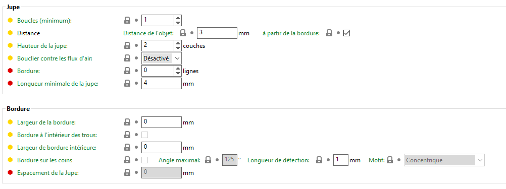

#### *Boucles (minimum)*
Nombre de boucles de la bordure. Si la **Longueur Minimale d'Extrusion** est paramétrée, le nombre de boucles minimal sera plus grand que celui configuré ici.

> **Mettez à 0 pour désactiver** complètement la bordure.

#### *Distance de l'objet*
Distance entre le la bordure et le ou les objet(s). Mettez à 0 pour attacher la bordure a(ux) objet(s) (peut être utilisé comme une alternative à la jupe pour augmenter l'adhérence).

#### *Hauteur de la bordure*
Le nombre de couches de bordure à imprimer. 

Les bordures d'une couche de hauteur peuvent être difficiles à retirer du plateau d'impression. Les profils Prusa utilisent généralement une bordure haute de 3 couches pour cette raison.

> **Vous pouvez aussi mettre à 0 ce paramètre pour désactiver** complètement la bordure.

#### *Bouclier contre les flux d'air*
Si cette option est activée, elle crée une bordure aussi haute que l'objet le plus haut de la scène. Cela peut être utilisé pour protéger l'ABS, l'ASA et d'autres matériaux contre la déformation en créant un microclimat autour de la pièce imprimée et en protégeant l'impression d'un courant d'air/du vent.

Les caractéristiques du bouclier vont dépendre des réglages de la bordure avec notamment le nombre de boucles qui va constituer le bouclier.

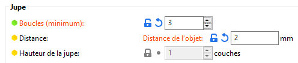  

#### *Longueur minimale d'extrusion de filament*
Force plus de boucles de bordure lorsque cela est nécessaire pour garantir que la quantité minimale de filament définie ici est extrudée avant la fin de la bordure. Pour les machines multi-extrudeurs, ce minimum s'applique à chaque extrudeur.

### Jupe
Avant d'envisager d'appliquer un matériau pour une meilleure adhésion sur le plateau, envisagez d'utiliser l'**option** **Jupe** dans SuperSlicer qui augmente la surface de la première couche. Vous pouvez définir manuellement la taille de la jupe dans **SuperSlicer** en allant dans **Réglages d'impression - Bordure et jupe - Jupe**. Généralement, il est conseillé d'utiliser au moins un bord de 3 mm pour augmenter l'adhérence.

Vous devriez envisager d'utiliser l'option jupe lors de l'**impression de :**

- Objets hauts avec une petite base
- Plusieurs petits objets à la fois

Quand la **Compensation de l'effet patte d'éléphant** est activée, un petit espace apparaît entre le modèle et la jupe dans l'aperçu.

#### *Largeur de la jupe*
Largeur horizontale de la jupe qui sera imprimée autour de chaque objet sur la première couche.

#### *Jupe à l’intérieur des trous*
Permet de créer une jupe sur un ilot lorsqu'il est à l'intérieur d'un trou (ou entourée par un objet).

#### *Largeur de jupe intérieure*
Largeur de la jupe intérieure, Elle sera imprimée à l'intérieur des trous d'un objet sur la première couche.

#### *Jupe sur les coins*
Option pour ne mettre une jupe qu'autour des arrêtes saillantes du modèle

##### *Angle maximal*
Angle maximum pour ajouter une jupe de coin.

> **Si mis à 0, aucune jupe ne sera créée.**

Si mis à environ 178, la jupe sera créée autour de toutes les arrêtes sauf les sections droites.

##### *Rayon de détection*
La géométrie sera décimée avant de détecter les angles aigus. Ce paramètre indique la longueur minimale de la déviation après décimation.

> **Mettre 0 pour désactiver la fonction.**

##### *Motif*
Motif pour le coin. Le concentrique est celui par défaut. Le rectiligne a un périmètre autour de lui, vous pouvez l'essayer si le concentrique a trop de problèmes pour coller à la plaque de construction.

#### *Décalage de la jupe*
Distance entre la jupe et la pièce. Doit être maintenue à 0, sauf si vous rencontrez de grandes difficultés pour les séparer. Elle est soustraite à [brim_width](../variable/brim_width.md) et [brim_width_interior](../variable/brim_width_interior.md), elle doit donc être inférieure à celles-ci.

## Support

Les imprimantes 3D fonctionnent en posant une couche sur une couche de plastique pour créer un objet 3D. Chaque nouvelle couche doit être supportée par celle qui se trouve en dessous. Si une partie de votre modèle commence dans le vide et n'est supportée par aucun élément en dessous, vous devez ajouter une structure de support supplémentaire pour garantir une impression réussie.

Cela vaut la peine d'envisager de modifier l'orientation du modèle ou de diviser le modèle en plusieurs parties afin de réduire éventuellement les surplombs et par conséquent la quantité de supports générés.

SuperSlicer peut à la fois détecter les zones qui ont besoin de supports et les générer **automatiquement** à ces endroits.

Vous pouvez également définir manuellement les supports en utilisant :

- **Supports peints**
- **Générateurs/Bloqueurs de supports**

Les supports peuvent être activés à partir du **panneau de droite** ou dans **Réglages d'impression - Support - Générer des supports**.

Lorsque l'impression se termine, selon la géométrie du modèle et le matériau utilisé, la structure de support peut souvent être facilement retirés à mains nues. Vous pouvez utiliser une pince pour avoir une meilleure prise dans des endroits autrement difficiles à atteindre. Un scalpel ou un couteau utilitaire peuvent également être utilisés pour retirer proprement un morceau de support qui semble être collé au modèle.

Les morceaux de supports peuvent être étonnamment tranchants et sont parfois violemment éjectés dans une direction aléatoire après leur retrait. Lorsque vous rencontrez des supports difficiles à retirer, pensez à porter des lunettes de protection (cela semble stupide jusqu'à ce que vous soyez touché à l'œil pour la première fois).

### Supports partout

Les supports peuvent se développer à la fois à partir du plateau d'impression et de toute surface de modèle si nécessaire. 

Cela garantit que chaque surplomb et toutes les parties commençant dans le vide seront supportées. Cependant, de petites imperfections peuvent apparaître sur la surface où les supports ont commencé à se développer.

### Supports sur le plateau uniquement
Crée uniquement des supports qui ont leur base au niveau du plateau d'impression.

### Uniquement pour les générateurs de supports
La génération de supports automatique est activée uniquement pour les zones marquées avec un générateur de supports. Cette option est essentiellement un raccourci qui active **Paramètres d'impression - Supports - Générer des supports**, mais désactive **Paramètres d'impression - Supports - Supports générés automatiquement**.

### Activation/désactivation des supports pour chaque modèle
Il est possible d'imprimer plusieurs objets à la fois chacun avec leurs propres paramètres de supports. Par défaut, tous les modèles sont affectés par les paramètres globaux. Vous pouvez les remplacer en faisant un **clic droit** sur un modèle dans la vue 3D et en sélectionnant **Supports**. Vous pouvez également cliquer avec le bouton droit sur l'icône d'édition dans la Liste d'objets.

Une nouvelle fenêtre apparaîtra dans le panneau de droite appelée **Paramètres de l'objet à modifier - Supports**. La modification de ces paramètres affectera uniquement l'objet concerné et ses instances. Vous pouvez supprimer les paramètres remplacés en cliquant sur l'icône croix rouge. Si vous le faites, les paramètres globaux seront à nouveau appliqués.

### Générateur/Bloqueur de supports
Les supports automatiques peuvent parfois apparaître dans des endroits difficiles d'accès, ce qui entraîne un retrait fastidieux des structures de support. Si vous pensez qu'une telle partie du modèle pourrait être imprimée sans supports, mais ni le paramètre **Seuil de surplomb** ni l'option **Supports sur le plateau uniquement** n'ont aidé, vous pouvez ajuster les supports manuellement.

À partir de SuperSlicer 2.3, vous pouvez également utiliser les Supports peints.

Faites un **clic-droit** sur un modèle et choisissez soit un **Bloqueur de supports ou un Générateur de supports**.

**Mode Simple** - Les générateurs/bloqueurs sont toujours en forme de pavé

**Mode Avancé** - Formes de pavé/cylindre/sphère/dalle

**Mode Expert** - Option pour charger une géométrie externe en tant que bloqueur/générateur

Les bloqueurs et les générateurs de supports peuvent être manipulés avec les outils habituels de déplacement, rotation et mise à l'échelle. Vous pouvez également les dupliquer rapidement par copier-coller.

### Bloqueur de supports
Les bloqueurs de support sont utiles lorsque vous êtes généralement satisfait des supports automatiques et que vous souhaitez simplement supprimer certains d'entre eux. Concentrez-vous sur le placement des bloqueurs là où les supports rencontrent l'objet, le reste de la structure de support en-dessous sera supprimé automatiquement.

### Générateur de supports
Les générateurs de supports sont excellents dans les situations où seules quelques parties de l'objet doivent être supportées, mais l'algorithme automatique place les supports sur tout le modèle. Dans cette situation, n'oubliez pas de basculer le mode de support sur Seulement pour les générateurs de supports. 

C'est moins courant, mais vous pouvez également utiliser des générateurs de support avec la génération automatique activée.

Une autre utilisation intéressante des générateurs de supports est de diviser les ponts longs en plus petits en plaçant un support au milieu du pont. Vous pouvez répéter ce processus et imprimer des ponts plus courts et presque parfaits tout en facilitant le retrait des supports.

#### *Générer des supports*
Les supports sont désactivés sauf si un modèle a un écrasement pour ce paramètre.

#### *Supports générés automatiquement*

Lorsque cette option est désactivée, la détection de surplomb est désactivée. Seuls les générateurs de supports génèrent des supports.

#### *Seuil de surplomb*

La valeur de seuil de surplomb représente la pente la plus horizontale (mesurée à partir du plan horizontal) que vous pouvez imprimer sans support (90 = vertical).

La modification de cette valeur est un moyen rapide d'ajuster la quantité de supports générés.

Plus la valeur est faible, moins de supports seront générés.

1. La valeur du seuil de surplomb et comment elle est mesurée
1. Seuil de surplomb 55
1. Seuil de surplomb 35
1. Seuil de surplomb 15

#### *Générer des supports sur le(s) X première(s) couches*
Générer des supports pour le nombre de couches spécifié à partir du bas, que les supports normaux soient activés ou non et sans tenir compte des seuils d'inclinaison. Ceci est utile pour obtenir une meilleure adhérence pour des objets ayant une surface de contact très fine ou limitée sur le plateau.

* 

L’option **Générer des supports** doit être activé à minima pour obtenir ces X premières couches.

### Radeau

#### *Première couche pleine*

Dépose une couche pleine sur le plateau à la place d'un radeau.

 

Première Couche pleine à droite / Radeau classique à gauche.

#### *Couches du radeau*

L'objet sera surélevé de ce nombre de couches et des supports seront générés en-dessous. Une fois l'impression terminée, vous pouvez saisir le radeau et le décoller de la pièce.

* 

### Options pour le matériau de support et le radeau

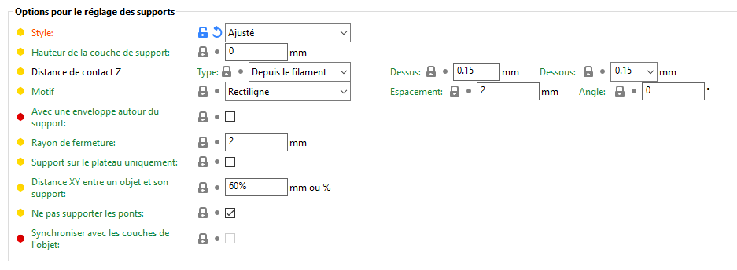

Options pour le matériau de support et le radeau.

#### *Distance de contact Z*

La distance verticale entre l'objet et l'interface du support.

La définition de cette valeur à 0 empêchera SuperSlicer d'utiliser le débit et la vitesse des ponts pour la première couche de l'objet.

Des valeurs comprises entre 50 et 75% de la hauteur de la couche semblent bien fonctionner.

##### *Type*

Comment calculer la distance de contact verticale Z.

- ***Depuis le filament*** : il utilise le morceau le plus proche du filament. Lorsqu'un pont est extrudé, il passe en dessous du plan actuel.

- ***Depuis le plan*** :  il utilise le plan-z. Identique à "Depuis le filament" si aucun "pont" n'est extrudé.

- ***Aucune (soluble)*** : pas de distance de contact verticale Z. Utile pour les supports solubles. 

##### *Dessus*

Distance verticale entre l’interface du support et l’objet (lorsque l’objet est imprimé sur le support).

Définir ce paramètre à 0 empêchera également SuperSlicer d’utiliser le flux et la vitesse de pont pour le premier calque d’objet.

Peut être spécifié par un % de la largeur d'extrusion utilisée pour les couches d'interface.

##### *Dessous*

La distance verticale entre l’objet et l’interface du support (lorsque le support est imprimé sur l’objet).

Peut être spécifié par un % de la largeur d'extrusion utilisée pour les couches d'interface.

#### *Motif*
- ***Rectiligne*** - par défaut, généralement le plus facile à supprimer
- ***Grille rectiligne*** - plus solide et moins sujette à la rupture pendant l'impression par rapport au remplissage rectiligne, plus difficile à retirer
- ***Nid d'abeille*** - robuste, un peu difficile à enlever

#### *Avec une enveloppe autour du support*

Crée un périmètre unique autour des supports, ce qui les rend plus robustes, mais plus difficiles à retirer.

#### *Espacement du motif*

Espacement entre les lignes des supports. Augmentez-le pour faciliter le retrait des supports. Les couches d'interface du support pontent sur les lignes des supports, si vous augmentez trop cette valeur, ces ponts commenceront à s'affaisser et auront une connexion imparfaite avec le modèle.

Mettre à zéro pour obtenir des supports pleins.

Attention non seulement ce paramètre va jouer sur la distance entre les lignes mais aussi sur le débordement du support par rapport à sa zone d’appui

#### *Angle du motif*

Angle des lignes du motif d'interface.

#### *Supports sur le plateau uniquement*

Les supports ne peuvent démarrer que sur le plateau d'impression. L'activation de cette option est un moyen très rapide de se débarrasser des supports excédentaires, principalement sur les formes organiques. Assurez-vous de vérifier l'aperçu et de vérifier que toutes les parties sont supportées ou à un angle de surplomb gérable par l'imprimante.

Supports partout (à gauche) vs Support sur le plateau uniquement (à droite).

#### *Séparation XY entre un objet et ses supports*

Définit la largeur de l'espace entre le modèle et les supports. Une plus grande séparation XY diminue le contact des supports mais les rend plus faciles à retirer et moins sujets à la fusion avec le modèle.

Si exprimée en pourcentage (par exemple 150%), elle sera calculée à partir de la largeur du périmètre externe.

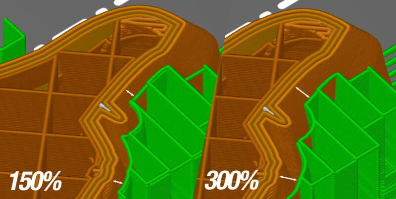

#### *Ne pas supporter les ponts*

Cette option, empêche la génération de supports sous les ponts.

#### *Synchroniser avec les couches de l'objet*

Les supports seront imprimés à des hauteurs de couche égales au modèle lui-même. Ceci est utile avec les imprimantes multi-matériaux, où le changement d'extrudeur est coûteux.

### Options pour l’interface des supports

#### *Motif*
- ***[Rectiligne](../pattern/pattern_rectilinear.md)*** : par défaut, généralement le plus facile à supprimer
- ***[Monotone](../pattern/pattern_monotonic.md)***  : Comme rectiligne mais en remplissage continue
- ***[Concentrique](../pattern/pattern_concentric.md)*** : Concentrique
- ***[Concentrique Remplit](../pattern/pattern_concentricgapfill.md)*** : Concentrique avec remplissage des espaces
- ***[Courbe de Hilbert](../pattern/pattern_hilbertcurve.md)*** : Courbe de Hilbert
- ***[Dent de scie](../pattern/pattern_sawtooth.md)*** : Motif en dent de scie
- ***[Lissage](../pattern/pattern_smooth.md)*** : Permet de réaliser un lissage de la dernière couche.

#### *Couches d'interface*

Les couches d'interface forment une surface plus uniforme entre l'objet et les supports. Celles-ci sont de préférence définies sur un motif beaucoup plus dense que les couches normales de support afin que vous puissiez à la fois maximiser la surface du support en contact avec le modèle pour éviter l'affaissement tout en minimisant le temps d'impression et le matériau utilisé avec un espacement de motif de support plus grand.

Cette option permet de définir le nombre de couches d'interface à insérer entre le(s) objet(s) et les supports.

#### *Espacement du motif d’interface*

Espacement entre les lignes des motifs d’interface.

Mettre à zéro pour obtenir des motifs d’interface pleins.

#### *Boucles d’interface*

Recouvrir la couche de contact supérieure des supports avec des boucles.  Va créer des boucles autour du modèle.

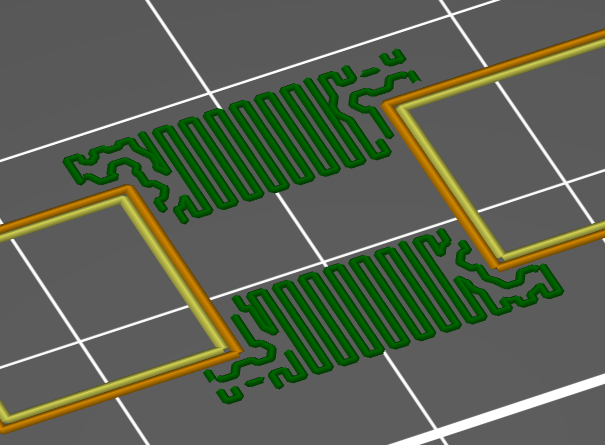

Désactivé par défaut.

## Vitesse

Section de réglage des vitesses dans le logiciel.

 

### Vitesse pour les déplacements d’impression

#### *Périmètres*

Vitesse pour les périmètres (contours, parois verticales). Réglez sur zéro pour un ajustement automatique.

#### *Périmètres courts*

Ce réglage distinct affectera la vitesse des périmètres extérieurs (ceux qui sont visibles). Si cette valeur est exprimée en pourcentage (par exemple : 80%) elle sera calculée d'après le réglage de la vitesse de périmètre susmentionnée. Réglez sur zéro pour un ajustement automatique.

#### *Périmètres externes*

Ce réglage distinct affectera la vitesse des périmètres extérieurs (ceux qui sont visibles). Si cette valeur est exprimée en pourcentage (par exemple : 80%) elle sera calculée d'après le réglage de la vitesse de périmètre susmentionnée. Réglez sur zéro pour un ajustement automatique.

#### *Remplissage*

Vitesse pour imprimer le remplissage interne. Réglez sur zéro pour un ajustement automatique.

#### *Remplissage couche pleine*

Vitesse pour imprimer des zones pleines (supérieures/inférieures/parois horizontales internes). Peut être exprimée en pourcentage (par exemple: 80%) de la vitesse de remplissage par défaut susmentionnée. Réglez sur zéro pour un ajustement automatique.

#### *Remplissage supérieur*

Vitesse pour imprimer les couches pleines supérieures (ne s'applique qu'aux couches externes les plus hautes et pas aux couches internes pleines). Vous voudrez peut-être abaisser cette vitesse afin d'avoir une finition de surface plus nette. Peut être exprimé en pourcentage (par exemple: 80%) de la vitesse de remplissage plein susmentionnée. Réglez sur zéro pour un ajustement automatique.

#### *Supports*

Vitesse d'impression du support.

#### *Interface de supports*

Vitesse d'impression des couches d'interface des supports. Si exprimée en pourcentage (par exemple 50%), elle sera calculée à partir de la vitesse d'impression des supports.

#### *Ponts*

Vitesse d'impression des ponts.

#### *Remplissage des trous*

Vitesse pour combler de petits interstices avec de courts mouvements en zigzag. Gardez un réglage relativement lent afin d'éviter les problèmes de vibration et de résonance. Réglez sur zéro pour désactiver le remplissage d'interstices.

#### *Lissage*

Vitesse du lissage, pour être active l’option de lissage des couches supérieures doit être active.

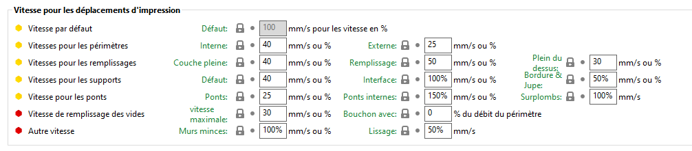 

Vitesse pour les déplacements d’impression.

Note : Si vous fixez une vitesse à 0 cela revient à désactiver la fonction. Exemple 0 pour la vitesse de remplissage des trous enlève le remplissage des trous

### Vitesse pour les déplacements sans impression

**Vitesse de déplacement :** Vitesse pour les déplacements (trajet entre deux points d'extrusion distants).

Possibilité de définir la vitesse pour les axes **X/Y** et **Z** différencié.

### Modificateurs

##### *Vitesse de la première couche*

Si exprimée avec une valeur absolue en mm/s, cette vitesse sera appliquée à tous les déplacements d'impression de la première couche, quel que soit leur type. Si exprimée comme un pourcentage (par exemple 40%), cela modulera la vitesse par défaut.

##### *Remplissage* 

Si elle est exprimée en valeur absolue en mm/s, cette vitesse sera appliquée aux déplacements du remplissage déplacements de la première couche, elle peut être écrasée par la vitesse 'par défaut' (remplissage pleine ou remplissage si pas de fond) si elle est inférieure à cette vitesse. Si elle est exprimée en pourcentage (par exemple : 40%), elle mettra à l'échelle la vitesse de remplissage actuelle.

##### *Petite vitesse périphérique *

Ces paramètres permettent de définir la notion de petit périmètre.

##### *Longueur minimale*

Cela fixe le seuil de la petite longueur périmétrique. Chaque boucle dont la longueur inférieure à cela sera imprimée à une vitesse de petit périmètre.

Peut être exprimé mm ou un % du diamètre de la buse.

##### *Longueur maximale*

Cela fixe la fin du seuil de la petite longueur périmétrique. Chaque boucle de périmètre inférieure à cela verra sa vitesse réduite un peu, de leur vitesse normale à cette longueur jusqu'à la vitesse du petit périmètre.

Peut être exprimé en mm ou un % du diamètre de la buse.

##### *Vitesse*

**Ce réglage distinct affectera la vitesse des périmètre ayant un rayon <= 6.5mm (les trous habituellement). Si cette valeur est exprimée en pourcentage (par exemple: 80%) elle sera calculée d'après le réglage de la vitesse de périmètre susmentionnée.**

Réglez sur zéro pour un ajustement automatique.

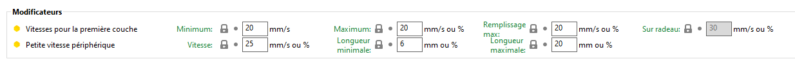

### Contrôle de l’accélération (avancé)

##### *Périmètres*

Permet de définir l'accélération qui sera utilisée par votre imprimante pour les périmètres. Régler sur zéro pour désactiver l'accélération pour les périmètres.

##### *Remplissage*

Il s'agit de l'accélération que votre imprimante utilisera pour le remplissage. Régler sur zéro afin de désactiver le contrôle de l'accélération pour le remplissage.

##### *Ponts*

L'accélération qui sera utilisée par votre imprimante pour les ponts. Régler sur zéro pour désactiver l'accélération pour les ponts.

##### *Première couche*

L'accélération que l'imprimante utilisera pour la première couche. Régler sur zéro afin de désactiver le contrôle de l'accélération pour la première couche.

##### *Défaut*

Accélération à laquelle votre imprimante sera réinitialisée suite à une modification de l'accélération des fonctions spécifiques (périmètre/remplissage). Régler sur zéro pour ne pas réinitialiser l'accélération.

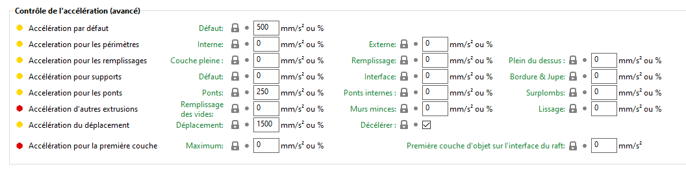 

### Vitesse automatique (avancé)

#### *Vitesse d’impression maximale*

Lorsque vous réglez les autres vitesses à 0, SuperSlicer calculera automatiquement la vitesse optimale de façon à garder une pression constante dans l'extrudeur. Cette fonction expérimentale est utilisée pour régler la plus haute vitesse que vous souhaitez autoriser.

#### *Vitesse volumétrique maximale*

Le **réglage de la vitesse volumétrique maximale (MVS)** est l'une des **fonctionnalités les plus puissantes de SuperSlicer**. Le paramètre MVS crée essentiellement un gestionnaire pour la quantité maximale de filament que SuperSlicer tentera de faire passer à travers la hotend de votre imprimante 3D.

Cela donne aux utilisateurs de SuperSlicer un **énorme avantage**. Plutôt que d'essayer de calculer une plage de vitesses pour des combinaisons de différentes tailles de buses, hauteurs de couche ou largeurs d'extrusion, vous pouvez simplement spécifier les vitesses et les paramètres souhaités, puis laisser le MVS réguler les vitesses au moment du découpage et seulement si nécessaire.

Vitesse volumétrique maximale = Hauteur de couche x Largeur d'extrusion x Vitesse

Des valeurs MVS indépendantes peuvent être définies dans **Réglages d'impression** et **Réglages de filament**. Dans votre profil d'impression, vous aurez généralement une valeur par défaut globale basée sur votre hotend. Dans les profils de filament, vous pouvez ajuster le MVS selon vos besoins pour tenir compte des caractéristiques du filament, par exemple le diminuer pour les filaments FLEX (vous n'aurez donc pas à créer un nouveau profil d'impression pour les filaments flexibles, juste un profil de filament).

Réglez le MVS sur **zéro** (0) pour **n'avoir aucune limite**.

Le MVS est parfois appelé vitesse automatique.

#### *Le MVS dans les Réglages d'impression*

**Réglages d'impression - Vitesse - Vitesse volumétrique maximale** (Mode expert)

Cette valeur définit la vitesse volumétrique maximale globale. Même si vous réglez le MVS à une valeur supérieure dans les paramètres de filament, il ne dépassera jamais cette valeur.

#### *Le MVS dans les Réglages du filament*
**Réglages du filament - Avancé - Vitesse volumétrique maximale** (Mode avancé) 

Cette valeur est limitée par le MVS défini dans les Réglages d'impression, vous pouvez toutefois l'outrepasser avec une valeur inférieure.

La plupart du temps, ni les vitesses linéaires ni la vitesse volumétrique maximale ne sont importantes pour les petites impressions. La buse n'atteint jamais sa vitesse maximale et passe la plupart du temps à accélérer et à ralentir à des vitesses inférieures. C'est lorsque vous commencez à faire des pièces plus grandes ou à vous déplacer rapidement pour des choses comme le remplissage que cela compte. "Obéir à la limite de vitesse" avec le paramètre de vitesse volumétrique maximale évite les clics et les blocages de l'extrudeur qui peuvent provoquer un désastre à mi-chemin d'une impression de grande taille.

#### *Choix du MVS*

##### *Filaments*

Différents matériaux de filament ont des caractéristiques différentes. La viscosité, la rigidité et d'autres facteurs peuvent réduire considérablement le débit effectif.

Exemples :

|**Filament**|**Vitesse volumétrique maximale (environ)**|
| :-: | :-: |
|**PLA**|15|
|**ASA/ABS**|11|
|**PETG**|8|
|**BVOH/PVA (supports solubles)**|4|
|**FLEX (TPU/TPE)**|1-2.5|

##### *Hotends*

La vitesse volumétrique maximale globale que vous devez utiliser dépend de votre hotend. Par exemple, la hotend E3D V6 livrée avec l'Original Prusa i3 MK3/S est annoncée avec un taux de 15 mm3/s. Une valeur sécuritaire qui laisse un peu de place pour une configuration imparfaite (tension de la roue libre, buse légèrement bouchée) de 11,5 mm3/s est réaliste.

Si vous devez pousser plus de filament, une hotend plus puissante sera nécessaire. La hotend Volcano d'E3D augmente ce paramètre à environ 25 mm3/s mais nécessite la modification de l'imprimante et du firmware. D'autres types de hotend permettent des débits encore plus élevés.

##### *Diamètre de la buse*

Intuitivement, il peut sembler que le diamètre de la buse ne devrait pas affecter la quantité maximale de plastique que la hotend peut chauffer dans un laps de temps donné. Cependant, **avec des buses plus larges, vous pouvez augmenter légèrement le MVS** en raison d'une résistance mécanique plus faible - en gros, il est un peu plus facile pour le filament de passer à travers la buse.

Et vice-versa, avec des buses plus fines, vous devrez diminuer un peu le MVS. 

Avec des buses plus larges, envisagez d'augmenter la température de la buse pour permettre un MVS encore plus grand. Par exemple, vous pouvez imprimer du PLA 10-20 °C plus chaud que notre profil standard lorsque vous utilisez une buse de 0,6 mm.

**L'impression avec une buse de grand diamètre et une hauteur de couche élevée permet-elle de gagner du temps d'impression ?**

C'est une conséquence souvent négligée du MVS. Lorsque vous utilisez une buse de grand diamètre et une hauteur de couche très élevée, par exemple une buse de 0,8 mm et une hauteur de couche de 0,5 mm, **votre vitesse d'impression va en effet être plafonnée par le MVS**. Cela est inutile à moins que vous n'installiez une hotend plus puissante sur votre imprimante. Si vous remarquez dans l'aperçu que votre vitesse est limitée par le MVS, vous pouvez essayer d'augmenter la température de la buse et d'augmenter légèrement le MVS. Cependant, il peut être temps de simplement abaisser la hauteur de la couche, vous obtiendrez plus de détails sans augmenter le temps d'impression car l'imprimante pourra imprimer plus rapidement.

#### *Aperçu du MVS*

Une fois que vous avez découpé votre modèle, vous pouvez basculer le mode d'aperçu sur *Débit volumétrique* en utilisant la case de sélection dans le coin inférieur gauche.

Sur les modèles plus petits, vous remarquerez que vous n'êtes pas du tout limité par le MVS. De même, si vous imprimez avec une faible hauteur de couche, vous ne serez probablement pas limité par le MVS. 

En revanche, lors de l'impression de modèles plus grands avec des hauteurs de couche élevées, vous pouvez remarquer que la vitesse est limitée par le MVS, en particulier lors de l'impression du remplissage. Si la majorité de votre modèle est imprimée plus lentement en raison de la limite du MVS, pensez à réduire la hauteur de la couche, vous obtiendrez plus de détails "gratuitement".

## Largeur et Débit

### Largeur d’extrusion

Ce paramètre permet de régler une valeur non-nulle pour définir manuellement la largeur d’extrusion. Si la valeur reste sur zéro, SuperSlicer calcule la largeur d’extrusion en se basant sur le diamètre de la buse. Si la valeur est exprimée en pourcentage (par exemple : 230%), elle sera calculée par rapport à la hauteur de couche.

### Espacement

L’espacement est une solution alternative de définition de la largeur de ligne. Vous pouvez spécifier soit l’un ou l’autre des paramètres. En modifiant dans une case l’autre valeur sera calculée automatiquement et vice et versa.

Le paramètre Espacement permet de régler une valeur non-nulle pour définir manuellement l’espacement entre les cordons. Si la valeur est exprimée en pourcentage, elle sera calculée par rapport à la hauteur de couche. Le Schéma suivant permet d’illustrer la différence entre Largeur et Espacement. Si le recouvrement du périmètre est fixé à 100%, les zones jaunes doivent être remplies par le chevauchement. Si le chevauchement est à 0% Largeur = espacement.

Si vous choisissez d’exprimer les valeurs en pourcentage alors le pourcentage sera utilisé dans les 2 types de spécifications.

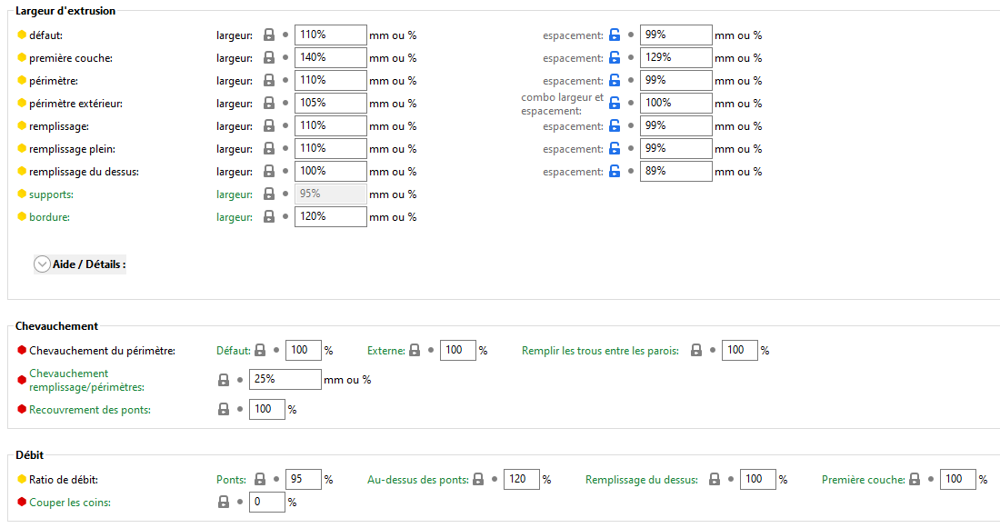

### Largeur d’extrusion

#### *Largeur d’extrusion par défaut*

Réglez ce paramètre sur une valeur non-nulle pour définir manuellement la largeur d’extrusion. Si la valeur reste sur zéro, SuperSlicer calcule la largeur d’extrusion en se basant sur le diamètre de la buse (voir l’info-bulle concernant la largeur d’extrusion du périmètre, la largeur d’extrusion du remplissage, etc…). Si la valeur est exprimée en pourcentage (par exemple : 230%), elle sera calculée par rapport à la hauteur de couche.

#### *Première couche*

Réglez ce paramètre sur une valeur non-nulle pour définir manuellement la largeur d’extrusion pour la première couche. Vous pouvez procéder ainsi pour obtenir des extrudats plus épais afin d’avoir une meilleure adhérence. Si la valeur est exprimée en pourcentage (par exemple : 120%), elle sera calculée par rapport à la hauteur de la première couche. Si elle est réglée sur zéro, elle utilisera la largeur d’extrusion par défaut.

#### *Périmètre*

Réglez ce paramètre sur une valeur non-nulle pour définir manuellement une largeur d’extrusion pour les périmètres. Vous voudrez peut-être utiliser des extrudats plus fin pour obtenir des surfaces plus nettes. Si la valeur reste sur zéro, la largeur d’extrusion par défaut sera utilisée si définie, sinon la valeur 1.125 x diamètre de la buse sera utilisée. Si la valeur est exprimée en pourcentage (par exemple : 200%), elle sera calculée par rapport à la hauteur de couche.

#### *Périmètre extérieure*

Réglez ce paramètre sur une valeur non-nulle pour définir manuellement la largeur d’extrusion pour les périmètres extérieurs. Si la valeur reste sur zéro, la largeur d’extrusion par défaut sera utilisée si définie, sinon la valeur 1.125 x diamètre de la buse sera utilisée. Si la valeur est exprimée en pourcentage (par exemple : 200%), elle sera calculée par rapport à la hauteur de couche.

#### *Remplissage*

Réglez ce paramètre sur une valeur non-nulle pour définir manuellement la largeur d’extrusion pour le remplissage. Si la valeur reste sur zéro, la largeur d’extrusion par défaut sera utilisée si définie, sinon la valeur 1.125 x diamètre de la buse sera utilisée. Vous voudrez peut-être utiliser des extrudats plus épais pour accélérer le remplissage et rendre vos pièces plus solides. Si la valeur est exprimée en pourcentage (par exemple : 90%), elle sera calculée par rapport à la hauteur de couche.

#### *Remplissage plein*

Réglez ce paramètre sur une valeur non-nulle pour définir manuellement la largeur d’extrusion pour le remplissage ou les surfaces pleines. Si la valeur reste sur zéro, la largeur d’extrusion par défaut sera utilisée si définie, sinon la valeur 1.125 x diamètre de la buse sera utilisée. Si la valeur est exprimée en pourcentage (par exemple : 90%), elle sera calculée par rapport à la hauteur de couche.

#### *Remplissage supérieur*

Réglez ce paramètre sur une valeur non-nulle pour définir manuellement la largeur d’extrusion pour le remplissage ou les surfaces supérieures. Vous voudrez peut-être utiliser des extrudats plus fins pour remplir les zones les plus étroites et obtenir des finitions plus lisses. Si la valeur reste sur zéro, la largeur d’extrusion par défaut sera utilisée si définie, sinon le diamètre de la buse sera utilisé. Si la valeur est exprimée en pourcentage (par exemple : 90%), elle sera calculée par rapport à la hauteur de couche.

#### *Supports*

Réglez ce paramètre sur une valeur non-nulle pour définir manuellement la largeur d’extrusion pour les supports. Si la valeur reste sur zéro, la largeur d’extrusion par défaut sera utilisée si définie, sinon le diamètre de la buse sera utilisé. Si la valeur est exprimée en pourcentage (par exemple : 90%), elle sera calculée par rapport à la hauteur de couche.

Pour limiter la résistance des supports et faciliter leurs enlèvement il est possible de paramétrer une largeur d’extrusion plus faible pour les supports afin de les rendre plus fragile.

#### *Bordure*

Largeur horizontale de la bordure qui sera imprimée autour de chaque objet. Si la valeur est laissée à zéro les paramètres de la première couche seront utilisés pour définir les largeurs d’extrusion sur la bordure.

### Chevauchement

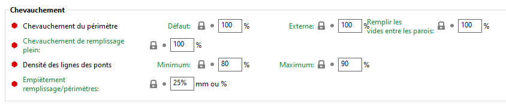

#### *Chevauchement du périmètre*

Ce paramètre par **Défaut** vous permet de réduire le chevauchement entre les périmètres, pour réduire l'impact des artefacts des périmètres. 100% signifie qu'aucun espace n'est laissé, et 0% signifie que les périmètres ne se touchent plus.

##### *Externe*

Ce paramètre vous permet de réduire le chevauchement entre les périmètres et le contour externe, afin de réduire l'impact des artefacts des périmètres. 100% signifie qu'aucun vide n'est laissé, et 0% signifie que le périmètre externe ne contribue pas au chevauchement avec le périmètre interne.

##### *Remplir les trous entre les parois*

Ce paramètre vous permet de réduire le chevauchement entre les périmètres et le remplissage de l'espace. 100% signifie qu'aucun espace n'est laissé, et 0% signifie que le remplissage des espaces ne touchera pas les périmètres.

#### *Chevauchement remplissage/périmètres*

Cette option applique un chevauchement supplémentaire entre les périmètres et le remplissage pour une meilleur fusion. En théorie, cela ne devrait pas être nécessaire, mais le jeu mécanique peut générer des espacements. Si exprimé en pourcentage (par exemple 15%), la valeur sera calculée en fonction de la largeur d'extrusion du périmètre.

  

Chevauchement à 25% à gauche, 50% à droite.

#### *Recouvrement des ponts*

Quantité de chevauchement entre les lignes du pont. Si vous voulez plus d'espace entre les lignes (ou moins), vous pouvez le modifier. La valeur par défaut est de 100%. Une valeur de 50% créer deux fois moins de lignes.

### Débit

#### *Ratio de débit pour les ponts*

Ce facteur affecte la quantité de plastique utilisée pour les ponts. Vous pouvez le diminuer légèrement pour éviter l'affaissement. La valeur par défaut est généralement suffisante et vous devriez expérimenter le refroidissement (utiliser un ventilateur) avant de modifier ceci.

 

#### *Ratio de débit Au-dessus des ponts*

Ratio de débit permettant de compenser les lacunes des couches au dessus des ponts. Utilisé pour l'étirage du motif de remplissage pour éviter les régions où la passe à faible débit ne permet pas fournir une surface lisse en raison d'un manque de plastique. Vous pouvez l'augmenter légèrement pour obtenir la couche supérieure à la bonne hauteur. 

> Maximum recommandé : 120%.

#### *Ratio de débit Remplissage du dessus*

Vous pouvez augmenter cela pour sur-extruder sur la couche supérieure s'il n'y a pas assez de plastique pour faire un bon remplissage.

#### *Ratio de débit Première couche*

Vous pouvez augmenter ce paramètre pour sur-extruder sur la première couche s'il n'y a pas assez de plastique parce que votre plateau n'est pas nivelé.

Note : N'UTILISEZ PAS CECI si votre seul problème est le nivellement du plateau, NIVELEZ VOTRE PLATEAU ! N'utilisez ce paramètre qu'en dernier recours, après l'échec de tous les calibrages.

#### *Couper les coins*
Activez cette option pour modifier le débit afin de reconnaître que la buse est ronde et que les coins auront une forme ronde, et donc de modifier le débit pour réaliser cela et éviter la surextrusion. 100% est activé, 0% est désactivé et 50% est semi-activé.

Note : A 100%, cela change le débit de ~5% sur une très petite distance (~diamètre de la buse), donc cela ne devrait pas être perceptible à moins que vous ayez une très grande buse et une imprimante très précise.

## Extrudeurs multiples

### Extrudeuses

Définition des extrudeuses à utiliser pour la création des différentes parties de l’impression.

#### *Extrudeur pour les périmètres*

L'extrudeuse à utiliser pour imprimer les périmètres et la jupe. La première extrudeuse a le numéro 1.

#### *Extrudeur pour le remplissage*

L'extrudeuse à utiliser pour imprimer le remplissage.

#### *Extrudeur pour le remplissage plein*

L'extrudeuse à utiliser pour imprimer les remplissages pleins.

#### *Extrudeur pour support/radeau/jupe*

L'extrudeuse à utiliser pour imprimer des supports, du radeau ou des contours (1+,0 pour utiliser l'extrudeur actuel et limiter les changements de filament).

#### *Extrudeur pour l’interface des supports/du radeau*

L'extrudeur à utiliser pour imprimer les intercalaires du support (1+,0 pour utiliser l'extrudeur actuel et limiter les changements d'outil). Cela affecte également le raft.

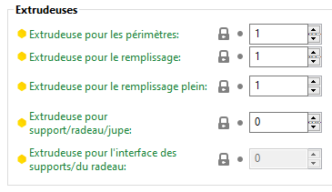

### Prévention des coulures

#### *Activer*

Cette option abaissera la température des extrudeurs inutilisés pour prévenir le oozing (suintement). Cela active automatiquement la génération d'une grande bordure et le déplacement des extrudeurs hors de cette bordure lors des changements de température.

#### *Variation de température*

Différence de température devant être appliquée quand un extrudeur n'est pas actif. Permet la génération d'un contour complet "sacrificiel" sur lequel les buses sont nettoyées régulièrement.

### Tour de purge

#### *Activer*

Les imprimantes multi-matériaux peuvent avoir besoin de préparer ou de purger leurs extrudeurs lors d'un changement d'outil. Extruder le matériau en excès dans la tour de purge.

Attention l’activation de la tour de purge n’est pas possible en mode ***Compléter les objets individuels*** dans la section : ***Option de sortie*** :

#### *Position de la tour de purge X & Y*

Coordonnées X et Y du coin avant gauche d'une tour de purge

#### *Largeur du bord de la tour de purge*

Peut être exprimée en mm ou en % du (supposée) diamètre de buse.

#### *Largeur*

Largeur d'une tour de purge. La longueur sera elle fonction du volume de purge à utiliser.

#### *Angle de rotation de la tour de purge*

Angle de rotation de la tour de purge par rapport à l'axe X.

Il est à noter qu’il est aussi très facile de repositionner et orienter la tour de purge depuis l’interface graphique. 

#### *Distance maximale de pont*

Distance maximale entre les supports sur les sections de remplissage épars.

Dans le cas où les couches de la tour de purge ne sont là que pour maintenir le niveau d’impression, les couches de la tour ne sont pas pleines et un cadrillage permet simplement de garantir une stabilité et un support pour les futurs couches pleines. Dans ce cas le distance entre le quadrillage et piloté par ce paramètre appelé ***Distance maximale de pont.***

#### *Sans couches dispersées (EXPERIMENTAL)*

Si elle est activée, la tour de purge ne sera pas imprimée sur des couches sans changement de filament. Sur les couches avec un changement de filament, l'extrudeur se déplacera vers le bas pour imprimer la tour de purge. C'est à l'utilisateur de s'assurer qu'il n'y a pas de collision avec l'impression.

#### *Préparer toutes les extrudeuses d’impression*

Si l'option est activé, tous les extrudeurs qui impriment seront amorcés sur l’avant du plateau d’impression au début de l'impression.

### Avancé

#### *Création d’interface entre coques*

Force la génération de coques pleines entre des volumes/matériaux adjacents. Utile pour des impressions multi-extrudeurs avec des matériaux translucides ou avec un support manuel soluble.

 

A gauche l’option n’est pas activée / A droite option coque d’interface activée.

## Options de sortie

### Plateau

#### *Distance entre les objets*

Distance utilisée par la fonction d'agencement automatique du plateau. Pour définir la distance à respecter entre les objets placés sur le plateau d’impression.

### Impression séquentielle

Lorsque vous imprimez plusieurs objets à la fois, vous pouvez choisir de les réaliser séquentiellement, un par un. Cela peut minimiser les coulures et la création de fils se créant entre les impressions. Cela peut également éviter de perdre plusieurs impressions semi-achevées si l'un des objets se détache du plateau d'impression.

Vous pouvez activer cette fonction en activant **Réglages d'impression - Options de sortie - [Compléter les objets individuels](../variable/complete_objects.md)**.

Appuyez sur la touche  **E**  pour voir l'**ordre des objets** dans la vue 3D.

Vous pouvez modifier l'ordre en faisant un **glisser-déposer** des objets dans la **Liste des objets**. L'objet le plus haut dans la liste d'objets sera imprimé en premier, le dernier en bas.

Vous devrez **surveiller régulièrement l'imprimante,** avec chaque objet, il est possible que la pièce spécifique ne colle pas au plateau d'impression.

Avec l'impression séquentielle, il existe un **risque de collisions** entre la tête d'impression et l'une des impressions achevées ou entre l'axe X et l'une des impressions achevées.

SuperSlicer essaiera de vous avertir de tels cas, mais même si vous ne recevez aucun avertissement, vous devriez essayer d'éviter autant que possible les collisions éventuelles.

#### *[Tri des objets](../variable/complete_objects_sort.md)*

Lorsque vous imprimez plusieurs objets ou copies les uns après les autres, cela vous aidera à choisir l'ordre dans lequel ils seront imprimés.

- **Panneau de droite** les triera selon l'ordre des objets indiqué dans le panneau à droite de l'écran.
- **Le plus bas Y** les triera en fonction de leur point Y le plus bas. Utile pour les imprimantes avec une barre X.
- **Le plus bas Z** les triera par leur hauteur, utile pour les imprimantes delta.
- 
#### *[N’autoriser qu’une seule boucle de bordure](../variable/complete_objects_one_skirt.md)*

Lorsque vous utilisez ***'Compléter les objets individuels'***, le comportement par défaut est de dessiner la bordure autour de chaque objet. Si vous préférez n'avoir qu'une seule bordure pour l’impression entière, utilisez cette option.

Pour aider SuperSlicer à détecter les collisions, spécifiez les paramètres **Dégagement de l'extrudeuse :**

#### *[Rayon](../variable/extruder_clearance_radius.md)*

Le rayon de dégagement cylindrique autour de l'extrudeuse.

#### *[Hauteur](../variable/extruder_clearance_height.md)*

La distance verticale entre la pointe de la buse et les tiges de l'axe X (ou la pièce la plus basse qui peut interférer avec une impression finie).

SuperSlicer veut **que tous les objets doivent être inférieurs à la hauteur de dégagement de l'extrudeur, sauf le dernier objet**, qui peut être aussi grand que le Z max de l'imprimante.

### Fichier de sortie

#### *G-code commenté*

Activez ceci pour obtenir un fichier G-code commenté, avec chaque ligne expliquée par un texte descriptif. Si vous imprimez depuis une carte SD, le poids supplémentaire du fichier pourrait ralentir le firmware de votre imprimante.

#### *Marquer les objets*

Activez cette option pour ajouter des commentaires dans le G-code afin d'identifier les mouvements d'impression avec l'objet concerné. Cela est utile pour le plugin Octoprint CancelObject. Ce paramètre n'est **PAS** compatible avec la configuration mono-extrudeur multi-matériaux ni avec la configuration ***Purger dans l'objet*** ou ***Purger dans le remplissage***.

#### *Format du nom de fichier de sortie*

Vous pouvez utiliser toutes les options de configuration comme variables dans ce modèle. Par exemple : [layer_height], [fill_density] etc. Vous pouvez aussi utiliser [timestamp], [year], [month], [day], [hour], [minute], [second], [version], [input_filename], [input_filename_base].

### Fraisage de post-traitement

#### *Post_traitement par fraisage*

Si cette option est activée, à la fin de chaque couche, l'imprimante utilisera une tête de fraisage pour fraiser les périmètres externes.

Vous devez définir la ***Taille XY supplémentaire de fraisage*** sur une valeur suffisamment élevée pour avoir suffisamment de plastique à fraiser. Assurez-vous également que votre pièce est fermement collée sur le plateau.

#### *Taille XY supplémentaire de fraisage*

Cela augmente la taille de l'objet d'une certaine quantité pour avoir assez de plastique à fraiser. Vous pouvez définir un nombre de mm ou un pourcentage de la largeur supplémentaire optimale calculée (à partir du calcul du flux).

#### *Fraisage seulement après*

Ce paramètre limite le fraisage post-processus à une certaine hauteur, pour éviter de fraiser le plateau. 
Cela peut être exprimé en mm ou un % de la hauteur de la première couche (cela peut donc dépendre de l'objet).

#### *Vitesse de fraisage*

Vitesse de l’outil de fraisage.

### *[Scripts de post-traitement](post_process.md)*

Si vous voulez traiter le G-code de sortie à l'aide de scripts personnalisés, listez simplement leurs chemins absolus ici. Séparez les divers scripts avec un point-virgule. Les scripts vont recevoir en premier argument le chemin absolu du fichier G-code, et ils peuvent accéder aux réglages de configuration de SuperSlicer en lisant des variables d'environnement.

### Exemple de Post-traitement SuperSlicer G-Code

Ces notes sont basées sur mes expériences avec les imprimantes Ender 3 de Creality. Si vous utilisez une autre imprimante, veuillez vérifier que les détails du fonctionnement sont similaires.

Il y a certaines choses que SuperSlicer ne fait tout simplement pas. La possibilité de modifier automatiquement le G-code est fournie par des scripts de post-traitement. Les scripts peuvent être écrits dans différents langages, mais vous êtes responsable de l'installation et de la configuration du langage de programmation et des fichiers de support sur votre système.

Dans cette exemple le code M73 généré par SuperSlicer pour indiquer le temps d’impression restant, sera changé en mode **M117** pour un affichage sur l’écran LCD d’une imprimante Creality.

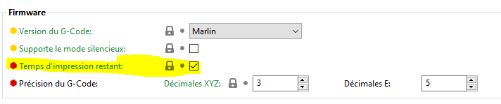 

Nous allons retrouver ci-après le listing d’un script de 32 lignes de post-traitement pour changer le code M73 d’impression du temps restant en M117 pour machine Creality.

Il est à noter que ces scripts doivent traiter la récupération du nom du fichier G-Code généré, passé en premier argument par SuperSlicer :

	sourceFile=sys.argv[1]

	1	#!/usr/bin/python
	2	import sys
	3	import re
	4	import os
	5	import os.path
	6	from os import path
	7		
	8	sourceFile=sys.argv[1] 
	9
	10	# Read the ENTIRE g-code file into memory 
	11	with open(sourceFile, "r") as f: 
	12		lines = f.readlines() 
	13
	14	destFile = re.sub('\.gcode$','',sourceFile) 
	15	tempFile = destFile+".bak" 
	16	if path.exists(tempFile): 
	17		os.remove(tempFile) 
	18	os.rename(sourceFile,destFile+".bak") 
	19	destFile = re.sub('\.gcode$','',sourceFile) 
	20	destFile = destFile + '.gcode'
	21
	22	with open(destFile, "w") as of: 
	23		for lIndex in range(len(lines)): 
	24			oline = lines[lIndex] 
	25			if oline[:3] == "M73": 
	26				tempLine = oline.replace(" R", " min ") 
	27				tempLine = tempLine.replace("M73 P", "M117 %") 
	28				of.write(tempLine) 
	29			else: 
	30				of.write(oline) 
	31	of.close()
	32	f.close()

Précisez le chemin d'accès au script dans la partie **[Scripts de post-traitement](post_process.md)**

_**Attention dans le cas de script Python, il est nécessaire d’indiquer le chemin complet à la console Python**_. 

Pour les scripts Python, l’interpréteur Python peut être téléchargé à l’adresse suivante : <https://www.python.org/downloads/> .

## Remarques

Vous pouvez inscrire ici vos commentaires personnels. Ce texte sera ajouté aux commentaires en entête du G-Code.

## Dépendances

**Section à compléter.**

Page suivante [Réglages du filament](../filament_settings/filament_settings.md)

[Retour Page principale](../superslicer.md)
