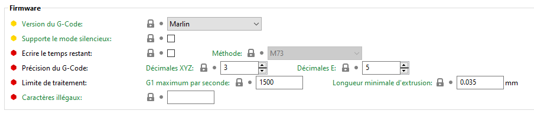
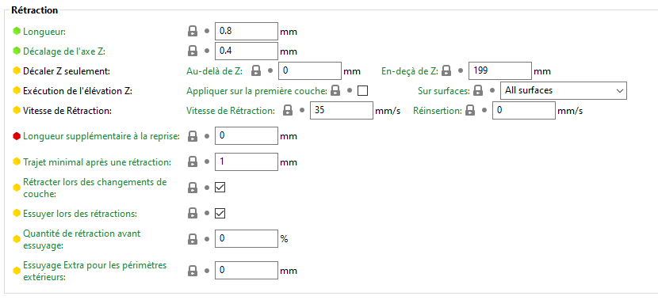
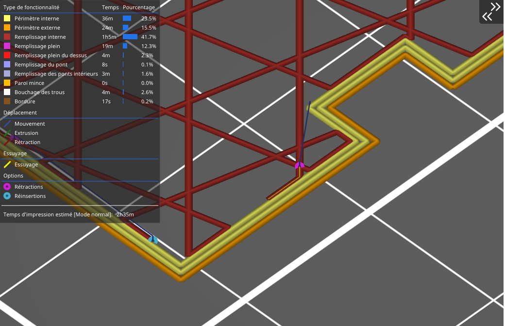
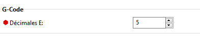

# Réglages de l'Imprimante

## Contenu de la page

* Réglages de l'Imprimante
	* [Textures de plateau SVG et PNG personnalisées](#textures-de-plateau-svg-et-png-personnalisées)
	* [Général](#Général)
	* [G-Code personnalisé](#g-code-personnalisé)
	* [Limites de la machine](#Limites-de-la-machine)
	* [Extrudeuse](#extrudeuse)
	* [Milling](#milling)
	* [Réglage multi-matériaux pour extrudeuse unique](#réglage-multi-matériaux-pour-extrudeuse-unique)
	* [Création de profils pour différentes buses](#création-de-profils-pour-différentes-buses)

* [Retour Page principale](../superslicer.md)

## Textures de plateau SVG et PNG personnalisées

SuperSlicer prend en charge les textures et les modèles de plateau d'impression personnalisés dans les formats **PNG** et **SVG** .

Vous pouvez attribuer un modèle ou une texture personnalisée en sélectionnant **Réglages de l'imprimante - Général (Taille et coordonnées) - Forme du plateau - Appliquer**.

> Le chemin d'accès complet aux fichiers sélectionnés est stocké dans les variables du profil d'impression `bed_custom_texture` et `bed_custom_model`. 

### Exportation de textures SVG depuis Adobe Illustrator

L'analyseur [Nano SVG](https://github.com/memononen/nanosvg), que SuperSlicer utilise, ne prend pas en charge toutes les fonctionnalités du format SVG. Nous suggérons la méthode de travail suivante pour exporter correctement une texture SVG depuis Adobe Illustrator:

1. **Fichier - Exporter - Exporter en tant que**
1. Cochez **Utiliser les plans de travail** pour vous assurer que la taille résultante est correcte
1. Dans la boîte de dialogue **Options SVG** : 
   1. Stylisation - **Style en ligne (le CSS interne n'est PAS pris en charge)**
1. Confirmer avec **OK**

*Exportation de textures SVG depuis Adobe Illustrator*(Image Prusa)

### Performance

Afin d'éviter les problèmes graphiques dus aux textures de plateau d'impression trop détaillées qui ne rentrent pas dans la mémoire du GPU, les stratégies suivantes sont mises en œuvre  pour faire face aux problèmes de mémoire GPU faible :

- La texture du plateau d'impression est pixellisée à une résolution élevée de 8192x8192 pixels uniquement si la carte graphique prend en charge OpenGL 3.0 et plus récent, ou s'il y a un écran Retina connecté à un Mac. Sinon, une texture de plateau d'impression de résolution inférieure de 4096x4096 est pixellisée.
- Si la taille de la RAM détectée est inférieure à 6 Go, la taille de la texture est à nouveau divisée par 2
- La texture du plateau d'impression est compressée avec la [bibliothèque de compression DXT1/DXT5 C temps réel](https://github.com/Cyan4973/RygsDXTc).

En plus de cela, après le démarrage de l'application, une texture de plateau d'impression basse résolution est d'abord chargée dans le GPU, tandis que les résolutions plus élevées sont compressées et envoyées progressivement au CPU au fur et à mesure qu'elles sont prêtes.

## Général

### Taille et coordonnées

#### *[Hauteur maximale d’impression](../variable/max_print_height.md)*

Réglez cette valeur sur la hauteur maximum que peut atteindre votre extrudeur au cours de l'impression.

#### *[Orientation préférée](../variable/init_z_rotate.md)*

Permet de tourner la pièce autour de Z lors de son importation.

#### *[Décalage en Z](../variable/z_offset.md)*

Cette valeur sera ajoutée (ou soustraite) de toutes les coordonnées Z dans le G-Code de sortie. Elle est utilisée pour compenser une mauvaise position de fin de course Z: par exemple si votre fin de course place votre buse à 0.3mm au-dessus du plateau, réglez cette valeur sur -0.3 (ou corrigez votre fin de course).

#### *[Pas entier sur Z](../variable/z_step.md)*

Réglez cette valeur sur la hauteur déplacée lorsque votre moteur Z (ou équivalent) tourne d'un pas. Si votre moteur a besoin de 200 pas pour déplacer votre tête/platine de 1mm, ce champ doit être de 1/200 = 0.005.

Notez que le G-Code écrira les valeurs z avec 6 chiffres après le point si z\_step est activé (c'est 3 chiffres s'il est désactivé).

> Mettez 0 pour désactiver.

#### *[Hauteur min pour les déplacements](../variable/lift_min.md)*

Quand un extrudeur se déplace vers un objet (de la position de départ ou d'un autre), la buse est garantie d'être au moins à cette hauteur.

Ceci permet de s'assurer que si le lit d'impression possède des clips ou d'autres objets fixés dessus, la buse ne les percutera pas. 

Faites tout de même attention qu'il n'y ai rien dans l'enveloppe convexe des objets.

### Fonctionnalités

#### *[Extrudeuses](../variable/extruders_count.md)*

Nombre d'extrudeuses de l'imprimante.

#### *[Extrudeuse unique Multi-matériaux](../variable/single_extruder_multi_material.md)*

L'imprimante multiplexe les filaments vers une seule tête d'extrusion.

L’activation de cette option permet de déverrouiller l’accès aux paramètres de réglage de l’imprimante : ***[Réglage MM pour extrudeur unique](../variable/single_extruder_multi_material.md)***.

#### *[Fraises](../variable/milling_count.md)*

Nombre de tête de fraisage disponible sur la machine. L'activation de ce paramètre va rajouter les paramètres [Milling](#milling) à la liste des options configurable sur la machine.

### Firmware

#### *[Version du G-code](../variable/gcode_flavor.md)*

Certaines commandes G/M-code, y compris le contrôle de la température ainsi que d'autres, ne sont pas universelles. Paramétrez cette option selon le firmware de votre imprimante pour obtenir une sortie compatible. 

L'option "***Aucune d'extrusion***" empêche complètement SuperSlicer d'exporter toute valeur d'extrusion.

#### *[Supporte le mode silencieux](../variable/silent_mode.md)*

Indique que le firmware est compatible avec le mode silencieux. Ce mode permet normalement aux imprimantes d'être un peu plus silencieuses en fonctionnement. Le mode silencieux ne se déplace pas directement plus lentement.  Lorsque l'imprimante est mise en mode silencieux, elle utilise les paramètres d'accélération et de vitesse de la section silencieux du microprogramme (qui correspondent à ceux de la section ***Mode silencieux*** de la configuration de l'imprimante). Ainsi, elle n'atteindra pas les mêmes vitesses puisque l'accélération est plus faible et que le microprogramme limite les vitesses de pointe.  Le mode silencieux fait aussi des choses avec les courants d'entraînement ce qui, je pense, explique pourquoi la détection de collision ne fonctionne pas dans ce mode sur les imprimantes Prusa.

Si vous voulez qu'il soit plus silencieux pendant la nuit, en plus de passer en mode furtif, vous pouvez également réduire la vitesse en utilisant la commande de l'imprimante. Cela peut être fait dans n'importe quel mode et fait partie de son fonctionnement normal.  Il suffit de la ramener à un niveau suffisamment bas pour vous et, le matin, si l'impression se poursuit, de la ramener à 100 %.

#### *[Temps d’impression restant](../variable/remaining_times.md)*

Émet M73 P[pourcentage imprimé] R[temps restant en minutes] à 1 minute d'intervalle dans le G-code afin que le firmware puisse indiquer précisément le temps restant. Jusqu'à présent seul le firmware Prusa i3 MK3 reconnait M73. Par ailleurs le firmware i3 MK3 supporte M73 Qxx Sxx pour le mode silencieux.

##### *[Méthode](../variable/remaining_times_types.md)*

M73: Émet M73 P[pourcentage imprimé] R[temps restant en minutes] à 1 minute d'intervalle dans le G-Code afin que le firmware puisse indiquer précisément le temps restant. Jusqu'à présent seul le firmware Prusa i3 MK3 reconnait M73. Par ailleurs le firmware i3 MK3 supporte M73 Qxx Sxx pour le mode silencieux.

M117: Emet une comande pour afficher un message à l'imprimante, du type 'Time Left .h..m..s'.

#### *Précision du G-Code*

Permet de définir le nombre de chiffres après le point pour les coordonnées **[XYZ](../variable/gcode_precision_xyz.md)** et pour les valeurs de pilotage de l’extrudeur **[E](../variable/gcode_precision_e.md)**.

#### *Limite de traitement*
[G1 maximum par seconde](../variable/max_gcode_per_second.md) : Si votre firmware s'arrête pendant l'impression, il se peut que sa file d'attente de gcode soit pleine. Définissez ce paramètre pour fusionner les extrusions en de plus grandes afin de réduire le nombre de commandes de gcode que l'imprimante doit traiter chaque seconde.

Notez que la réduction de la vitesse d'impression (au moins pour les extrusions externes) réduira le nombre de fois où cela se déclenchera et donc augmentera la qualité.

Une valeur de 150 est typique pour un contrôleur 8 bit.

Mettre zéro pour désactiver.

#### *[Caractères illégaux](../variable/gcode_filename_illegal_char.md)*
Tous les caractères qui sont écrits ici seront remplacés par "_" lors de l'écriture du nom du fichier gcode.

Si le premier caractère est "["" ou "("", alors ce champ sera considéré comme une expression rationnelle regexp (entrez "[^a-zA-Z0-9]" pour utiliser uniquement les caractères ascii).

### Ventilateur de refroidissement

 

#### *Accélération*

***[Temps d’accélération](../variable/fan_speedup_time.md)*** : Permet d'anticiper le démarrage du ventilateur d'au moins ce délai (en secondes, vous pouvez utiliser des décimales).
Il suppose une accélération infinie pour cette estimation de temps et ne prendra en compte que les déplacements G1 et G0. 

> Utilisez 0 pour désactiver.

L’option ***[Uniquement pour les surplombs](../variable/fan_speedup_overhangs.md)***, ne tiendra compte que du délai pour le refroidissement des surplombs.

#### *[Durée de la phase de démarrage](../variable/fan_kickstart.md)*

Ajoutez un M106 S255 (vitesse maximale du ventilateur) pendant ce nombre de secondes avant de passer à la vitesse désirée pour démarrer le ventilateur de refroidissement.

> Réglez à 0 pour désactiver.

#### *[Réglage ventilateur de 0-100](../variable/fan_percentage.md)*

Définissez cette option si votre imprimante utilise des valeurs de contrôle de 0 à 100 au lieu de 0 à 255.

### Vignettes

#### *Taille pour le G-Code*

Tailles de photo à stocker dans un fichier .gcode et .sl1, au format suivant : "XxY, XxY, ..."

#### *Annulation de la couleur*

Appliquer une couleur spécifique aux vignettes. Si ce n'est pas le cas, leur couleur sera celle définie par le filament.

#### *Plateau sur la vignette*

Montrez la texture du plateau sur la vignette.

#### *Vignette à la fin*

Mettre le code des vignettes à la fin du fichier au lieu du début.

Soyez prudent! La plupart des Firmwares l'attendent au début, soyez sûr que votre imprimante le supporte bien.

### Avancé

#### *Utiliser les valeurs de E relatives*

Si votre firmware requiert des valeurs relatives pour E, cochez cette case, sinon laissez-la décochée. La plupart des firmwares utilisent des valeurs absolues.

Valider dans le G-code de départ l’option M83 pour activer le mode d’extrusion relatif.

#### *Utiliser la rétraction du firmware*

Ce réglage expérimental utilise les commandes G10 et G11 pour laisser le firmware gérer la rétraction. Utilisable seulement par les versions récentes de Marlin.

#### *E volumétrique*

Cette fonction expérimentale génère des valeurs de E en millimètres cubiques au lieu de millimètres linéaires. Si votre firmware ne connait pas déjà le diamètre du filament, vous pouvez saisir une commande comme ***'M200 D[filament\_diameter\_0] T0'*** dans votre G-Code de début pour activer le mode volumétrique, et utiliser le diamètre de filament associé au filament choisi dans SuperSlicer. Cette fonction n'est utilisable que dans les versions récentes de Marlin.

#### *Longueur minimale de l’extrusion*

Trop de commandes de déplacement trop petites peuvent surcharger le firmware / la connexion. Mettez une valeur plus élevée ici si vous constatez un ralentissement étrange au niveau de votre imprimante.

> Mettez à 0 pour désactive complètement la gestion de la longueur minimale d’extrusion.

#### *[Activer la fonction de hauteur de couche variable](../variable/variable_layer_height.md)*

Certaines imprimantes ou certains réglages d'imprimante peuvent rencontrer des difficultés pour imprimer avec une hauteur de couche variable. 

Activé par défaut.

## G-Code personnalisé

### Uniquement sur G-Code de démarrage personnalisé

Option pour n’utiliser que le G-Code de démarrage personnalisé.

Permet de s'assurer que le slicer n'ajoutera pas de commandes de chauffage, de ventilateur, d'extrudeuse... avant ou juste après votre G-Code de début. Si vous activez cette option, vous devrez écrire un G-Code de début complet et correct, car aucune vérification ne sera faite.

Il est possible de définir un G-Code personnalisé pour les sections :

#### *[G-Code de début](../variable/start_gcode.md)*

Cette procédure de démarrage est insérée au début, après un G-Code de démarrage de l'imprimante (et après tout changement de filaments vers ce filament, si vous utilisez l'option multi-matériaux).

Elle est utilisée pour remplacer les réglages pour un filament spécifique.

Si Slic3r détecte des commandes M104, M109, M140 ou M190 dans vos codes personnalisés ces commandes ne seront pas ajoutées automatiquement, de cette manière vous pouvez personnaliser la procédure de chauffe et autres actions.

Notez que vous pouvez utiliser des variables génériques pour tous les réglages de Slic3r, donc vous pouvez saisir une commande ***M109 S[first_layer_temperature]*** où vous voulez.

Si vous avez plusieurs extrudeuses, le G-Code sera exécuté dans l'ordre des extrudeuses.

#### *[G-Code de fin](../variable/end_gcode.md)*

Cette procédure de fin est insérée à la fin du fichier de sortie, juste avant le G-Code de fin (et avant tout changement d’extrudeuse de ce filament dans le cas d’imprimantes multi-matériaux).

Notez que vous pouvez utiliser des variables de substitution pour tous les paramètres SuperSlicer. Si vous avez plusieurs extrudeuses, le G-Code est ajouté dans leur ordre.

#### *[G-Code avant changement de couche](../variable/before_layer_gcode.md)*

Ce code personnalisé est inséré à chaque changement de couche, juste avant le mouvement en Z.

Notez que vous pouvez utiliser des variables génériques pour tous les réglages de SuperSlicer de même que [layer_num] et [layer_z].

#### *[G-Code après changement de couche](../variable/layer_gcode.md)*

Ce code personnalisé est inséré à chaque changement de couche, juste après le mouvement Z et avant le déplacement de l'extrudeuse au point de départ de la couche suivante.

Notez que vous pouvez utiliser des variables génériques pour tous les réglages de SuperSlicer de même que [layer_num] et [layer_z].

#### *[G-Code de changement d’extrudeuse](../variable/toolchange_gcode.md)*

Ce code personnalisé est inséré à chaque changement d'extrudeuse. Si vous ne laissez pas ce champ vide, vous devrez vous occuper du code de changement de l’extrudeuse vous-même.

SuperSlicer ne fournira aucun autre code G pour changer le filament.

Vous pouvez utiliser des variables de substitution pour tous les paramètres SuperSlicer, ainsi que pour [previous\_extruder] et [next\_extruder], par exemple.

La commande standard toolchange peut être écrite sous la forme *T [next_extruder].*

**!! Attention !!** Si un quelconque caractère est écrit ici, SuperSlicer n'écrira aucun G-code de changement de buse par lui-même.

#### *[Entre le G-Code des objets (Pour une impression séquentielle)](../variable/between_objects_gcode.md)*

Ce code est inséré entre des objets lorsque vous utilisez l'impression séquentielle. Par défaut la température de l'extrudeuse et du plateau est réinitialisée et utilise la commande sans attente ; toutefois si des commandes M104, M109, M140 ou M190 sont détectées dans ce code personnalisé, SuperSlicer n'ajoutera pas de commandes de température. Notez que vous pouvez utiliser des variables génériques pour tous les réglages de SuperSlicer, donc vous pouvez entrer une commande ***M109S[first_layer_temperature]*** où vous le souhaitez."

#### *[Entre changement G-Code de type d’extrusion](../variable/feature_gcode.md)* 

Ce code personnalisé est inséré à chaque changement de type d'extrusion.

Notez que vous pouvez utiliser des variables de substitution pour tous les paramètres SuperSlicer, ainsi que pour [layer_num], [layer_z] et [extrusion_role] pouvant prendre ces valeurs de chaîne : {Perimeter, ExternalPerimeter, OverhangPerimeter, InternalInfill, SolidInfill, TopSolidInfill, BridgeInfill, GapFill, Skirt, SupportMaterial, SupportMaterialInterface, WipeTower, Mixed}.

Mixed n'est utilisé que lorsque le type de l'extrusion n'est pas unique, pas uniquement dans une catégorie ou n'est pas connu.

#### *[G-Code changement de couleur](../variable/color_change_gcode.md)* 

Ce G-Code sera utilisé comme code pour le changement de couleur.

Valeur par défaut : `M600`

#### *[G-Code de pause d'impression](../variable/pause_print_gcode.md)* 

Ce G-Code sera utilisé comme code pour la pause de l'impression.

Valeur par défaut : `M601`

#### *[Patron de G-Code personnalisé](../variable/template_custom_gcode.md)* 

Ce code G sera utilisé comme un code personnalisé.

## Limites de la machine

### Compensation de l'estimation du temps
Ces paramètres permettent une meilleur prise en compte du calcul du temps d'impression en rajoutant les secondes apportées par certaines actions comme par exemple [La durée de temps de démarrage de la machine](../variable/time_start_gcode.md) ou la [Durée d'un changement d'extrudeur](../variable/time_toolchange.md) 

#### [Côut par heure](../variable/time_cost.md)

Ce paramètre permet de renseigner de combien coûte une heure d'impression, en maintenance, prêt, salaire, etc.

### [Limites de la machine](../variable/machine_limits_usage.md)

Option pour définir comment seront appliquer les limites qui sont définie dans cette section du logiciel. Dans tous les cas, elles seront sauvegardé dans le fichier G-Code.

Attention même si vous utilisez un profil d'impression qui définit une accélération de 5000, si pour votre machine la limite d'accélération est de 4000, le G-Code sorti utilisera la limite de 4000.

* Vous pouvez également l'utiliser comme sauvegarde et pour avoir une meilleure estimation du temps d'impression, option ‘Utiliser pour l'estimation du temps’.
* Option ‘Émettre également les limites dans le G-Code’. Les valeurs seront sauvegardées dans le G-Code, elles permettront une meilleure estimation du temps d'impression et seront écrites en début de fichier G-Code, avec M201, M202 M203, M204 et M205.
* Si vous voulez seulement sauvegarder les valeurs, choisissez l'option ‘Utiliser aussi pour l'estimation du temps’ et écrivez vous-même les limites dans la section G-Code personnalisé.
* L’option ***Utiliser uniquement pour sauvegarde** ne fera qu’écrire les données dans les paramètres sauvegardés du G-Code.
* Émettre également les limites dans le G-Code = emit_to_gcode
* Utiliser pour l'estimation du temps = time_estimate_only
* Utiliser uniquement pour sauvegarde = limits
* Désactiver = ignore

Exemple de code définissant les limites dans le G-Code :

M201 X500 Y500 Z100 E5000 ; sets maximum accelerations, mm/sec^2

M203 X500 Y500 Z10 E60 ; sets maximum feedrates, mm/sec

M204 P500 R1000 T1500 ; sets acceleration (P, T) and retract acceleration (R), mm/sec^2

M205 X8.00 Y8.00 Z0.40 E5.00 ; sets the jerk limits, mm/sec

M205 S0 T0 ; sets the minimum extruding and travel feed rate, mm/sec

#### *Vitesses maximums*

Définition des vitesses maximum pour les axes [X](../variable/machine_max_feedrate_x.md)[Y](../variable/machine_max_feedrate_y.md)[Z](../variable/machine_max_feedrate_z.md) et [E](../variable/machine_max_feedrate_e.md) exprimé en mm/s

#### *Accélérations maximums*

Définition des accélérations maximum pour les axes [X](../variable/machine_max_acceleration_x.md)[Y](../variable/machine_max_acceleration_y.md)[Z](../variable/machine_max_acceleration_z.md) et [E](../variable/machine_max_acceleration_e.md) exprimé en mm/s²

Pour l’axe E (L’extrudeuse) il est aussi possible d’affiner la valeur de l’extrusion maximum en décomposant selon :

Accélération maximum lors de l’extrusion (M204P)

Accélération maximum lors de la rétraction (M204R)

Accélération maximum lors du déplacement (M204T)

#### *Limites de mouvements brusques*

Définition des mouvements brusques (secousses) maximum pour les axes XYZ et E exprimé en mm/s.

Le terme secousse ou ‘jerk’ a été introduit par Marlin. Il y a été conçu comme une solution de contournement du problème inhérent à la tentative de suivre parfaitement un parcours. Comme la buse ne peut pas s'écarter de la trajectoire (en théorie), il faudrait qu'elle décélère à 0 mm/s dans chaque coin. Cela ruinerait votre impression, car la décélération à 0 mm/s provoquerait une sur-extrusion dans chaque coin. Au lieu de cela, Marlin permet un changement instantané du vecteur vitesse dans chaque coin. L'ampleur de ce changement du vecteur vitesse est appelée "saccade".

#### *Vitesses minimums*

Définition des vitesses minimum pour l’extrudeuse E exprimé en mm/s

Il est possible de différencier la ***valeur minimale lors de l’extrusion*** : M205S, de la ***valeur minimale lors en déplacement*** : M205T.

## Extrudeuse

Réglages liés à une extrudeuse. Ces réglages peuvent être multiplié selon le nombre d'extrudeuses définies pour une machine. Le nombre d'extrudeuse par le paramètre [Extrudeuses](../macros/extruders_count.md) dans la section [Fonctionnalités](#fonctionnalités).

### Nom et taille

#### [*Nom extrudeuse*](../variable/tool_name.md)

Utilisé uniquement pour klipper, où vous pouvez nommer l'extrudeuse. S'il n'est pas défini, ce sera '**extruderX**' avec 'X' remplacé par le numéro de l'extrudeuse.

#### [*Diamètre de la buse*](../variable/nozzle_diameter.md)

Il s'agit du diamètre de la buse de votre extrudeur (par exemple: 0.5, 0.35, etc.)

### Limites de hauteur de couche

#### [*Minimum*](../variable/min_layer_height.md)

Cette valeur est la hauteur de couche imprimable minimum pour cet extrudeur et elle limite la résolution pour la hauteur de couche variable. Les valeurs type se situent entre 0.05 mm et 0.1 mm.

#### [*Maximum*](../variable/max_layer_heigh.md)

Ceci est la hauteur de couche imprimable maximum pour cet extrudeur, utilisée pour plafonner la hauteur de couche variable et la hauteur de couche des supports. La hauteur de couche maximum recommandée est 75% de la largeur d'extrusion afin d'obtenir une adhésion inter-couches correcte. 

Si réglée sur 0, la hauteur de couche est limitée à 75% du diamètre de la buse.

SuperSlicer utilise une hauteur de couche variable est différente de la hauteur de couche du modèle ce paramètre est donc très important pour définir les hauteurs de couche qui seront calculés par le logiciel

Les hauteurs de couche sur les supports sont automatiquement gérées par le Slicer et ne sont pas équivalentes à la hauteur de couche pièce. Il est donc important de bien paramétrer les Limites des hauteurs de couche mini et maxi qui pilotent ces hauteurs.

### Décalages (pour les imprimantes multi-extrudeur)

#### [*Décalage de l’extrudeuse*](../variable/extruder_offset.md)

Si le firmware de votre imprimante ne gère pas le décalage de l'extrudeuse, c'est au G-code d'en tenir compte. Cette option vous permet de spécifier le décalage de chaque extrudeuse par rapport à la première. Des valeurs positives sont attendues (elles seront soustraites des coordonnées XY).

#### [*Décalage de la température de l'extrudeuse*](../variable/extruder_temperature_offset.md)

Ce décalage sera ajouté à toutes les températures définies dans le réglage du filament.

#### [*Décalage du ventilateur de l'extrudeuse*](../variable/extruder_fan_offset.md)

Ce décalage sera ajouté à toutes les vitesses du refroidissement définies dans le réglage du filament. Le résultat ne pourra cependant pas aller plus haut que 100% ou plus bas que 0%.

### Rétraction

 

#### [*Longueur*](../variable/retract_length.md)

Lorsque la rétractation est déclenchée avant un déplacement, le filament est retiré de la longueur indiquée (la longueur est mesurée sur le filament brut, avant qu'il entre dans l'extrudeur).

#### [*Décalage de l’axe Z*](../variable/retract_lift.md)

Si vous indiquez une valeur positive, l'axe Z est rapidement élevé à chaque rétraction. Lorsque vous utilisez plusieurs extrudeurs, seul le réglage du premier extrudeur sera pris en compte.

#### [*Décaler Z seulement au-delà de Z*](../variable/retract_lift_above.md)

Si vous indiquez une valeur positive, le relevage de l'axe Z ne sera déclenché qu'à partir de la valeur absolue indiquée pour l'axe Z. Vous pouvez modifier ce réglage pour ***éviter*** le relevage de l'axe Z ***sur les premières couches***.

#### [*Décaler Z seulement en-deçà de Z*](../variable/retract_lift_below.md)

Si vous indiquez une valeur positive, le relevage de l'axe Z ne sera déclenché que jusqu'à la valeur absolue indiquée pour l'axe Z. Vous pouvez modifier ce réglage pour ***limiter*** le relevage de l'axe Z ***aux dernières couches***.

#### *Exécution de l’élévation de Z*

Ces options permettent de spécifier quand sera appliqué le décalage en Z :

##### [*Appliquer sur la première couche*](../variable/retract_lift_first_layer.md)
Sélectionner cette option pour appliquer le décalage en Z sur la première couche.

##### [*Sur surfaces*](../variable/retract_lift_top.md)

Sélectionnez cette option pour ne pas utiliser/appliquer le Décalage en Z sur une surface supérieure. Les possibilités de réglages sont :

- ***Toutes surfaces*** : sur toutes les surfaces
- ***Pas sur le dessus*** : ne pas appliquer sur les surfaces supérieures
- ***Seulement sur le dessus*** : appliquer seulement sur les surfaces supérieures

#### [*Vitesse de Rétraction*](../variable/retract_speed.md)

La vitesse des rétractations (ne s'applique qu'au moteur de l'extrudeur).

#### [*Vitesse de Réinsertion*](../variable/deretract_speed.md)

La vitesse de chargement d'un filament dans l'extrudeur après une rétractation (ne s'applique qu'au moteur de l'extrudeur). Si cette valeur reste sur zéro, la vitesse de rétraction est utilisée.

#### [*Longueur supplémentaire à la reprise*](../variable/retract_restart_extra.md)

Lorsque la rétractation est compensée après un déplacement, l'extruder exprimera cette quantité de filament en plus. Ce réglage est rarement nécessaire.

#### [*Trajet minimal après une rétraction*](../variable/retract_before_travel.md)

La rétraction n'est pas déclenchée lorsque les déplacements sont plus courts que cette distance.

#### [*Rétracter lors des changements de couche*](../variable/retract_layer_change.md)

Cette option active la rétractation lors d'un déplacement sur l'axe Z.

#### [*Essuyer lors des rétractions*](../variable/wipe.md)

Cette option déplace la buse lors des rétractions, limitant ainsi l'apparition d'amas sur les extrudeurs ayant tendance à couler.

Après le point de rétraction une partie de la rétraction va se faire avec la buse qui suit le cordon déjà déposé.

Zone d’essuyage :

#### [*Vitesse d'essuyage*](../variable/wipe_speed.md)

Définition de la vitesse d'essuyage en mm/s.  Si vous l'augmenter, l'essuyage se fera sur une distance plus grande. Le temps d'essuyage est défini par ( 100% - 'rétraction avant essuyage') * 'distance de rétraction' / 'vitesse de rétraction'.
Si mis à 0, la vitesse de déplacement est utilisé.

#### [*Quantité de rétractation avant essuyage*](../variable/retract_before_wipe.md)

Avec les extrudeurs bowden, il est conseillé d'effectuer une rétractation rapide avant de réaliser le mouvement d’essuyage.

#### [*Essuyage extra pour les périmètres extérieurs*](../variable/wipe_extra_perimeter.md)

A la fin de l'extrusion de la boucle du périmètre externe, un essuyage est effectué, allant un peu à l'intérieur de l'impression. Le nombre mis dans ce paramètre augmente l'essuyage en déplaçant la buse à nouveau le long de la boucle avant l'essuyage final.

### Essuyage générale

 

#### [*Espace de jointure*](../variable/seam_gap.md)

Pour éviter une couture visible, l'extrusion peut être arrêtée un peu avant la fin de la boucle.

Peut être un mm ou un % du diamètre actuel de la buse.

#### *[Essuyer au démarrage](../variable/wipe_inside_start.md)*

Avant de commencer l'extrusion d'un périmètre extérieur, cet option permet de placer la buse un peu à l'intérieur de l'objet et un peu en avance de la jointure avant de dérétracter le filament. 
La buse se déplacera ensuite à la position de la jointure.

#### *[Essuyer à la fin](../variable/wipe_inside_end.md)*

Ce paramètre permet de nettoyer légèrment la buse après la fin de l'extrusion d'un périmètre extérieur en la déplacant vers l'intérieur de la pièce. L'essuyage supplémentaire  est d'abord exécuté (wipe_extra_perimeter), puis celui-ci et enfin l'essuyage dûe à la rétraction du filament.

A noter que si ce paramètre est désactivé, l'essuyage de la rétraction suivra la ligne centrale du périmètre extérieur, et pas la ligne virtuelle qui part de la fin de cet essuyage.

#### *[Profondeur](../variable/wipe_depth.md)*

Règle la distance pour les paramètres d’essuyage vers l'intérieur (wipe_inside).

En % de la largeur d'un périmètre.

Note: ne pas mettre de valeur supérieur à 50% is l'on n'a qu'un seul périmètre, pas plus de 150% pour deux, etc... ou alors la buse va suinter au lieu de s'essuyer.

### Rétraction lorsque le filament est désactivé

Réglages avancés pour les configurations multi-extrudeurs

Options spécifiques au changement de fil.

#### [*Retrait minimum*](../variable/retract_length_toolchange.md)

Lorsque la rétractation est déclenchée avant un changement de fil le filament est retiré de la longueur indiquée (la longueur est mesurée sur le filament brut, avant qu'il entre dans l'extrudeur).

#### [*Non retrait supplémentaire*](../variable/retract_restart_extra_toolchange.md)

Lorsque la rétractation est compensée après un changement de fil, l'extruder exprimera cette quantité de filament en plus. Ce réglage est rarement nécessaire.

### Aperçu

#### *Couleur de l’extrudeur*

Ceci est uniquement utilisé dans l'interface de SuperSlicer comme indication visuelle plutôt que d’utiliser la couleur du filament.

### G-Code

##### *Décimales E :*

Permet de définir combien de chiffres après le point utiliser pour les définir le pilotage de l'extrudeuse.

## Milling

Paramètres pour le réglage des opérations de fraisage. Pour être visible il faut avoir au préalable défini un [nombre de fraise](../variable/milling_count.md) disponible dans la section [Générale](#général).

### Taille

#### *Diamètre de fraisage*

Diamètre de l’outil de coupe utilisé

#### *Décalage en Z de l’extrudeuse*

Valeur des décalages en Z lors des déplacements de fraisage.

### G-Code

#### *G-Code pour passer à cette tête de fraisage*

Mettez ici le G-Code pour changer la tête d'outil (appelé après le G-Code T [next_extruder]). Vous avez accès à [next_extruder] et [previous_extruder].  Next_extruder est le 'numéro d'extrudeuse' du nouveau outil de fraisage, il est égal à l'index (commençant à 0) de l'outil de fraisage plus le nombre d'extrudeuses. 

previous\_extruder est le 'numéro d'extrudeuse' de l'outil précédent, il peut s'agir d'une extrudeuse normale, s'il est inférieur au nombre d'extrudeuses. Le numéro d'extrudeuse est disponible à [extruder] et le numéro de la fraise est disponible à [milling_cutter].

#### *G-Code pour arrêter cette tête de fraisage*

Mettez ici le G-Code pour terminer l'action de la tête d'outil, comme l'arrêt de la broche.

Vous avez accès à [next_extruder] et [previous_extruder]. previous\_extruder est le 'numéro d'extrudeuse' de l'outil de fraisage actuel, est égal à l'index (commençant à 0) de l'outil de fraisage plus le nombre d'extrudeuses. next\_extruder est le 'numéro d'extrudeuse' de l'outil suivant, il peut être un extrudeuse normal, s'il est inférieur au nombre d'extrudeuses.

Le nombre d’extrudeuses est disponible dans la variable [extruder] et le nombre d'outils de fraisage dans [milling\_cutter].

Pour visualiser les mouvements liés à l’opération de fraisage, vous devez activer la visualisation des déplacements dans les options d’affichage :

## Réglage multi-matériaux pour extrudeuse unique

Ce groupe d’options est disponible si vous avez activé une machine multi-extrudeuse et l’option [Extrudeuse Unique Multi-Matériaux](../variable/single_extruder_multi_material.md) dans SuperSlicer.

### Paramètres multi matériaux pour extrudeuse unique

Dans le cas d'une machine équipé d'un système d'extrusion utilisant une seule buse par plusieurs système d’entraînement, SuperSlicer propose différents paramètres permettant de gérer  l'extrusion et la bonne gestion du changement de filament.

#### *Position du tube de refroidissement*

Distance entre le point central du tube de refroidissement et la pointe de l'extrudeur.

#### *Longueur du tube de refroidissement*

Longueur du tube de refroidissement pour limiter l'espace pour les déplacements de refroidissement à l'intérieur de celui-ci.

#### *Position d’attente du filament*

Distance entre la pointe de l'extrudeur et la position où le filament est positionné en attente lorsqu'il est déchargé. Cela doit correspondre à la valeur dans le firmware de l'imprimante.

#### *Distance de chargement supplémentaire*

Lorsqu'elle est réglée sur zéro, la distance de laquelle le filament est déplacé depuis la position d'attente pendant le chargement est exactement la même que lors de son déchargement. Lorsqu'elle est positive, il est chargé davantage, si elle est négative, le déplacement de chargement est plus court que le déchargement.

#### *Courant de l’extrudeur élevé lors du changement de filament*
Il peut être intéressant d'augmenter le courant du moteur de l'extrudeur pendant la séquence d'échange de filament pour permettre un débit d'expulsion rapide et pour compenser la résistance lors du chargement d'un filament avec une pointe mal taillée.

### Calculs avancés du volume de la tour de purge

#### *Activer le volume de purge avancé*

Permettre à SuperSlicer de calculer le volume de purge via des calculs intelligents. Utilisez le pigment % de chaque filament et les paramètres suivants.

#### *Volume de la buse*

Le volume de plastique fondu à l’intérieur de votre buse. Utilisé par la ***'purge avancée'***.

#### *Multiplicateur*

Le multiplicateur de volume utilisé pour calculer le volume final à extruder par l'algorithme.

#### *Algorithme*

Algorithme pour la purge avancé. 

- ***Linéaire*** : volume = buse + volume_mult * (pigmentAvant-pigmentAprès)
- ***Quadratique*** : volume = buse + volume_mult * (pigmentAvant-pigmentAprès) + volume_mult * (pigmentAvant-pigmentAprès)^3
- ***Hyperbolique*** : volume = buse + volume_mult * (0.5 + pigmentAvant) / (0.5 + pigmentAprès)

## Création de profils pour différentes buses

Le diamètre de buse par défaut pour la plupart des imprimantes d'aujourd'hui est de 0,4 mm. Si vous décidez d'utiliser une buse de diamètre différent et s'il n'y a pas de profil intégré pour cela, vous devrez en créer un vous-même.

Plutôt que de créer un nouveau profil, il est préférable de commencer avec un profil existant et de le modifier. 

Les deux principales choses qui doivent être ajustées sont :

- [Diamètre de la buse](../variable/nozzle_diameter.md) dans les réglages de l'imprimante
- [Largeur d'extrusion](../variable/extrusion_width.md) dans les réglages d'impression

Cela signifie que vous devrez enregistrer non seulement un nouveau profil d'imprimante mais également de nouveaux profils d'impression.

Les imprimantes Prusa dans SuperSlicer ont des profils intégrés pour des buses de 0,25, 0,4 et 0,6 mm.

### Diamètre de la buse dans les réglages de l'extrudeur

Allez dans les **Réglages de l'imprimante - Extrudeur 1 - Diamètre de la buse** et entrez le diamètre exact de votre nouvelle buse.

Cette valeur est principalement utilisée dans SuperSlicer comme limite de machine. Par exemple, vous ne pouvez pas imprimer avec une hauteur de couche supérieure au diamètre de votre buse. SuperSlicer note également le diamètre de la buse dans le G-code exporté en tant que commentaire. Ceci est très utile car l'imprimante peut vous avertir si vous essayez accidentellement d'imprimer un G-code généré pour une taille de buse différente.

Cependant, en soi, **la modification de cette valeur ne fera pas que SuperSlicer générera des lignes d'extrusion plus épaisses**.

### Largeur d'extrusion dans les réglages d'impression

La configuration de la largeur d'extrusion est la chose la plus importante lors de la création d'un profil pour une nouvelle buse.

Allez dans les **Réglages d'impression – Largeur & Débit**.

Vous verrez une liste de différents paramètres de largeur d'extrusion.

- Entrez la largeur d'extrusion manuellement, par exemple 0,65 (**préférée**)
- Entrez 0 et SuperSlicer déduira la largeur d'extrusion du diamètre de la buse  
  - 1,125 × le diamètre de la buse sera utilisé
- Entrez un pourcentage, par exemple 120% 
  - le pourcentage est calculé à partir de la **hauteur de couche**, pas le diamètre de la buse

#### *Astuces pour la largeur d'extrusion*

En règle générale, vous voulez que votre largeur d'extrusion soit d'environ **110% du diamètre de votre buse**.

Vous pouvez augmenter la largeur d'extrusion de la première couche pour qu'elle adhère mieux au plateau d'impression (par exemple 120-140% du diamètre de la buse) au prix d'une résolution plus faible dans le plan XY.

En définissant la largeur d'extrusion **à une valeur inférieure au diamètre de la buse** vous pouvez affaiblir les supports et les retirer plus facilement.

Page suivante  [Fonctionnalités avancées](../advanced_functionality/advanced_functionality.md)

[Retour Page principale](../superslicer.md)
