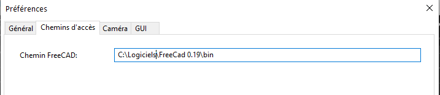
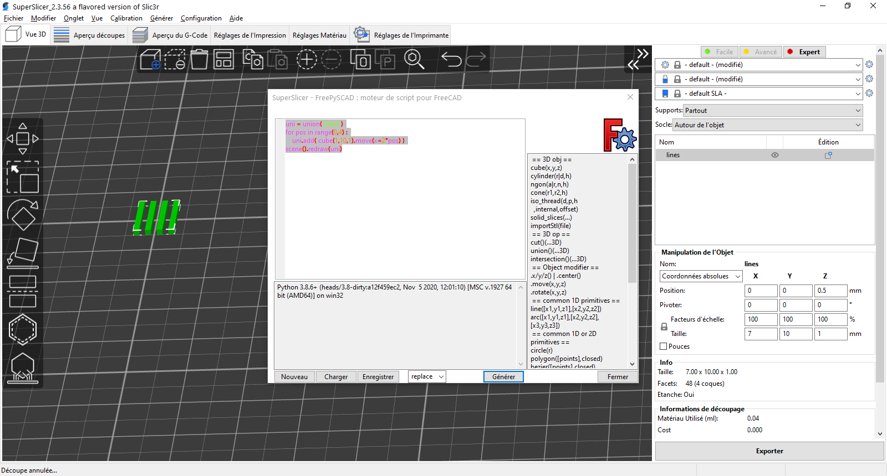

# Fenêtre de script FreePySCAD

Source : <https://github.com/supermerill/SuperSlicer/wiki/FreePySCAD-script-window>

## Contenu de la page

* Fenêtre de script FreePySCAD
	* [Comment cela fonctionne](#comment-cela-fonctionne)
	* [Comment écrire](#comment-écrire)
	* [Comment écrire du code python](#comment-écrire-du-code-python)
	* [Label](#label)
	* [La fenêtre du script](#la-fenêtre-du-script)
	* [Raccourcis](#raccourcis)

* [Retour Page principale](../superslicer.md)

Le but de cette fenêtre est de permettre à l'utilisateur de générer rapidement des géométries simples, sans avoir à passer à un logiciel de CAO complet, enregistrer, ouvrir. Si vous avez besoin de créer un objet compliqué (plus de 5 minutes pour créer), le vrai logiciel de CAO devrait être le choix préféré.

## Comment cela fonctionne

Vous écrivez l'arbre de construction avec des fonctions séparées par des ',' comme `union()(cube(x=1,y=3,z=1), cube(3,1,1).move(-1,2))` pour créer un '**T**' par exemple, un peu comme dans OpenScad. Ensuite, vous cliquez sur le bouton **générer** et ce script est envoyé à la console python de FreeCAD (vous devez avoir entré le chemin du répertoire bin de votre installation FreeCAD, en version au moins 0.19). Le logiciel FreeCAD renverra un fichier objet qui sera importé automatiquement dans votre plateau.

Dans l'implémentation actuelle, tous les objets de votre plateau seront remplacés par le ou les objets générés.

### Réglage du Chemin FreeCad

Assurez-vous d'avoir bien spécifié dans les réglages du logiciel le Chemin d'accès au répertoire Bin contenant les exécutables **FreeCad**. Dans le logiciel régler via **Configuration - Préférences - Chemin d'accès** le chemin d'accès à FreeCad.

## Comment écrire

Vous avez accès aux objets primitifs de base comme le cube et le cylindre.

	exemple : cylinder(r=5,h=2)

Vous pouvez les déplacer et les faire pivoter.

	exemple : cylinder(r=5,h=2).rotate(x=90)

Vous pouvez créer une union, une intersection et une différence (coupe) d'objets.

	exemple : cut()( cylinder(r=5,h=2).rotate(x=90), cylinder(r=2,h=2) )

Chaque union, intersection ou coupe est également un objet.

Chaque objet au niveau de la racine créera un objet dans le plateau.

Toutes les fonctions disponibles sont documentées [ici](https://github.com/supermerill/FreePySCAD).

## Comment écrire du code python

Comme il s'agit d'un script python, vous pouvez également écrire des fonctions, des objets et des boucles en python.

Mais pour pouvoir le faire, vous devez dire quelle partie du code est la collection d'objets et quelle partie est le code python. Ceci est fait avec la fonction.

	scene().redraw()

Exemple :

`uni = union("lines")
for pos in range(0,4) :
    uni.add( cube(1,10,1).move(x=2*pos) )
scene().redraw(uni)
`
Le résultat de ce script dans FreeCad est visible dans l'image ci dessous
`
 
 
## Label
Toutes les fonctions peuvent prendre un paramètre "nom". C'est utile pour la racine union/cut, afin que vous puissiez nommer votre objet.

Exemple :

	cut("my object")( cube(10), cylinder(1,10) )

## La fenêtre du script
Une aide a été incluse dans la petite fenêtre.

Premièrement, vous avez l'auto-complétion, automatiquement ou en tapant _**ctrl+espace**_.

Deuxièmement, vous avez une petite fenêtre d'aide qui vous indique les paramètres possibles que vous pouvez entrer dans la fonction (s'il y en a). Tous les paramètres peuvent être utilisés avec la forme `x=12`, mais ce n'est pas obligatoire s'il n'y a pas de '=' dans la fenêtre d'aide : `cube(size)` signifie que vous pouvez l'appeler comme `cube(10)` ou `cube(size=10) ; cylinder(d=,h=)` signifie que la seule façon est d'utiliser `cylinder(d=2,h=3)`.

La fenêtre de script essaie de corriger les erreurs, comme lorsque vous avez oublié un ','. C'est un travail en cours, car idéalement, elle doit vraiment comprendre l'arbre écrit pour vous dire où il y a une erreur, mais ce n'est pas encore fait. Si vous avez quelque chose qui vous dérange vraiment, n'hésitez pas à ouvrir un problème.

## Raccourcis
- **crtl + espace** : Autocomplétion

- **ctrl + escape** : Sortie

- **ctrl + s** : Sauvegarde rapide (si déjà sauvegardé/chargé)

- **ctrl + maj + s** : Enregistrer sous

- **ctrl + n** : Effacer

- **ctrl + g | F5** : Générer

Page suivante [Réglages de l'impression](../print_settings/print_settings.md)

[Retour Page principale](../superslicer.md)
