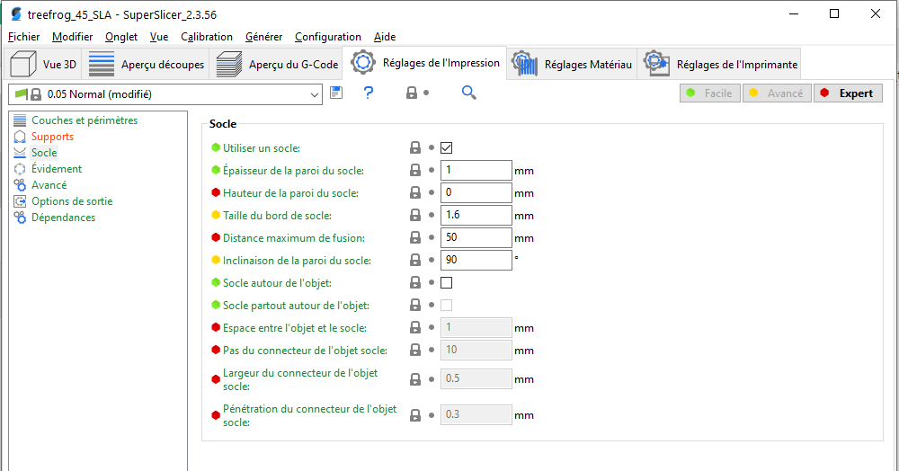
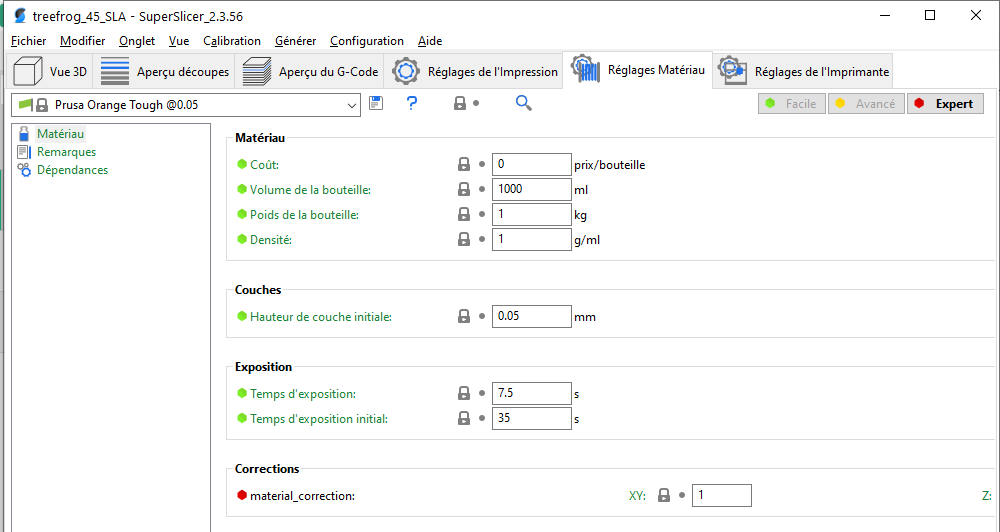
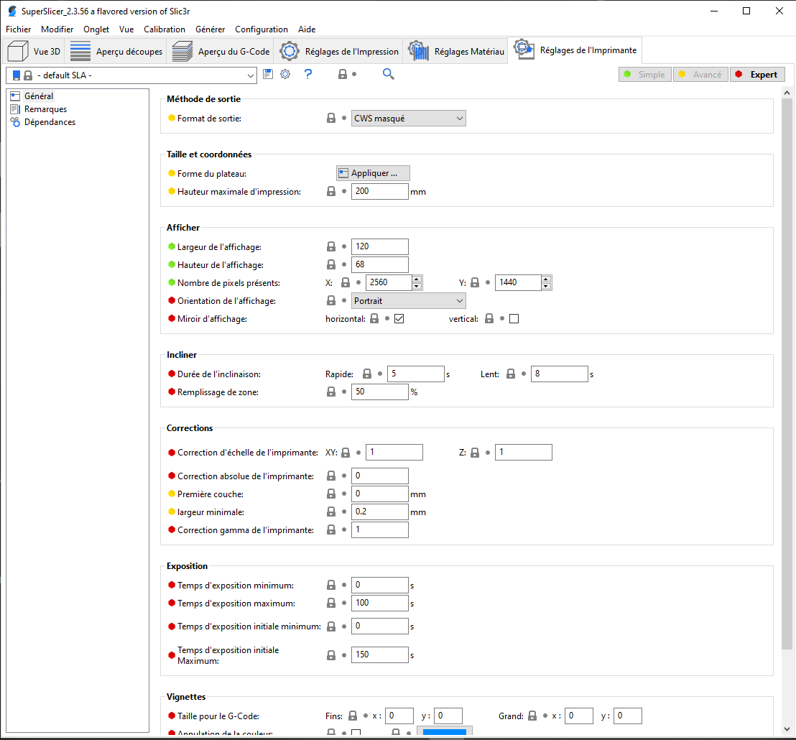

# Paramètres d'impression SLA

## Contenu de la page

* Paramètres d'impression SLA
	* [Paramètres spécifiques SLA](#paramètres-spécifiques-SLA)
	* [Réglages de l'Impression](#réglages-de-limpression)
	* [Réglages Matériau](#réglages-matériau)
	* [Réglages de l'Imprimante](#réglages-de-limprimante)

* [Retour Page principale](../superslicer.md)

## Paramètres spécifiques SLA 

## Réglages de l'Impression 

### Couches et périmètres

### Supports
#### Supports
#### Tête du support
#### Pilier du support
#### Connexion des tiges de support et jonctions
#### Génération automatique

### Socle

### Evidement
**Activer l'évidement**

### Avancé
#### Couche

### Options de sortie

**Fichier de sortie** Format du nom de fichier de sortie.

### Dépendances

## Réglages Matériau 

### Matériau

#### Matériau

**Coût**

**Volume de la bouteille*

**Poids de la bouteille**

**Densité**

#### Couches

**Hauteur de la couche initiale**

#### Exposition

**Temps d'exposition**

**Temps d'exposition initial**

#### Corrections

**Correction matière**

### Remarques
Remarques
### Dépendances
Dépendances du profil

## Réglages de l'Imprimante 

### Général

#### Méthode de sortie

##### Format de Sortie

Permet de sélectionner le format de sortie des découpes. 2 modes sont disponibles

- CWS Masqué
- Prusa SL1

#### Taille et coordonnées
#### Afficher
#### Incliner
#### Corrections
#### Exposition
#### Vignettes

### Remarques

Remarques

### Dépendances

Dépendances du profil.

Page suivante les [Macros](../macros/macros.md)

[Retour Page principale](../superslicer.md)

