# Découpage SLA

## Contenu de la page

* Découpage SLA
	* [Obtenir des objets géométriquement précis](#obtenir-des-objets-géométriquement-précis) 
	* [Supports de type arborescent](#supports-de-type-arborescent)
	* [Orientation d'un objet](#orientation-dun-objet)
	* [Évidement](#évidement)
* [Retour Page principale](../superslicer.md)

## Obtenir des objets géométriquement précis

Les pièces mécaniques, les objets qui doivent s'ajuster entre elles, doivent être imprimés avec précision. Alors que les imprimantes 3D SLA conviennent mieux à l'impression de formes organiques ou les figurines, les formes géométriques et les pièces d'assemblage peuvent également être imprimées. La clé ici est de **placer les supports stratégiquement le long des bords de l'objet**. 

La raison est simple : lors de l'impression avec des résines liquides, le matériau durci après le flashage est encore relativement mou, ce qui signifie que **l'objet peut se tordre très légèrement** pendant les mouvements de la plateforme. **La plupart des résines ont aussi tendance à rétrécir** un peu après avoir été durcies par la lumière UV, ce qui peut entraîner des bords légèrement déformés sur l'objet imprimé. Un bon nombre de supports est donc essentiel au maintient de la géométrie imprimée.

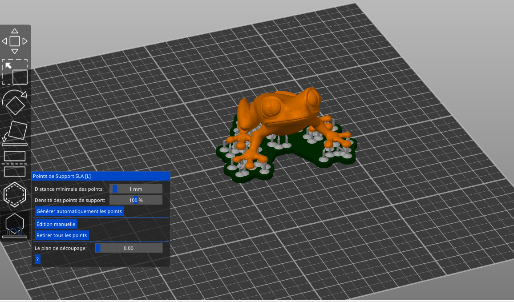 
*Lors de l'impression de formes non organiques, utilisez l'outil de placement manuel de supports pour placer des supports plus épais le long des bords de l'objet*

Rappelez-vous également que lors de l'impression d'objets directement sur la plateforme, les premières couches développent généralement ce que nous appelons un **pied d'éléphant** - au fur et à mesure que les premières couches durcissent, le matériau se dilate un peu, créant une surface inégale. C'est pourquoi **l'utilisation du Socle est recommandé**.

Comme déjà mentionné, l'impression prendra toujours le même temps quel que soit le nombre d'objets sur la plateforme d'impression. Le temps total est défini par le nombre de couches à solidifier. Utilisez ceci à votre avantage : si vous avez un objet complexe avec une orientation délicate, placez plusieurs copies sur la plateforme d'impression et faites pivoter chaque objet dans une direction différente. Cela vous aidera à gagner du temps.

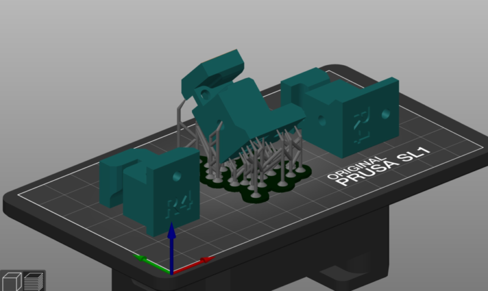
*Imprimez l'objet avec plusieurs rotations en même temps pour trouver rapidement l'orientation optimale - le temps d'impression restera le même.*

## Supports de type arborescent
Contrairement aux supports FDM, qui sont généralement en treillis ou en forme de grille, les supports SLA ressemblent à des **échafaudages en forme arborescent avec des extrémités très minces**. Ils sont faciles à retirer et laissent peu ou pas de traces sur la surface de l'objet imprimé lorsqu'ils sont retirés. Cela signifie également qu'un nombre insuffisant de supports peut entraîner des effets indésirables - par exemple, des objets lourds peuvent se détacher pendant l'impression. Les supports vont de pair avec l'orientation de l'objet - en faisant pivoter l'objet dans une position optimale, vous pouvez minimiser le besoin de supports. 

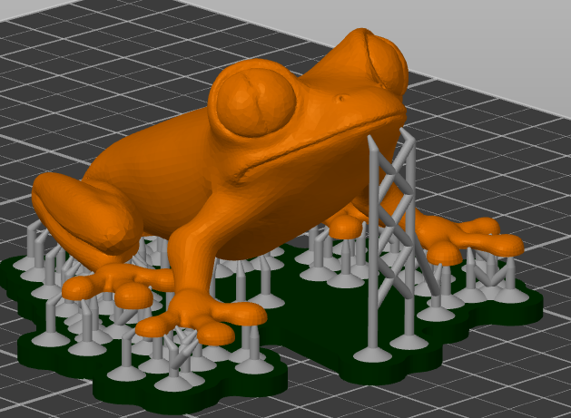 

Vous pouvez vous débarrasser de beaucoup de supports si vous faites pivoter l'objet vers une position optimale.

Aussi, gardez à l'esprit que le retrait des supports peut laisser de minuscules marques sur la surface, donc si votre objet a certaines zones qui devraient être parfaitement parfaites (un ornement sur un bijou, le visage d'une figurine), essayez de garder les supports loin d'eux.

SuperSlicer 2.3 est entièrement équipé pour la génération automatique de support de type arbre :

1. Sélectionnez l'objet qui nécessite des supports
1. Cliquez sur l'icône points de support SLA
1. Choisissez la densité de points de support et la distance minimale des points (les valeurs par défaut devraient fonctionner correctement pour la majorité des objets)
1. Cliquez sur Générer automatiquement les points et attendez la fin du processus
1. Utilisez le mode Aperçu pour vérifier si toutes les "îles" sont supportées - sinon, vous pouvez ajuster manuellement les supports.

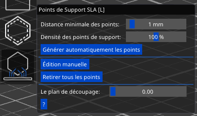 

Une autre chose que vous devriez envisager d'utiliser est le socle. **Le socle** (activé par défaut) est une grande structure à la base de l'impression, qui sert de base aux supports. Bien qu'il soit possible d'avoir des supports imprimés directement sur la plate-forme d'impression en aluminium, le socle assurera une bien meilleure stabilité.

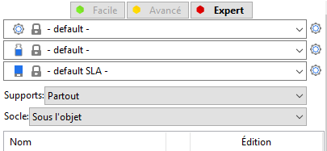 

Il est possible de définir à partir de la zone de Droite du logiciel la définition du **Socle** qui peut être :
* Sous l'objet 
* Autour de l'objet
* ou de le désactiver (Aucun)

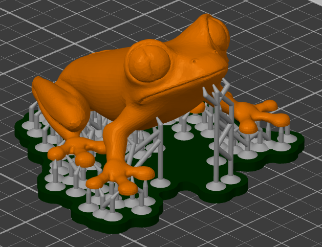 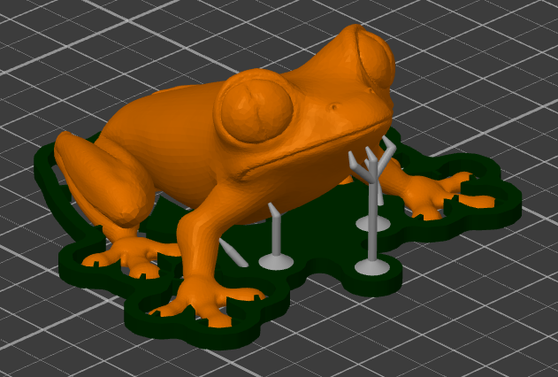 

Les images ci-dessus montre la différence entre un socle **Sous l'objet** et **Autour de l'objet**

### Édition manuelle des supports
Dans certains cas, la génération automatique de support ne donne pas un résultat parfait à 100 % - ce qui est normal puisque les objets importés peuvent être infiniment complexes. Nous améliorons constamment nos sous-programmes de génération de support pour éviter que ces situations ne se produisent. Cependant, à certaines occasions, des supports doivent être ajoutés manuellement - cela peut être fait même s'il existe déjà des supports générés automatiquement.

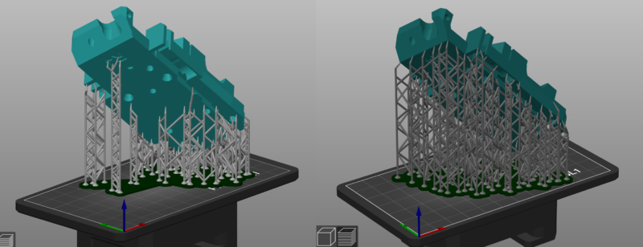

*Comparaison des supports générés automatiquement et des supports modifiés manuellement (Image Prusa)*

Cliquez sur le bouton **Édition manuelle**. Les supports générés précédemment disparaîtront temporairement pour vous donner un meilleur aperçu du modèle. Utilisez le **bouton gauche de la souris** pour **ajouter de nouveaux points de support**. Vous pouvez modifier l'épaisseur du support en mode d'édition manuelle en utilisant le curseur du **Diamètre de la tête**, ou vous pouvez aller dans **Paramètres d'impression - Supports** et modifiez les paramètres suivants pour augmenter l'épaisseur des supports :

- Diamètre avant de la tête du support : 0,6 mm
- Pénétration de la tête du support : 0,6 mm
- Diamètre du pilier de support : 1,3 mm

**Raccourcis utiles**

**Majuscule** + Glisser la souris avec le clic gauche **Ajouter plusieurs points à la sélection**

**CTRL** + Clic gauche de la souris **Ajouter un seul point de support à la sélection**

**ALT** + Clic gauche de la souris **Supprimer un seul point de support de la sélection**

**ALT** + Glisser la souris avec le clic gauche **Supprimer plusieurs points de la sélection**

**CTRL** + **A** **Sélectionner tous les points**

**CTRL** + Molette de la souris **Déplacer le plan de découpage**

## Orientation d'un objet
L'orientation des objets est cruciale avec l'impression **SLA**. Elle influence grandement la qualité d'impression résultante et dans le cas de la SL1, qui durcit la couche entière en une seule fois, elle contrôle directement le temps d'impression.

Vous avez peut-être remarqué que les impressions **SLA** sont souvent placées à un **angle de 45 degrés**. Il y a plusieurs raisons à cela :

- Les grandes surfaces horizontales plates nécessitent beaucoup de force pour se séparer du fond du réservoir lorsque la couche est durcie (elles auraient besoin de plus de supports)
- Les objets inclinés couvrent une plus grande surface, de sorte que les supports sous ces objets sont répartis plus uniformément
- Meilleur anti-aliasing

Laisser les objets croître progressivement sous un angle est généralement le moyen le plus sûr d'obtenir de belles impressions. Cela dit, **certains objets peuvent être placés directement sur la plateforme d'impression** pour obtenir de meilleurs résultats.

Dans la majorité des cas, l'objet aura plus d'une seule bonne orientation. Cela se produit généralement avec les bijoux ou diverses statues. La règle générale ici est d'essayer de faire pivoter l'objet d'une manière qui minimisera le nombre de points où l'objet commencerait dans le vide. Nous appelons ces points des îles. Ces zones ne peuvent pas être imprimées sans supports - et comme il est généralement préférable d'éviter d'utiliser des supports, vous devriez toujours essayer de trouver une meilleure orientation.

Vous disposez de 3 outils pour modifier l'orientation des objets :

- L'outil Rotation (**R**)
- L'outil Placer sur une face (**F**)
- L'outil Optimiser l'orientation (menu contextuel du clic droit)

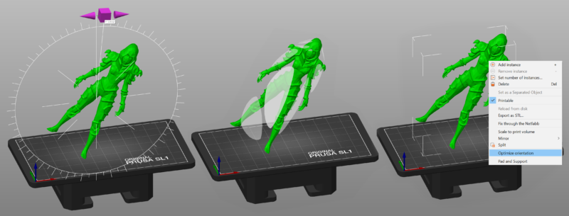
*L'outil Rotation (à gauche), l'outil Placer sur une face (au milieu) et l'outil Optimiser l'orientation (à droite)*

### Outil Optimiser l'orientation
Quand vous faites un **clic droit** sur un modèle, vous pouvez choisir **Optimiser l'orientation** dans le menu contextuel. SuperSlicer tentera de rechercher une orientation d'impression optimale. Notez que cela peut prendre un certain temps sur les modèles complexes avec un nombre élevé de polygones.

L'algorithme est **non déterministe**, cela signifie que la répétition de l'optimisation pour le même modèle entraînera toujours **orientation différente à chaque fois**. Enfin, cet outil ne prend pas en compte le volume d'impression maximum. Si la nouvelle orientation positionne une partie de votre modèle en dehors de la zone d'impression, réduisez le modèle ou ajustez l'orientation.

### Temps d'impression
Les temps d'impression de la SL1 sont définis par une simple multiplication : _le nombre de couches × (temps d'exposition + temps d'inclinaison)_. Quel que soit le nombre (et la complexité) des objets présents sur la plateforme d'impression, les temps d'exposition sont constants tout au long de l'impression - à l'exception des dix premières couches, qui prennent un peu plus de temps à se terminer.

En d'autres termes, l'impression d'un objet haut prendra moins de temps si vous le posez à plat sur la plateforme d'impression. **En termes de temps, peu importe si vous placez un seul objet sur la plateforme - ou une douzaine**. Le temps d'impression sera toujours le nombre de couches multiplié par le temps d'exposition d'une seule couche.

## Évidement
Tous les objets découpés pour les imprimantes SLA sont **complètement pleins** par défaut. Il n'y a **aucun motif de remplissage** comme dans l'impression 3D FDM. Les objets pleins imprimés à partir de résine liquide peuvent être lourds et robustes, mais la consommation de résine est élevée par rapport aux objets creux, en particulier lors de l'impression de grands modèles.

Évider votre modèle 3D est un excellent moyen de :

- Économiser une quantité considérable de **matériau** (diminue le prix d'impression)
- Diminuer la **surface de chaque couche** - ce qui diminue la force nécessaire pour détacher l'impression de l'écran lors du passage à la couche suivante
- Réduire le **nombre de supports nécessaires** (poids réduit du modèle imprimé)

Nous suggérons d'ajouter au moins deux **trous de drainage**. Sans eux, la résine non durcie finirait par être piégée à l'intérieur de votre impression terminée.

### Utilisation de l'outil d'évidement
L'évidement peut être configuré pour chaque modèle individuellement à l'aide de l'outil Évidement dans la **barre d'outils à gauche**. Alternativement, vous pouvez configurer l'évidement pour tous les modèles en même temps dans **Réglages d'impression - Évidement**.

Le flux de travail de l'évidement et des trous de drainage est **non destructif**. L'évidement peut être annulé et les trous de drainage peuvent être déplacés ou supprimés à tout moment.

L'évidement du modèle est configuré avec les paramètres suivants :

|
<h4>***Épaisseur d'évidement***</h4>

L'épaisseur de la coque résultante. La valeur minimale est de 1 mm.

<h4>***Précision d'évidement***</h4>

Un compromis entre précision et performance. Si une faible précision d'évidement est définie, l'épaisseur de paroi du modèle résultant peut être inégale. Par conséquent, une précision d'évidement plus élevée est recommandée pour une petite épaisseur d'évidement (pour les coquilles minces) afin d'assurer une épaisseur de paroi minimale.

<h4>***Distance de fermeture d'évidement***</h4>

L'évidement supprime les cavités plus étroites que le seuil de distance de fermeture, et il remplit également les coins concaves tranchants de la paroi intérieure, desquels il serait autrement difficile d'enlever la résine non durcie hautement visqueuse.
|
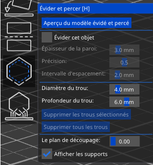

|
| - | - |

### Ajout de trous de drainage
Des trous de drainage peuvent être ajoutés par un **clic gauche** sur l'objet lorsque le manipulateur d'évidement SLA est actif.

Les trous peuvent ensuite être repositionnés en les faisant glisser sur le maillage.

Chaque trou est toujours perpendiculaire à la surface et son **diamètre** et sa **profondeur** peuvent être configurés - les paramètres courants seront utilisés pour les trous nouvellement placés.

Vous pouvez supprimer les trous par un **clic droit** sur l'un d'eux.

**Vous pouvez ajouter des trous même aux modèles dont l'évidement est désactivé**. Ceci est utile pour les modèles que vous avez évidés dans un programme externe.

Veuillez comprendre que si le maillage d'entrée est cassé, l'algorithme de forage de trous peut refuser de continuer afin d'éviter des plantages du programme ou des résultats incorrects.

### Confirmer et prévisualiser le maillage évidé
L'évidement et le forage des trous sont effectués après l'appui sur le bouton ***Aperçu du modèle évidé et percé***. Notez que l'évidement et le forage des trous sont des tâches coûteuses en calcul et prendront un certain temps, en particulier avec les modèles complexes. Dans le cas où l'utilisateur n'appuie pas sur le bouton lui-même, l'évidement et le forage seront effectués pendant le processus de découpage.

L'**Outil de plan de coupe** peut être utilisé pour jeter un œil à l'intérieur d'un objet (le même outil est présent dans le manipulateur d'édition des points de support SLA). Déplacez le curseur de gauche à droite pour déplacer le plan de coupe. Vous pouvez vérifier la géométrie évidée et placer les trous de drainage de manière appropriée.

 

Le bouton **Réinitialiser la direction** alignera l'outil de plan de coupe parallèlement à la vue caméra courante. Par exemple, si vous voulez que le plan de coupe se déplace de haut en bas, regardez le modèle par le haut (**Vue de Dessus**1) et appuyez sur le bouton Réinitialiser la direction.

Le bouton Réinitialiser la direction n'est visible que si vous déplacez l'outil Plan de coupe sur une valeur non nulle.

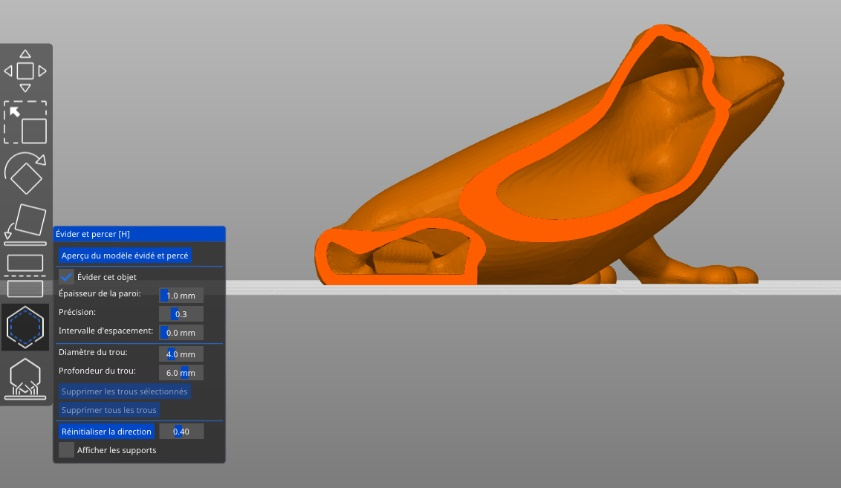 

Vous pouvez exporter le modèle évidé et percé en sélectionnant **Fichier - Exporter - Exporter le plateau au format STL.**

La modification d'un paramètre forcera une invalidation du maillage (comme le déplacement d'un trou, la mise à l'échelle de l'objet, etc.). La visualisation du modèle revient à l'objet d'origine sans les trous percés et sans l'évidement appliqué.

**Exemple de modèle plein vs évidé**

Modèle plein : 237 ml, coût de résine de $13,75

Modèle évidé : 81 ml, coût de résine de $4,70

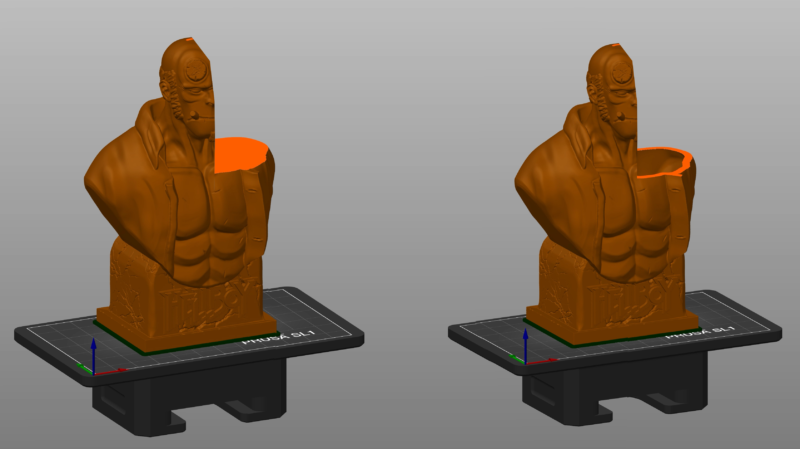

Les fonctions d'évidement et de forage de trous reposent sur les bibliothèques [OpenVDB](https://www.openvdb.org/) et [CGAL](https://www.cgal.org/). Un grand merci aux auteurs des deux bibliothèques.

Page suivante les [Paramètres d'impression SLA](sla_parameters.md)

[Retour Page principale](../superslicer.md)