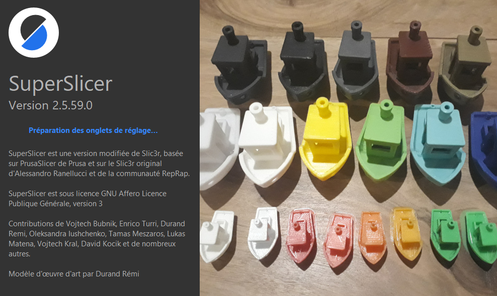

# superslicer

## SuperSlicer

[**Version 2.5.59.0**](overview.md)

Version 1.20 du 20/08/2022

## Table des matières

* [Préambule](overview.md)
* [A propos de SuperSlicer](about\_superslicer/about\_superslicer.md)
  * [Quelles sont les principales caractéristiques de SuperSlicer / PrusaSlicer / Slic3r ?](about\_superslicer/about\_superslicer.md#quelles-sont-les-principales-caractéristiques-de-superslicer--prusaSlicer--slic3r-)
  * [Quelles sont les principales différences de SuperSlicer ?](about\_superslicer/about\_superslicer.md#quelles-sont-les-principales-différences-de-superslicer--)
  * [Les autres caractéristiques principales](about\_superslicer/about\_superslicer.md#les-autres-caractéristiques-principales)
  * [Développement](about\_superslicer/about\_superslicer.md#Développement)
  * [Licence et attribution](about\_superslicer/about\_superslicer.md#licence-et-attribution)
* [Installer SuperSlicer](install/install.md)
  * [Télécharger les versions](install/install.md#télécharger-les-versions)
  * [Installer SuperSlicer](install/install.md#installer)
* [Avoir du Support](getting-support.md)
* [Configuration](configuration/configuration.md)
  * [Assistant de Configuration](configuration/configuration.md#assistant-de-configuration)
  * [Instantanés de Configuration](configuration/configuration.md#instantanés-de-configuration)
* [Première impression avec SuperSlicer](first\_print/first\_print.md)
  * [Importation du modèle](first\_print/first\_print.md#importation-du-modèle)
  * [Orientation du modèle](first\_print/first\_print.md#orientation-du-modèle)
  * [Sélection de l'imprimante](first\_print/first\_print.md#sélection-de-limprimante)
  * [Sélection du matériau](first\_print/first\_print.md#sélection-du-matériau)
  * [Sélection d'un profil d'impression/d'une hauteur de couche](first\_print/first\_print.md#sélection-dun-profil-dimpressiondune-hauteur-de-couche)
  * [Supports](first\_print/first\_print.md#supports)
  * [Remplissage](first\_print/first\_print.md#remplissage)
  * [Bordure](first\_print/first\_print.md#bordure)
  * [Prévisualisation du G-code avant l'impression](first\_print/first\_print.md#Prévisualisation-du-gcode-avant-limpression)
* [Interface utilisateur](user\_interface/user\_interface.md)
  * [Présentation de l'interface utilisateur](user\_interface/user\_interface.md#présentation-de-linterface-utilisateur)
  * [Panneau de manipulation des objets](user\_interface/user\_interface.md#panneau-de-manipulation-des-objets)
  * [Liste des objets](user\_interface/user\_interface.md#liste-des-objets)
  * [Vue](user\_interface/user\_interface.md#vue)
  * [Sélectionner des modèles](user\_interface/user\_interface.md#sélectionner-des-modèles)
  * [Modes Simple, Avancé, Expert](user\_interface/user\_interface.md#modes-simple-avancé-expert)
  * [Aperçu des découpes](user\_interface/user\_interface.md#aperçu-des-découpes)
  * [Raccourcis clavier](user\_interface/user\_interface.md#raccourcis-clavier)
  * [Divers](user\_interface/user\_interface.md#divers)
* [Réglages des préférences du logiciel](user\_interface/settings.md)
* [Exporter/importer](input\_output/input\_output.md)
  * [Exporter](input\_output/input\_output.md#exporter)
  * [Formats de fichiers pris en charge](input\_output/input\_output.md#formats-de-fichiers-pris-en-charge)
  * [Sauvegarder des projets](input\_output/input\_output.md#sauvegarder-des-projets)
  * [Exporter vers une carte SD/une clé USB](input\_output/input\_output.md#exporter-vers-une-carte-sdune-clé-USB)
  * [Import / Export des configurations](input\_output/input\_output.md#import--export-des-configurations)
* [Barre d'outils de gauche](left\_toolbar/left\_toolbar.md)
  * [Outils Déplacer, Pivoter et Redimensionner](left\_toolbar/left\_toolbar.md#outils-déplacer-pivoter-et-redimensionner)
  * [Outil d’orientation selon une Face](left\_toolbar/left\_toolbar.md#outil-dorientation-selon-une-face)
  * [Outil de coupe](left\_toolbar/left\_toolbar.md#outil-de-coupe)
  * [Peinture des supports](left\_toolbar/left\_toolbar.md#peinture-des-supports)
  * [Peinture des coutures](left\_toolbar/left\_toolbar.md#peinture-des-coutures)
* [Barre d’outils du haut](top\_toolbar/top\_toolbar.md)
  * [Outil d'agencement automatique](top\_toolbar/top\_toolbar.md#outil-dagencement-automatique)
  * [Annuler / Rétablir](top\_toolbar/top\_toolbar.md#annuler--rétablir)
  * [Copier / Coller](top\_toolbar/top\_toolbar.md#copier--coller)
  * [Instances](top\_toolbar/top\_toolbar.md#instances)
  * [Diviser en objets/pièces](top\_toolbar/top\_toolbar.md#diviser-en-objetspièce)
  * [Fonction de hauteur de couche variable](top\_toolbar/top\_toolbar.md#fonction-de-hauteur-de-couche-variable)
  * [Recherche](top\_toolbar/top\_toolbar.md#recherche)
* [Calibration](calibration/calibration.md)
  * [Calibration de l'imprimante](calibration/calibration.md#Calibration-de-limprimante)
  * [Calibration du filament](calibration/calibration.md#Calibration-du-filament)
  * [Calibration du logiciel](calibration/calibration.md#Calibration-du-logiciel)
* [Fenêtre de script FreePySCAD](script\_freecad/script\_freecad.md)
  * [Comment cela fonctionne](script\_freecad/script\_freecad.md#comment-cela-fonctionne)
  * [Comment écrire](script\_freecad/script\_freecad.md#comment-écrire)
  * [Comment écrire du code python](script\_freecad/script\_freecad.md#comment-écrire-du-code-python)
  * [Label](script\_freecad/script\_freecad.md#label)
  * [La fenêtre du script](script\_freecad/script\_freecad.md#la-fenêtre-du-script)
  * [raccourcis](script\_freecad/script\_freecad.md#raccourcis)
* [Réglages de l'impression](print\_settings/print\_settings.md)
  * [Périmètre et enveloppe](print\_settings/print\_settings.md#périmètre-et-enveloppe)
  * [Couche](print\_settings/print\_settings.md#couche)
  * [Remplissage](print\_settings/print\_settings.md#remplissage)
  * [Jupe et bordure](print\_settings/print\_settings.md#jupe-et-bordure)
  * [Support](print\_settings/print\_settings.md#support)
  * [Vitesse](print\_settings/print\_settings.md#vitesse)
  * [Largeur et Débit](print\_settings/print\_settings.md#largeur-et-débit)
  * [Extrudeurs multiples](print\_settings/print\_settings.md#extrudeurs-multiples)
  * [Options de sortie](print\_settings/print\_settings.md#options-de-sortie)
  * [Remarques](print\_settings/print\_settings.md#remarques)
* [Réglages du filament](filament\_settings/filament\_settings.md#filament-configuration)
  * [Filament](filament\_settings/filament\_settings.md#filament)
  * [Refroidissement](filament\_settings/filament\_settings.md#refroidissement)
  * [Multi-matériaux](filament\_settings/filament\_settings.md#multi-matériaux)
  * [Rétractions de Filament](filament\_settings/filament\_settings.md#rétractions-de-filament)
  * [G-code personnalisé](filament\_settings/filament\_settings.md#g-code-personnalisé)
  * [Remarques](filament\_settings/filament\_settings.md#remarques)
  * [Dépendances](filament\_settings/filament\_settings.md#dépendances)
* [Réglages de l'Imprimante](printer\_settings/printer\_settings.md)
  * [Textures de plateau SVG et PNG personnalisées](printer\_settings/printer\_settings.md#textures-de-plateau-svg-et-png-personnalisées)
  * [Général](printer\_settings/printer\_settings.md#Général)
  * [G-Code personnalisé](printer\_settings/printer\_settings.md#g-code-personnalisé)
  * [Limites de la machine](printer\_settings/printer\_settings.md#Limites-de-la-machine)
  * [Extrudeuse](printer\_settings/printer\_settings.md#extrudeuse)
  * [Milling](printer\_settings/printer\_settings.md#milling)
  * [Réglage MM pour extrudeuse unique](printer\_settings/printer\_settings.md#réglage-MM-pour-extrudeuse-unique)
  * [Création de profils pour différentes buses](printer\_settings/printer\_settings.md#création-de-profils-pour-différentes-buses)
* [Fonctionnalités avancées](advanced\_functionality/advanced\_functionality.md)
  * [Paramètres par modèle](advanced\_functionality/advanced\_functionality.md#paramètres-par-modèle)
  * [Changement de couleur](advanced\_functionality/advanced\_functionality.md#changement-de-couleur)
  * [Modificateurs](advanced\_functionality/advanced\_functionality.md#modificateurs)
  * [Recharger depuis le Disque](advanced\_functionality/advanced\_functionality.md#recharger-depuis-le-disque)
  * [Insérer une pause ou un G-code personnalisé à une couche](advanced\_functionality/advanced\_functionality.md#insérer-une-pause-ou-un-g-code-personnalisé-à-une-couche)
  * [Exporter les parcours d'outils au format OBJ](advanced\_functionality/advanced\_functionality.md#exporter-les-parcours-doutils-au-format-obj)
* [Découpage multi-matériaux](multimaterial/multimaterial.md)
  * [Importation d'un modèle multi-matériaux](multimaterial/multimaterial.md#importation-dun-modèle-multi-matériaux)
  * [Prévention des coulures](multimaterial/multimaterial.md#prévention-des-coulures)
  * [Attribution de couleurs (extrudeurs)](multimaterial/multimaterial.md#attribution-de-couleurs-extrudeurs)
  * [ColorPrint avec le MMU](multimaterial/multimaterial.md#tour-de-purge)
  * [Tour de purge](multimaterial/multimaterial.md#tour-de-purge)
  * [Volume de purge](multimaterial/multimaterial.md#volume-de-purge)
* [Découpage SLA](sla\_printer/sla\_printer.md)
  * [Objets géométriquement précis](sla\_printer/sla\_printer.md#objets-géométriquement-précis)
  * [Supports de type arborescent](sla\_printer/sla\_printer.md#supports-de-type-arborescent)
  * [Orientation d'un objet](sla\_printer/sla\_printer.md#orientation-dun-objet)
  * [Évidement](sla\_printer/sla\_printer.md#évidement)
* [Paramètres d'impression SLA](sla\_printer/sla\_parameters.md)
  * [Paramètres spécifiques SLA](sla\_printer/sla\_parameters.md#paramètres-spécifiques-SLA)
  * [Réglages de l'Impression](sla\_printer/sla\_parameters.md#réglages-de-limpression)
  * [Réglages Matériau](sla\_printer/sla\_parameters.md#réglages-matériau)
  * [Réglages de l'Imprimante](sla\_printer/sla\_parameters.md#réglages-de-limprimante)
* [Macros](macros/macros.md)
  * [Opérateurs](macros/macros.md#opérateurs)
  * [Fonctions](macros/macros.md#fonctions)
  * [Variables scalaires](macros/macros.md#variables-scalaires)
  * [Variables sous forme de tableau](macros/macros.md#variables-sous-forme-de-tableau)
  * [Tableaux multidimensionnels](macros/macros.md#tableaux-multidimensionnels)
  * [Tour de température](macros/macros.md#tour-de-température)
* [SuperSlicer Liste des variables](variable/variable\_list.md)
* [SuperSlicer Aperçu du G-Code](gcode\_viewer/gcode\_viewer.md)
  * [Trancheurs supportés](gcode\_viewer/gcode\_viewer.md#trancheurs-supportés)
  * [Associer à l'extension de fichier .gcode](gcode\_viewer/gcode\_viewer.md#associer-à-lextension-de-fichier-gcode)
  * [Caractéristiques](gcode\_viewer/gcode\_viewer.md#caractéristiques)
* Lancement en mode console
  * [Lancement en mode console](console/mode\_console.md)
  * [Lancement en mode console pour les impressions FDM](console/mode\_console\_fff.md)
  * [Lancement en mode console pour les impressions SLA](console/mode\_console\_sla.md)
* Tutoriels
  * [Correction d'un modèle non valide](tutorial/repairing-models.md)
  * Contribuer sur github
  * Utilisation des buses de différents diamètres
  * [Créer et mettre à jour une traduction](tutorial/software\_translation.md)
  * [Ajout imprimante physique](tutorial/add\_printer.md)
* Dépannage
  * [Dépannage](troubleshooting/troubleshooting.md)
  * [Erreur dimension](troubleshooting/dimension-errors.md)
* [Largeur d'extrusion](advanced/flow-math.md)
* [Lexique](glossary/glossary.md)
