# Barre d’outils du haut

## Contenu de la page

* Barre d’outils du haut
	* [Outil d'agencement automatique](#outil-dagencement-automatique)
	* [Annuler / Rétablir](#annuler--rétablir)
	* [Copier / Coller](#copier--coller)
	* [Instances](#instances)
	* [Diviser en objets/pièces](#diviser-en-objetspièce)
	* [Fonction de hauteur de couche variable](#fonction-de-hauteur-de-couche-variable)
	* [Recherche](#recherche)

* [Retour Page principale](../superslicer.md)

 
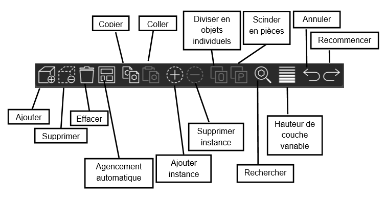 

## Outil d'agencement automatique

Lorsque vous importez plusieurs modèles ou créez de nombreuses instances du même modèle, leur organisation sur le plateau d'impression peut prendre beaucoup de temps. SuperSlicer dispose d'un outil d'agencement automatique qui réorganise les objets sur l'ensemble du plateau d'impression avec un écart paramétrable entre eux. L'agencement automatique peut être lancé en appuyant sur la touche **A** ou en choisissant le bouton **Agencer** dans la barre d'outils supérieure.

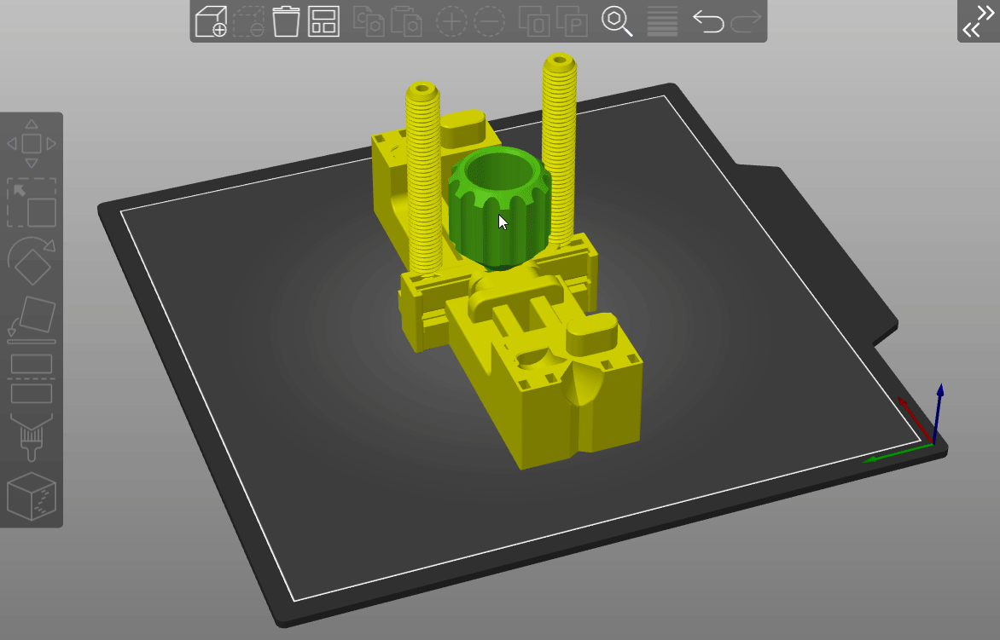

### Agencement partiel
L'outil d'agencement automatique peut être utilisé pour organiser uniquement un sous-ensemble des objets sur le plateau tout en conservant inchangée la position des objets non sélectionnés. Pour ce faire, sélectionnez les objets à agencer et appuyez sur le bouton **Agencer** tout en maintenant la touche Shift ou en appuyant sur le raccourci clavier **Shift** + **A**.

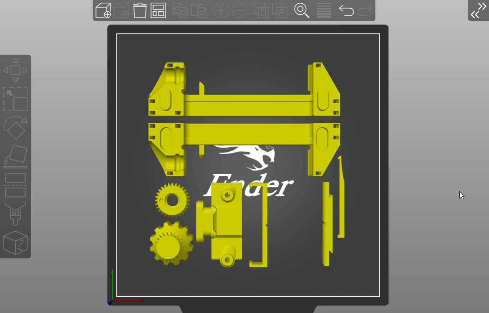

## Annuler / Rétablir

Toutes les actions accessibles à partir de la vue de l'éditeur 3D sont annulables, y compris la sélection d'objets, les actions dans la barre latérale (ajout de modificateurs, modification de leurs attributs) à l'exception du changement des profils d'impression, de filament et de matériau SLA.

| Raccourci                                             | Action       |
|:-----------------------------------------------------:|:------------:|
| **Ctrl** + **Z**                                      | **Annuler**  |
| **Ctrl** + **Y** (ou **Ctrl** + **Majuscule**+ **Z**) | **Rétablir** |
Vous pouvez annuler ou rétablir plusieurs étapes à la fois en cliquant ***avec le bouton droit de la souris*** sur le bouton Annuler ou Rétablir et en sélectionnant un point dans l'historique. Comme chaque action a un nom expressif attribué, il est facile de s'orienter même dans une longue liste d'actions.

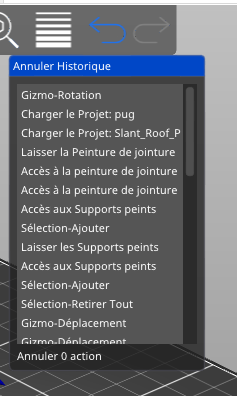

*Fonction Annuler bouton de droite de la souris*

La modification des paramètres dans les onglets Impression / Filament / Matériau SLA ou Imprimante est déjà annulable avec les boutons **Réinitialiser à la valeur système** (Cadenas) et **Réinitialiser à la valeur enregistrée par l'utilisateur** (Flèche annulation), ces évènements ne sont donc pas enregistré dans la liste des actions à Annuler / Rétablir de la vue 3D du plateau.

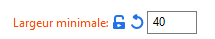

## Copier / Coller

Vous pouvez sélectionner un ou plusieurs modèles et les copier/coller à l'aide des boutons de la barre d'outils supérieure ou avec les raccourcis familiers :

| Raccourci         | Action     |
|:-----------------:|:----------:|
| **Ctrl** + **C**  | **Copier** |
| **Ctrl** + **V**  | **Coller** |
Les copies d'objets incluent tout, des modificateurs aux instances d'objet ou les bloqueurs et générateurs de supports.

## Instances

### Instances d'objets

Les instances d'objets sont essentiellement des copies d'un objet, qui sont liées entre elles et partagent les mêmes paramètres et orientation, à l'exception de la rotation de l'axe Z. Elles sont extrêmement utiles lorsque vous souhaitez configurer rapidement une impression avec plusieurs copies du même modèle.

Lorsque vous redimensionnez l'une des instances, toutes seront redimensionnées. Lorsque vous coupez le bas d'un modèle, toutes les instances seront coupées, si vous modifiez l'objet parent ( par exemple si le modèle STL est mis à jour : Fonction **Recharger depuis le disque** ) toutes les instances de cet objet seront elles aussi modifiées, etc.

### Ajouter / supprimer une instance

Vous pouvez ajouter ou supprimer des instances en sélectionnant un modèle, puis en cliquant sur les icônes plus ou moins dans la barre d'outils supérieure ou en utilisant le raccourci clavier :

\+ **Ajouter une instance** 

\- **Supprimer l'instance** 

Cette option est également disponible dans le menu contextuel lorsque vous cliquez avec le bouton droit sur un modèle. Le menu contextuel a également l'option ***Définir le nombre d'instances***, ce qui est utile lorsque vous devez imprimer de nombreux objets.

Note : Copier **Ctrl** + **C** et coller **Ctrl** + **V** ne créent pas d'instances mais des copies indépendantes de l'objet parent.

### Séparation d'une instance de l'objet parent

Cliquez avec le bouton droit sur une instance et choisissez **Définir comme objet séparé**. Vous pouvez également faire glisser l'instance dans la liste des objets hors de l'objet parent.

Les instances séparées se comportent comme un objet autonome et leurs modifications ne les affectent qu'eux. Cela dit, vous pouvez créer des instances de ce nouvel objet, qui lui seront à nouveau liées.

## Diviser en objets/pièces

En impression 3D (et modélisation, animation et autres), les objets sont représentés par leur **enveloppe extérieure**. Cette enveloppe est représentée comme un maillage triangulaire. Il est possible d'avoir plusieurs maillages dans un même fichier.

Les fichiers STL seront toujours importés en tant qu'objet unique, quel que soit le nombre de modèles distincts inclus dans le fichier.

Les fichiers 3MF prennent en charge plusieurs objets de façon native, chaque objet sera correctement identifié et chargé en tant qu'entité distincte.

Parfois, cela est fait exprès, par exemple, lorsque vous exportez l'intégralité du plateau en un unique STL ou lorsque vous exportez un modèle multi-matériaux. Vous souhaiterez peut-être séparer les enveloppes afin de transformer des objets individuels indépendamment les uns des autres ou définir des paramètres d'impression différents pour différents modèles. SuperSlicer peut identifier automatiquement plusieurs enveloppes dans un seul fichier et les diviser en modèles distincts. Cependant, il existe deux façons différentes de procéder.

### Diviser en objets

- Crée un objet individuel pour chaque enveloppe
- Place chaque modèle nouvellement créé sur le plateau d'impression

### Scinder en pièces

- Conserve une seule instance du modèle dans la scène, mais crée plusieurs pièces.
- Les pièces restent à leur emplacement d'origine, même si elles flottent dans les airs au-dessus du plateau d'impression
- Habituellement utilisé pour diviser les modèles MMU sans désaligner les pièces individuelles.

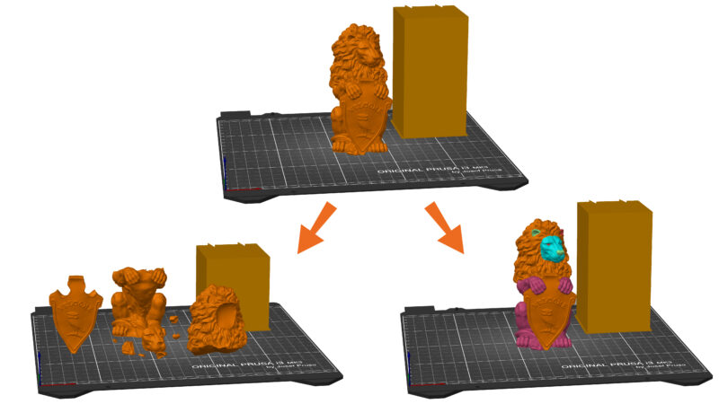

## Fonction de hauteur de couche variable

SuperSlicer vous permet de définir différentes régions de votre modèle à imprimer avec une hauteur de couche différente et de lisser automatiquement la transition entre elles. Cela peut entraîner des temps d'impression nettement plus courts avec un minimum de sacrifices à la qualité d'impression.

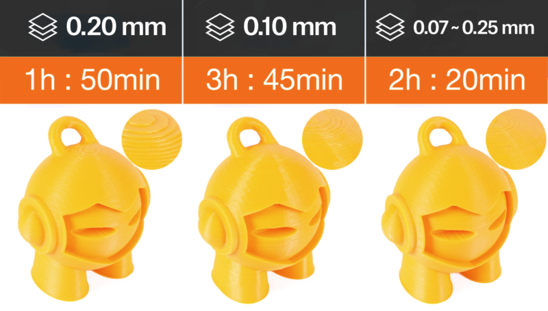

La hauteur de couche variable peut être configurée soit **automatiquement**, **manuellement** ou vous pouvez **combiner les deux méthodes ensemble**.

### Configuration de la hauteur de couche variable

Tout d'abord, sélectionnez un modèle dans la vue 3D. Puis, l'outil hauteur de couche variable devient disponible dans la barre d'outils supérieure. Dès que vous l'activez, un **aperçu en temps réel des lignes de contour** créées par chaque couche s'affiche. Une nouvelle fenêtre apparaît dans le coin inférieur droit et un nouveau panneau s'affiche sur le côté droit de la vue 3D.

**Adaptatif**

En cliquant sur le bouton ***Adaptatif*** SuperSlicer calcule le profil de couche en fonction du paramètre Qualité/Vitesse.

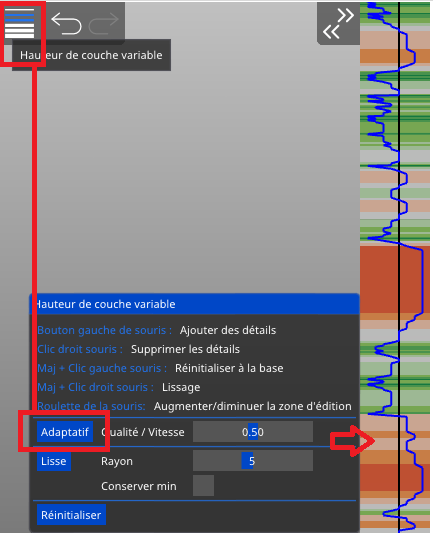

**Qualité/Vitesse**

En déplaçant ce curseur, vous pouvez modifier le rapport de couches fines et épaisses. Re-cliquez sur le bouton ***Adaptatif*** pour voir le nouveau profil de couche variable.

**Lisse**

Comme son nom l'indique, cela lisse le profil de hauteur de couche variable. Un plus grand **rayon** adoucira davantage la courbe. **Vous pouvez cliquer sur ce bouton à plusieurs reprises** pour obtenir un résultat encore plus lissé.

**Conserver min**

Lorsque l'option est activée, les **plus petites hauteurs de couche (vert foncé)** ne seront pas lissées et resteront à leur valeur minimale.

**Réinitialiser**

Réinitialise les paramètres de hauteur de couche variable (modifications automatiques et manuelles).

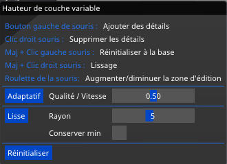

*Réglage paramètres couches variables*

Vous pouvez modifier manuellement le résultat de la hauteur de couche variable automatique.

Vous pouvez également ignorer complètement l'étape automatique et tout régler manuellement.

Lorsque vous passez la souris au-dessus du panneau de la hauteur de calque variable (à droite), la partie affectée du modèle est mise en évidence en jaune.

Bouton gauche de la souris **Diminuer la hauteur de couche** pour améliorer le rendu et les détails

Bouton droit de la souris **Augmenter la hauteur de couche** pour diminuer le temps d'impression

**Majuscule** + Bouton gauche de la souris **Réinitialiser à la base** (Cliquez plusieurs fois pour ramener à la valeur d'origine)

**Majuscule** + Bouton droit de la souris **Lissage**

Roulette de la souris **Augmenter ou diminuer la zone éditée**

Notez que **toutes les instances** de l'objet **sont également affectées** par l'outil hauteur de couche variable.

Vous remarquerez peut-être un **saut brusque en bas** de la ligne bleue - **c'est normal** et c'est due à la représentation visuelle du paramètre de la hauteur de la première couche qui n'est pas affectée par le réglage des hauteurs de couche variables.

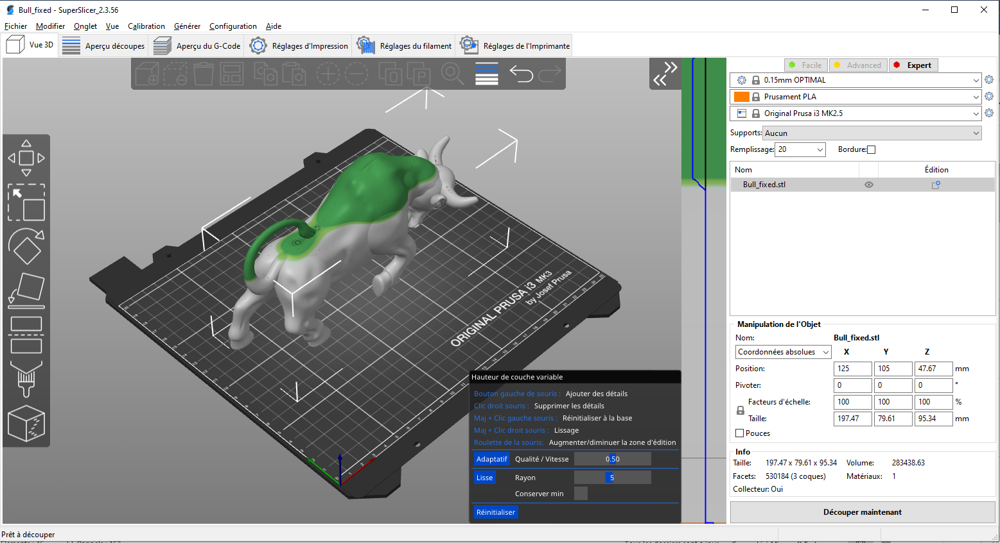

### Métriques des hauteur de couche variable automatique

Il a été expérimenté différentes métriques pour la qualité de surface. Les métriques par [Florens Wasserfall et al.](https://tams.informatik.uni-hamburg.de/publications/2017/Adaptive%20Slicing%20for%20the%20FDM%20Process%20Revisited.pdf) implémentées dans **Slic3r** limite l'erreur de discrétisation maximale (la plus grande distance euclidienne de la surface étagée du modèle source).

**PrusaSlicer** et donc  **SuperSlicer** limite la distance maximale des [lignes de contour](https://en.wikipedia.org/wiki/Contour_line) dans le plan XY, produisant des résultats plus intuitifs que la métrique de Waserfall.

Au final, il a été  implémenté une autre métrique, limitant la surface de section entre la surface étagée et le modèle source. Le graphique suivant montre la limite de hauteur de couche de diverses métriques en fonction de la pente de la surface.

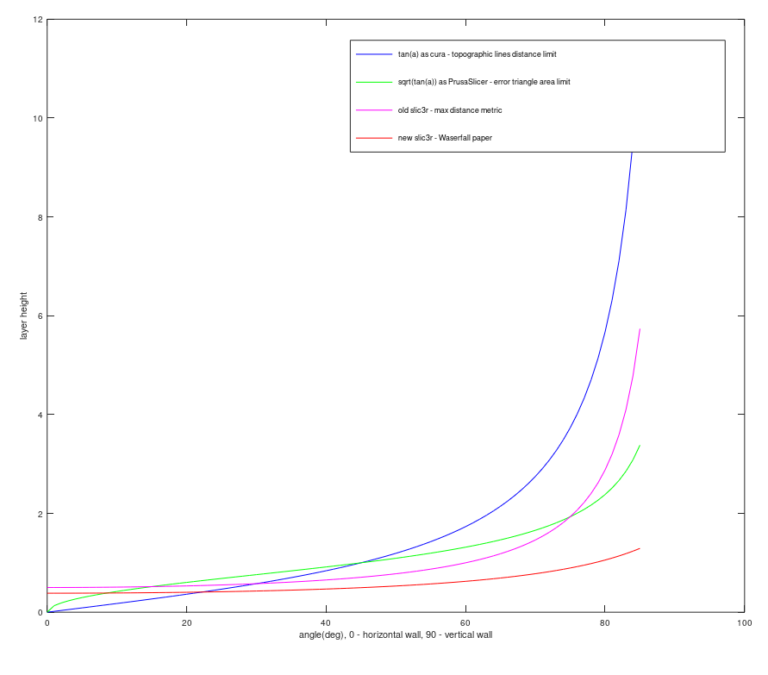
*Limite de hauteur de couche de diverses métriques en fonction de la pente de la surface (image Prusa).*

## Recherche

Nouveauté de la version 2.3, SuperSlicer permet désormais de rechercher un paramètre pour accéder rapidement à une page de paramètres et à un champ de paramètres particuliers. La recherche est accessible à la fois à partir de la barre d'outils supérieure et des pages des paramètres d’impression/des réglages du filament/des réglages de l’imprimante, ou avec un raccourci clavier **Ctrl** + **F** 

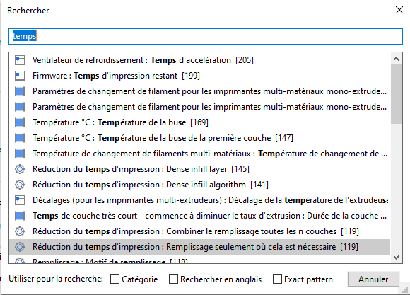

Après avoir trouvé le paramètre recherché, un clic dessus vous amènera directement sur la bonne page et une flèche clignotante vous indiquera le paramètre concerné.

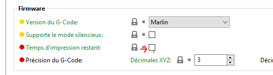

Il est possible de faire une recherche en Anglais donc dans le langage le plus utilisé pour SuperSlicer.

Exemple : Recherche du terme ***First layer*** : Sans et avec activation de la recherche en anglais.

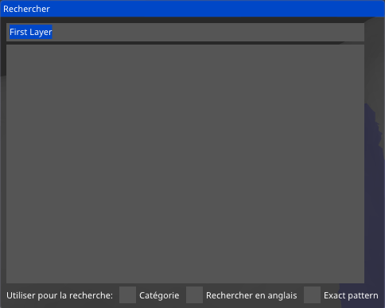

Avec l’activation de la recherche en anglais :

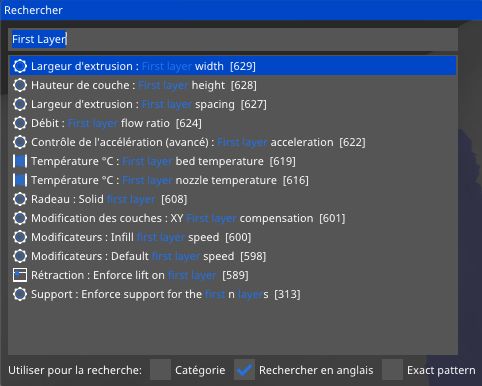

L’option ***Catégorie*** permet aussi de faire une recherche sur les noms des catégories dans lesquelles sont classifié les paramètres.

Page suivante [Calibration](../calibration/calibration.md)

[Retour Page principale](../superslicer.md)
