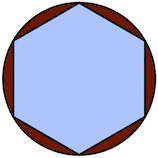
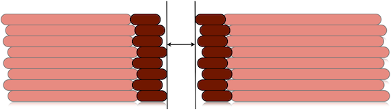
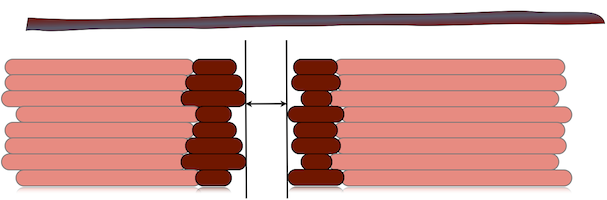

# Erreurs de dimension

Si vous n'êtes pas satisfait de la précision dimensionnelle de vos impressions, assurez-vous tout d'abord que votre **firmware** est correctement configuré : les valeurs **pas/mm** pour les axes **X, Y et Z** doivent être calculées en fonction de vos courroies, poulies et vis. N'essayez pas de calibrer par tâtonnement : ces valeurs doivent être exactes. Utilisez l'outil de Josef Prusa [Calculator](http://calculator.josefprusa.cz).

### Dimensions verticales

Si vos dimensions verticales sont fausses (c'est-à-dire **le long de l'axe Z**) -et votre objet est généralement plus court que prévu- cela signifie que votre buse est **trop basse**, et donc que la première couche est trop *écrasée* sur le plateau d'impression. Pour résoudre ce problème, vous pouvez augmenter votre butée Z ou augmenter l'option *Z offset* dans SuperSlicer.

### Dimensions horizontales

Le problème habituel concerne les trous trop petits. Ce problème ne concerne généralement que les trous situés sur le plan horizontal (XY). Il y a plusieurs raisons à cela. Voyons-les une par une :

#### Rétrécissement du plastique

Le plastique **rétrécit lors du refroidissement**. Les différents types de plastique présentent un rétrécissement différent, qui peut également dépendre de la température. En raison de ce rétrécissement, les trous circulaires (ou polygonaux) créés par l'extrudeuse au diamètre nominal seront plus petits après refroidissement.

#### Plus de matière est déposée à l'intérieur

Lorsque vous extrudez le long d'une courbe, une plus grande quantité de matière par unité de distance est déposée dans la partie concave. Cet excès de matière rend le rayon interne plus court.

Un [algorithme de compensation] (http://reprap.org/wiki/ArcCompensation) a été proposé par Adrian Bowyer et a été implémenté dans SuperSlicer il y a quelque temps, mais de nombreux utilisateurs se sont plaints que les trous étaient trop grands - il a été supprimé par la suite, car les petits trous sont préférables aux grands, car ils peuvent être percés.

#### Les courbes sont approximées par des polygones

Les fichiers STL ne contiennent que des maillages composés de triangles, de sorte que leurs sections planes ne peuvent contenir que des formes polygonales. Par exemple, un trou circulaire est approximé par un polygone :

Augmenter le **nombre de segments** dans votre CAO avant d'exporter le fichier STL aidera à réduire l'erreur. Les utilisateurs d'OpenSCAD peuvent utiliser la fonction `polyhole()` développée par [nophead](http://hydraraptor.blogspot.it/2011/02/polyholes.html) qui calcule le nombre optimal de segments.

#### Le filament a tendance à se déposer avec un chemin plus réduit

Les courbes étant approximées par des polygones les dimensions sont donc réduites au départ, de plus  **plastique a tendance à faire des angles arrondis**, en se déposant, ce qui réduit encore plus la surface interne du trou.

#### Oscillation Z

Même si la précision dimensionnelle d'une seule couche est correcte, plusieurs couches empilées peuvent rendre le trou plus petit si elles ne sont pas exactement alignées. [L'oscillation Z](troubleshooting.md#oscillation-z) causée par des problèmes mécaniques réduira la taille du trou à l'enveloppe interne des couches empilées :

#### Section non régulière du filament

Les filaments de basse et moyenne qualité n'ont pas un diamètre très régulier. Si vous mesurez leur diamètre le long d'un seul mètre d'entre eux, vous trouverez souvent de nombreuses valeurs différentes (et de nombreux filaments de basse qualité n'ont même pas une section parfaitement ronde). Cette **variation continue du diamètre** produira un **écoulement irrégulier** et le trou résultant sera toujours l'enveloppe interne de toutes les couches :

#### Backlash

Le jeu est un défaut mécanique d'un ou de plusieurs axes qui réduit essentiellement la quantité de mouvement réel lorsqu'un moteur inverse son sens de rotation. Il est généralement causé par des courroies lâches. Sur les imprimantes dotées d'un lit mobile, l'axe (généralement l'axe Y) est plus sujet au jeu en raison de l'inertie. Donc, **si vous obtenez des erreurs de dimensions différentes en X et en Y, cela est dû au jeu**. Vous devrez vous serrer la ceinture. Aucun logiciel ne peut raisonnablement compenser une imprimante mal assemblée.

#### Calculs de débit

D'accord, toutes les causes ci-dessus ne dépendent pas de Slic3r et, lorsque cela est possible, elles doivent être corrigées **avant** de tenter une solution logicielle.

Cela dit, les mathématiques de flux utilisées dans Slic3r jouent un rôle important dans la détermination des dimensions correctes, puisqu'elles tentent de deviner la forme du matériau extrudé et l'épaisseur de l'extrusion sur le plan horizontal pour une quantité donnée de matériau. Comme il s'agit d'une approximation, elle comporte une erreur. La façon habituelle de traiter ces problèmes consiste à régler le paramètre *Multiplicateur d'extrusion* afin d'augmenter/réduire la quantité de plastique, rendant ainsi les extrusions plus ou moins épaisses. Mais cela affecte également les surfaces solides, ce n'est donc pas la solution idéale.

Pour des dimensions plus exactes, vous devez cocher l'option **Périmètres externes d'abord**. L'impression des périmètres externes en premier évitera le décalage causé par le chevauchement des extrudats. D'un autre côté, l'impression des périmètres internes en premier masque mieux les coutures, donc c'est à vous de voir.

Une nouvelle option **Compensation de la taille XY** a également été introduite. Elle permet d'agrandir/réduire la forme de l'objet afin de compenser l'erreur mesurée. Supposons que vos trous soient plus petits de 0,1 mm, il vous suffit d'entrer -0,05 dans cette option pour qu'ils soient compensés (le signe négatif signifie un rétrécissement vers l'intérieur).
