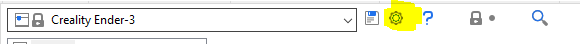
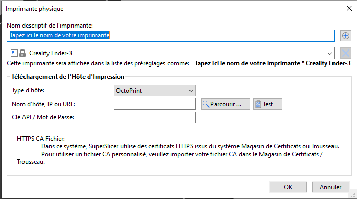
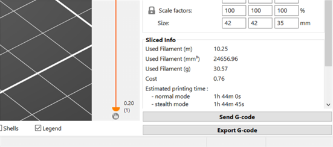
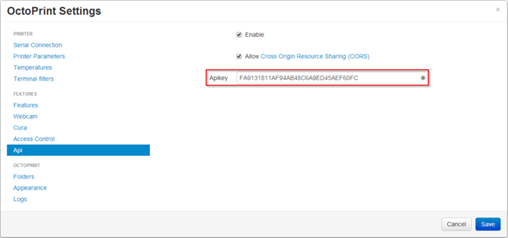

# Ajouter une imprimante physique

## Imprimantes physiques (paramètres réseau)

SuperSlicer stockait jusqu’à présent les réglages de connexion réseau de l’imprimante dans le profil de l’imprimante. Cela a pu poser problème dans certains scénarios (lorsque vous possédez plusieurs imprimantes avec le même profil, par exemple). Avec celle nouvelle version, SuperSlicer sépare les réglages de connexion de l’imprimante physique du Profil d’imprimante dans les nouveaux profils Imprimante Physique.

Donc depuis la version 2.3.0, si vous utilisez [Octoprint](https://octoprint.org/) ou  [Duet](https://www.duet3d.com/), vous pouvez envoyer des G-codes à votre imprimante directement à partir de SuperSlicer. Aller dans **Paramètres de l'imprimante** – **Ajouter une imprimante physique** ( icone roue dentée à droite du nom de l’imprimante )
 
 
 
 

### Type d'hôte : Octoprint/Duet/FlashAir/Astrobox/Repetier 

Sélectionnez le type d'appareil wifi/usb que vous utilisez.

### Nom d'hôte, IP ou URL

Si vous ne connaissez pas l'IP de votre appareil, vous pouvez utiliser le bouton Parcourir pour rechercher des appareils compatibles sur votre réseau.
Si vous installez le plugin [OctoPrint-ipOnConnect](https://github.com/jneilliii/OctoPrint-ipOnConnect), vous pourrez voir l'adresse IP directement sur l'écran LCD de l'imprimante.

Alternativement, si vous avez accès à votre routeur Wi-Fi domestique, recherchez la dernière adresse IP allouée par le serveur DHCP ou utilisez un outil de surveillance réseau (par exemple [Angry IP scanner](https://angryip.org/)) pour trouver votre appareil.

Vous pouvez utiliser le bouton _**Test**_ et SuperSlicer tentera d'obtenir une réponse du périphérique cible.

Dès que vous remplissez ce champ, un nouveau bouton Envoyer le G-code apparaîtra au-dessus du bouton Exporter le G-code chaque fois que vous découpez votre modèle.
 

### Clé d'API / Mot de passe
La clé d'API Octoprint se trouve dans **Paramètres Octoprint** - **API**.
 

[Retour Page principale](../superslicer.md)
