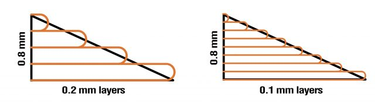
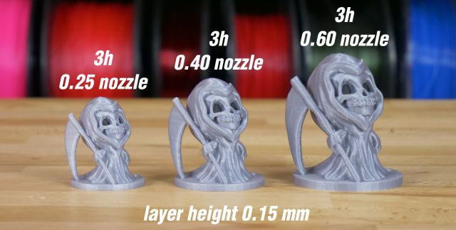
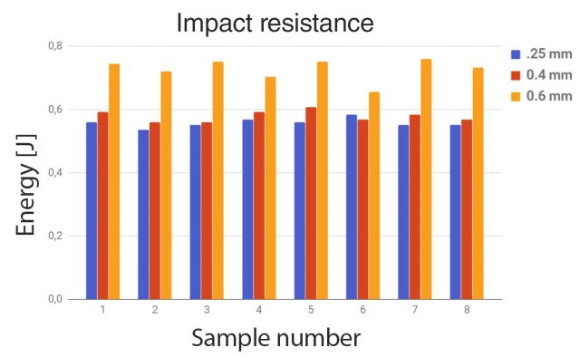
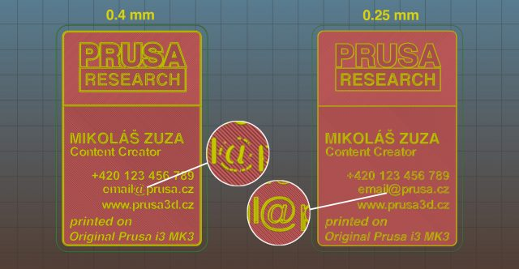
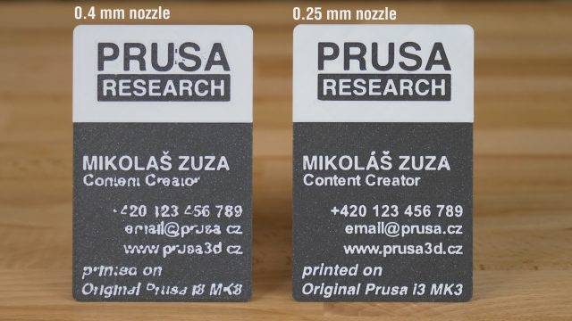
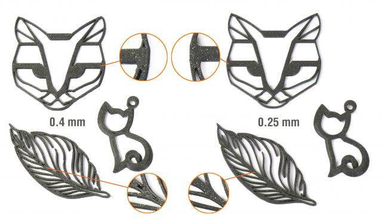
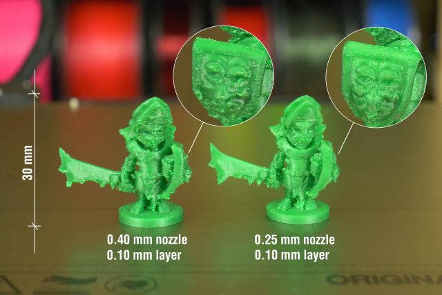
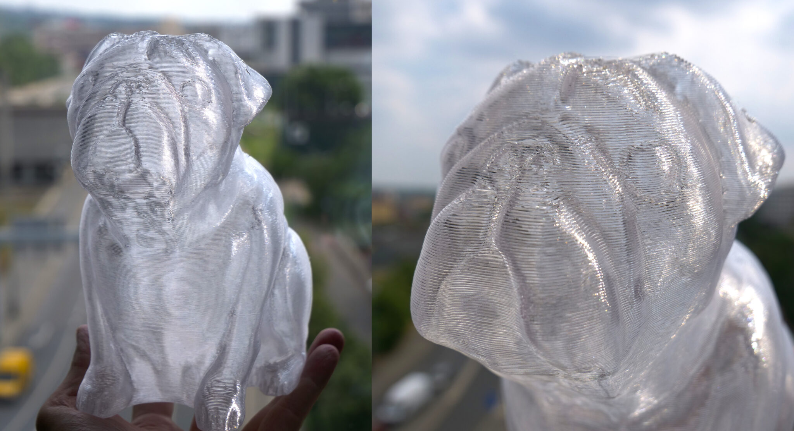

# Utilisation des buses de  différents diamètres

Le diamètre par défaut des buses de la plupart des imprimantes actuelles est de 0,4 mm. Le changement de buse ne prend que quelques minutes et il peut apporter un certain nombre d'avantages. 

Une buse plus petite est idéale pour les impressions détaillées (mais plus lentes), tandis qu'une buse plus grande permet d'imprimer plus rapidement, mais la qualité en souffre - ou pas ? En réalité, c'est un peu plus compliqué. Dans cet article, nous allons évoquer les avantages des buses plus petites et plus grandes dans des situations réelles. Mais d'abord, nous devons clarifier un point sur lequel les utilisateurs se trompent souvent : la corrélation entre la hauteur de couche et le diamètre de la buse.

## Hauteur de la couche en fonction du diamètre de la buse

Pour assurer une bonne alimentation en plastique fondu, la hauteur de la couche ne doit pas dépasser 80 % du diamètre de la buse. Si vous utilisez une buse standard de 0,4 mm, la hauteur maximale de la couche doit être de 0,32 mm. Cependant, avec une buse de 0,6 mm, il est possible d'atteindre une hauteur de couche de 0,48 mm.

En dehors de ces limitations, les deux paramètres sont indépendants l'un de l'autre. Si vous modifiez leurs réglages séparément, vous obtiendrez des résultats complètement différents. Le diamètre de la buse affecte le niveau de détail global presque exclusivement dans le plan horizontal (parallèle à la surface d'impression). Qu'est-ce que cela signifie ? Avec une buse plus petite, vous pourrez imprimer un texte plus détaillé, à condition qu'il soit placé sur la face supérieure de l'objet imprimé. À l'inverse, la hauteur de la couche affecte le niveau de détail sur les faces verticales et inclinées d'un objet. Vous avez beaucoup plus de chances de voir les couches individuelles sur les objets d'aspect organique. Plus la hauteur de couche est faible, meilleur est le résultat global. En revanche, il est peu judicieux d'imprimer des objets de forme rectangulaire avec une hauteur de couche très faible. Il n'y aura que peu ou pas de différence dans le résultat final, et le temps d'impression sera inutilement long.

## Imprimez jusqu'à 4 fois plus vite !

L'impression 3D n'est pas ce que l'on pourrait qualifier de processus rapide. Même une impression de quelques centimètres de haut peut prendre plusieurs heures. Il est donc assez surprenant de constater à quel point l'impression à l'aide de buses de grand diamètre est négligée, alors qu'elle peut entraîner une amélioration spectaculaire de la vitesse d'impression.

*Lien de téléchargement STL - Chibi Grim par Tanya Wiesner*

Une buse de plus grand diamètre dépose des périmètres plus larges, ce qui signifie qu'elle utilise moins de périmètres qu'une buse de plus petit diamètre pour imprimer un mur de la même épaisseur. Une buse de plus grand diamètre permet également d'imprimer avec une hauteur de couche plus importante. La combinaison de ces deux effets permet de réduire sensiblement le temps d'impression. Mais il y a un hic : si vous conservez la même hauteur de couche pour imprimer un objet à un seul périmètre, comme un vase, vous ne remarquerez aucune amélioration de la vitesse. En effet, la buse doit effectuer exactement la même séquence de mouvements, indépendamment du diamètre. Oui, le vase aura une paroi légèrement plus épaisse, mais le temps d'impression sera presque le même.

## Effet sur les propriétés mécaniques

Un autre avantage de l'utilisation de buses plus grandes est l'augmentation de la résistance des objets imprimés. Un test de résistance à l'impact a révélé que les objets imprimés avec la buse de 0,6 mm ont absorbé jusqu'à 25,6 % d'énergie en plus que ceux imprimés avec une buse de 0,4 mm. Et les objets imprimés avec une version de 0,25 mm ont absorbé 3,6 % d'énergie en moins que ceux imprimés avec une buse de 0,4 mm. Ce test a été effectué sur dix échantillons différents. Nous avons ensuite supprimé les valeurs minimales et maximales, c'est pourquoi vous pouvez voir les valeurs de 8 échantillons.

Image Prusa

## Supports

Les supports sont généralement imprimés sous la forme d'une polyligne d'un périmètre de large. Si vous allez dans les paramètres du logiciel, vous pouvez souvent remarquer que les supports sont délibérément sous-extrudés, afin qu'ils soient plus faciles à retirer. Et, bien sûr, l'utilisation d'une buse d'impression différente affecte directement la largeur des murs de support. Vous pouvez encore aller plus loin , en utilisant simplement une buse plus petite, les supports seront plus fins et plus faciles à enlever. L'utilisation de buses plus grandes a l'effet inverse et donne des supports plus larges et plus solides, qui peuvent être un peu difficiles à enlever.

## Comment remplacer la buse de l'extrudeuse ?

Paramètres prêts à l'emploi pour les buses de 0,25 mm et de 0,6 mm (et maintenant **de 0,8)**

Si vous voulez essayer des buses de 0,25 mm ou 0,6 mm, vous n'avez pas besoin de créer de nouveaux profils de trancheurs. Nous l'avons fait pour vous ! Ouvrez SuperSlicer et cherchez les options de l'imprimante (directement sous le menu de sélection du filament).

## Buse de 0.25mm

#### Pour

* Des textes imprimés de meilleure qualité
* Meilleure résolution dans les axes XY - parfait pour les bijoux, les logos...
* Supports extrêmement faciles à enlever

#### Contre

* Temps d'impression nettement plus longs
* Risque plus élevé d'obstruction de la buse
* Non compatible avec certains filaments (filaments contenant des particules plus grosses)

### Exemples d'utilisation pratique (0.25 mm)

#### Impression de textes

Comme nous l'avons déjà mentionné, le diamètre de la buse a un effet notable sur la résolution d'impression du plan parallèle à la surface d'impression. Cela signifie qu'une buse de 0,25 mm est adaptée à l'impression de textes détaillés. Comparons-la à la buse par défaut de 0,4 mm. Bien que l'option "Détecter les parois fines" soit activée, certaines parties des lettres peuvent être perdues lors du découpage. Cela ne se produira pas avec une buse de 0,25 mm, vous pouvez donc l'utiliser pour imprimer une carte de visite inhabituelle pour séduire les foules 🙂 Il convient de mentionner que la modification de la hauteur de couche n'affectera pas la lisibilité du texte.

 
*L'aperçu de Slic3r montre que les détails de l'objet sont trop petits pour la buse sélectionnée.*

*À gauche : carte de visite imprimée avec une buse de 0,4 mm. Droite : Même modèle, imprimé avec une buse de 0,25 mm.*

#### Impression de bijoux

Il s'agit là d'une autre excellente utilisation d'une buse plus petite. La différence entre une buse de 0,4 mm et une buse de 0,25 mm n'est pas si spectaculaire, car même une buse de 0,4 mm peut imprimer de petits objets de manière raisonnable. Les améliorations seront visibles surtout lors de l'impression de lignes fines.

.

 
#### Impression de miniatures

Étonnamment, l'impression de miniatures à l'aide d'une buse de petit diamètre entraîne une amélioration assez mineure de la qualité d'impression. Vous remarquerez la plus grande amélioration lors de l'impression des supports de ces objets. Les supports imprimés avec une buse de 0,25 mm sont faciles à retirer et laissent des traces presque invisibles sur l'objet.

*Lien de téléchargement STL*

D'un autre côté, si vous n'avez pas besoin de supports, la différence entre une buse de 0,4 mm et une de 0,25 mm est proche de zéro. Honnêtement, si nous avions interverti les étiquettes au-dessus de ces deux coffres, pourriez-vous le dire ?

*Lien de téléchargement STL*

## Buse de 0.6mm

Une buse de 0,60 mm convient pour toute impression qui n'ont pas sur de détails minuscules. Les supports d'écouteurs, les supports divers, les supports ou les pots de fleurs... peuvent tous être imprimés en moitié moins de temps que d'habitude. Nous avons surtout utilisé une buse de 0,4 mm au cours des derniers mois, alors franchement, ce fut une agréable redécouverte de l'utilité de la buse de 0,6 mm.

#### Pour

* Temps d'impression jusqu'à deux fois plus rapide
* Qualité d'impression presque identique à celle d'une buse de 0,4 mm
* Impressions plus durables
* Faible risque d'obstruction de la buse

#### Contre

* Mauvaise résolution des petits détails et des textes
* Les supports sont plus difficiles à enlever

## Exemples d'utilisation pratique (0.6 mm)

### Pots de fleur et vase
Les pots de fleurs ne comportent généralement pas de détails complexes, de sorte que la différence entre une impression de 0,4 mm et de 0,6 mm est pratiquement impossible à faire. Dans l'exemple ci-dessous, nous utilisons la même hauteur de couche. Avec une hauteur de couche supérieure, l'impression de 0,6 mm serait terminée encore plus rapidement. Et grâce à la forme du pot de fleurs, la différence ne serait pas trop perceptible.

[***STL download link***](https://www.thingiverse.com/thing:903411)

### Buddy le chien

Buddy est un modèle assez détaillé. Cependant, la buse de 0,6 mm n'a aucun problème à cette échelle.

### Lampe Voroni

Grâce à la forme de cette lampe (grandes surfaces planes), presque aucune qualité n'a été sacrifiée. Une buse de 0,6 mm nécessite un périmètre de moins pour obtenir la même épaisseur de paroi qu'une buse de 0,4 mm (3 périmètres avec 0,4 mm contre 2 périmètres avec 0,6 mm). Cela a permis de gagner énormément de temps avec une réduction du temps d'impression de près de 9 heures !

[***STL download link***](https://www.myminifactory.com/object/3d-print-voronoi-lamp-001-hq-version-6019)

## Buse de 1mm

Même les impressions qui prennent des dizaines d'heures peuvent être réalisées en quelques heures seulement avec une buse de 1 mm. Vous pouvez atteindre des vitesses d'impression jusqu'à 5 fois plus rapides qu'avec une buse de 0,4 mm. Bien sûr, il y a un prix à payer. Avec une buse de 1 mm, vous imprimerez généralement avec une hauteur de couche de 0,5 mm, mais il est possible d'aller encore plus loin. Bien sûr, les couches de l'objet imprimé seront très visibles, mais parfois, cela n'est pas gênant. Dans certains cas, cela peut même donner au modèle une esthétique intéressante, ce qui pourrait être assez difficile à obtenir avec d'autres méthodes. Nous allons, bien sûr, le montrer sur plusieurs exemples ci-dessous.

#### Pour

* Impression extrêmement rapide
* Impressions très robustes
* Aspect inhabituel avec des couches très visibles
* Risque quasi nul d'obstruction de la buse.

#### Contre
* Manque de détails
* Couches visibles
* Supports très difficiles à enlever
* Le filament semble disparaître de la bobine

### Exemples d'utilisation pratique (1 mm)

#### Dinosaure - un jouet pour les enfants

Un avantage surprenant de l'utilisation d'une buse de 1 mm est sa capacité à imprimer des bords arrondis de manière naturelle, sans aucun réglage supplémentaire. Cette caractéristique est idéale pour l'impression de jouets pour enfants, car le risque de se couper le doigt sur un bord tranchant est minimisé. De plus, le jouet a été imprimé cinq fois plus vite qu'avec la buse de 0,4 mm par défaut.

[***STL download link***](https://www.thingiverse.com/thing:2738211)

#### Porte-crayon

[***STL download link***](https://www.thingiverse.com/thing:297484)

#### Impressions transparentes sans remplissage

Les modèles imprimés à l'aide d'un filament transparent (par exemple PETG) sans remplissage et avec une hauteur de couche très élevée ont la capacité de réfracter la lumière de manière intéressante. En particulier, si vous pouvez les imprimer avec seulement un ou deux périmètres. Obtenir un aspect similaire serait autrement assez difficile.

## Conclusion

Si nous devions recommander l'achat d'une seule buse en remplacement de la buse de 0,4 mm, notre vote irait à l'option 0,6 mm. Elle offre des temps d'impression nettement plus courts, mais il est toujours possible d'imprimer des modèles raisonnablement détaillés. Si vous imprimez habituellement des modèles minuscules avec des textes, des bijoux ou des logos, vous devriez également envisager la buse de 0,25 mm. La version 1 mm a un usage limité, mais elle reste assez amusante à utiliser. 

