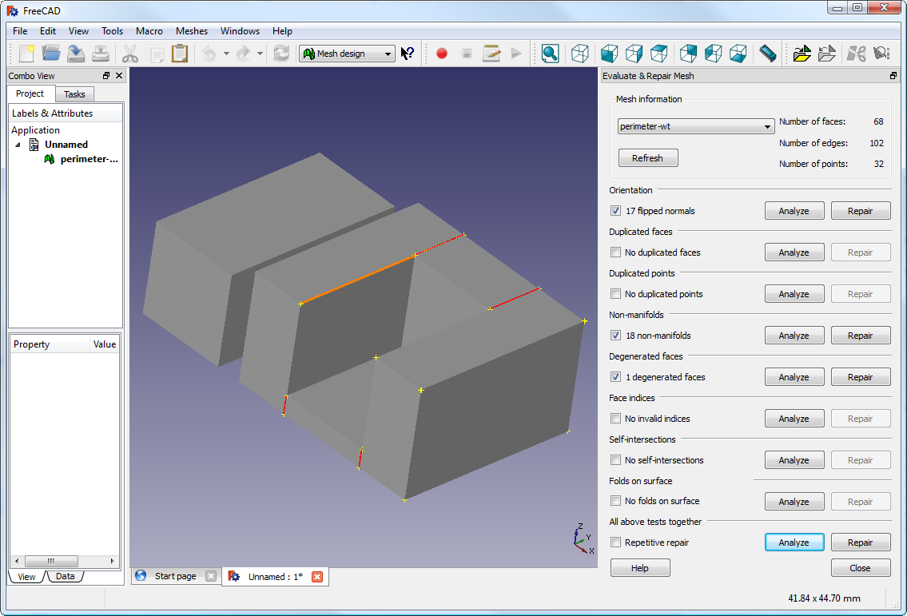

# Réparation des modèles

## Réparation de modèles par SuperSlicer

SuperSlicer propose une fonction de réparation pour les modèles non valides.

Dans le menu **Fichier** - **Réparer le Fichier STL** , le logiciel va vous demander de spécifier le fichier STL à réparer et le fichier de destination qui sera un fichier **Obj**. Après réparation vous pouvez importer le fichier Obj  pour traitement.

Si le maillage 3D décrit dans le modèle contient des trous, ou si les bords sont mal alignés (on dit qu'ils ne sont pas manifold ou étanche), SuperSlicer peut avoir des difficultés pour travailler dessus. SuperSlicer tentera de résoudre tous les problèmes qu'il peut, mais certains problèmes sont hors de sa portée.

*Indication par SuperSlicer d'un modèle réparé à la lecture.*

## Réparation de modèles par solutions externes

 Si SuperSlicer indique qu'un modèle ne peut pas être découpé correctement, il existe plusieurs options disponibles, et celles décrites ici sont toutes gratuites au moment de la rédaction.
 
#### MeshMixer

Autodesk  produit une gamme d'applications de modélisation 3D dont une version du logiciel appelé MeshMixer [^1]

**Note** : Actuellement la version de MeshMixer est la version 3.5.474

#### Netfabb Cloud Service

 Netfabb héberge également un service web où un fichier STL peut être téléchargé pour être vérifié et réparé [^3].
STL peut être téléchargé pour qu'il soit vérifié et réparé [^3].

 

-   Naviguez vers http://cloud.netfabb.com

-   Choisissez le fichier STL à télécharger à l'aide du bouton prévu à cet effet.

-   Une adresse électronique doit être fournie pour vous informer de la fin du service.
    terminé.

-   Choisissez si les mesures métriques ou impériales doivent être utilisées.

-   Lisez et acceptez les conditions de service, puis cliquez sur
   ` Upload 3D Model`.

-   Une fois que le service a analysé et réparé le fichier, un courrier électronique est envoyé
    fournissant le lien de téléchargement du fichier réparé.
    
    Si l'analyse est rapide vous pouvez aussi avoir le résultat en ligne directement avec un lien pour télécharger les fichier réparé.
    
     

#### FreeCAD

Freecad[^4] est un programme de CAO complet et gratuit qui comporte un module de maillage permettant de réparer des modèles dégénérés. Le module de maillage, dans lequel il est possible de réparer des modèles dégénérés. 
Les étapes suivantes décrivent comment un fichier de modèle problématique peut être analysé et réparé.

 

-   Démarrez FreeCAD et, à partir de la page d'accueil, choisissez   `Mesh Design`.

-   Chargez le modèle en le faisant glisser et en le déposant sur l'espace de travail ou par le biais du menu `Fichier`. Un petit message dans le coin inférieur gauche  indique si le modèle semble avoir des problèmes.

-   A partir du menu, choisissez `Maillages->Analyser->Evaluer et réparer le maillage` pour faire apparaître la boîte de dialogue des options de réparation.

-   Dans la boîte de dialogue des options, choisissez le maillage chargé, puis effectuez chaque  analyse en cliquant sur le bouton `Analyzer` pour chaque type de problème, ou bien   sélectionnez `Réparation répétitive` en bas pour effectuer toutes les vérifications. Si un   problème correspondant est détecté, le bouton `Réparer` devient  actif.

-   Pour chaque réparation souhaitée, cliquez sur le bouton `Réparer`.

-   Il est important d'examiner l'effet du script de réparation sur le modèle. Il se peut que le script endommage le fichier,  plutôt que de le réparer, par exemple en supprimant des triangles importants.

-   Exportez le modèle réparé via l'option de menu "Exporter" ou le menu contextuel.

**Note** : Actuellement la version de FreeCad est la version 0.19

[^1]: https://www.meshmixer.com/

[^3]: http://cloud.netfabb.com/

[^4]: https://github.com/FreeCAD/FreeCAD

Page suivante : [Créer et mettre à jour une traduction](../tutorial/software_translation.md) 

[Retour Page principale](../superslicer.md)
