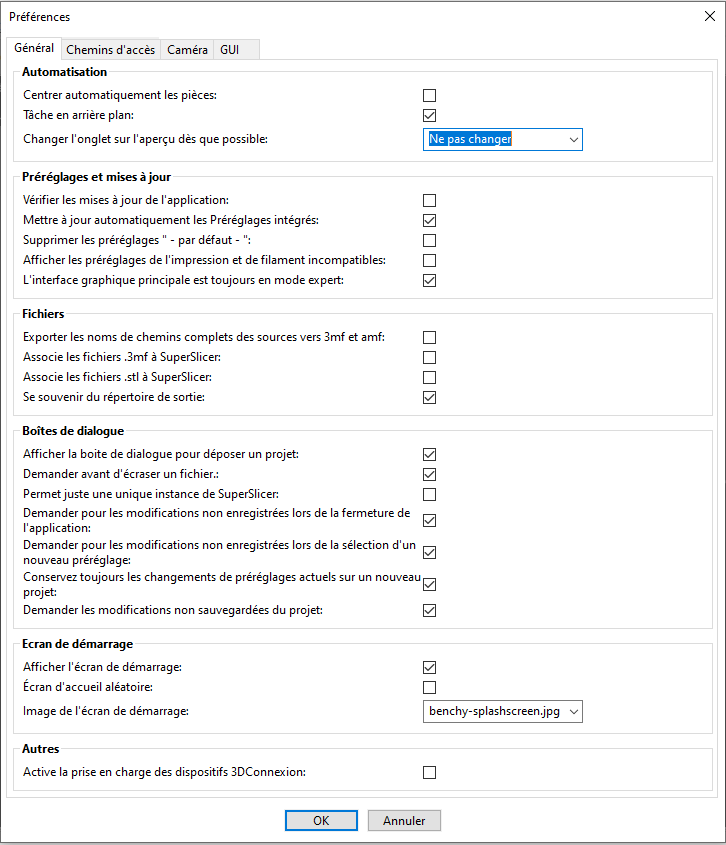
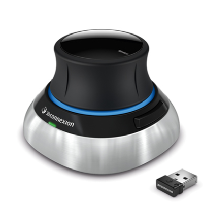
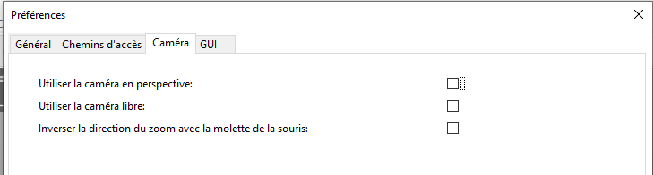

# Réglages du logiciel

## Contenu de la page

* Configuration du logiciel
	* [Préférences](#préférences)
        * [Général](#général)
        * [Chemin d'accès](#chemin-daccès)
        * [Caméra](#caméra)
        * [GUI](#gui)

* [Retour Page principale](../superslicer.md)

## Préférences
Le menu **Configuration** – **Préférences** vous permet d’accéder aux réglages du logiciel.

 

Vous pouvez ouvrir la fenêtre des Préférences en sélectionnant **Configuration - Préférences** ou en appuyant sur **Ctrl + P**

### Général

#### Automatisation

##### *Tâche en arrière-plan*

Par défaut, la génération de G-code démarre lorsque l'utilisateur clique sur le bouton Découper maintenant ou immédiatement après être passé à l'Aperçu. Lorsque le traitement en arrière-plan est activé, le G-code est généré dès que les modèles sont chargés. Par conséquent, l'aperçu du G-code, ainsi que l'estimation du temps d'impression, peuvent dans la plupart des cas être affichés immédiatement après être passé à l'Aperçu.

Le traitement en arrière-plan est particulièrement utile si vous faites des allers-retours entre les paramètres et l'aperçu du G-code (par exemple lors du réglage des paramètres de supports).

Chaque fois qu'un changement est détecté sur le plateau (par exemple déplacer un modèle, créer une copie d'un modèle), la partie correspondante du G-code commence à se mettre à jour en arrière-plan. Veuillez noter que contrairement à certaines versions plus anciennes de Slic3r PE, le traitement en arrière-plan est désormais plus intelligent et ne régénère pas l'intégralité du G-code, ce qui serait coûteux en calcul. Seules les étapes de découpage qui ont été invalidées par l'action de l'utilisateur sont recalculées.
Gardez à l'esprit que sur les appareils plus anciens et moins puissants, l'activation du traitement en arrière-plan peut entraîner une expérience moins fluide dans l'ensemble.

##### *Changer l'onglet sur l'aperçu dès que possible*

Lorsqu'un objet est découpé en couches, cela fera passer votre vue de la vue 3D à la pré-visualisation (et ensuite à la prévisualisation du G-Code) automatiquement, selon l'option choisie.

#### Préréglages et mise à jour

##### *Vérifier les mises à jour de l’application*
Lorsqu'il est activé et qu'une nouvelle [version stable](https://github.com/supermerill/SuperSlicer/releases) de SuperSlicer devient disponible, une notification s'affiche au démarrage suivant (jamais pendant l'utilisation du programme). Il ne s'agit actuellement que d'un mécanisme de notification, aucune installation automatique n'est effectuée.

##### *Mettre à jour automatiquement les préréglages intégrés*
Si activé, SuperSlicer télécharge les mises à jours des préréglages système intégrés (profils d'impression, de filament et d'imprimante) en arrière-plan. Ces mises à jour sont téléchargées dans un répertoire temporaire séparé. Lorsqu'une nouvelle mise à jour des préréglages est disponible, elle est proposée au démarrage de l'application.

##### *Supprimer les préréglages «  par défaut »*
Supprimer les préréglages " - par défaut - " dans les choix Impression / Filament / Imprimante une fois qu'il y a d'autres préréglages valides disponibles.

SuperSlicer ne supprime **JAMAIS** les profils créés par l'utilisateur. De plus, un instantané complet de tous les préréglages est réalisé lors de chaque mise à jour des préréglages.

##### *Afficher les préréglages d’impression et de filament incompatibles*
Lorsqu'ils sont sélectionnés, les préréglages de l'imprimante et du filament sont visibles dans l'éditeur de préréglage même s'ils sont désignés comme incompatibles avec l'imprimante en cours d'utilisation

##### *L'interface graphique principale est toujours en mode expert*
Si activé, l'interface sera en mode expert même si le mode simple ou avancé mode est sélectionné (mais pas les onglets de réglage).

#### Fichiers

##### *Exporter les noms de chemins complets des sources 3mf et amf*
Si activé, permet à la commande Recharger à partir du disque de rechercher et de charger automatiquement les fichiers lorsqu'elle est invoquée.

Pourquoi l'enregistrement des chemins complets est-il désactivé par défaut ?

Le format 3MF est essentiellement une archive zip, qui contient des fichiers XML lisibles par l'homme, une image miniature et certains fichiers divers. Le fait que les fichiers XML soient lisibles par l'homme est l'un des avantages du format de fichier 3MF. Cependant, dans certains cas, vous ne souhaiterez peut-être pas révéler l'emplacement de vos fichiers de modèle, par exemple : *C:\MaSociété\MonProjetSecret\LeCadeauPourMaCopine.stl*

##### *Associer les fichiers .3mf à SuperSlicer*
Si activé, définit SuperSlicer comme application par défaut pour ouvrir les fichiers .3mf.

##### *Associer les fichiers .stl à SuperSlicer*
Si activé, définit SuperSlicer comme l'application par défaut pour ouvrir les fichiers .stl.

##### *Centrer automatiquement les pièces*
Si ceci est activé, SuperSlicer centrera automatique les objets autour du centre du plateau d'impression.

##### *Se souvenir du répertoire de sortie*
Si ceci est activé, SuperSlicer affichera le dernier répertoire de sortie au lieu de celui contenant les fichiers d'entrée.

##### ***Emplacement des instantanés***

* Windows C/Users/username/AppData/Roaming/SuperSlicer/snapshots
* Mac “HDD” ▸ Users ▸ username ▸ Library ▸ Application Support ▸ SuperSlicer ▸ snapshots
* Linux ~/.SuperSlicer/snapshots

Les versions développeur (alphas et bêtas) utilisent des ensembles de paramètres différents de ceux des versions stables. Cela vous permet d'utiliser les versions développeur sans affecter la version stable de quelque manière que ce soit. Vous trouverez ces instantanés dans un dossier de données d'application correspondant :

#### Boite de dialogue

##### *Afficher la boite de dialogue pour déposer un projet*
Quand cette case est cochée, lorsque vous faites glisser et déposez un projet de fichier sur l'application, une boite de dialogue apparait pour vous demander de sélectionner l'action à accomplir sur le fichier à charger.

##### *Demander avant d'écraser un fichier.*
Si cette option est activé, SuperSlicer affichera une boites de dialogue pour confirmation lors d'un écrasement de fichier.

##### *N’autoriser juste une unique  instance de SuperSlicer*
Si cette option est activée, lors du démarrage de SuperSlicer et si une autre instance du même SuperSlicer est déjà en cours d'exécution, cette instance sera réactivée à la place.

##### *Demander pour les modifications non enregistrées lors de la fermeture de l’application*
Lors de la fermeture de l'application, toujours demander pour les modifications non enregistrées

##### *Demander pour les modifications non enregistrées lors de la sélection d’un nouveau préréglage*
Toujours demander pour les modifications non enregistrées lors de la sélection d'un nouveau préréglage.

##### *Conservez toujours les changements de préréglages actuels sur un nouveau projet*
Lorsque vous créez un nouveau projet, il conservera l'état actuel des préréglages, et n'ouvre pas la boîte de dialogue de changement de préréglage.

##### *Demander les modifications non sauvegardées du projet*
Demandez toujours si vous voulez sauvegarder votre projet si vous allez perdre certains changements. Sinon, il les ignorera sans avertissement.

#### Ecran de démarrage

##### *Afficher l’écran de démarrage*
Afficher l’écran de démarrage

##### *Ecran d’accueil aléatoire*
Afficher une image d'écran de démarrage aléatoire à partir de la liste à chaque démarrage.

##### *Image de l’écran d’accueil*
Choisissez l'image à utiliser comme écran d'accueil

#### Autres

##### *Activer la prise en charge des dispositifs 3DConnexion.*
Si activé, la boite de dialogue pour configurer les dispositifs 3DConnexion devient accessible en appuyant sur **Ctrl** + **M** .

### Chemin d'accès

#### *Chemin Free Cad*
S'il pointe vers une instance valide de freecad (le répertoire bin ou l'exécutable python exécutable), vous pouvez utiliser le script python intégré pour générer rapidement une géométrie.

### Caméra

Vous pouvez rapidement basculer entre la caméra perspective et orthographique à l'aide de la touche **K** ou dans le menu du logiciel  en cochant **Configuration - Préférences - Utiliser la caméra en perspective**. Les deux caméras ont leurs avantages et il est avantageux de basculer entre elles en fonction de vos besoins courants.

#### *Utiliser la Caméra en perspective*
La caméra en perspective vous donne plus d'informations sur la profondeur, les objets éloignés sont plus petits que ceux à proximité. Une vue en perspective est celle vue par les yeux humains dans le monde réel. 
Si le réglage n'est pas sélectionné alors le logiciel utilisera le mode **orthographique**. La caméra orthographique est couramment utilisée en ingénierie. Tous les objets apparaissent à la même échelle, les lignes parallèles restent parallèles et une unité de longueur semble avoir la même longueur partout sur le dessin. Cela permet de juger plus facilement les tailles relatives et d'aligner les modèles.

#### *Utiliser la Caméra libre*
Si activé, utilise la caméra libre. Si non activé, utilise la caméra contrainte.

#### *Inverser la direction du zoom avec la molette de la souris*
Si activé, inverse la direction du zoom avec la molette de la souris.

### GUI
Options relatives à l’interface utilisateur.

 

 #### Contrôles
 
##### *Barre de défilement séquentielle appliquée uniquement à la couche active*
Si activé, les modifications apportées à l'aide de la barre de défilement séquentielle, dans l'aperçu, s'appliquent uniquement à la couche active du G-Code. Si désactivé, les modifications effectuées à l'aide de la barre de défilement séquentielle, dans l'aperçu, s'appliquent à l'ensemble du G-Code.

##### *Afficher le bouton Réduire/Développer de la barre latérale*
Si activé, le bouton de réduction de la barre latérale apparaîtra dans le coin supérieur droit de la scène 3D

##### *Supprimer pour ouvrir l'hyperlien dans le navigateur*
Si activé, les descriptions des paramètres de configuration dans les onglets de réglage ne fonctionneront pas comme hyperliens. Si désactivé, les descriptions des paramètres de configuration dans les onglets de réglage fonctionneront comme hyperliens.

#### Apparence

##### *Utiliser une taille personnalisée pour les icônes de la barre d'outils*
Si activé, vous pouvez changer la taille des icônes de la barre d'outils manuellement.

Si l’option est activée une barre de contrôle permettra de fixer la taille des icônes.

##### *Taille de l'icône de l'onglet*
Taille des icônes des onglets, en pixels. La valeur 0 permet de supprimer les icônes.

##### *Afficher les icônes des réglages*
Les réglages ont un cadenas et des points (bouton pour remettre la valeur par défaut, type de réglage). Vous pouvez les cacher en déactivant cette option.

##### *Utiliser les info-bulles alternatives*
Dans certains systèmes d'exploitation, comme MacOs ou certains Linux, les info-bulles ne peuvent rester ouvert bien longtemps. Ce réglage permet de remplacer les info-bulles natives par des fenêtres internes pour leur permettre d'être plus facilement visible (ne fonctionne que pour les réglages).

Note: Pour les champs numérique avec flèches, vous devez survoler l'une des deux flèches. Le focus est conservé par la fenêtre, vous ne pouvez donc pas taper au clavier en même temps. Elle sera fermé et le focus rendu lorsque vous retirerez votre pointeur du champ. Il ne s'affichera pas si vous avez cliqué dans le champ pour l'éditer.

####  Couleurs

##### *Couleurs d'interface très sombre* 
Couleur très sombre, au format hexagonal RGB.

##### *Couleur sombre de l'interface* 
Couleur foncée, au format hexagonal RGB.

##### *Couleur de l'interface* 
Couleur principale, au format hexagonal RVB.

##### *Couleur claire de l'interface* 
Couleur très claire, au format hexagonal RVB.

##### *Couleur interface très légère* 
Couleur très claire, au format hexagonal RGB.

#### Options de disposition

##### *Interface standard avec la barre d'onglets* 

Toutes les fenêtres sont dans l'application, toutes sélectionnable par un onglet.

Celle que je trouve finalement la plus pratique

##### *Ancienne interface PrusaSlicer*

Toutes les fenêtres sont dans l'application, les paramètres sont sur l'onglet du haut et le choix du rendu des sections en bas de la vue 3D.

##### *Accès via le bouton Paramètres dans le menu supérieur*

Toutes les fenêtres sont dans l'application, pas d'onglets : vous devez cliquer sur les icones engrenages de réglages pour passer aux onglets de réglages.

##### *Réglages dans une fenêtre non modal*

Les paramètres sont affichés dans leur propre fenêtre. Vous devez cliquer sur les icones engrenages des paramètres pour afficher la fenêtre des paramètres.

Page suivante : [Importer/Exporter](../input_output/input_output.md)

[Retour Page principale](../superslicer.md)
