# Interface utilisateur

## Contenu de la page

* Interface utilisateur
	* [Présentation de l'interface utilisateur](#présentation-de-linterface-utilisateur)
	* [Panneau de manipulation des objets](#panneau-de-manipulation-des-objets)
	* [Liste des objets](#liste-des-objets)
	* [Vue](#vue)
	* [Sélectionner des modèles](#sélectionner-des-modèles)
	* [Modes Simple, Avancé, Expert](#modes-simple-avancé-expert)
	* [Aperçu des découpes](#aperçu-des-découpes)
	* [Raccourcis clavier](#raccourcis-clavier)
	* [Divers](#divers)

* [Retour Page principale](../superslicer.md)

## Présentation de l'interface utilisateur

SuperSlicer possède une interface utilisateur assez simple. La majorité de l'écran est dédiée à la vue 3D, qui est utilisée pour manipuler des modèles 3D. La barre d'outils supérieure (**1**) est utilisée pour ajouter et supprimer des objets. La barre d'outils de gauche (**4**) contient des outils de manipulation des modèles 3D, tels que l'outil redimensionner ou pivoter. Le panneau de droite est principalement utilisé pour sélectionner un profil d'impression, de filament et d'imprimante (**6,7,8**) et pour choisir de générer ou non des supports ou des bordures.

Le bouton **"Découper maintenant"** (**5**) est utilisé pour générer le G-code, qui peut ensuite être exporté sur une carte SD ou envoyé directement à une imprimante. Certaines fonctions avancées sont masquées par défaut, vous pouvez les activer plus tard en passant en mode avancé ou expert (**12**).

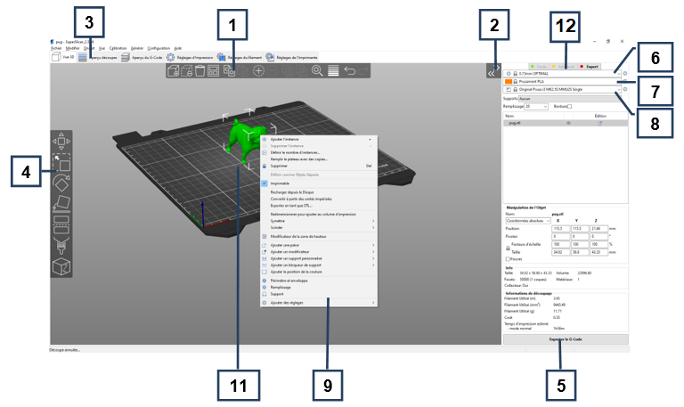

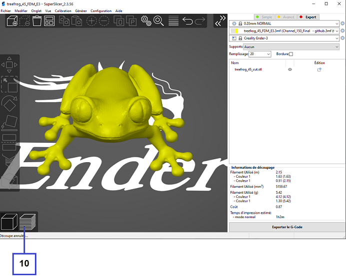

1. Le bouton **Ajouter** charge les modèles dans SuperSlicer
1. Les boutons **Supprimer** et **Supprimer tout** suppriment le(s) modèle(s) de SuperSlicer
1. Ouvre les paramètres détaillés d’impression, du filament et de l’imprimante
1. **Outils Déplacer, Redimensionner, Pivoter, Placer sur une face** et **Couper**
1. Bouton de découpage et de génération du G-code
1. Réglage de qualité / vitesse d’une impression
1. Sélection du matériau
1. Sélection de l’imprimante
1. Un **clic droit** sur le modèle ouvre un menu contextuel
1. Basculer entre l’éditeur 3D et l’aperçu des couches (Seulement en mode PrusaSlicer )
1. Aperçu du modèle
1. Basculer entre les modes Simple / Avancé / Expert

## Panneau de manipulation des objets

Chaque fois qu’un ou plusieurs objets sont sélectionnés, le panneau de manipulation d’objets apparaît dans le panneau de droite. 

En utilisant les entrées de texte, vous pouvez rapidement modifier :

- La position
- La rotation
- Le facteur d’échelle
- La taille

L’échelle peut rapidement être ramenée à 100% à l’aide du **flèche de réinitialisation** affiché en bleue à coté de la ligne des facteurs d'échelle.

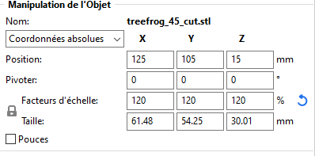

Lorsque vous transformez un modificateur ou une partie d’un modèle composé de plusieurs parties, un bouton spécifique apparaît chaque fois que l’objet sélectionné est au-dessus du plateau d’impression pour vous permettre de le repositionner au niveau du plateau (Voir image ci dessous).

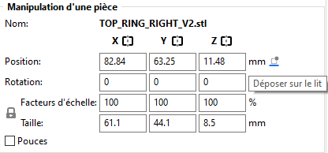

Si vous passez des coordonnées Globales aux coordonnées Locales, vous pouvez utiliser 3 boutons de miroir rapide (Voir image ci-dessus).

### Coordonnées Locales vs Absolues

En mode Avancé et Expert, un choix entre les coordonnées Locales et Absolues est disponible.

Le système de coordonnées locales est fixe par rapport à l'objet. Les coordonnées globales sont fixes par rapport au plateau d'impression. Cela signifie que la taille d'un objet changera dans les coordonnées globales lorsque vous le tournerez, par exemple, autour de l'axe Z. La taille en coordonnées locales est constante quelle que soit la rotation autour de l'un des axes.

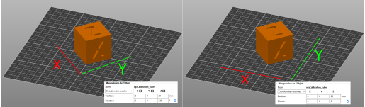

## Liste des objets

La Liste d'objets est située dans le panneau de droite et affiche une hiérarchie de :

- Objets (modèles)
- Instances (duplication d'un modèle)
- Paramètres personnalisés pour chaque objet
- Modificateurs - Modificateurs de plage de hauteur et Maillages de modification
- Générateurs de supports et bloqueurs

Vous pouvez avoir une idée claire de la structure du projet simplement en regardant l'arborescence des objets.

Vous pouvez **double-cliquer** sur un nom de modèle dans la Liste d'objets pour le renommer. Cela peut être pratique lorsque vous imprimez plusieurs pièces avec des noms génériques exportés à partir d'un logiciel de CAO.

L'**icône œil** bascule la propriété "imprimable". Lorsque vous la désactivez, le modèle reste sur le plateau d'impression, mais le SuperSlicer ignorera ce modèle lors de la génération du G-Code.

> Désactiver le modèle le fera apparaître dans une couleur plus sombre sur le plateau.

Cliquer sur l'icône **Édition** ouvrira un menu contextuel, qui vous permet de personnaliser les paramètres de l'objet sélectionné.

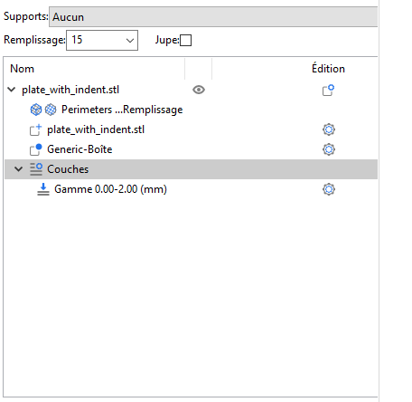 

## Vue

Raccourcis clavier pour la gestion des vues :

Bouton gauche de la souris **Tourner**

Bouton droit de la souris **Déplacer**

Utilisation de la Molette pour **Zoomer** , ou à l'aide des touches  **I**  pour zoomer,  **O**  pour dézoomer 

**B** **Zoom sur l'ensemble du plateau d'impression**

**Z** **Zoom sur les objets sélectionnés ou sur tous les objets si aucun n'est sélectionné**

**0** **Vue isométrique**

**1** **Vue du haut vers le bas**

**2** **Vue du bas vers le haut**

**3** **Vue de face**

**4** **Vue arrière**

**5** **Vue gauche**

**6** **Vue droite**

## Sélectionner des modèles

La sélection de base se fait avec le bouton gauche de la souris.

En maintenant la touche **Ctrl** et en cliquant sur des modèles supplémentaires, vous pouvez les ajouter à votre sélection actuelle.

**Majuscule** + glisser la souris **Sélection par boîte** 

**Alt** + glisser la souris **Désélectionner par boîte**

**Ctrl** + **A**  **Tout sélectionner** 

La sélection peut également être effectuée via la ***[Liste des objets](#liste-des-objets)***.

## Modes Simple, Avancé, Expert
L'interface utilisateur change d'apparence selon le mode dans lequel vous vous trouvez. Vous pouvez passer à un autre mode en utilisant les boutons du panneau de droite ou en allant **Configuration - Mode - Simple/Avancé/Expert**.

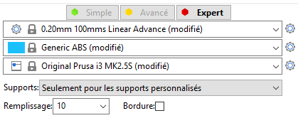

Le raisonnement derrière le **mode Simple** est de simplifier l'apprentissage pour les débutants et de désencombrer l'interface utilisateur pour les utilisateurs occasionnels. **Les fonctionnalités complexes** comme les maillages de modification **sont cachés**, et seul un sous-ensemble de paramètres de base est présenté à l'utilisateur.

En **mode Expert**, plus de paramètres sont affichés et en mode Expert, toutes les fonctionnalités de SuperSlicer sont accessibles. Pour faciliter l'apprentissage des paramètres, ils sont codés par couleur :

- **Vert** - sûr pour être modifié par un débutant
- **Jaune** - l'utilisateur avancé peut vouloir modifier ces paramètres
- **Rouge** - réglages d'expert dont la plupart ne doivent être touchés que si vous créez un profil pour une nouvelle imprimante

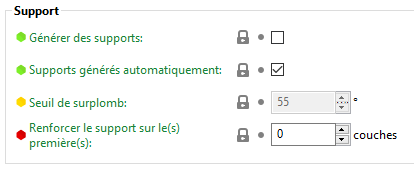

## Aperçu des découpes

Selon le mode choisi pour l’interface du logiciel, après avoir découpé votre modèle, vous pouvez voir le résultat des découpes en utilisant soit les boutons de la barre outils du bas ou en appuyant sur la touche **Tabulation**.  Si vous avez choisi le mode dite ***Ancienne interface PrusaSlicer***, deux boutons sont afficher dans le coin inférieure gauche de la fenêtre de visualisation.

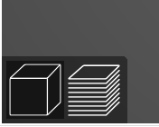

Le premier bouton permet l’affichage en mode Vue 3D (**Ctrl** + **1** ) l’autre affiche le résultat des découpes ( **Ctrl** + **2**).

Dans le cas de l’interface ***Standard avec la barre d'onglets*** vous pouvez aussi voir le découpage en cliquant sur le bouton de l’onglet ***Aperçu des découpes*** ou ***Aperçu du G-Code***.

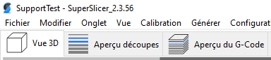

Dans le cas de l'interface SuperSlicer la visualisation du modèle  se fait avec (**Ctrl** +  **1** ) l’autre affiche le résultat des découpes( **Ctrl** +  **2** ) et enfin le suivant affiche l’aperçu du G-Code ( **Ctrl** +  **3** ).

Dans le mode de visualisation des découpes vous avez en haut à gauche les informations sur le code couleur ainsi que les durée et pourcentage pour chaque type de trajectoire.

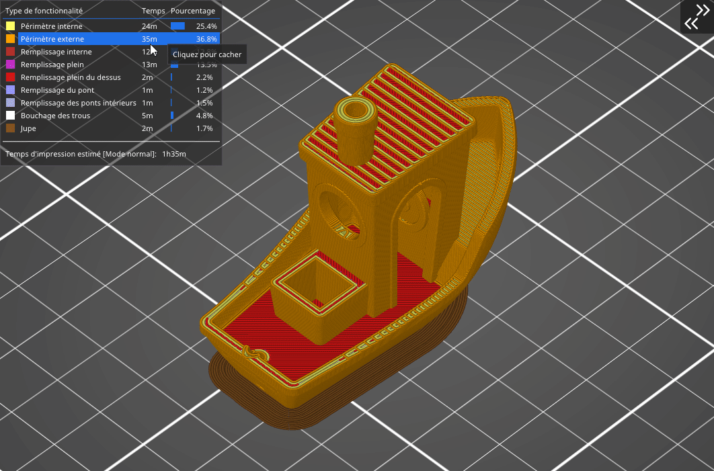

Pour ne visualiser que certains types vous pouvez cliquer dans la zone d’information sur les trajectoires à masquer/afficher.

Dans le type d’interface ***Standard avec la barre d'onglets***  l’accès aux sections Vue 3D , Aperçu des découpes et Aperçu du G-Code ainsi que l'accès aux réglages est intégré dans la barre des Onglets en dessous des menus du logiciel.

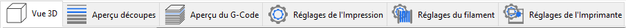

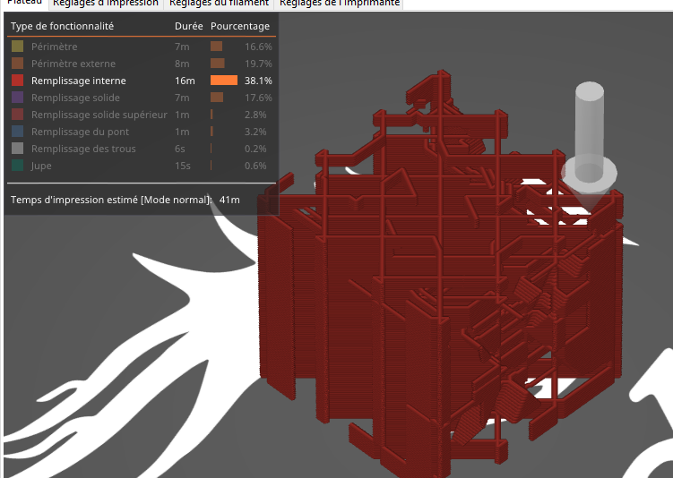

Il est aussi possible avec la barre du dessous de régler les types de trajectoire que vous voulez visualiser :

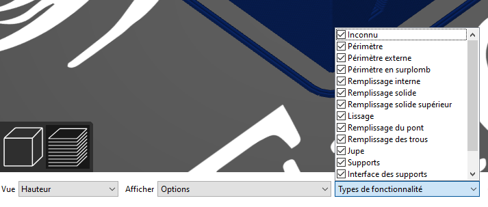
Cette barre de menu vous permet aussi de régler le type d’affichage que vous désirez avoir : 

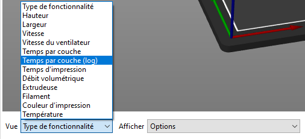

Vous avez le choix entre :

- **Type de fonctionnalité** : Type des trajectoires affichées
- **Hauteur :** Hauteur des couches
- **Largeur** : Largeur des cordons
- **Vitesse** : Vitesse d’impression
- **Vitesse du ventilateur :** Vitesse du ventilateur
- **Temps par couche** : Affichage de la durée de chaque couche
- **Temps par couche (log)** : Affichage de la durée de chaque couche en mode logarithme, ce qui permet d'avoir plus de contraste entre les différences dans les temps par couche.
- **Temps d’impression :** Temps totale d’impression des pièces
- **Débit volumétrique :** Débit volumétrique en mm3/s
- **Extrudeuse** : buse et extrudeuse active
- **Filament** : Affichage du filament employé particulièrement utile dans le cas d’utilisation d’une machine équipé d’un système de multi-extrusion
- **Couleur d’impression** : Affichage de la couleur d’extrusion. A noter que la couleur n’est pas forcément lié à un filament si le changement du fil est réalisé à la main avec un code M600.
- **Température** : Température d’impression

Les réglages de cette barre vous permettent aussi de pouvoir régler les éléments que vous voulez voir apparaître dans la visualisation.

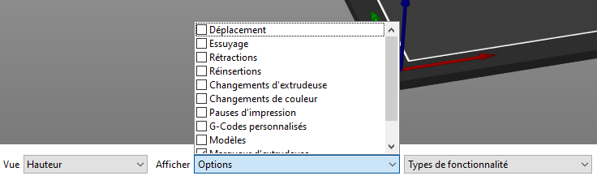

Vous pouvez par exemple rajouter l’affichage des :

- **Déplacements** : Ajout des déplacements de ***mouvement*** avec ***extrusion*** en ***rétraction***.
- **Essuyage** : Parcours d’essuyage de la buse sur des zones déjà imprimées
- **Rétractions** : Positions des rétractions ajoutées par le logiciel.
- **Réinsertions** : Positions des réinsertions après les rétractions ajoutées par le logiciel.
- **Changement de couleur** : Position de changement de couleur
- **Changement d'extrudeuse**  : Position de changement d'extrudeuse
- Des **Pauses d’impression** 
- **G-Codes personnalisés** : G-Code rajouté par l'utilisateur
- Des **Modèles** : Visualisation du ou des modèles 3D en transparence par dessus la visualisation des découpes.
- …

## Raccourcis clavier

Presque toutes les fonctions de SuperSlider sont accessibles via un raccourci clavier. En plus de cela, de nombreuses fonctions ont un mode alternatif accessible avec une touche de modification. Elles permettent un grand gain de temps et nous suggérons d'apprendre les raccourcis clavier au moins pour les fonctions les plus couramment utilisées, tels que les outils Déplacer **M**, Faire Pivoter **R** et Redimensionner **S**.

La liste de tous les raccourcis clavier peut être affichée dans la fenêtre **Aide - Raccourcis clavier** ( ou en appuyant sur **Majuscule** + **?** ).

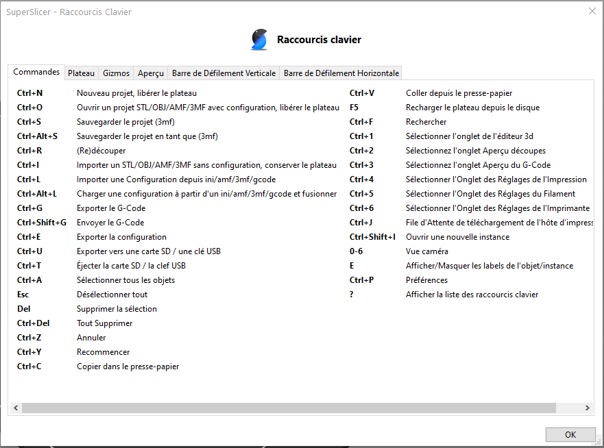

Alternativement, vous pouvez survoler une icône d'outil et le raccourci clavier s'affichera après un court délai.

### Plateau

Raccourcis clavier pour l'agencement sur le plateau d'impression.

| Touche                           | Fonction                                                     |
|----------------------------------|--------------------------------------------------------------|
| **A**                            | Agencer                                                      |
| **Shift** + **A**                | Agencement partiel (agencer la sélection)                    |
| **Ctrl**+ **A**                  | Sélectionnez tous les objets                                 |
| **Suppr**.                       | Supprimer la sélection                                       |
| **Ctrl** + **Del**               | Tout supprimer                                               |
| **Ctrl** + **C**                 | Copier                                                       |
| **Ctrl** + **V**                 | Coller                                                       |
| **+**                            | Ajouter une instance                                         |
| **-**                            | Supprimer l'instance                                         |
| **M**                            | Déplacer                                                     |
| **S**                            | Redimensionner                                               |
| **R**                            | Pivoter                                                      |
| **C**                            | Couper                                                       |
| **F**                            | Placer sur une face                                          |
| **L**                            | Support SLA                                                  |
| **Shift**+ Glisser la souris     | Sélection en boîte                                           |
| **Alt**+ Glisser la souris       | Dé-sélection en boîte                                        |
| **Shift** + Outil redimensionner | Pas de 5%                                                    |
| **Shift** + Outil déplacer       | Pas de 1 mm                                                  |
| **F**+ Outil redimensionner      | Redimensionner pour s'adapter (taille maximale)              |
| **Ctrl**+ Outil redimensionner   | Redimensionner uniquement dans une direction                 |
| **K**                            | Changer le type de caméra (perspective/orthographique)       |
| ` `**B**                         | Zoomer sur le plateau                                        |
| ` `**Z**                         | Zoomer sur tous les objets                                   |
| ` `**Z**  + Modèle sélectionné   | Zoomer sur le modèle sélectionné                             |
| ` `**I**                         | Zoom avant                                                   |
| ` `**O**                         | Zoom arrière                                                 |
| **Ctrl** + M                     | Afficher/masquer les paramètres du périphérique 3D connexion |
| **Échap**                        | Annuler la sélection                                         |

### Aperçu

Raccourcis clavier pour la gestion de l'aperçu.

| Raccourci                 | Fonction                                                           |
|---------------------------|--------------------------------------------------------------------|
| **Flèche vers le haut**   | Couche supérieure                                                  |
| **Flèche vers le bas**    | Couche inférieure                                                  |
| **Flèche vers la gauche** | Reculer la simulation                                              |
| **Flèche vers la droite** | Avancer la simulation                                              |
| **W**                     | Afficher une seule couche et afficher la couche supérieure         |
| **S**                     | Afficher une seule couche et afficher la couche inférieure         |
| **L**                     | Afficher/masquer la légende                                        |
| **+**                     | Ajouter un repère de changement de couleur pour la couche en cours |
| **-**                     | Retirer le repère de changement de couleur pour la couche en cours |

### Fenêtre principale

Raccourcis clavier pour la visualisation dans la fenêtre principale.

| Raccourci                    | Fonction                                               |
|------------------------------|--------------------------------------------------------|
| **Ctrl** + **O**             | Ouvrir projet (supprime le plateau)                    |
| **Ctrl** + **I**             | Importer un modèle (conserve le plateau)               |
| **Ctrl** + **L**             | Charger la configuration                               |
| **Ctrl** + **G**             | Exporter le G-code                                     |
| **Ctrl** + **S**             | Enregistrer le projet (3MF)                            |
| **Ctrl** + **Alt** +**L**    | Charger une configuration et fusionner                 |
| **Ctrl** + **R**             | (Re)Découper                                           |
| **Ctrl** + **1**             | Onglet du plateau                                      |
| **Ctrl** + **2**             | Onglet de l’aperçu des découpes                        |
| **Ctrl** + **3**             | Onglet de l’aperçu du G-Code                           |
| **Ctrl** + **4**             | Onglet des réglages d'impressions                      |
| **Ctrl** + **5**             | Onglet de réglages du filament                         |
| **Ctrl** + **6**             | Onglet des réglages de l'imprimante                    |
| **Ctrl** + **P**             | Préférences                                            |
| **Ctrl** + **J**             | Afficher la file d'attente de téléchargement de l'hôte |
| **0** - **6**                | Vue de la caméra                                       |
| **?**                        | Afficher les raccourcis clavier                        |
| **Ctrl** + **Clique Souris** | Ajouter un modèle à la sélection                       |

## Divers

### Icône cadenas fermé

Chaque paramètre des onglets Impression, Filament et Imprimante comporte une icône de cadenas **fermé** ou **ouvert** à côté de celui-ci. L'icône de cadenas fermé indique que la valeur est la même que dans le profil actuellement sélectionné. Dès que la valeur est modifiée, l'icône se transforme en ***cadenas ouvert*** et une flèche arrière apparaît, ce qui vous permet de réinitialiser la valeur du profil d'impression. En plus de cela, **le texte devient orange** (Selon réglage dans le [mode daltonien](#mode-daltonien)).  Cela vous permet de repérer rapidement les paramètres qui ont été modifiés.

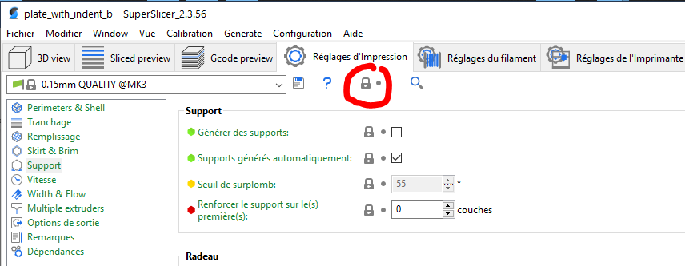

Dans l'exemple ci dessous une variable a été modifiée, le cadenas est ouvert et la flèche d'annulation apparaît à coté de la valeur. De plus le texte de la variable est passé en orange.

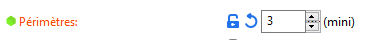

### Recherche dans les réglages

Avec un accès via le raccourci clavier (**Ctrl** + **F**) ou en utilisant l’icône Loupe, cette fonction permet de rechercher des paramètres en indiquant directement l’intitulé du paramètre. Après avoir trouvé le paramètre recherché, en cliquant dans la liste la fonction vous positionnera directement sur la fonction recherchée.  Une petite flèche clignotante vous indiquera la zone concernée dans la page de paramètre ouverte.

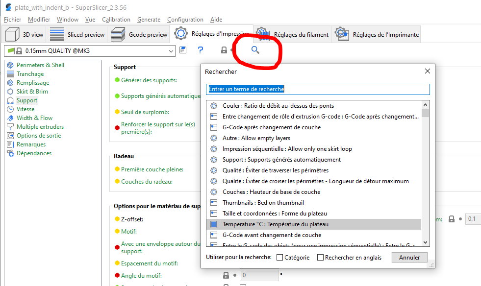

### Comparer les réglages

Depuis la version 2.4 il est possible de comparer des réglages facilement avec la fonction accessible dans **Onglet** -> **Comparer deux Préréglages**

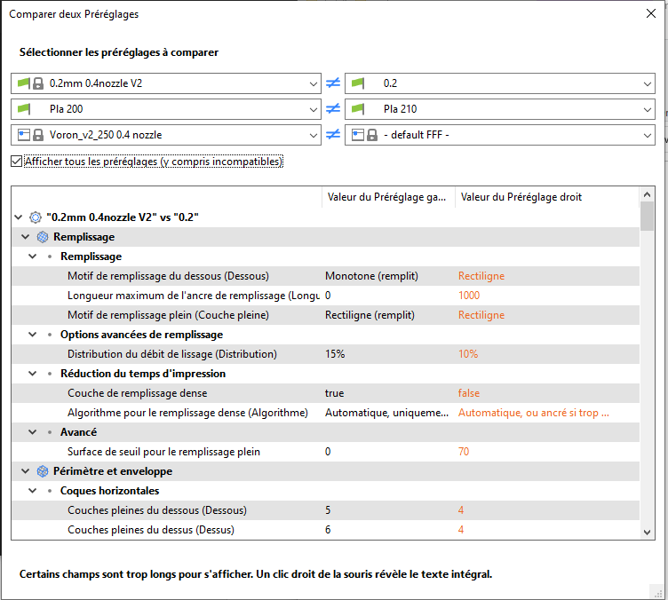

Vous pouvez également activer cette vue en cliquant sur un bouton dans le panneau supérieur.

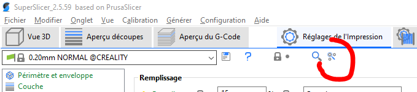

### Mode Daltonien

Si vous avez l'un des différents types de daltonisme, vous pouvez personnaliser certaines des couleurs utilisées par SuperSlicer. Cliquez sur le point d'interrogation rouge dans l'onglet de paramètres d'Impression, de Matériau ou d'Imprimante. Ensuite, vous pouvez cliquer sur l'une des deux couleurs en bas de la nouvelle fenêtre et définir une couleur différente.

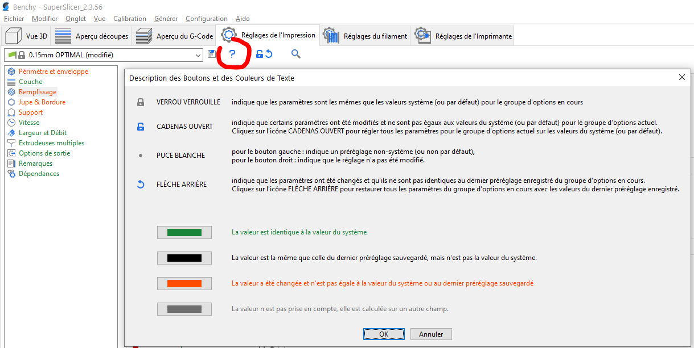

Page suivante [Réglages des préférences du logiciel](../user_interface/settings.md)

[Retour Page principale](../superslicer.md)
