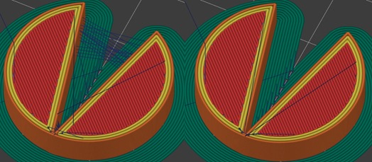

# avoid_crossing_perimeters

* Technologie : FDM
* Groupe : [Réglages de l'Impression](../print_settings/print_settings.md)
* Sous groupe : [Périmètre et enveloppe](../print_settings/print_settings.md#périmètre-et-enveloppe) - [Qualité](../print_settings/print_settings.md#qualité)
* Mode : Expert

## Eviter de traverser les périmètres

### Description

L'option permet d'optimiser les déplacements afin de minimiser le franchissement de périmètres. Ceci est surtout utile avec les extrudeuses de type Bowden qui sont sujettes aux coulures.

**Attention** L'activation de cette fonction ralentit considérablement la génération du G-code et augmente le temps d'impression.

Éviter de traverser les périmètres option active à droite.

[Retour Liste variables](variable_list.md)
